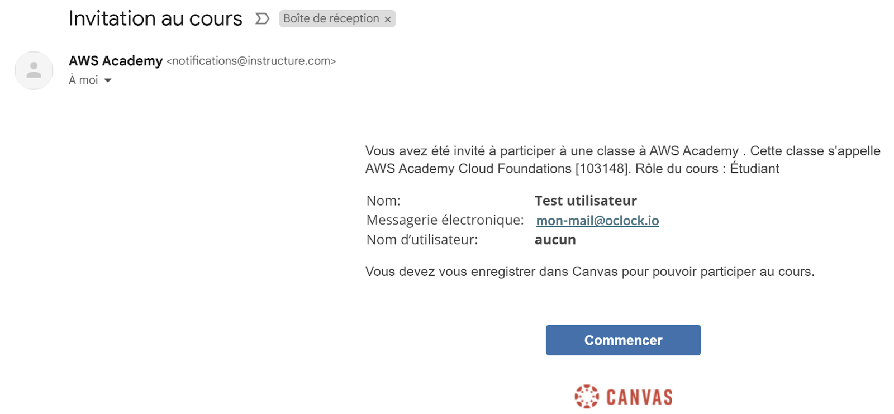
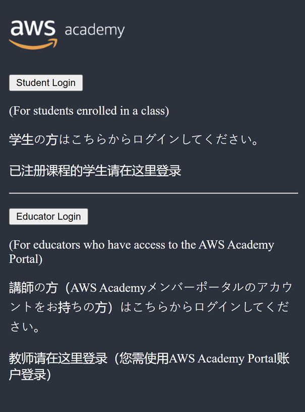
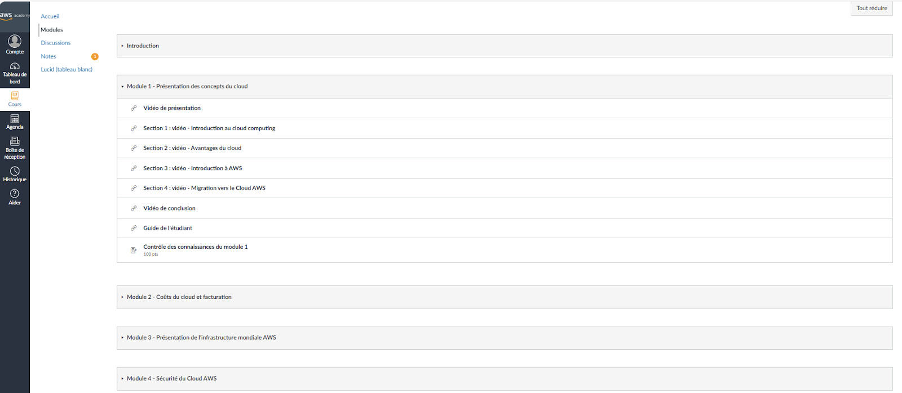
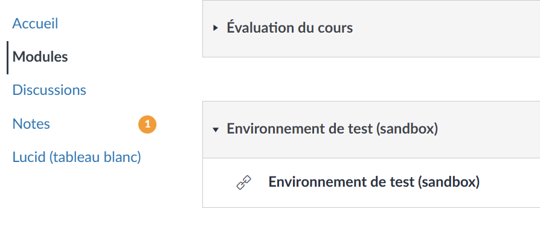
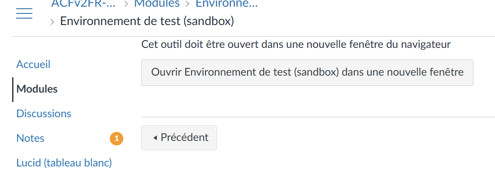
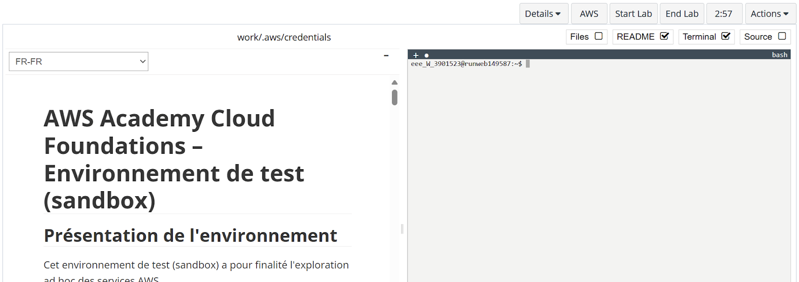

:titre: Plateforme AWS Academy
:module: Cloud providers
:duree: 30
:description: Introduction à la plateforme AWS Academy
include::../../../../adoc/libs/header-module.adoc[]

ifeval::["{visible-on-html}" !=  "yes"]
:docinfo: shared
:docinfodir: ../../../adoc/libs
endif::[]

== Objectifs pédagogiques
// tag::objectifs[]
* Comprendre le fonctionnement de la plateforme AWS Academy
* Savoir utiliser les ressources mises à disposition
* Comprendre la structure des cours
// end::objectifs[]

// tag::deroulement[]

== Connection à la plateforme

Vous avez reçu un mail d’invitation de la part de AWS Academy pour rejoindre le cours :

include::../../../../adoc/libs/slide-notitle.adoc[]

Cliquer  sur commencer et choisir “Student Login”: 

== Menu Module

Le menu “Modules” donne accès à : 

* Les leçons vidéos de cours officiels fournis par Amazone (non jouées par le formateur) 
* Des études de cas et démonstrations (rejouées par le formateur)
* Guide de l’étudiant : contient l’ensemble des supports  utilisé par le formateur, pour vous permettre de  suivre le cours 
* L'Accès à un environnement de test AWS, dédié  à chaque étudiant pour manipuler 

include::../../../../adoc/libs/slide-notitle.adoc[]

== La sandbox

La sandbox AWS Academy

include::../../../../adoc/libs/slide-notitle.adoc[]

Sélectionner “Ouvrir Environnement de test dans une nouvelle fenêtre”

Une fois l’environnement lancé suivre le didacticiel pour utiliser la SandBox

//tag::demo[]

== Démonstration

Plateforme AWS Academy

[NOTE.speaker]
--
* Montrer la connection au portail AWS Academy
* Montrer l’interface et les menus 
* Expliquer le test de fin de cursus pour l’obtention du badge (test en fin de cursus de 20 questions, taux de 70% pour obtention du badge)
* **Important** : Jouer avec les étudiants le didacticiel lié à l’utilisation de la sandbox.
--

//end::demo[]

// end::deroulement[]

== Conclusion
// tag::conclusion[]
* La plateforme AWS Academy est un outil complet pour apprendre à utiliser les services AWS
* Les ressources mises à disposition permettent de se former de manière autonome
* La sandbox est un outil pratique pour manipuler les services AWS sans risque
* Passons à présent sur la plateforme et le cours AWS Cloud Foundations
// end::conclusion[]