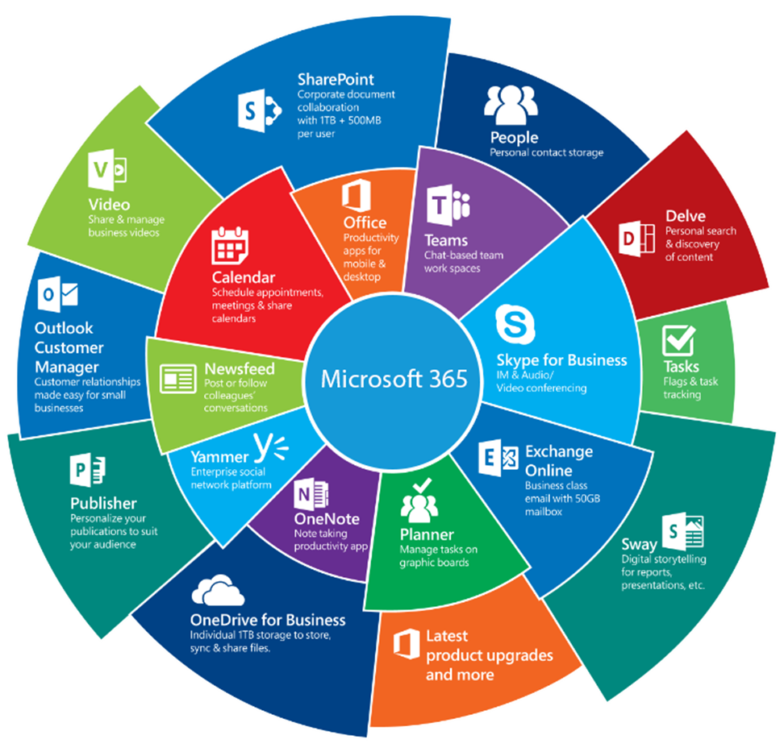
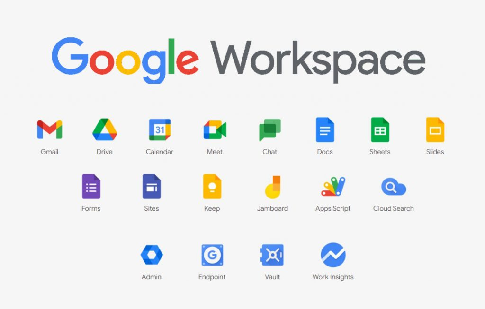

:titre: Introduction aux cloud providers
:module: Cloud providers
:duree: 30
:description: 
include::../../../../adoc/libs/header-module.adoc[]

ifeval::["{visible-on-html}" !=  "yes"]
:docinfo: shared
:docinfodir: ../../../adoc/libs
endif::[]

== Objectifs pédagogiques
// tag::objectifs[]
* Comprendre le cloud computing
* Découvrir les acteurs majeurs du cloud
* Comprendre le contenu du programme AWS Academy Cloud Foundations
// end::objectifs[]

// tag::deroulement[]

== Qu'est-ce que le cloud ?

* modèle de service informatique qui permet d'accéder à des ressources informatiques à la demande
* il peut s'agir :
** de serveurs
** de stockage
** de bases de données
** de réseaux
** de logiciels...

=== Concepts clés

* **Infrastructure as a Service (IaaS)** : Fournit des ressources informatiques fondamentales, comme des machines virtuelles.
* **Platform as a Service (PaaS)** : Fournit une plateforme permettant de développer, gérer et déployer des applications sans gérer l'infrastructure sous-jacente.
* **Software as a Service (SaaS)** : Fournit des logiciels via Internet, que les utilisateurs peuvent utiliser directement sans se soucier de la gestion de l’infrastructure ou de la plateforme sous-jacente.

== Cloud public, privé et hybride

=== Cloud public

* Infrastructure partagée gérée par un fournisseur.
* Évolutivité quasi illimitée.
* Coûts réduits, pas de maintenance matérielle.
* Surveillance nécessaire pour les volumes de données et les temps de démarrage des VMs.

=== Cloud privé

* Contrôle total par l'entreprise sur l'infrastructure.
* Sécurité accrue grâce à l'absence de mutualisation.
* Expansion coûteuse, nécessitant des investissements en matériel.

=== Cloud hybride

* Combinaison des avantages des Clouds public et privé.
* Flexibilité, sécurité, et performances optimisées.
* Gestion efficace des coûts et des ressources

== La disponibilité des data centers

Les data centers offrent différents niveaux de disponibilité, adaptés aux besoins des entreprises :

* **Niveau 1** : Disponibilité de 99,67 % (soit environ 28,8 heures d'arrêt par an).
* **Niveau 2** : Disponibilité de 99,75 % (soit environ 22 heures d'arrêt par an).
* **Niveau 3** : Disponibilité de 99,982 % (soit environ 1,6 heure d'arrêt par an).
* **Niveau 4** : Disponibilité de 99,995 % (soit environ 26,3 minutes d'arrêt par an).

include::../../../../adoc/libs/slide-notitle.adoc[]

Le choix d’infrastructure dépend de :

* **Criticité des services** : Tolérance aux interruptions de service ?
* **Exigences de performance** : performances et disponibilité des applications ?
* **Infra existante** : Dispose-t-on d'une salle serveur et de matériel adéquats ?
* **Budget et garantie** : achat nouveau matériel ou à utiliser du matériel non garanti ?
* **Connexion Internet** : Fiabilité et débit suffisants pour un hébergement Cloud ?
* **Réglementations** : Contraintes en matière de confidentialité des données ?
* **Compétences internes** : Compétences pour gérer l'infrastructure disponibles ?

== Caractéristiques clés du cloud

* **Élasticité** : Ajuster automatiquement les ressources allouées en fonction des besoins
* **Scalabilité** : Capacité du système à évoluer pour faire face à une augmentation de la charge de travail. 
** scalabilité verticale (ajout de ressources à une seule machine) 
** scalabilité  horizontale (ajout de plus de machines pour partager la charge de travail).
* **Paiement à l’usage (Pay-as-you-go)** : Le modèle économique où les utilisateurs ne paient que pour les ressources qu'ils consomment, sans investissement initial important.
* **Accessibilité Globale** : Capacité d'accéder aux services et aux données depuis n'importe quel endroit dans le monde, tant que vous avez une connexion Internet

== Acteurs du cloud

* **AWS** : Leader mondial avec une offre complète et un écosystème robuste.
* **Microsoft Azure** : Fort en cloud hybride, intégré avec les outils Microsoft.
* **Google Cloud** : Spécialiste en IA et Big Data.
* **Alibaba Cloud** : Leader en Asie avec des solutions compétitives.
* **IBM & Oracle** : Focus sur le cloud hybride, ERP et solutions métier.
* **Autres acteurs émergents** :
** **Tencent Cloud, OVHcloud, Huawei Cloud** : Présence régionale forte.
** **Salesforce** : Leader en SaaS (CRM).

=== Microsoft Azure

* **Calcul** : Machines virtuelles (VM), App Services (hébergement d'applications web), Azure Kubernetes Service (AKS).
* **Stockage** : Azure Blob Storage (stockage d’objets), Azure File Storage (stockage de fichiers).
* **Réseau** : Réseaux virtuels (VNet), Azure Load Balancer (équilibrage de charge), Azure DNS.
* **Bases de Données** : Azure SQL Database, Cosmos DB (base de données NoSQL).
* **IAM (Identity and Access Management)** : entraID (gestion des utilisateurs, des rôles et des permissions)

=== Microsoft 365

**Applications incluses :**

* **Office Suite** : Word, Excel, PowerPoint, Outlook.
* **Collaboration** : Teams (visioconférence et chat), SharePoint (gestion des contenus), OneDrive (stockage en ligne).
* **Sécurité et conformité** : Azure Active Directory, protection des données via Microsoft Defender, gestion des appareils mobiles (MDM) avec Intune.

**Avantages :**

* **Intégration native** avec les environnements Windows et Office.
* **Sécurité avancée** avec des outils de gestion des identités et des accès.
* **Flexibilité et extensibilité** avec les services Azure.

include::../../../../adoc/libs/slide-notitle.adoc[]

=== Google Cloud

* **Calcul** : Google Compute Engine (machines virtuelles), Google Kubernetes Engine (GKE).
* **Stockage** : Google Cloud Storage (stockage d’objets), Persistent Disk (stockage de volumes).
* **Réseau** : Google VPC (Virtual Private Cloud), Cloud CDN (réseau de distribution de contenu).
* **Bases de Données** : Cloud SQL (base de données relationnelle), Firestore (base de données NoSQL).

=== Google Workspace

**Applications incluses :**

* **Communication** : Gmail, Google Meet (visioconférence), Chat.
* **Productivité et collaboration** : Google Docs, Sheets, Slides (équivalents de Word, Excel, PowerPoint), Google Drive (stockage en ligne), Google Calendar.
* **Gestion et sécurité** : Google Admin Console, Google Vault (archivage et eDiscovery).

**Avantages :**

* **Collaboration en temps réel** facilitée par les applications cloud natives.
* **Simplicité d'utilisation** et une interface utilisateur intuitive.
* **Flexibilité multi-appareils** avec un fort accent sur la mobilité.

**Cas d'usage typique :** Entreprises axées sur le cloud, nécessitant une collaboration transparente entre différents appareils et des outils de communication intégrés.

include::../../../../adoc/libs/slide-notitle.adoc[]

=== Amazon Web Services

* **Calcul** : Amazon EC2 (Elastic Compute Cloud pour les machines virtuelles), AWS Lambda (fonctions sans serveur).
* **Stockage** : Amazon S3 (Simple Storage Service pour le stockage d'objets), Amazon EBS (Elastic Block Store pour le stockage de volumes de blocs).
* **Réseau** : Amazon VPC (Virtual Private Cloud), Amazon CloudFront (CDN pour la distribution de contenu).
* **Bases de Données** : Amazon RDS (Relational Database Service), DynamoDB (base de données NoSQL).

=== Services AWS

**Services inclus :**

* Collaboration : Amazon WorkDocs (partage et gestion de documents), Amazon Chime (visioconférence et chat).
* Messagerie et calendrier : Amazon WorkMail.
* Infrastructure cloud : Services AWS (EC2, S3, RDS) pour une infrastructure personnalisée.

include::../../../../adoc/libs/slide-notitle.adoc[]

**Avantages :**

* Flexibilité extrême permettant de construire des solutions sur mesure.
* Sécurité et conformité robustes, avec des outils de gestion fine des accès et des ressources.
* Intégration profonde avec d'autres services AWS pour des besoins spécifiques.

**Cas d'usage typique :** Entreprises avec des besoins complexes en infrastructure IT, souhaitant une solution personnalisée et scalable.

== AWS Academy

Pour la suite de ce cours Cloud Provider,  nous basculerons sur le cours officiel AWS Academy Cloud Fondations.

Les grands concepts et notions sur le Cloud abordées dans ce cours officiel sont universelles et applicables à d'autres fournisseurs cloud

include::../../../../adoc/libs/slide-notitle.adoc[]

L’ensemble des ressources d’apprentissage seront disponible via le LMS AWS Academy. 

* Supports de cours
* Contrôles des connaissances à choix multiple en ligne
* Exercices pratiques
* Formation numérique (facultative)
* Vidéos de présentation
* Vidéos de démonstration
* Exemples de solutions

=== AWS Academy Cloud Foundations

* Comprendre les concepts fondamentaux du cloud computing : Acquisition des notions de base du cloud, ses avantages, et introduction au modèle AWS.
* Appréhender les services clés AWS : Découverte des services essentiels, incluant la gestion des coûts, la sécurité, le stockage, la mise en réseau, et le calcul.
* Maîtriser les principes de conception et d'architecture cloud : Comprendre le cadre AWS Well-Architected Framework et les bonnes pratiques en matière de performance, sécurité, et optimisation des coûts.
* Développer des compétences pratiques : Utilisation d'activités pratiques et ateliers pour manipuler les outils et services AWS (VPC, EC2, IAM, S3, etc.).

include::../../../../adoc/libs/slide-notitle.adoc[]

* Obtenir le badge de fin de cursus  de AWS Academy Cloud Foundations
* Préparer la  certification AWS : **AWS Certified Cloud Practitioner**

// end::deroulement[]

== Conclusion
// tag::conclusion[]
* Le cloud computing est un modèle de service informatique qui permet d'accéder à des ressources informatiques à la demande.
* Les acteurs majeurs du cloud sont AWS, Microsoft Azure, Google Cloud, Alibaba Cloud, IBM, Oracle, et d'autres acteurs émergents.
* Les concepts clés du cloud sont l'IaaS, le PaaS, et le SaaS.
* Les avantages du cloud sont l'élasticité, la scalabilité, le paiement à l'usage, et l'accessibilité globale.
* On va utiliser le cours AWS Academy Cloud Foundations pour approfondir les concepts du cloud et se préparer à la certification AWS Certified Cloud Practitioner.
// end::conclusion[]