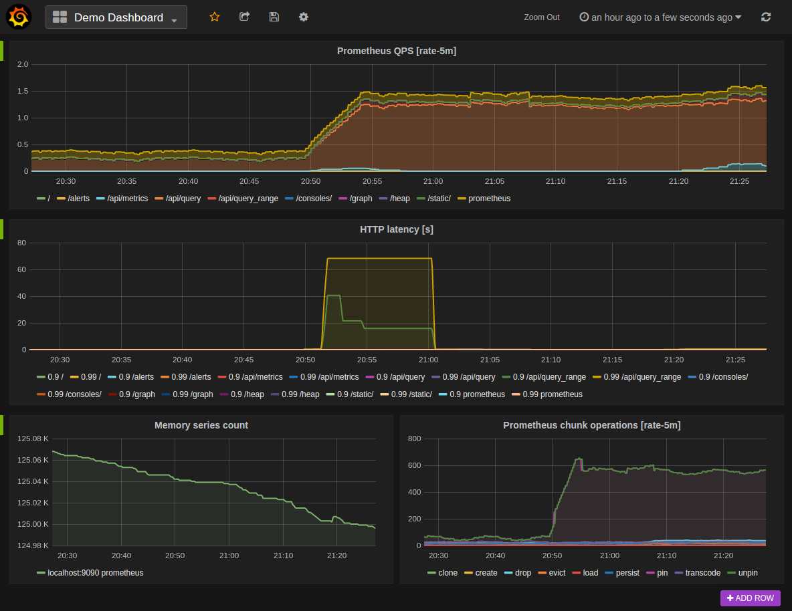

:titre: L'IA au service de l'administration système
:module: Administration Système
:duree: 90
:description: Utilisation de l'intelligence artificielle pour l'administration système, automatisation des tâches, surveillance avancée, optimisation des ressources, démos de scripts IA
include::../../../../adoc/libs/header-module.adoc[]

ifeval::["{visible-on-html}" !=  "yes"]
:docinfo: shared
:docinfodir: ../../../adoc/libs
endif::[]

== Objectifs pédagogiques

// tag::objectifs[]
* Comprendre les concepts de base de l'intelligence artificielle (IA) appliquée à l'administration système.
* Automatiser des tâches courantes de gestion d'infrastructure grâce à l'IA.
* Mettre en place des outils de surveillance et de monitoring avancés utilisant des algorithmes d'IA.
* Optimiser la gestion des ressources système par des solutions intelligentes.
// end::objectifs[]

// tag::deroulement[]
== Introduction à l’IA

=== L’Intelligence Artificielle

* Vise à créer des machines capables de reproduire des comportements humains tels que :
  ** l’apprentissage
  ** la résolution de problèmes
  ** la prise de décision
* Ensemble de technologies et de techniques permettant aux systèmes informatiques de percevoir, interpréter et répondre à des données de manière autonome.
* **Origines :** Années 1950 avec Alan Turing et John McCarthy (test de Turing).

=== Types d’IA

* **IA faible (ou étroite) :**
  ** Spécialisée dans une seule tâche ou ensemble de tâches.
  ** Très utilisée en administration système, notamment dans les scripts d’automatisation.
  
* **IA forte (ou IA générale) :**
  ** Théoriquement capable d’exécuter toute tâche intellectuelle qu’un humain peut accomplir.
  ** N’a pas encore trouvé d’application réelle en administration système.

=== L’IA dans la gestion d’infrastructures

* **Automatisation des tâches :**
  ** Gestion des configurations
  ** Déploiement de logiciels
  ** Surveillance des systèmes
  
* **Analyse prédictive :**
  ** Prévoir les pannes système
  ** Identifier les anomalies
  ** Proposer des solutions proactives
  
* **Optimisation des ressources :**
  ** Ajustement dynamique des allocations de ressources

== Automatisation des tâches courantes avec l’IA

=== Types de tâches couramment automatisées

* **Mises à jour logicielles :**
  ** Algorithmes identifient le moment le plus opportun pour effectuer les mises à jour.
  
* **Gestion des utilisateurs :**
  ** Scripts intelligents gèrent des comptes utilisateurs en appliquant des politiques spécifiques.
  
* **Sauvegardes et restaurations :**
  ** L’IA détermine les moments appropriés pour effectuer ces tâches et s’assure que les données critiques sont toujours sauvegardées de manière efficace.

=== Méthodes d’automatisation par l’IA

* **Automatisation basée sur des règles :**
  ** Utilisation de scripts et logiciels pour exécuter des tâches prédéfinies selon des conditions spécifiques.
  ** **Exemple :** Scripts Bash ou PowerShell.
  
* **Automatisation adaptive :**
  ** Utilisation du machine learning pour analyser les données historiques et adapter les actions en conséquence.
  ** **Exemple :** Prédire les meilleures plages horaires pour les mises à jour système en fonction de l’utilisation passée.
  
* **Automatisation prédictive :**
  ** Modèles prédictifs anticipant les pannes ou les besoins de maintenance, permettant une gestion proactive des systèmes.

=== Avantages et Inconvénients

* **Avantages :**
  ** **Gain de temps :** Permet de se concentrer sur des tâches plus stratégiques et d’éviter les tâches répétitives.
  ** **Réduction des erreurs humaines :** Les tâches sont toujours exécutées de la même manière, réduisant les risques d’erreurs.
  ** **Amélioration de la disponibilité des systèmes :** Les interruptions de service sont minimisées.
  
include::../../../../adoc/libs/slide-notitle.adoc[]

* **Inconvénients :**
  ** **Complexité de mise en œuvre :** Configuration initiale complexe nécessitant une expertise technique.
  ** **Dépendance à l’IA :** Peut conduire à une perte de compétences humaines.
  ** **Coûts initiaux :** Développement et intégration de l’IA peuvent entraîner des coûts importants.

// tag::demo[]
== 📋 Démonstration 01 : Exemple d’un script automatisé en Python

[NOTE.speaker]
--
* Installer les modules Python `pandas` et `sklearn` pour exécuter ce script.
* Exécuter le script et expliquer les différentes parties :
  ** Génération de données fictives
  ** Entraînement du modèle
  ** Prédiction des périodes de maintenance
* Montrer le résultat : "Les jours suivants sont prédits comme opportuns pour la maintenance: [datetime.date(2025, 1, 17) datetime.date(2025, 1, 28)]"

```python
import numpy as np
import pandas as pd
from sklearn.ensemble import RandomForestRegressor
from sklearn.model_selection import train_test_split

# Génération de données fictives sur l'utilisation du serveur
data = {
    'date': pd.date_range(start='2024-01-01', periods=365, freq='D'),
    'cpu_usage': np.random.uniform(20, 80, 365),
    'memory_usage': np.random.uniform(30, 90, 365),
    'network_activity': np.random.uniform(10, 70, 365),
}

# Création d'un DataFrame
df = pd.DataFrame(data)

# Ajout d'une colonne pour indiquer si la maintenance a eu lieu (critère ajusté)
df['maintenance'] = (df['cpu_usage'] > 70) & (df['memory_usage'] > 75) & (df['network_activity'] > 50)

# Transformation des dates en nombre de jours écoulés
df['days_since_start'] = (df['date'] - df['date'].min()).dt.days

# Variables indépendantes (X) et dépendante (y)
X = df[['cpu_usage', 'memory_usage', 'network_activity', 'days_since_start']]
y = df['maintenance'].astype(int)

# Division des données en ensembles d'entraînement et de test
X_train, X_test, y_train, y_test = train_test_split(X, y, test_size=0.2, random_state=42)

# Modèle de prédiction
model = RandomForestRegressor(n_estimators=100, random_state=42)
model.fit(X_train, y_train)

# Prédiction sur les données de test
y_pred = model.predict(X_test)

# Prédiction des périodes de maintenance pour les prochains jours
future_dates = pd.date_range(start='2024-12-31', periods=30, freq='D')
future_data = {
    'cpu_usage': np.random.uniform(20, 80, 30),
    'memory_usage': np.random.uniform(30, 90, 30),
    'network_activity': np.random.uniform(10, 70, 30),
    'days_since_start': [(date - df['date'].min()).days for date in future_dates]
}
future_df = pd.DataFrame(future_data)
future_df['maintenance_pred'] = model.predict(future_df)

# Réduction du seuil pour marquer une prédiction de maintenance (prédiction > 0.3)
maintenance_days = future_df[future_df['maintenance_pred'] > 0.3]['days_since_start']

# Affichage des dates réelles pour les jours de maintenance prédits
maintenance_dates = future_dates[maintenance_days.index]
print(f"Les jours suivants sont prédits comme opportuns pour la maintenance: {maintenance_dates.date}")
```
--
// end::demo[]

== Surveillance et monitoring avancés

=== Surveillance proactive des systèmes avec l’IA

* **Objectifs :**
  ** Anticiper les problèmes avant qu’ils ne surviennent en analysant continuellement les données système.
  ** Détecter des anomalies, identifier des patterns inhabituels, prédire des pannes potentielles.

* **Analyse en temps réel des systèmes :**
  ** L’IA permet de traiter et analyser de grandes quantités de données de journaux système en temps réel.
  ** Les algorithmes peuvent détecter des problèmes tels que des failles de sécurité ou des défaillances matérielles imminentes.

=== Détection des anomalies

* **Apprentissage supervisé :**
  ** Utilise des données étiquetées pour entraîner l’IA à reconnaître des comportements normaux et anormaux.
  ** **Exemple :** Un modèle pourrait être entraîné à détecter des pics anormaux d’utilisation CPU ou des patterns d’accès non autorisés au système.

* **Apprentissage non supervisé :**
  ** Utilise des algorithmes pour identifier des patterns dans les données sans étiquettes préalables.
  ** Particulièrement utile pour détecter des anomalies inconnues ou des comportements imprévus qui ne suivent pas de schémas prédéfinis.

=== Prévision des pannes

* Des modèles IA peuvent prédire les pannes probables en se basant sur l’historique des performances système.
* Permet une **maintenance proactive** : on anticipe les pannes au lieu de les subir.
* **Exemple :** Un modèle peut prévoir la défaillance imminente d’un disque dur en analysant ses performances passées et ses erreurs actuelles.

=== Prometheus : un système de surveillance open-source

* **Prometheus** est utilisé pour la surveillance des performances système et la gestion scalable des métriques.
* Intègre des fonctionnalités de **machine learning** pour la détection des anomalies.

include::../../../../adoc/libs/slide-notitle.adoc[]



=== Quelques autres outils IA open source

* **Surveillance et Monitoring :**
  ** **Prometheus + Thanos :** Surveillance des performances système et gestion scalable des métriques.
  ** **Datadog + AI-based Monitoring :** Surveillance des infrastructures cloud avec détection des anomalies.
  ** **Zabbix + Zabbix Machine Learning :** Surveillance en temps réel et analyse prédictive.
  ** **Nagios + Nagios XI :** Surveillance des réseaux, serveurs et applications, avec alertes intelligentes.

include::../../../../adoc/libs/slide-notitle.adoc[]

* **Gestion des Logs et Détection d'Anomalies :**
  ** **ELK Stack (Elasticsearch, Logstash, Kibana) + Machine Learning :** Analyse des journaux système et détection des anomalies.
  ** **Splunk + Splunk Machine Learning Toolkit (MLTK) :** Analyse des journaux et prédiction d'événements.

* **Automatisation et Gestion de Configuration :**
  ** **Ansible + AWX :** Automatisation des tâches de routine et gestion de la configuration des serveurs.
  ** **TensorFlow + Custom Scripts :** Automatisation avancée et optimisation des ressources via des modèles personnalisés.

include::../../../../adoc/libs/slide-notitle.adoc[]

* **Visualisation et Analyse Prédictive :**
  ** **Grafana + Grafana Machine Learning (ML) Plugin :** Visualisation des données de surveillance avec prévision des tendances.

* **Optimisation des Serveurs HPC :**
  ** **DeepMind’s AlphaFold + Protein Server Management :** Optimisation des serveurs dédiés aux tâches complexes, comme le calcul haute performance.
// end::deroulement[]

== 📝 Conclusion
// tag::conclusion[]
* Connaissance d’outils d'IA pour automatiser les tâches d'administration système.
* Compréhension de l'IA et comment elle peut améliorer la surveillance et le monitoring des infrastructures.
* Connaissance de techniques pour optimiser la gestion des ressources système avec des solutions intelligentes.
// end::conclusion[]