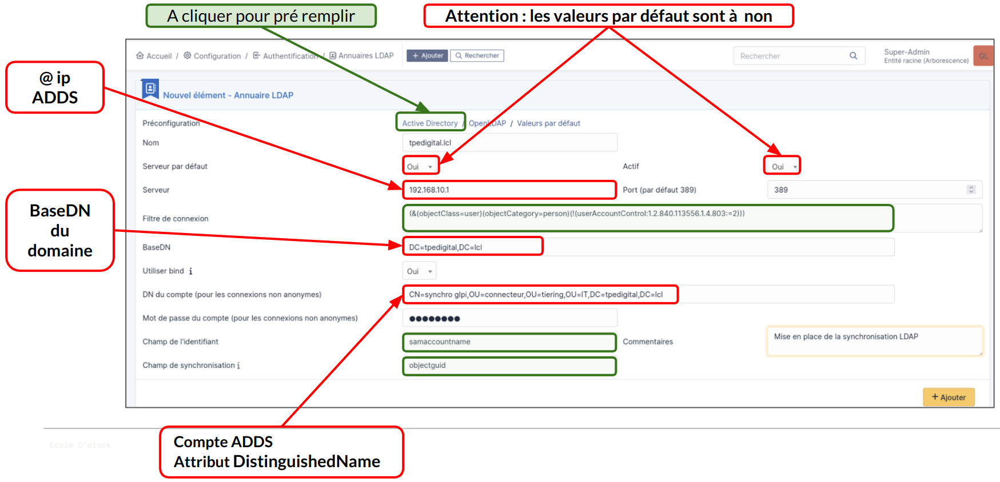

:titre: Authentification AD, Groupe et Habilitation GLPI
:module: Centre de services
:duree: 120
:description: Ce module a pour objectif de présenter les différentes méthodes d'authentification et de gestion des habilitations dans GLPI.
include::../../../../adoc/libs/header-module.adoc[]

ifeval::["{visible-on-html}" !=  "yes"]
:docinfo: shared
:docinfodir: ../../../../adoc/libs
endif::[]


== Objectifs pédagogiques

// tag::objectifs[]
* Comprendre le rôle et la configuration des utilisateurs dans GLPI
* Mettre en place et tester une synchronisation LDAP
* Automatiser la synchronisation LDAP
* Gérer les groupes et les habilitations
* Implémenter des habilitations dynamiques
// end::objectifs[]

// tag::deroulement[]

== Utilisateur par défaut dans GLPI

Lors de l’installation, GLPI propose plusieurs comptes avec des rôles prédéfinis.

=== Utilisateurs créés par défaut

* Super-Admin :
** Accès illimité à toutes les fonctionnalités.
** identifiant par défaut à l’installation : glpi / glpi
* Admin :
** Gestion complète des équipements et tickets, mais pas des paramètres critiques.
** identifiant par défaut à l’installation : tech / tech

include::../../../../adoc/libs/slide-notitle.adoc[]

* Normal :
** Lecture seule sur le parc et les tickets.
** identifiant par défaut à l’installation : normal / normal
* Post-Only :
** Soumission et suivi de tickets uniquement.
** identifiant par défaut à l’installation : post-only

== Base des comptes utilisateurs

**Base de comptes interne** : Les comptes sont stockés directement dans la base de données de GLPI.

**Base de comptes externe** : Permet une authentification centralisée et dynamique grâce à des systèmes externes, tels que :

* **LDAP** ou **LDAP Active Directory**.
* Serveurs de messagerie (comptes POP/IMAP).
* **Certificats X509** pour une authentification renforcée.

include::../../../../adoc/libs/slide-notitle.adoc[]

**Configuration des bases externes** : Nécessite l’intégration d’un serveur d’authentification dédié.

**Gestion des utilisateurs** :

* Possibilité d’un **import manuel** des utilisateurs en amont.
* **Import automatique** des utilisateurs lors de leur première connexion.
* Les **champs utilisateur** dans GLPI peuvent être automatiquement alimentés à partir des attributs présents dans Active Directory (AD).

== Mise en place de la synchronisation LDAP

=== Etape 1 : Activer l’extension LDAP pour PHP

Pour que GLPI puisse communiquer avec Active Directory via le protocole LDAP, il faut que  l’extension LDAP soit installée et activée sur le  serveur PHP.

Cette étape permet à PHP, utilisé par GLPI, d'établir des connexions avec l'annuaire LDAP pour interroger Active Directory.

=== Sous Linux (Debian/Ubuntu)

Installez l’extension LDAP en exécutant la commande suivante :

```sh
sudo apt-get install php-ldap
```

Redémarrez le serveur web 

```sh
sudo systemctl restart apache2
```

=== Sous Windows

* Modifier le fichier `php.ini` dans le répertoire d’installation de PHP.
* Recherchez la ligne contenant `;extension=php_ldap.dll` supprimer le point-virgule (`;`) en début de ligne pour activer l’option.
* Enregistrez le fichier et redémarrez le serveur web pour appliquer les modifications.

=== Etape 2 : Configurer l'annuaire LDAP dans GLPI

* Accédez au menu **Configuration** > **Authentification**.
* Cliquez sur "**Annuaires LDAP**", puis sur le bouton "**Ajouter**" pour créer une nouvelle connexion.
* Sélectionnez l’option "**Active Directory**" dans la section "**Préconfiguration**". Cela pré-rempli certains champs spécifiques à Active Directory.

include::../../../../adoc/libs/slide-notitle.adoc[]

* Complétez les champs suivants :

** **Nom** : Donnez un nom descriptif à la connexion, par exemple "Annuaire AD".
** **Serveur** : Indiquez le nom d’hôte ou l’adresse IP de votre contrôleur de domaine 
** **Port** : Utilisez le port par défaut 389 ou 636 pour une connexion sécurisée avec SSL.
** **BaseDN** : BaseDN de votre domaine. Exemple : DC=mondomaine,DC=local.
** **DN du compte** : Compte utilisateur, saisir la valeur de son attribut DistinguishedName.
** **Mot de passe du compte** : Entrez le mot de passe correspondant à ce compte.

include::../../../../adoc/libs/slide-notitle.adoc[]



== Tester la synchronisation LDAP

**Tester la connexion à Active Directory**

Il est essentiel de vérifier que la configuration permet à GLPI de se connecter à votre Active Directory.

* Après avoir ajouté l’annuaire LDAP, cliquez sur son nom dans la liste.
* Dans la section "**Tester**", cliquez sur "**Tester**".
* Si la connexion est réussie, un message de succès apparaîtra. Sinon, revérifiez les informations saisies.

=== Importer les utilisateurs depuis Active Directory

* Dans "**Administration**" > "**Utilisateurs**".
* Cliquez sur "**Liaison annuaire LDAP**" en haut de la page.
* Sélectionnez "**Importation de nouveaux utilisateurs**".
* Cliquez sur "**Rechercher**" pour afficher la liste des utilisateurs disponibles dans AD.
* Cochez les utilisateurs que vous souhaitez importer ou utilisez la case générale pour tout sélectionner.
* Cliquez sur "**Actions**", sélectionnez "**Importer**", puis confirmez.

Une fois l’import terminé, les utilisateurs AD seront visibles dans la liste des utilisateurs de GLPI.

== Synchronisation LDAP automatique

Une synchronisation régulière permet de maintenir les informations utilisateur à jour dans GLPI.

* Dans GLPI, allez dans **Administration** > **Utilisateurs**.
* Cliquez sur **Liaison annuaire LDAP**, puis sur **Synchronisation des utilisateurs déjà importés**.
* Pour automatiser cette tâche, configurez un **cron job** sur votre serveur :
** Ajoutez une ligne dans votre fichier crontab pour exécuter une synchronisation quotidienne

```sh
0 2 * * * /usr/bin/php /var/www/glpi/front/cron.php --force ldapmasssync
```

== Les groupes

Un groupe dans GLPI est une structure qui rassemble des utilisateurs ayant des droits  ou des rôles similaires.

=== Types de groupes

**Groupes locaux**

* Créés et gérés directement dans GLPI.
* La gestion des membres se fait uniquement via l'interface GLPI.
* Utilisés principalement pour des besoins spécifiques au sein de GLPI.

**Groupes ADDS statiques**

* Importés depuis Active Directory Domain Services (ADDS).
* Les membres sont définis dans AD et reflétés dans GLPI lors de l'import.
* Nécessitent un import préalable pour être utilisés dans GLPI.
* ils fonctionnent comme des groupes locaux pour la gestion des droits et des fonctionnalités

include::../../../../adoc/libs/slide-notitle.adoc[]

**Quand utiliser un groupe ADDS statique ?**

* Groupe existant dans l’AD  pour une structure organisationnelle ou des responsabilités précises et éviter de créer manuellement des groupes locaux.
* Simplifier la synchronisation des droits entre l’AD  et GLPI

== Les habilitations

Les habilitations permettent de définir les droits d'accès et leurs portées pour les utilisateurs. 

* Une habilitation combine deux éléments essentiels :
** Un profil : qui définit les droits de l’utilisateur.
** Une entité : qui limite ou étend l’application de ces droits.
* Il est possible d'appliquer les habilitations aux entités enfants (récursivité).
* Chaque utilisateur peut disposer de plusieurs habilitations, gérées soit manuellement (statiques), soit automatiquement (dynamiques).

=== Les habilitations statiques dans GLPI

Les habilitations statiques sont configurées manuellement depuis l’interface GLPI. 

* **Configuration individuelle** : chaque utilisateur doit être configuré séparément.
* **Manque de centralisation** : la gestion des droits n’est pas unifiée.
* **Maintenance lourde** : le processus est susceptible d’erreurs et demande du temps.

Ces limitations rendent cette méthode peu adaptée aux environnements avec un grand nombre d’utilisateurs ou des besoins de gestion complexe.

== Les habilitations dynamiques

* utilisent des règles pour attribuer automatiquement les droits en fonction de critères. 
* Ces règles sont appliquées à chaque connexion de l'utilisateur.

=== Principes

* **Critères et actions** : chaque règle associe des critères (conditions) à des actions (attribution de droits).
* **Lecture indépendante de l’ordre** : les règles sont exécutées sans dépendance à leur ordre de création.
* **Flexibilité** : les critères peuvent être internes (paramètres GLPI) ou externes (LDAP).

== Critères des règles dynamiques

Les critères définissent les conditions pour l’attribution des habilitations. Parmi les options courantes :

* **Gestion centralisée via Active Directory (AD)** : simplifie l’administration en s’appuyant sur l’AD pour déterminer les appartenances.
* **Utilisation de groupes AD** : l’attribution repose sur des groupes comme le critère `(LDAP) MemberOf`.
* **Conditions souples** : par exemple, « contient » est utilisé pour éviter les restrictions trop strictes (« est »).

== Actions des règles dynamiques

Les actions définissent les droits à attribuer lorsqu’un critère est vérifié. Chaque règle doit inclure au moins deux actions pour être valide :

* Attribution d’un profil spécifique.
* Définition d’une entité et de sa récursivité éventuelle.

Les actions dépendent également de la logique définie (opérateurs ET/OU) entre plusieurs critères.

== Implémenter des habilitations dynamiques

* **Identification des droits** : Identifier les rôles et les droits nécessaires pour chaque type d’utilisateur.
* **Création des groupes Active Directory** : Configurer des groupes AD qui serviront de référence pour les règles.
* **Configuration des utilisateurs Active Directory** : Assigner les utilisateurs aux groupes AD en fonction de leurs besoins.
* **Création des règles dans GLPI** : Définir les règles d’attribution des habilitations basées sur les groupes AD.
* **Vérification des configurations** : Tester les règles après importation dans GLPI pour garantir que chaque utilisateur dispose des droits corrects.

=== Avantages des habilitations dynamiques

* **Automatisation** : gain de temps significatif.
* **Centralisation / Fiabilité** : gestion simple via l’AD, limitation des erreurs manuelles.

Ce système est particulièrement adapté pour des environnements complexes nécessitant une gestion évolutive et précise des droits.

// tag::demo[]

== Démonstration

[NOTE.speaker]
--
**Configuration de l'utilisateur par défaut**

**Objectif** : Créer un utilisateur par défaut dans GLPI.

* Connectez-vous à GLPI avec un compte administrateur.
* Allez dans **Configuration** > **Utilisateurs**.
* Cliquez sur **Ajouter**.
* Remplissez les champs requis :
** **Nom d'utilisateur** : utilisateur_defaut.
** **Nom complet** : Utilisateur par défaut.
** **Email** : default@exemple.com.
* Définissez les permissions basiques :
** **Profil** : Utilisateur standard.
** **Entité** : Entité par défaut.
* Cliquez sur **Ajouter** pour enregistrer.
* Testez l'accès avec les identifiants nouvellement créés.

**Mise en place de la synchronisation LDAP**

**Objectif** : Configurer l’intégration LDAP dans GLPI.

* Accédez à **Configuration** > **Authentification**.
* Sous la section **Annuaire LDAP**, cliquez sur **Ajouter**.
* Remplissez les paramètres de votre serveur LDAP :
** **Nom** : LDAP Principal.
** **Adresse** : ldap.exemple.com.
** **Port** : 389 (ou 636 pour LDAP sécurisé).
** **Base DN** : dc=exemple,dc=com.
** **Utilisateur de liaison** : cn=admin,dc=exemple,dc=com.
** **Mot de passe** : Mot de passe de l’utilisateur LDAP.
* Testez la connexion en cliquant sur **Tester la connexion**.

**Tester la synchronisation LDAP**

**Objectif** : Valider la configuration LDAP.

* Retournez à **Configuration** > **Authentification**.
* Dans la section LDAP, sélectionnez votre annuaire et cliquez sur **Tester**.
* Effectuez une recherche d'utilisateur en entrant un identifiant existant dans votre LDAP.
* Si la recherche est réussie, essayez d’importer l’utilisateur.

**Configurer la synchronisation LDAP automatique**

**Objectif** : Automatiser la mise à jour des comptes utilisateurs.

* Accédez à **Configuration** > **Actions automatiques**.
* Recherchez l’action `ldap_users_sync`.
* Cliquez sur le crayon pour éditer.
* Configurez la fréquence de synchronisation (par exemple, **quotidiennement**).
* Activez l’action et enregistrez.

**Gestion des groupes et habilitations**

**Objectif** : Organiser les utilisateurs dans des groupes avec des droits spécifiques.

* Accédez à **Configuration** > **Groupes**.
* Cliquez sur **Ajouter** pour créer un nouveau groupe.
* Entrez les détails :
** **Nom** : Techniciens.
** **Entité** : Entité par défaut.
* Associez les utilisateurs à ce groupe via **Administration** > **Utilisateurs**.
* Configurez les habilitations :
** Accédez à **Administration** > **Profils**.
** Sélectionnez le profil lié au groupe et ajustez les permissions.

**Implémenter des habilitations dynamiques**

**Objectif** : Automatiser l’attribution des habilitations selon des règles spécifiques.

* Accédez à **Configuration** > **Règles** > **Habilitations dynamiques**.
* Cliquez sur **Ajouter** pour créer une nouvelle règle.
* Configurez les critères :
** Par exemple : **Si** Email contient @support.exemple.com.
* Configurez l’action :
** **Attribuer le profil** : Technicien.
** **Ajouter au groupe** : Techniciens.
* Sauvegardez la règle.
* Testez en ajoutant un utilisateur correspondant au critère pour vérifier l’application automatique des permissions.
--

// end::demo[]

// end::deroulement[]

== Conclusion
// tag::conclusion[]
La gestion des utilisateurs, des groupes et des habilitations est un pilier de l’administration dans GLPI. 

Grâce à la synchronisation LDAP et aux habilitations dynamiques, il est possible d’automatiser et de sécuriser la gestion des droits tout en minimisant les erreurs humaines.

Maîtriser ces fonctionnalités permet d’assurer une administration efficace, évolutive et adaptée aux besoins spécifiques des organisations.
// end::conclusion[]