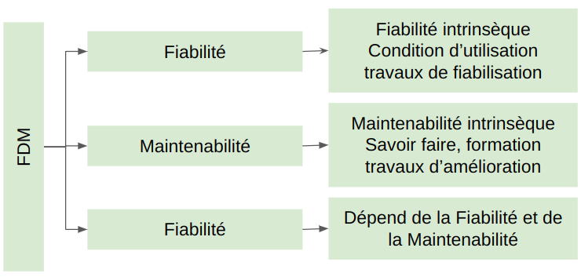
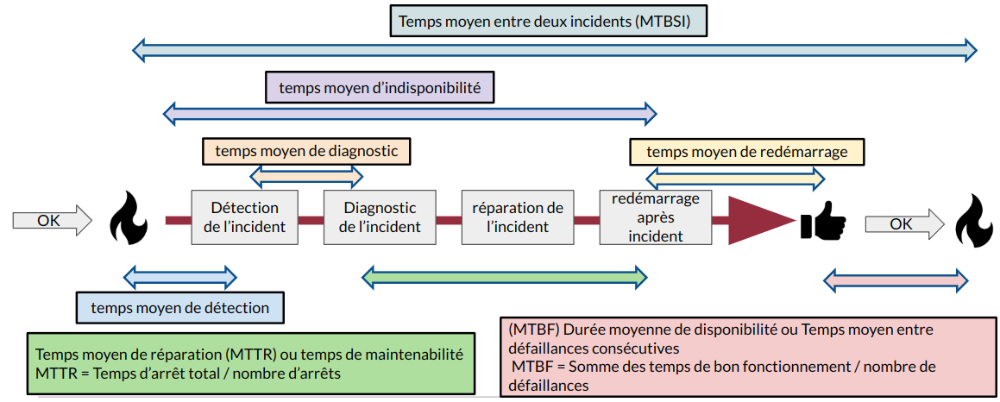

:titre: La conception des services
:module: Centre de services
:duree: 90
:description: Ce module est une introduction à la conception des services ITIL
include::../../../../adoc/libs/header-module.adoc[]

ifeval::["{visible-on-html}" !=  "yes"]
:docinfo: shared
:docinfodir: ../../../../adoc/libs
endif::[]

== Objectifs pédagogiques

// tag::objectifs[]
* Comprendre les principes fondamentaux de la conception des services, incluant objectifs, rôles et indicateurs.
* Appliquer les processus de conception en tenant compte des niveaux de service et des concepts clés FMD.
* Maîtriser la terminologie pour une communication efficace. 
* comprendre comment se mesure les taux de disponibilités 
// end::objectifs[]

// tag::deroulement[]

== Recueil des exigences et définition 

* Collecter les exigences du client (SLR), 
* définir la solution technique, 
* respecter les contraintes de l'architecture SI, 
* définir les processus et indicateurs de mesure de service.

=== Acteurs de la conception

* **Clients et utilisateurs finaux** : Fournissent les besoins,
* **Équipes IT** :
** **Architectes techniques** : Garantissent l'alignement avec l'infrastructure SI.
** **Experts sécurité** : Intègrent les politiques de protection des données et les normes de conformité.
** **Gestionnaires ITSM** : Modélisent et documentent les processus nécessaires à la gestion des services.
* **Partenaires externes** : Fournisseurs de solutions et intégrateurs contribuent à la faisabilité technique et à l'implémentation.
* **Responsables de projets** : Coordonnent les parties prenantes et veillent au respect des délais et des budgets.

== Objectifs et Rôles

* **Objectif Principal**
** Produire des services conformes aux livrables définis par la stratégie des services.
* **Rôles Clés**
** Recueillir les exigences des clients (SLR).
** Définir les solutions adaptées.
** Comprendre les contraintes architecturales du système d’information.
** Établir les processus nécessaires.
** Mettre en place des indicateurs pour mesurer la performance des services.

== Définition de la Solution

=== Élaboration de la Solution

* Identifier les exigences, contraintes, spécifications, validité et bénéfices.
* Choisir les options de réalisation adéquates, internes ou externes.
* Décider entre la maintenance corrective interne ou externe (TMA).
* Opter pour l'exploitation interne ou l'infogérance.
* Déterminer si l'on procède par sous-traitance fonctionnelle (BPO), ou si l'on utilise l'ASP pour fournir le service via l'infrastructure informatique d'un fournisseur.
* Considérer le recours au KPO pour l'expertise externe en métiers ou technologie.

== Indicateurs

=== Surveillance des Indicateurs

* Comment évoluent les données du service ?
* Le service correspond-il à ce qui a été vendu au client ?
* Le service est-il conforme aux SLA ?
* Notre efficience dans la livraison quotidienne du service est-elle optimale ?

=== Acteurs de la Conception des Services

**Personnes et Compétences**

Utilisation des meilleures ressources internes.

**Processus Métier**

Création et évolution des processus selon leur application dans les services.

**Produits et Partenaires**

Sélection de produits adaptés et implication de sous-traitants spécialisés.

**Normes et Outils**

Application des meilleures pratiques et conformité à ISO 20000.

== Processus de conception et niveaux de services

=== Coordination et Gestion

* Coordination des divers processus pour la création de services.
* Gestion du catalogue de services et des SLA.
* Assurance de la disponibilité, de la capacité et de la continuité des services.
* Gestion de la sécurité des données et des relations avec les fournisseurs.

=== Gestion des Niveaux de Service

**Définition des Modalités**

Détails des modalités de service incluant la continuité, disponibilité, changements ...

**Contrats de Service (OLA et UC)**

* **OLA**  : permet Structure et clauses des contrats internes et externes pour réaliser les SLA
** Généralement conclu entre différents départements d'une même organisation qui supportent le service IT.
* **UC - Underpinning Contract** : Contrat de soutien (UC) sous traitance par le fournisseur principal du service

== Les trois concepts FMD

**FMD** englobe trois concepts clés dans la gestion de la performance et de la qualité des systèmes et services

=== Fiabilité (Reliability)

* Définition : Capacité d'un système ou service à fonctionner sans défaillance sur une période déterminée sous conditions spécifiées.
* Mesure : Généralement exprimée par le temps moyen entre défaillances (MTBF).
* Importance : Une haute fiabilité signale une opérabilité prolongée sans interruptions, essentielle pour les opérations critiques.

=== Maintenabilité (Maintainability)

* Définition : Facilité avec laquelle un produit ou service peut être maintenu ou réparé pour retourner à son état opérationnel après une panne.
* Mesure : Souvent quantifiée par le temps moyen de réparation (MTTR).
* Importance : Systèmes faciles à maintenir réduisent les temps d'arrêt et les coûts associés, améliorant la disponibilité et l'efficacité opérationnelle.

=== Disponibilité (Availability)

* Définition : Capacité à être opérationnel et accessible à la demande.
* Mesure : Calculée comme un pourcentage, 
** ((Temps total−Temps d'arrêt) / temps total) x 100
* Importance : Indicateur direct de la performance opérationnelle qui englobe les aspects de fiabilité et de maintenabilité.

include::../../../../adoc/libs/slide-notitle.adoc[]

== Terminologie

* **SLR - Service Level Requirement** :L'exigence de niveau de service (SLR) est une documentation des besoins de service spécifiques du client, qui forme la base pour la négociation des SLA.
* **SLM - Service Level Manager** :  Gestionnaire de niveaux de service (SLM) est le responsable de la négociation, de la définition et du maintien des accords de niveaux de service entre le fournisseur de services et ses clients.
* **SLA - Service Level Agreement** : Accord de niveau de service (SLA) est un contrat formel entre un fournisseur de service et le client. Il précise les services à fournir, les standards de service attendus, et les métriques par lesquelles les services sont mesurés.

include::../../../../adoc/libs/slide-notitle.adoc[]

* **OLA - Operational Level Agreement** : Accord de niveau opérationnel (OLA) décrit les responsabilités interne nécessaires pour la réalisation des SLA. Il est généralement conclu entre différents départements d'une même organisation qui supportent le service IT.
* **UC - Underpinning Contract** : Contrat de soutien (UC) sous traitance par le fournisseur principal du service
* **Catalogue de service** : document regroupant l’ensemble des services

include::../../../../adoc/libs/slide-notitle.adoc[]

* **SIP - Service Improvement Program** : Le programme d'amélioration des services (SIP) est un ensemble d'initiatives planifiées pour améliorer la qualité et l'efficacité des services informatiques, souvent en réponse aux déficits identifiés dans les SLA.
* **TMA - Tierce Maintenance Applicative** : maintenance corrective des applications effectuée par un tiers. Elle comprend généralement la gestion des bugs, des mises à jour, ainsi que l'amélioration continue de l'application.
* **BPO - Business Process Outsourcing** : L'externalisation des processus métiers (BPO) est une pratique de délégation de fonctions de processus métiers spécifiques, telles que la paie ou la comptabilité, à des fournisseurs de services externes.

include::../../../../adoc/libs/slide-notitle.adoc[]

* **ASP - Application Service Provision** : La fourniture de services applicatifs (ASP) désigne un modèle où les applications sont hébergées par un fournisseur de services et mises à disposition des clients sur Internet.
* **KPO - Knowledge Process Outsourcing** :L'externalisation des processus de connaissance (KPO) implique l'externalisation de tâches qui nécessitent et génèrent un niveau élevé de connaissances analytiques et spécialisées, souvent par des consultants ou des spécialistes externes.

== Mesure de la disponibilité

[NOTE.speaker]
--
La flamme : incident

Le pouce : rétablissement

1 - Temps moyen de non-disponibilité

2 - Temps moyen de diagnostique

3 - Temps moyen de redémarrage

4 - Temps moyen de détection

5 - Temps moyen de réparation (MTTR) ou temps de maintenabilité 🡪 moyenne des temps de taches de réparation MTTR = Temps d’arrêt total / nombre d’arrêts

6 - Durée moyenne de disponibilité (MTBF) ou Temps moyen entre défaillances consécutives 🡪 MTBF = Somme des temps de bon fonctionnement / nombre de défaillances

7 - Temps moyen entre deux incidents (MTBSI)

8 - Détection

9 - Diagnostique

10 - Réparation

11 - Redémarrage
--

== La gestion de la continuité : terminologie

* **BCP ou PCA** : **B**usiness **C**ontinuity **P**lan (**P**lan de **C**ontinuité d’**A**ctivité en Français) : 
** Orienté métier, 
** Quelles sont les activités opérationnelles et les ressources associées que je dois maintenir ?
* **BCM** : **B**usiness **C**ontinuity **M**anagment 
** analyse et gestion, 
** Doit répondre aux questions quels sont les risques et leurs impacts ? 

[NOTE.speaker]
--
**BCP**: 4 fonctions essentielles

* Effectuer une analyse de l'incidence sur les activités afin de déterminer les fonctions et les processus opérationnels critiques ou urgents ainsi que les ressources qui les appuient.
* Identifier, documenter et mettre en œuvre pour récupérer les fonctions et les processus opérationnels essentiels.
* Organiser une équipe de continuité des opérations et compiler un plan de continuité des opérations pour gérer une interruption des activités.
* Dispenser une formation à l'équipe de continuité des opérations et effectuer des tests et des exercices pour évaluer les stratégies de rétablissement et le plan.

**BCM** : c’est être en mesure d’identifier quels sont les impacts d’une menace sur un éco-système **afin d’en réduire les effets sur les activités métiers. On n’a pas les conséquences business => C’est le BIA**
--

include::../../../../adoc/libs/slide-notitle.adoc[]

* **BIA** : **B**usiness **I**mpact **A**nalysis
** méthode d’analyse de l’impact business qui permet d’évaluer les pertes potentielles.
* **DRP ou PRA** : **D**isaster **R**ecovery **P**lan (**P**lan de **R**eprise d’**A**ctivité en Français) 
** plan de rétablissement de l’entreprise qui inclut le PRI.
* **PRI**  : Plan de reprise Informatique  
** se concentre uniquement sur le périmètre du service informatique

[NOTE.speaker]
--
**BIA**: prédit les conséquences de la perturbation d'une fonction et d'un processus opérationnels (déterminé dans le BCM) et recueille l'information nécessaire pour élaborer des stratégies de rétablissement.

Le **plan de reprise d'activité (PRA)** d’une entreprise constitue l’ensemble des « procédures documentées lui permettant de rétablir et de reprendre ses activités en s’appuyant sur des mesures temporaires adoptées pour répondre aux exigences métier habituelles après un incident ».
--

== La Gestion de la sécurité : terminologie

**Disponibilité** : Assurer que les informations nécessaires sont accessibles aux utilisateurs autorisés au moment opportun, avec des données précises et à jour.

**Confidentialité** : Garantir que les informations ne sont accessibles qu’aux personnes autorisées, grâce à des outils comme le chiffrement et les mots de passe.

**Intégrité** : Maintenir les données dans leur état initial, sans modification ou altération non autorisée, pour assurer leur fiabilité.

**Authenticité** : S’assurer que les échanges et les informations proviennent bien de la source revendiquée, notamment via des signatures électroniques.

include::../../../../adoc/libs/slide-notitle.adoc[]

**Non-répudiation** : Garantir qu’une action réalisée (comme l’envoi d’un message) ne peut être niée par son auteur, pour renforcer la traçabilité et la responsabilité.

**Traçabilité** : Permettre de suivre et d’enregistrer toutes les actions effectuées sur un système ou des données, notamment via des journaux d’audit.

**Chiffrement** : Protéger les informations en les rendant illisibles sans une clé spécifique, assurant leur sécurité lors du stockage ou du transfert.

**Authentification** : Vérifier l’identité d’un utilisateur ou d’un système avant de leur accorder l’accès, à l’aide de mots de passe, biométrie ou systèmes à deux facteurs.

== La gestion des fournisseurs

Les Fournisseurs sont des organisations externes à l’entreprise qui vont intervenir dans la fourniture d’un service sous contrat de sous-traitance (**UC**, **U**nderpinning **C**ontract)

include::../../../../adoc/libs/slide-notitle.adoc[]

Plusieurs relations possibles :

* Sous-traitance : 
** Organisation externe qui s’engage pour la conception, le développement, l’exploitation et la maintenance d’un service.
* Cotraitance : 
** Organisation externe qui s’engage à participer à des activités du cycle de vie du service.
* Partenariat : 
** Engagement à long terme pour de nouvelles opportunités.
* **A**pplication **S**ervice **P**rovision (ASP) : 
** Fourniture partielle ou totale d’un service à partir de son propre SI et de son réseau.

[NOTE.speaker]
--
Un fournisseur est une organisation externe à l’entreprise qui va intervenir dans le cadre d’un contrat appelé UC (Underpinning Contract, contrat de sous-traitance en français). On traduit aussi le mot fournisseur par sous-traitant, mais à tort, car derrière la notion de sous-traitant, il y a un type de relation bien spécifique. Pour ITIL, la notion de fournisseur ne préjuge pas du type de relation. Plusieurs types de relations avec les fournisseurs sont possibles :

* sous-traitance : l’engagement d’une organisation externe pour la fourniture de la conception, le développement, l’exploitation ou la maintenance d’un service.
* cotraitance : l’engagement d’une organisation externe pour sa participation à des activités du cycle de vie d’un service.
* partenariat : l’engagement à long terme entre une organisation externe et le département informatique pour créer de nouvelles opportunités.
* mode ASP (Application Service Provision en anglais) : l’engagement d’une organisation externe à fournir à la demande tout ou partie d’un service à partir de son propre système d’information et de son réseau.
--

// end::deroulement[]

== Conclusion
// tag::conclusion[]
La conception des services est un levier stratégique qui permet d’aligner les objectifs organisationnels avec les besoins des utilisateurs.

Elle repose sur plusieurs piliers fondamentaux :

* Une compréhension claire des **objectifs** et des **rôles** associés.
* Une définition précise des **solutions** pour répondre aux attentes.
* L’utilisation **d’indicateurs** pertinents pour mesurer et améliorer la performance.

Les processus de conception doivent être structurés en fonction des différents **niveaux de service** et s’appuyer sur des concepts clés, comme les **trois concepts FMD**.

Enfin, une **maîtrise rigoureuse de la terminologie** est essentielle pour assurer une communication fluide et efficace entre les parties prenantes.
// end::conclusion[]