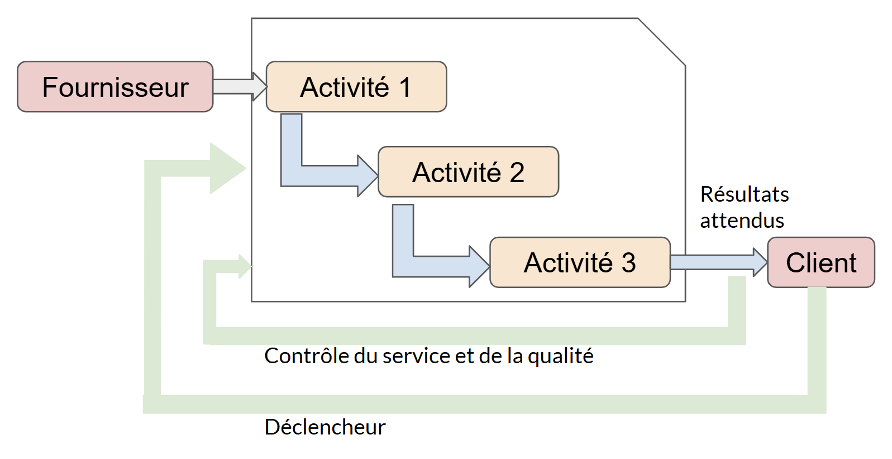
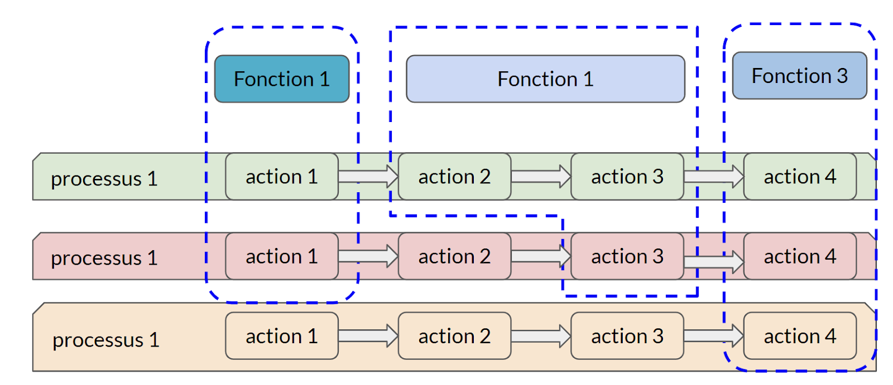

:titre: Concepts ITIL V3
:module: Centre de services
:duree: 90
:description: Découvrez les concepts de base d'ITIL V3 et le rôle d'ITIL dans la gestion des services IT.
include::../../../../adoc/libs/header-module.adoc[]

ifeval::["{visible-on-html}" !=  "yes"]
:docinfo: shared
:docinfodir: ../../../../adoc/libs
endif::[]

== Objectifs pédagogiques

// tag::objectifs[]
* Comprendre les principes clés d’ITIL v3
* Découvrir les 5 phases du cycle de vie des services
* Explorer les processus et fonctions
* Relier théorie et pratique
// end::objectifs[]

// tag::deroulement[]

== Cycle de vie des services

ITIL v3 repose sur 

* une structure méthodique et organisée autour du cycle de vie des services. 
* Chaque phase du cycle de vie est soutenue par des processus et des fonctions. 

Le cycle de vie d'ITIL v3 est un modèle qui structure la gestion des services informatiques autour de cinq phases distinctes mais interconnectées. 

include::../../../../adoc/libs/slide-notitle.adoc[]

Chaque phase du cycle de vie couvre un aspect spécifique de la gestion des services

[cols="1,1"]
|===

a| 
* Stratégie de Service
* Conception de Service
* Transition de Service
* Exploitation de Service
* Amélioration Continue du Service
a| image::./assets/01-cycle.png[]

|===

== Stratégie de service

Compréhension des besoins clients, des objectifs organisationnels, des opportunités de marché. Définit comment les services IT créeront de la valeur.

=== Activités clés

**Analyse des besoins des clients :**

* Identifier les attentes des parties prenantes et leurs priorités.
* Déterminer les services nécessaires pour répondre à ces besoins.

**Alignement stratégique :**

* Évaluer les objectifs business et voir comment les services IT peuvent y répondre.
* Créer des plans stratégiques à long terme. (sdsi - Schéma Directeur des Systèmes d’Information)  

include::../../../../adoc/libs/slide-notitle.adoc[]

**Gestion du portefeuille des services :**

* Vue d'ensemble des services existants pour garantir qu'ils sont alignés sur les besoins métiers.

**Gestion financière :**

* Établir les coûts des services IT.
* Identifier les opportunités de réduction des coûts tout en améliorant la qualité.

**Résultats attendus :**

* Une stratégie claire pour la fourniture de services IT alignée sur les besoins de l'organisation.
* Des décisions sur les investissements dans les services IT.

== Conception de service

Concevoir les nouveaux services ou modifier les services existants pour garantir qu'ils répondent aux besoins stratégiques, techniques et opérationnels, tout en respectant les contraintes de coût et de performance.

=== Activités clés

**Conception fonctionnelle des services :**

* Définir les spécifications des nouveaux services, y compris les niveaux de performance requis.

**Gestion des niveaux de service (SLM) :**

* Élaborer des accords de niveaux de service (SLAs) 

**Gestion de la capacité et des ressources :**

* Prévoir les ressources techniques pour répondre aux demandes futures.

include::../../../../adoc/libs/slide-notitle.adoc[]

**Gestion de la sécurité de l'information :**

* Garantir la confidentialité, l'intégrité et la disponibilité des données.

**Gestion de la continuité des services :**

* Planifier la résilience des services face aux perturbations (ex. : pannes, cyberattaques).

== Transition de service

Introduire de nouveaux services ou modifications dans l'environnement opérationnel tout en minimisant les risques et en assurant la continuité des services existants.

=== Activités clés

**Gestion des changements :**

* Planifier et contrôler les modifications pour éviter les interruptions.

**Gestion des configurations :**

* Maintenir une base de données des composants IT (Configuration Management Database - CMDB) pour garantir une vue précise de l'infrastructure.

**Gestion des déploiements et des versions :**

* Organiser et déployer les nouvelles versions des services de manière planifiée.

include::../../../../adoc/libs/slide-notitle.adoc[]

**Validation et tests des services :**

* Vérifier que les services répondent aux exigences définies lors de la conception.

**Résultats attendus :**

* Un déploiement maîtrisé des nouveaux services et transition fluide vers l’exploitation sans impact négatif sur les utilisateurs.

== Exploitation de service

Gérer le fonctionnement quotidien des services IT pour garantir leur disponibilité, leur performance et leur fiabilité, tout en répondant rapidement aux incidents.

=== Activités clés

**Gestion des incidents :**

* Résoudre rapidement les interruptions de service pour minimiser leur impact.

**Gestion des problèmes :**

* Identifier et éliminer les causes profondes des incidents récurrents.

**Gestion des événements :**

* Surveiller les systèmes pour détecter les anomalies 

include::../../../../adoc/libs/slide-notitle.adoc[]

**Gestion des accès :**

* Assurer que seuls les utilisateurs autorisés accèdent aux systèmes et services.

**Service Desk :**

* Point de contact unique pour les utilisateurs, chargé de la gestion des demandes et des incidents.

**Résultats attendus :**

* Services stables et performants.
* Expérience utilisateur optimisée avec une gestion proactive et réactive des incidents.

== Amélioration continue du service

Identifier et mettre en œuvre des opportunités d'amélioration dans tous les processus et phases du cycle de vie des services pour maximiser la valeur fournie aux clients.

=== Activités clés

**Évaluation des performances des services :**

* Mesurer les résultats des services à l'aide d'indicateurs clés de performance (KPIs).

**Analyse des écarts :**

* Identifier les différences entre les performances actuelles et les objectifs définis.

**Priorisation des améliorations :**

* Déterminer les actions les plus critiques à mettre en œuvre.

include::../../../../adoc/libs/slide-notitle.adoc[]

**Planification et exécution des initiatives d'amélioration :**

* Appliquer le cycle PDCA (Plan-Do-Check-Act) pour garantir une amélioration continue.

**Résultats attendus :**

* Des services plus efficaces, résilients et alignés sur les besoins des clients.
* Une optimisation continue des coûts et des performances.

== Processus et fonctions

Dans ITIL v3, une distinction claire est faite entre **processus** et **fonctions**

=== Les processus

* Ce sont des ensembles d'activités coordonnées qui produisent un résultat spécifique.
* Ils traversent souvent plusieurs fonctions ou départements.
* Exemples : Gestion des incidents, gestion des changements.

=== Les fonctions

* Ce sont des unités organisationnelles ou des équipes responsables de l'exécution de certaines tâches.
* Les fonctions regroupent des ressources humaines, outils et compétences.
* Exemples : Service Desk, gestion des opérations IT.

== Processus

Série d'actions organisées et logiques visant à produire un ou plusieurs résultats attendus pour un ou plusieurs clients..

=== Caractéristiques

* Il est déclenché par un ou plusieurs facteurs.
* Il implique des éléments d'entrée clairement définis.
* Il génère des éléments de sortie, qui peuvent servir d'entrées pour d'autres processus.
* Il établit les rôles et les responsabilités des participants.
* Il spécifie les besoins en outils et les mécanismes de contrôle de gestion.
* Sa documentation, son suivi et son contrôle sont essentiels

=== Mesure de la performance

**Un processus se mesure par son efficacité et son efficience.**

**efficacité** ⇒ mesure si les objectifs cibles du processus, d’un service, d’une activité sont réalisés 

**efficience** ⇒ mesure si  la quantité de ressource alloué à été bien utilisé (coût, temps) 

include::../../../../adoc/libs/slide-notitle.adoc[]

[NOTE.speaker]
--
- Un processus fonctionne en permanence, il est multi instancié et est suivi par un gestionnaire. Contrairement à un projet qui lui possède une date de début et une de fin et est mono instancié

- Un processus fonctionne en flux tiré

- Les acteurs :

**Propriétaire de processus (Process Owner - financeur)**

Est chargé de la conception, de la mise en œuvre et garanti le résultat d’un processus

Est chargé de fournir les ressources au bon fonctionnement d’un processus

Est chargé de vérifier la mise à jour de la documentation et est responsable de sa publication

Choisis les indicateurs de performance d’évaluation de l’efficacité et l’efficience d’un processus

** Indicateurs principaux (Key Performance Indicator)
** Indicateurs secondaires

Analyse les indicateurs et les compare aux objectifs

Produit des actions d’améliorations pour le Plan d’Amélioration Continue (CSIP)

Est chargé de nommer le gestionnaire de processus

Effectue des audits réguliers pour vérifier l’efficacité des processus

**Gestionnaire de processus (Process Manager)**

Fait vivre au quotidien le processus

Entité qui coordonne, supervise les activités et les résultats du processus

Est la partie opérationnelle du processus

Elabore les procédures opérationnelles du processus et les tester

Faire le choix des outils à utiliser et les déployer

Produire des indicateurs

Surveille les performances du processus

Est chargé du reporting auprès du propriétaire du processus
--

== Fonctions

Une fonction est une structures organisées  composé d’une unité ou d’une équipe, doté leurs propres moyens et ressources,

* responsables de la gestion de certaines activités opérationnelles
* va prendre en charge une ou plusieurs actions d’un ou plusieur processus

=== Fonctions définies dans ITIL v3

**Centre de services (Service Desk) :**

* Il s'agit du point de contact unique entre les utilisateurs et le service IT. Crucial pour la gestion des incidents et des requêtes, et pour la communication avec les utilisateurs.

**Gestion technique :**

* Expertise technique nécessaire pour gérer l'infrastructure IT, intervient dans la conception technique et le support opérationnel des services IT.

**Gestion des opérations informatiques :**

* gestion quotidienne de l'infrastructure IT. Comme la gestion des data centers, la surveillance des réseaux, et l'exécution des sauvegardes et des restaurations.

**Gestion des applications :**

* supporte et améliore les applications utilisées par l'organisation pour assurer que celles-ci fonctionnent efficacement et répondent aux exigences.

== Fonctions et processus d'imbrication

La distinction entre fonction et processus dans ITIL V3 est essentielle 

Les fonctions s'occupent des capacités et ressources, tandis que les processus s'occupent des actions et des résultats.

include::../../../../adoc/libs/slide-notitle.adoc[]

// end::deroulement[]

== Conclusion
// tag::conclusion[]
ITIL v3 est structuré autour d’un cycle de vie en 5 phases, chacune avec des objectifs précis pour garantir une gestion cohérente des services IT.

Les concepts de processus et fonctions assurent une organisation efficace et transverse des activités IT.

Chaque phase contribue à l’alignement stratégique, à l’efficacité opérationnelle et à la création de valeur.

ITIL v3 reste une méthode robuste, adaptée aux environnements structurés, mais peut nécessiter des ajustements pour s’inscrire dans des contextes modernes plus agiles.
// end::conclusion[]