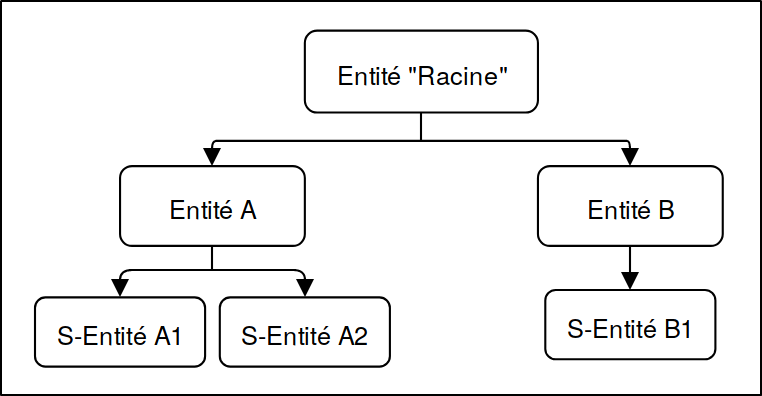
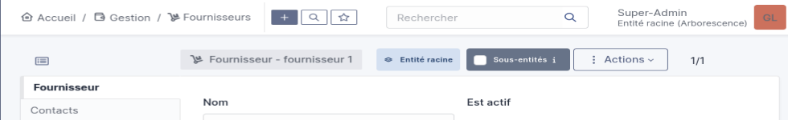

:titre: Entités, Lieux et  profils
:module: Centre de services
:duree: 120
:description: Ce module a pour but de configurer les entités, les lieux et les profils dans GLPI.
include::../../../../adoc/libs/header-module.adoc[]

ifeval::["{visible-on-html}" !=  "yes"]
:docinfo: shared
:docinfodir: ../../../../adoc/libs
endif::[]

== Objectifs pédagogiques

// tag::objectifs[]
* **Structurer GLPI efficacement** : Comprendre et configurer les entités, leur récursivité, et les lieux pour une organisation hiérarchique claire.
* **Adapter l’interface aux utilisateurs** : Différencier et configurer les interfaces simplifiée et standard selon les besoins.
* **Gérer les profils et permissions** : Créer, personnaliser et attribuer des profils pour contrôler les droits d’accès.
* **Personnaliser GLPI** : Ajuster les intitulés et paramètres pour répondre aux besoins spécifiques de l’organisation.
// end::objectifs[]

// tag::deroulement[]

== Les entités dans GLPI

Une des clés de sa bonne utilisation réside dans la structuration des entités et des lieux, qui permettent :

include::../../../../adoc/libs/slide-notitle.adoc[]

* Idéal pour une entreprise avec une structure hiérarchique.
* Notion fondamentale dans GLPI.
* Permet de cloisonner strictement les entités, sauf en cas de récursivité activée.
* Exemple d'utilisation : configurer une entité par client pour une société gérant plusieurs filiales.
* Facilite la segmentation et l'organisation des domaines d'administration de l'application.

include::../../../../adoc/libs/slide-notitle.adoc[]

== Création d'entités

Créer une arborescence d’entités est essentiel pour refléter l’organisation réelle de votre environnement de travail ce qui permet d’avoir .

* Une localisation rapide des équipements, facilitant leur gestion.
* Une séparation claire des responsabilités grâce à la restriction des droits des utilisateurs.
* Par exemple, chaque bâtiment devient une entité, chaque étage devient une sous entité du bâtiment et les salles y sont rattachées comme des lieux.

=== Étapes pour créer une entité

* Accédez à Administration > Entités dans GLPI.
* Créez une nouvelle entité enfant, telle que "Bâtiment B".
* Ajoutez des sous-entités pour chaque étage, comme "Étage 2".

À chaque étape, vérifiez la structure globale via l’arborescence pour confirmer que l’organisation correspond à vos besoins.

Pensez à utiliser des noms clairs et explicites pour éviter toute confusion.

== Récursivité des entités

La récursivité permet de gérer la visibilité des objets dans les sous-entités, en différenciant les objets globaux et locaux.

* Rendre un objet visible dans les sous-entités associées.
* Permet de gérer les problématiques liées aux objets globaux (partagés) et locaux (spécifiques).

=== Exemple d’utilisation : objet de type fournisseur

* Un fournisseur global est déclaré au niveau de l’entité principale (la plus haute hiérarchie) avec l’option de récursivité activée. Cela le rend visible dans toutes les sous-entités.
* Un fournisseur local est déclaré uniquement dans une entité spécifique, sans activer la récursivité. Il reste visible uniquement dans cette entité.

Permet de garantir une gestion optimale des ressources en fonction des besoins hiérarchiques, tout en évitant les redondances inutiles.

== Les lieux dans GLPI

**Pourquoi créer des lieux ?**

Les lieux permettent de localiser précisément un équipement à l’intérieur d’une entité. 

* Entité : Bâtiment B > Étage 2.
* Lieu : Bureau 21.

=== Étapes pour créer des lieux :

* Accédez à **Configuration** > **Intitulés**.
* Créez une structure hiérarchique en commençant par l’étage, puis les bureaux.
* "Étage 2" contient :
** Bureau B21.
** Bureau B22.

Une fois les lieux créés, associez les équipements pour une localisation plus précise. Cela facilite les interventions techniques.

WARNING: Attention à ne pas confondre Entités et lieux

== Les interfaces simplifiée et standard

Dans GLPI, deux types d'interfaces sont disponibles, “Simplifiée” et “standard”.

=== Interface simplifiée :

* **Destinée aux utilisateurs finaux** : Interaction minimale avec le système.
* **Fonctionnalités limitées** : créer des tickets et suivre leurs propres demandes, accéder aux réservations et  consulter la FAQ.
* **Interface épurée** : Menu restreint, facilitant l’utilisation pour les utilisateurs.
* l'interface simplifiée est  associée au Profil "Self-Service" 

=== Interface standard :

* **Conçue pour les techniciens et administrateurs** : Offre un accès complet aux fonctionnalités de GLPI, en fonction des droits attribués au profil de l'utilisateur.
* **Modules complets** : Inclut l'inventaire, le helpdesk, la gestion des problèmes, des changements, des contrats, des fournisseurs, et plus encore.
* **Vues multiples** : Propose des perspectives personnelle, de groupe et globale, permettant une gestion efficace des tâches et une vision d'ensemble des activités.
* L'interface standard est attribuée aux profils tels que "Technicien", "Admin" ou "Super-Admin"

== Les profils dans GLPI

Les profils dans GLPI permettent de : 

* Déterminer le type d’interface utilisée : standard ou simplifiée.
* Chaque utilisateur peut disposer de plusieurs profils.
* Les profils définissent les droits d’accès à l’application.
* Un profil peut être spécifique à une entité, avec possibilité de récursivité.

=== Liste des profils prédéfinis dans GLPI

* **Super-Admin** : Tous les droits sur GLPI (profil de l’utilisateur principal).
** si le profil super-admin est supprimé ou s’il est configuré avec l’interface simplifiée, vous ne pouvez plus configurer GLPI.
* **Admin** : Pleins droits d’administration.
* **Technician** : Accès en lecture à l’inventaire et à la gestion des tickets.
* **Hotliner** : Création et suivi des tickets, mais pas d’attribution directe.
* **Observer** : Accès en lecture uniquement à l’inventaire et aux tickets.
* **Self-Service** : Profil simplifié par défaut, permettant de créer un ticket, suivre ses tickets, accéder aux réservations et à la FAQ.

=== Création de profils

Les profils permettent d’attribuer des droits sur différentes fonctionnalités :

* **Parc** : Gestion de l’inventaire.
* **Assistance** : Gestion et suivi des tickets.
* **Cycles de vie** : Gestion des étapes et statuts des tickets.
* **Gestion** : Administration des licences, fournisseurs, et budgets.
* **Outils** : Accès aux rapports, à la base de connaissance, aux projets, et aux tâches.
* **Administration** : Gestion des règles d’automatisation, des entités, et des groupes.
* **Configuration** : Paramétrage global de GLPI (lieux, intitulés, calendriers, etc.).

=== Différents types de droits peuvent être attribués

[cols="1,1"]
|===

a| * Lecture.
* Mise à jour.
* Création.
* Suppression.
* Purge.
* Autres droits spécifiques
* en fonction des besoins.
a| image::./assets/04-profils.png[]

|===

== Les intitulés dans GLPI

Les intitulés peuvent être organisés en deux formats :

* Liste de valeurs arborescente : Permet d’établir une hiérarchie entre les intitulés.
* Liste de valeurs à plat : Présentation simple et linéaire.

include::../../../../adoc/libs/slide-notitle.adoc[]

GLPI propose une liste par défaut, avec des options paramétrables selon les besoins :

[cols="1,1"]
|===

a| 
* Fournisseurs.
* Catégories de tickets.
* Statuts de matériels.
* Calendriers.
* Noms de logiciels.
* Prises réseau.
* Constructeurs.
* Lieux.
* ...
a| image::./assets/05-intitules.png[]

|===

// tag::demo[]

== Démonstration

[NOTE.speaker]
--
**Accéder à la section des entités**

* **Action** : Connectez-vous à GLPI avec un compte administrateur.
* **Chemin** : Cliquez sur Administration > Entités.
* **Vérification** : Une liste des entités existantes apparaît.

**Créer une nouvelle entité**

* **Action** :
** Cliquez sur le bouton **+** ou **Ajouter** en haut de la page.
** Remplissez les champs suivants :
*** **Nom** : Entrez "Bâtiment B".
*** **Description** : Entrez "Entité représentant le bâtiment B".
** Cliquez sur **Ajouter**.
* **Vérification** : La nouvelle entité "Bâtiment B" doit apparaître dans la liste.

**Ajouter des sous-entités**

* **Action** :
** Cliquez sur **Bâtiment B** dans la liste.
** Cliquez sur **+ Ajouter une sous-entité**.
** Remplissez les champs :
*** **Nom** : Entrez "Étage 1".
*** **Description** : Entrez "Premier étage du bâtiment B".
** Répétez pour créer une autre sous-entité appelée "Étage 2".
* **Vérification** : Dans l’arborescence, "Étage 1" et "Étage 2" apparaissent sous "Bâtiment B".

**Activer la récursivité**

* **Action** :
** Cliquez sur "Bâtiment B".
** Accédez à l’onglet **Paramètres**.
** Activez l’option **Rendre les objets visibles dans les sous-entités**.
** Cliquez sur **Enregistrer**.
* **Vérification** : Les objets de "Bâtiment B" seront visibles dans "Étage 1" et "Étage 2".

**Démonstration : Configuration des lieux**

**Accéder à la section des lieux**

* **Action** : Cliquez sur **Configuration** > **Intitulés** > **Lieux**.
* **Vérification** : La liste des lieux existants s’affiche.

**Ajouter un lieu**

* **Action** :
** Cliquez sur **+ Ajouter**.
** Remplissez les champs :
*** Nom : Entrez "Bureau B21".
*** Description : Entrez "Bureau situé au deuxième étage du bâtiment B".
** Associez ce lieu à "Étage 2" (sélectionnez dans la liste déroulante des entités).
** Cliquez sur **Ajouter**.
* **Vérification** : Le lieu "Bureau B21" apparaît sous "Étage 2".

**Associer un équipement à un lieu**

* **Action** :
** Accédez à **Parc** > **Ordinateurs**.
** Cliquez sur un ordinateur existant ou créez-en un nouveau.
** Dans l’onglet **Informations générales**, choisissez "Bureau B21" dans le champ Lieu.
** Cliquez sur **Enregistrer**.
* **Vérification** : L’équipement est maintenant associé au lieu "Bureau B21".

**Démonstration : Gestion des profils**

**Accéder à la section des profils**

* **Action** : Cliquez sur **Administration** > **Profils**.
* **Vérification** : Une liste des profils existants s’affiche.

**Créer un profil personnalisé**

* **Action** :
** Cliquez sur **+ Ajouter**.
** Remplissez les champs :
*** **Nom** : Entrez "Responsable IT".
*** **Description** : Entrez "Profil pour la gestion des tickets".
** Cliquez sur **Ajouter**.
** Configurez les permissions :
*** Accédez à l’onglet **Droits**.
*** Cochez les cases **Lecture**, **Création** et **Mise à jour** dans la section **Assistance**.
** Cliquez sur **Enregistrer**.
* **Vérification** : Le profil "Responsable IT" apparaît dans la liste des profils.

**Associer un profil à un utilisateur**

* **Action** :
* Cliquez sur **Administration** > **Utilisateurs**.
* Sélectionnez un utilisateur existant ou créez-en un nouveau.
* Dans l’onglet **Profils**, ajoutez "Responsable IT".
* Cliquez sur **Enregistrer**.
* **Vérification** : L’utilisateur dispose désormais des permissions du profil "Responsable IT".

**Démonstration : Interfaces simplifiée et standard**

**Configurer une interface simplifiée**

* **Action** :
** Retournez dans **Administration** > **Profils**.
** Sélectionnez le profil "Self-Service".
** Dans l’onglet **Interface**, choisissez **Simplifiée**.
** Cliquez sur **Enregistrer**.
* **Vérification** : Les utilisateurs avec ce profil verront une interface simplifiée.

**Passer à une interface standard**

* **Action** :
** Revenez dans **Profils**.
** Sélectionnez le profil "Technicien".
** Dans l’onglet **Interface**, choisissez **Standard**.
** Cliquez sur **Enregistrer**.
* **Vérification** : Les utilisateurs avec ce profil verront une interface complète.

**Validation finale**

Connectez-vous avec différents utilisateurs (Self-Service, Technicien, Responsable IT) pour vérifier que :

* Les interfaces sont adaptées.
* Les permissions sont respectées.
* Les équipements et lieux sont correctement associés.
--

// end::demo[]

// end::deroulement[]

== Conclusion
// tag::conclusion[]
On doit  garantir une utilisation adaptée de GLPI pour répondre aux besoins opérationnels.

* **Organisation structurée** : Les entités, leur récursivité et les lieux sont essentiels pour structurer efficacement les données dans GLPI.
* **Interfaces adaptées** : L’interface simplifiée convient aux utilisateurs finaux, tandis que l’interface standard offre des outils complets pour les techniciens et administrateurs.
* **Gestion des droits** : Les profils permettent de définir des permissions précises et de contrôler les accès en fonction des rôles.
* **Personnalisation** : Les intitulés et configurations permettent d’adapter GLPI aux besoins spécifiques de chaque organisation.
// end::conclusion[]