:titre: L'exploitation des services
:module: Centre de services
:duree: 90
:description: Ce module est une introduction à l'exploitation des services ITIL
include::../../../../adoc/libs/header-module.adoc[]

ifeval::["{visible-on-html}" !=  "yes"]
:docinfo: shared
:docinfodir: ../../../../adoc/libs
endif::[]

== Objectifs pédagogiques

// tag::objectifs[]
* **Comprendre les fonctions clés de l’exploitation des services** et leur rôle dans la continuité et la qualité des services informatiques.
* **Maîtriser les différents types de centres de service** (local, centralisé, virtuel, "follow-the-sun") et leurs fonctions pour répondre efficacement aux besoins des utilisateurs.
* **Appliquer les processus de gestion des incidents, des problèmes, des événements et des accès** pour garantir une exploitation fluide et réactive des services.
* **Optimiser l’exécution des requêtes** grâce à une organisation et des outils adaptés.
// end::objectifs[]

// tag::deroulement[]

== Exploitation des services

L’exploitation des Services à pour objectifs de :

* Coordonner les activités des processus garantissant l’atteinte des niveaux de service convenus
* Gérer l’exploitation au quotidien

=== Missions

* Coordonner et réaliser les activités nécessaires à la fourniture des services
** Exploitation – Supervision – Pilotage – Support – Maintenance
* Être efficace puis efficient tout au long de la vie des services (coût)
* Produire des indicateurs pour permettre à la phase d’amélioration continue de faire des propositions d’optimisation de la DSI

include::../../../../adoc/libs/slide-notitle.adoc[]

* Stabilité
** Le SI fonctionne normalement et est disponible : On ne change plus rien
** Réduction du nombre de changements et donc de Mises En Production (MEP)
* Réactivité
** Réaction aux sollicitations des métiers pour les rendre les plus performantes possible
* Coûts par rapport à qualité
** Éviter la surqualité, réduire les coûts en gardant le niveau de qualité demandé : Industrialisation de l’exploitation, supervision et pilotage

include::../../../../adoc/libs/slide-notitle.adoc[]

* Réactivité par rapport à proactivité
** Agir en fonction des évènements ou incidents
** Essayer d’anticiper en recherchant des moyens d’optimiser le SI
** Investir pour garantir un bon fonctionnement

== Les 4 fonctions ITIL v3

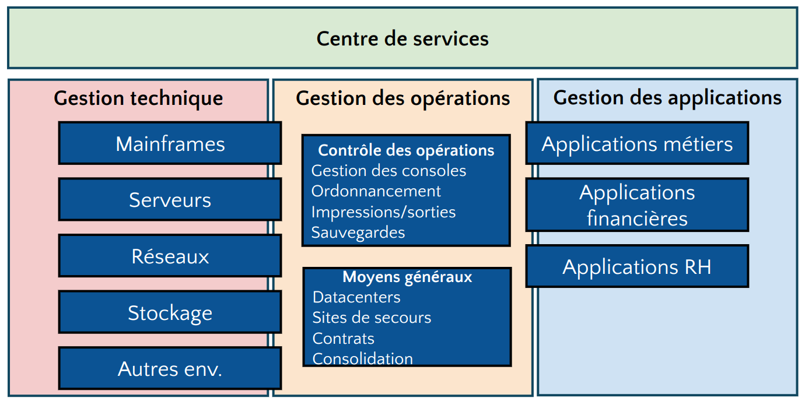

[NOTE.speaker]
--
La gestion des opérations est l’équipe en charge de l’exploitation du système d’information. Cette fonction est garante de la stabilité et de la disponibilité du système d’information au quotidien. Elle regroupe les équipes que l’on appelle communément l’exploitation et la production.

**La gestion technique**

La gestion technique est l’équipe qui regroupe toute l’expertise technologique sur le matériel et les logiciels de base (sur l’infrastructure). Cette fonction va fournir des ressources pour les phases de conception des services, de transition des services et d’exploitation des services. Les domaines de compétences sont :

* les mainframes, les serveurs…
* le réseau et les moyens télécoms,
* les bases de données,
* le stockage,
* etc.

**La gestion des applications**

La gestion des applications regroupe les compétences fonctionnelles (applicatives) qui interviendront pour les développements et la maintenance applicative. Cette fonction aide à :

* l’identification des besoins fonctionnels et des performances applicatives,
* la conception et le développement des applications,
* la maintenance corrective et évolutive des applications.

La gestion des applications regroupe les équipes des études et de la maintenance applicative (TMA, Tierce Maintenance Applicative, si elle est externalisée).

--

== Le centre de services est le coeur de l'exploitation

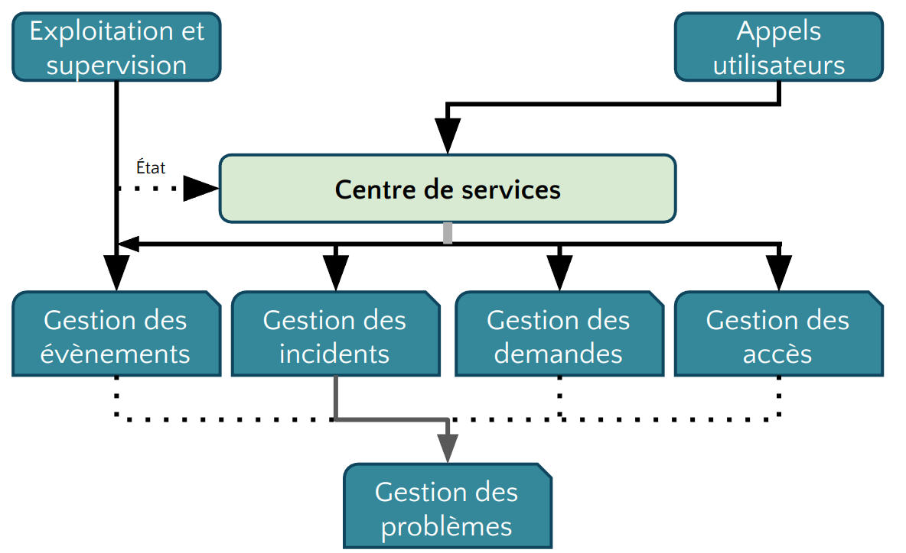

== Fonction du centre de services

Les missions du centre de service sont les suivantes : 

* Le « service desk »
* Être point de contact unique pour les utilisateurs
* Porter toute la relation avec les utilisateurs : relation bidirectionnelle
* Servir les utilisateurs et les satisfaire
* Garantir la bonne image de la DSI auprès des utilisateurs

include::../../../../adoc/libs/slide-notitle.adoc[]

* Être vitrine du département informatique
* Répondre aux questions et demandes des utilisateurs
* Restaurer le service dans un état normal, standard le plus rapidement possible dans le respect des délais définis et contractuels
* Assurer les activités de N1, gérer les escalades aux groupes supérieurs et coordonner

include::../../../../adoc/libs/slide-notitle.adoc[]

Les concepts

* Le centre d’appels ( « Call Center » )
* Le centre d’assistance ( « Help Desk » )
* Le centre de services ( « Service center » )

include::../../../../adoc/libs/slide-notitle.adoc[]

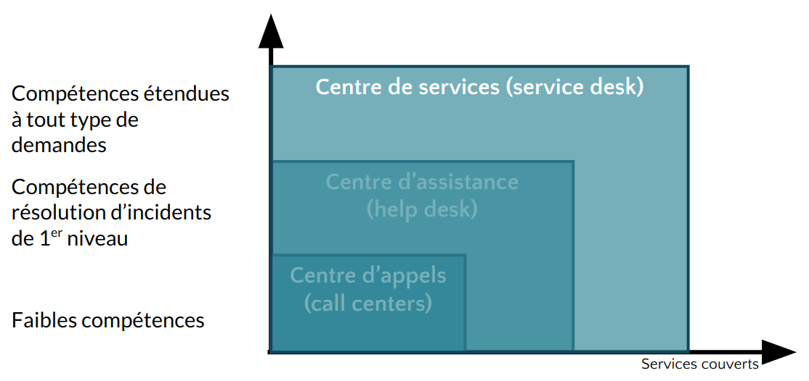

== Le centre d'appel

* Prendre des appels
* Passer des appels en masse

include::../../../../adoc/libs/slide-notitle.adoc[]

* Un standard téléphonique est en place
** On l’appelle / Il nous rappelle
** On s’identifie (nom, numéro de contrat, etc.)
** On explique les raisons de l’appel
** La réponse du centre d’appel est souvent : « On vous rappellera », « Un technicien vous rappellera »
** Très peu de valeur ajoutée, réponse minimale pour l’appelant
** Il est le niveau 0
*** Gère très peu d’actions, amène une forte frustration des utilisateurs
*** Transfert le ticket d’appel

== Le centre d'assistance

* Gère les pannes et les dysfonctionnements remontés par les utilisateurs
* Gère et coordonne toutes les activités liées au dépannage de l’utilisateur
* Donne des informations sur l’avancement du dépannage si l’utilisateur le demande

include::../../../../adoc/libs/slide-notitle.adoc[]

* Est dans des actions de type réactif
* Attend que l’utilisateur appelle pour le renseigner
* Le centre d’assistance
** Est là en support des utilisateurs qui appellent
** Répond aux sollicitations des utilisateurs
** À peu ou pas d’actions proactives vers les utilisateurs

== Centre de service

* Est un sur ensemble du centre d’assistance en ajoutant des activités de proactivité
* Intervient dans tous les processus de l’exploitation des services
* Et dans une partie des activités de deux processus de la transition des services
** La gestion des changements
** La gestion des déploiements et des mises en production

=== Activités

* La prise en compte de l’appel de l’utilisateur
* Ouverture du ticket d’appel dans l’outil de gestion du centre de services
* Enregistrement des informations liées à l’appel de l’utilisateur
* La catégorisation

include::../../../../adoc/libs/slide-notitle.adoc[]

* La codification
* L’investigation et le diagnostic
* La réponse dépendra de la demande utilisateur
* Escalade vers les groupes support de niveau 2 et de niveau 3 si nécessaire
* Le suivi de l’appel
* La résolution / clôture du ticket
* La gestion des enquêtes de satisfaction des utilisateurs
* La mise à jour de la base de connaissance

=== Configuration et architecture

Le choix de l’architecture et des configuration va dépendre de différents paramètres :

* Le périmètre (fonctionnalités, horaires, etc.)
* La typologie des appels gérés
* Les périodes de charge et les périodes creuses
* Les moyens nécessaires (les outils)

include::../../../../adoc/libs/slide-notitle.adoc[]

Il y a quatre grands types d’architecture

* Le centre de services local
* Le centre de services centralisé
* Le centre de services virtuel
* Le centre de services qui suit le soleil

=== Le centre de service local

* Implanté sur le même site que les utilisateurs
* Architecture souvent représentée par un guichet, un bureau où les utilisateurs peuvent venir
* Implémente des environnements très spécialisés avec des besoins spécifiques
avantages 
* Proximité des utilisateurs
* Forte réactivité, délai d’intervention rapide

include::../../../../adoc/libs/slide-notitle.adoc[]

* Meilleure compréhension de la problématique des utilisateurs
* Connaissance des utilisateurs eux-mêmes
* inconvénient
* Pas de mutualisation des ressources et leur optimisation
* Moins de partage de connaissance avec les autres centres de services locaux

include::../../../../adoc/libs/slide-notitle.adoc[]

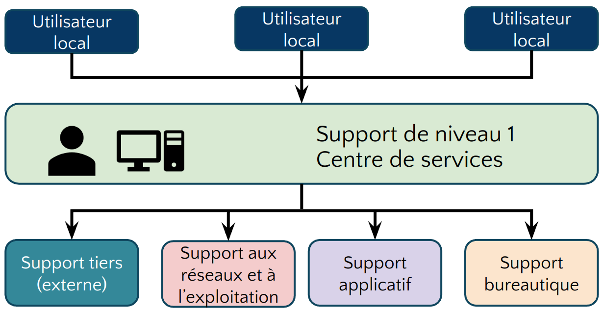

== Le centre de service centralisé

* Implanté sur un site unique
* Externalisé
* Contacté par des canaux de télécommunication (téléphone, e-mail, intranet)

=== Avantages

* Mutualisation des ressources et des moyens
* Meilleur partage de l’information et des connaissances : Procédures homogènes

=== Inconvénients

* Pas de proximité avec les utilisateurs
* La réactivité sera moins forte

**limiter les inconvénients**

* Outils de prise en mains à distance, technicien de proximité, mixité centre de service local

include::../../../../adoc/libs/slide-notitle.adoc[]

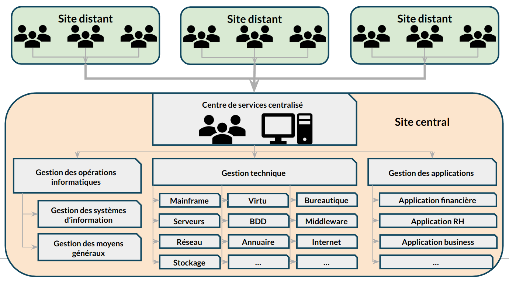

== Le centre de service virtuel

* Mettre le demandeur en relation avec le technicien possédant le meilleur profil
* En fonction de
** L’heure
** Du pays ou du site d’appel
** Du profil de l’utilisateur appelant
** Du métier du demandeur

=== Avantages & inconvénients

[cols="1,1"]
|===

| Avantages
| Inconvénients

a|
* Une meilleure crédibilité et réactivité
a|	
* Mise en place d’outils téléphoniques spécifiques avec SVI
* Problème de coordination des différentes entités
* Pour limiter ces inconvénients : Utilisation d’un responsable unique

|===

include::../../../../adoc/libs/slide-notitle.adoc[]

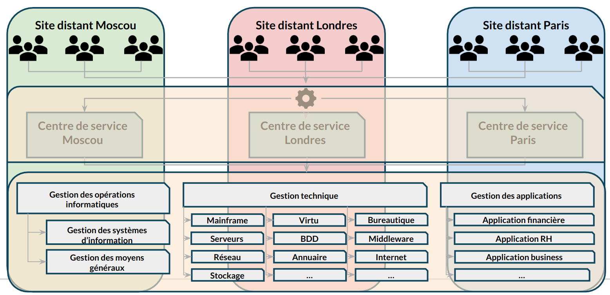

== Le centre de service qui suit le soleil

* Couvre une problématique particulière
* Fonctionne 24h/24
* Réparti dans plusieurs entités aux quatre coins du monde dans des faisceaux horaires différents

include::../../../../adoc/libs/slide-notitle.adoc[]

* À toute heure du jour ou de la nuit, l’appel est aiguillé vers un centre ou une équipe de jour présente
* Choix des moyens et des outils
* Avoir des procédures et des escalades communes et partagées
* Avoir une langue commune (souvent l’anglais)

include::../../../../adoc/libs/slide-notitle.adoc[]

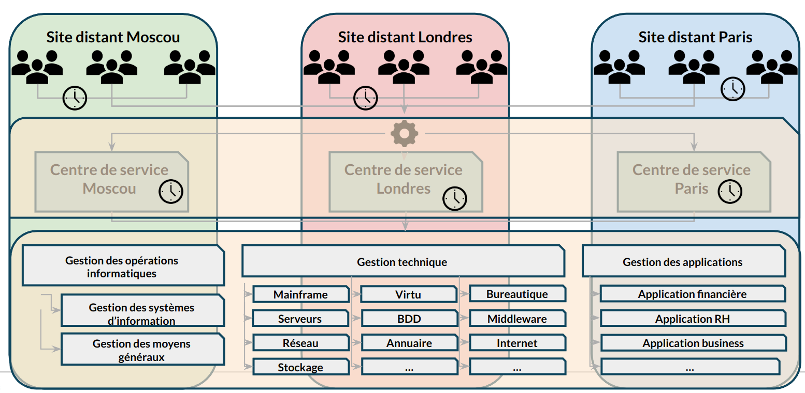

== Les outils

[cols="1,1"]
|===

a| * L’autocommutateur téléphonique intelligent
* Serveur vocal interactif
* Couplage téléphonique informatique
* Logiciel de relation utilisateur (CRM)
a| image::./assets/13-outils.png[]

|===

include::../../../../adoc/libs/slide-notitle.adoc[]

* Intégration avec les autres outils
** Le CMS
** La base des erreurs connues (KEDB)
** La gestion documentaire de l’entreprise (SKMS)
** Les outils de gestion de services
* Centre de services dit en libre-service (utilisateurs autonomes)

== L'exploitation des services

Peut être segmenté en  4 centres de gestion responsable de l'exécution des requêtes : 

* L’exécution des requêtes
** Traiter les demandes de services provenant des utilisateurs
La gestion des accès
Traiter les requêtes relatives à l’accès, aux droits et aux privilèges des utilisateurs

include::../../../../adoc/libs/slide-notitle.adoc[]

* La gestion des incidents
** Restauration au plus vite du service dégradé ou arrêté dans les délais impartis
* La gestion des problèmes
** Rechercher les causes et solutions à des incidents récurrents
* La gestion des évènements
** Interpréter et gérer tous les faits détectables qui arrivent sur l’infrastructure, qu’ils soient normaux ou anormaux

== L'exécution des requêtes

* Fournir un canal privilégié vers la DSI aux utilisateurs pour émettre et traiter leurs demandes
* Fournir de l’assistance auprès des utilisateurs sur l’utilisation des services
* Approvisionner des composants standards des services suivant les demandes des utilisateurs
* Fournir un canal pour faire remonter les plaintes des utilisateurs vers la DSI

=== Une requête : Demande de service provenant d’un utilisateur

[cols="1,1"]
|===

a|
* Assistance
* Conseil
* Information
* Changement standard simple
a|
* Approvisionnement de consommable
* Accès à un service
* Une plainte
* Tout ce qui n’est pas un incident

|===

== L'exécution des requêtes

Une requête va réaliser une action

* Limitée dans le temps
* À faible risque et coût
* Traitée par une seule personne

=== Le catalogue des requêtes

* Base du fonctionnement de ce processus
* Liste précise et détaillée des demandes de services provenant des utilisateurs
* Identifie précisément quel profil d’utilisateur a le droit de demander telle requête
* Diffusion et promotion de ce catalogue auprès de tous les utilisateurs sont un enjeu majeur

== La gestion des accès

* Mettre en place les procédures définies par
** La politique de sécurité de la DSI
** Les recommandations de la gestion de la disponibilité
** Les procédures doivent aussi être connues et diffusées auprès de tous
* Fournir aux utilisateurs les droits et privilèges d’un service ou d’un groupe de services

=== La gestion des droits

Ensembles des règles qui vont définir les types d’accès à un service ou un groupe de services

=== La gestion de l’identité

Gestion d’une identification fiable des utilisateurs qui vont accéder à ce service

=== L’accès au service

* Est le niveau, le périmètre de fonctionnalités ou de données auquel un utilisateur peut avoir accès
* Notions de confidentialité, gestion des mots de passe et règles associées (initialisation, validation et revalidation)

=== L’identité des groupes

* Cartographie des groupes de l’entreprise nécessaire
* Notions de groupe de services offerts à un utilisateur ou groupe d’utilisateurs
* Cartographie des services mettant en avant les familles de services en fonction des droits

== La gestion des incidents

* Rétablir le service dans un état normal de plus rapidement possible conformément au SLA
** Rétablir c’est trouver une solution, un palliatif, qui va relancer le service dans son état normal
* Minimiser l’impact de l’incident sur les utilisateurs (les conséquences pour l’utilisateur)
* Rétablir le service dans les délais contractuels (engagement auprès du client)
* Ce processus ne s’occupe pas de trouver la cause de l’incident

=== Définition d'un incident

* Ne pas confondre incident, évènement et problème
* Un événement est un fait détectable qui arrive du SI alors que l’incident est un événement qui altère ou dégrade le service rendu
* Il survient lorsque le service est arrêté ou quand la qualité du service est diminuée
* L’incident a pour origine un évènement (détecté ou non), mais tous les évènements ne créent pas d’incident
* Il est détecté soit par un utilisateur, des outils de supervision ou de pilotage par la gestion des évènements

=== Codifier un incident

C’est déterminer la priorité que l’on va lui attribuer

Pour cela :

* Identifier l’impact de l’incident
* Identifier l’urgence de l’incident
* Utilisation d’une matrice ou d’un référentiel applicatif
* Détermination du délai de rétablissement

WARNING: Toutes ces notions devront être notées dans les SLA pour chaque service et négociées avec les clients avant la mise en exploitation du service

=== L'impact

Effet de l’incident sur l’utilisation d’un service

* Perte d’exploitation
* Nombre d’utilisateurs bloqués
* Non-respect des dispositions légales
* Positionné sur une échelle de 1 à 3 ou de 1 à 5 (1 élevé, 3 ou 5 faible)

=== L’urgence : 

Temps dont dispose la DSI pour rétablir le service

Positionnée sur une échelle de 1 à 3 ou de 1 à 5

[cols="1,1"]
|===

a| image::./assets/17-incidents.png[]
a| image::./assets/17-incidents-2.png[]

|===

=== L'incident majeur

* Fort impact sur les clients
* Hors grille de codification
* D’une priorité très élevée
* Traité différemment des autres incidents
* Utilisation d’une procédure dite de « crise »

=== Les escalades

**escalade fonctionnelle**

Survient quand une équipe est dans l’incapacité de réaliser un traitement (diagnostic ou rétablissement)
Transfert vers un niveau supérieur ou de mêmes niveaux d’expertise, mais dans un autre domaine

include::../../../../adoc/libs/slide-notitle.adoc[]

**escalade hiérarchique**

* Escalade à la hiérarchie pour une situation particulière
* Incidents majeurs potentiels
* Impact fort sur les branches métier
* Blocage dû à un manque de ressources, moyens…

=== Concepts liés à la gestion des incidents

* Période de fourniture des services : Définir un calendrier d’utilisation des services
* Arbre de résolution
** Modèle d’incident – Branche de l’arbre la plus souvent parcourue
** Listing de dépannage – Check-list
* Base de connaissance : Liste des incidents connus et leurs solutions
* Incident majeur : Gravité importante pour les clients
* Crises : Incident majeur à résoudre tout de suite. Peut donner suite à un Post-Mortem

include::../../../../adoc/libs/slide-notitle.adoc[]

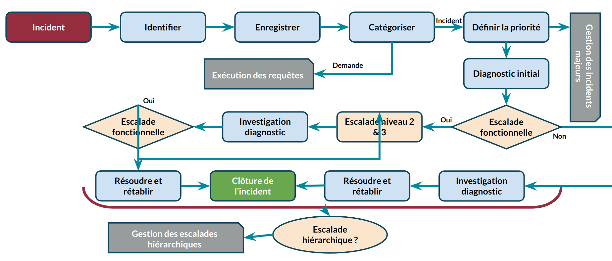

== La gestion des problèmes

* Faire diminuer le nombre d’incidents
* Prévenir l’apparition de nouveaux incidents et problèmes
* Minimiser l’impact des incidents
* Optimiser l’efficacité des équipes supports

include::../../../../adoc/libs/slide-notitle.adoc[]

* Contrôler les problèmes : Les transformer en erreurs connues
* Gérer les erreurs
* La proactivité
** Participe à maintenir le niveau de qualité de service demandé
** Prend l’initiative de la recherche de situations qui dégradent ce niveau

=== Définition d'un problème

* Situation dont on recherche la cause inconnue d’un ou plusieurs incidents
* La gestion des incidents traite en temps réel les situations (front line)
* La gestion des problèmes traite les causes de ces situations (back-office)
* Tous les incidents ne déclenchent pas de problèmes
* On ouvre un problème dans le cas d’incidents récurrents ou dans un contexte d’incident majeur

=== Une erreur connue

* Problème dont on connaît la cause et dont on a identifié une solution temporaire ou définitive
* La base des erreurs connues (KEDB) contient l’ensemble de ces problèmes transformés en erreurs connues
* Base mise à disposition du centre de services sous la responsabilité des groupes support

include::../../../../adoc/libs/slide-notitle.adoc[]

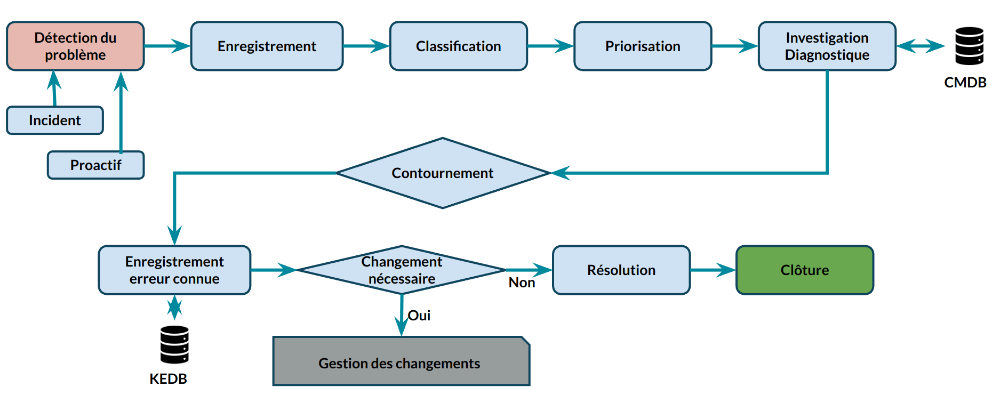

== La gestion des évènements

* Minimiser le nombre d’incidents
** Objectif principal
** Plus d’efficacité dans la gestion des évènements entraîne moins d’incidents
** Surveiller les évènements et les comprendre
** Positionner des seuils et des alarmes

include::../../../../adoc/libs/slide-notitle.adoc[]

* Garantir le niveau de qualité de service
** Anticiper les situations pouvant détériorer le niveau de qualité de service
** Avoir une action proactive sur la gestion des évènements pour maintenir et garantir le niveau de qualité de service
** Positionner des seuils sur les composants clés

=== Définition d’un événement

* Fait détectable arrivant sur le système d’information ou sur la fourniture d’un service
* Changement d’état d’un ou plusieurs composants de l’infrastructure
* Aléatoire, observable et mesurable
* Des outils sont nécessaires pour le détecter et le mesurer
* Sans outillage, pas d'événement

=== 4 types d’évènements

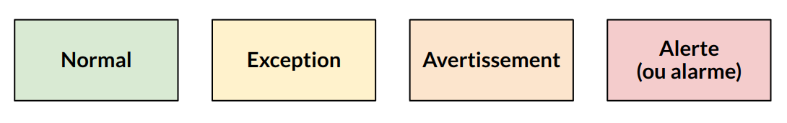

include::../../../../adoc/libs/slide-notitle.adoc[]

**Évènement normal**

* Indique un fonctionnement normal, dans la Baseline. 

**Événement exception**

* Événement anormal survenu sur l’infrastructure
* Peut-être visible par les utilisateurs sans dégrader le niveau de qualité de service offert
* Peut se transformer en incident si la situation impacte le niveau de qualité

include::../../../../adoc/libs/slide-notitle.adoc[]

**Évènement avertissement**

* Évènement inhabituel, un avertissement
* Approche d’un seuil critique, un pic d’activité

**Évènement alerte**

* Exception nécessitant une intervention
* Prédéfini en avance avec positionnement d’un seuil
* Des consignes préétablies vont permettre d’intervenir
* Un travail préliminaire sur l’identification des seuils est nécessaire

include::../../../../adoc/libs/slide-notitle.adoc[]

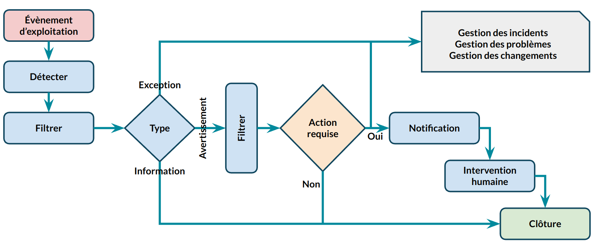

// end::deroulement[]

== Conclusion
// tag::conclusion[]
L’exploitation des services dans ITIL v3 repose sur des fonctions et processus clés qui garantissent la continuité et l’efficacité des services informatiques. Les points essentiels à retenir sont :

* **Les 4 fonctions ITIL v3** : Elles structurent l’exploitation des services pour répondre aux besoins organisationnels.
* **Les centres de service** : Leur diversité (local, centralisé, virtuel, "follow-the-sun") permet de s’adapter aux contextes opérationnels et d’assurer une prise en charge optimale des utilisateurs.

include::../../../../adoc/libs/slide-notitle.adoc[]

* **La gestion des incidents, des problèmes, des événements et des accès** : Ces processus visent à minimiser les interruptions et à maximiser la disponibilité des services.
* **L’importance des outils et de l’organisation** : Une exécution efficace des requêtes repose sur des processus bien définis et des outils performants.

En appliquant ces principes, l’exploitation des services devient un levier essentiel pour garantir la qualité et la continuité des services IT.
// end::conclusion[]