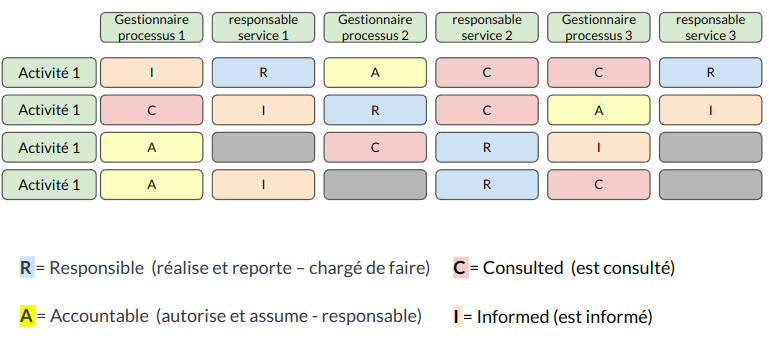

:titre: La gestion des services
:module: Centre de services
:duree: 60
:description: Ce module explique la gestion des services selon ITIL
include::../../../../adoc/libs/header-module.adoc[]

ifeval::["{visible-on-html}" !=  "yes"]
:docinfo: shared
:docinfodir: ../../../../adoc/libs
endif::[]

== Objectifs pédagogiques

// tag::objectifs[]
* Différencier clairement les concepts de projet et de service dans le cadre d’ITIL.
* Comprendre l’importance de mettre le service au cœur de la gestion pour répondre aux besoins des utilisateurs et des entreprises.
* Assimiler la notion de création de valeur et son rôle central dans la gestion des services IT.
* Identifier les cinq acteurs clés du service et leurs contributions respectives.
* Explorer le modèle RACI et son application pratique pour clarifier les rôles et responsabilités au sein des équipes.
// end::objectifs[]

// tag::deroulement[]

== Projet et service

ITIL v3 propose une évolution de la gestion de projet vers la gestion de service qui est plus orientée client.

=== Un projet c'est :

La capacité à mettre en place de nouvelles fonctionnalités par rapport à :

* De nouveaux besoins
* Une évolution de la législation
* Une avancée technologique

=== Un service c'est :

La capacité à générer le service demandé en respectant trois critères :

* Aligner les services informatiques sur les besoins des clients
* Améliorer la qualité des services informatiques
* Maîtriser les coûts de fourniture

== Focus service

Un service est l’ensemble des moyens mis en œuvre pour apporter à un client de la valeur sans qu’il n’en supporte ni les coûts ni les risques

=== Création de valeur

**Un service doit fournir de la valeur** et est une application installée sur une infrastructure avec :

* Un support de documentation
* Un support de formation
* Un support mis en place
* De l’assistance aux utilisateurs

Un service est un engagement de résultat :

* Face au client
* Face au risque

== Notion de création de valeur

Pour créer de la valeur deux conditions sont requises : **Utilité** et **Garantie**

=== Utilité (dimension de la prestation)

La raison d’être d’un service

* Amélioration des performances
* Dépassement des contraintes
* Ajout de fonctionnalité

=== Garantie (utilisabilité)

Assurance, pour le client, que le service va remplir les exigences de niveau de qualité contractualisé (condition, résultats, lieu, délais et moment)

C’est le niveau d’usage dont le client et ses utilisateurs ont besoin

Elle doit respecter :

* La disponibilité
* La performance
* La continuité de service
* La sécurité

== 5 acteurs de services

=== Le fournisseur de services informatiques (IT Service Provider)

Responsable de la mise à disposition des services informatiques

**Type I : fournisseur interne**

Exemple: Une organisation marketing d'une entreprise crée une équipe informatique interne pour gérer ses besoins informatiques.

**Type II : fournisseur de services partagés**

Une direction informatique sert plusieurs divisions d'une entreprise, y compris elle-même.

**Type III : fournisseur externe**

Offre des services informatiques à diverses entreprises.

=== Le client

Personne ou organisation bénéficiaire finale des services informatiques

* Donneur d'ordre, Paie pour la solution et le service.
* Autorisé à signer des SLA (Service Level Agreement) pour la fourniture de services informatiques.
* Exprime les besoins métiers, négocie et valide les services.
* Représentant des utilisateurs avec une relation spécifique avec la DSI (Direction des Systèmes d'Information).

=== L'utilisateur (collaborateur du client)

Utilise les services informatiques pour ses activités professionnelles

* Remonte ses exigences au client.
* N’a pas à payer directement pour l'utilisation des services.
* Contacte la DSI via un centre de services (helpdesk).

=== Propriétaire de service (Service Owner - marketing)

Responsable du suivi et de la gestion du service informatique

* Définit et met en œuvre le service.
* Impliqué dans l'amélioration et l'application des améliorations du service.
* Négocie les SLA et OLA (Operational Level Agreement).
* Gère les incidents majeurs et la performance du service.

=== Le gestionnaire de service

Mise en œuvre de la démarche ITIL et gestion de la vie du service dans l'entreprise

* Occupe une position hiérarchique élevée pour sa légitimité.
* Coordonne les activités des propriétaires de processus et de services.
* Collabore avec le gestionnaire de l'amélioration continue des services.

== Les rôles

Les rôles sont cruciaux pour la structure organisationnelle car ils aident à :

* **Clarifier les attentes** : En termes de performances et de résultats.
* **Optimiser la coordination** : Définit clairement qui est responsable de quoi.
* **Améliorer l'efficacité** : Allouer des ressources aux différentes tâches.

=== Modèle RACI

Le modèle **RACI** est un outil utilisé pour clarifier les rôles et les responsabilités dans les processus et les projets. On voit le détail de l'acronyme RACI juste après.

include::../../../../adoc/libs/slide-notitle.adoc[]

[cols="1,1"]
|===

a| 
**R**esponsible (Responsable) :

Personne qui effectue l'activité ou la tâche. Il y a une personne responsable pour chaque tâche ou processus.
a| 
**A**ccountable (Redevable) : 

Prend la responsabilité et rend des comptes sur l'achèvement correct de la tâche. approuve le travail du Responsable.

1 personne redevable par tâche ou processus

a|
**C**onsulted (Consulté) :

Personnes devant être consultées avant une prise de décision ou une action. experts ou parties prenantes 
a|
**I**nformed (Informé) : 

Les personnes tenues informées de l'avancement ou des résultats des processus ou des tâches.  pas de rôle direct dans la réalisation des tâches  mais a besoin des décisions ou des résultats

|===

include::../../../../adoc/libs/slide-notitle.adoc[]

// end::deroulement[]

== Conclusion
// tag::conclusion[]
**Projets vs services :**

les services sont continus et orientés vers la valeur, tandis que les projets sont limités dans le temps avec des objectifs spécifiques.

**Focus sur le service :**

placer le service au centre garantit une meilleure satisfaction des parties prenantes et un alignement sur les besoins métier.

**Création de valeur :**

ITIL met l’accent sur l’équilibre entre résultats obtenus et ressources utilisées pour maximiser la valeur.

include::../../../../adoc/libs/slide-notitle.adoc[]

**Les cinq acteurs de service :**

chaque acteur joue un rôle spécifique dans la gestion et la livraison des services.

**Modèle RACI :**

cet outil est essentiel pour définir clairement les responsabilités et éviter les ambiguïtés dans la collaboration.
// end::conclusion[]