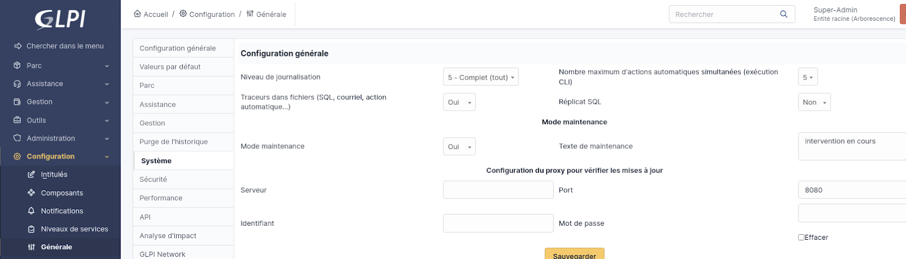
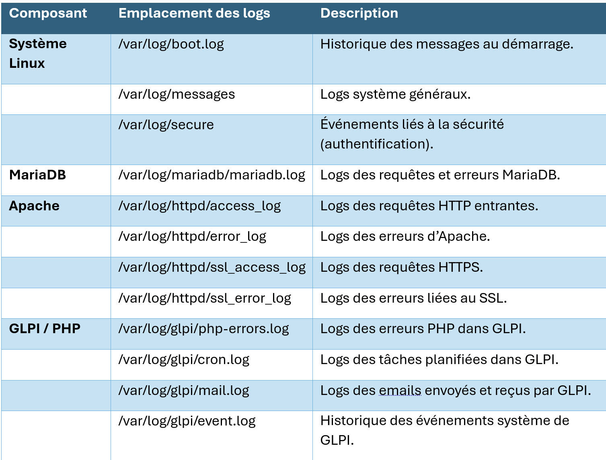
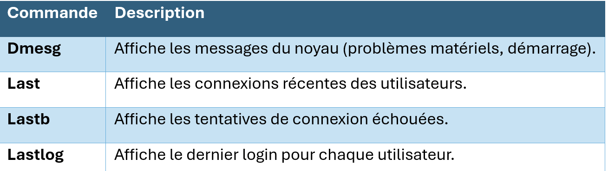

:titre: Maintenance et sauvegarde GLPI
:module: Centre de services
:duree: 60
:description: Ce module a pour objectif de présenter les fonctionnalités de maintenance et de sauvegarde de GLPI.
include::../../../../adoc/libs/header-module.adoc[]

ifeval::["{visible-on-html}" !=  "yes"]
:docinfo: shared
:docinfodir: ../../../../adoc/libs
endif::[]

== Objectifs pédagogiques

// tag::objectifs[]
* Comprendre l'importance des sauvegardes pour garantir la continuité et la sécurité des données.
* Identifier les composants critiques à sauvegarder dans GLPI.
* Effectuer une sauvegarde complète de GLPI, incluant la base de données et les répertoires essentiels.
* Automatiser le processus de sauvegarde avec des scripts et des tâches planifiées.
* Gérer le mode maintenance de GLPI pour assurer l'intégrité des données pendant les opérations sensibles.
* Comprendre les pratiques générales de maintenance et de gestion des logs pour maintenir GLPI performant et sécurisé.
// end::objectifs[]

// tag::deroulement[]

== Activer et gérer le mode maintenance

Le mode maintenance est une fonctionnalité essentielle pour empêcher les utilisateurs d'interagir avec le système pendant les opérations sensibles.

=== Activer le mode maintenance

* **Connexion à l’interface GLPI** : En tant que **super-administrateur**.
* **Accéder aux paramètres de configuration** : Dans Configuration > Général > Système
* **Activer le mode maintenance** :
** Cochez l’option **Mode maintenance**.
** Ajoutez un message personnalisé pour informer les utilisateurs que le système est temporairement inaccessible.

=== Bonnes pratiques

* **Informer les utilisateurs en amont** pour minimiser les interruptions.
* **Toujours activer le mode maintenance** avant des opérations sensibles comme les sauvegardes ou les mises à jour.



== Sauvegarder la BDD

La base de données contient toutes les informations essentielles (tickets, inventaires, utilisateurs, configurations).

=== Étapes pour la sauvegarde manuelle

**Exécuter la commande mysqldump :**

```sh
mysqldump -u [user] -p[PassWord] [nom_de_la_base] > /chemin/sauvegarde/bck_glpi.sql
```

Exemple :

```sh
mysqldump -u glpi_user -p glpi_password glpi_db > /home/admin/backup_glpi.sql
```

* **Vérification de la sauvegarde** :
** Contrôlez l'intégrité du fichier généré en le restaurant sur un environnement de test.

=== Bonnes pratiques

* Sauvegardez régulièrement la base de données.
* Stockez les fichiers de sauvegarde sur un support sécurisé.
* Testez périodiquement vos sauvegardes.

== Sauvegarde des répertoires

Les fichiers spécifiques à GLPI sont tout aussi importants que la base de données.

=== Répertoires à sauvegarder

* **files** : Pièces jointes et fichiers générés.
* **config** : Fichiers de configuration, notamment config_db.php et glpicrypt.key.
* **plugins** : Extensions installées.
* **marketplace** : Plugins téléchargés depuis la marketplace.

=== Commande pour sauvegarder les répertoires

```sh
tar -czvf /chemin/vers/sauvegarde/backup_glpi_files.tar.gz /var/www/glpi/files /var/www/glpi/config /var/www/glpi/plugins /var/www/glpi/marketplace
```

=== Bonnes pratiques

* Stockez les sauvegardes sur un serveur distant ou un disque externe.
* Vérifiez régulièrement l’extraction des archives pour garantir leur validité.

== Automatisation des sauvegardes

Un script Bash peut automatiser la sauvegarde de la base de données et des répertoires.

```sh
#!/bin/bash
# Variables
DATE=$(date +%F)
BACKUP_DIR="/chemin/vers/sauvegarde/$DATE"
DB_USER="glpi_user"
DB_PASS="glpi_password"
DB_NAME="glpi_db"
GLPI_DIR="/var/www/glpi"
# Création du répertoire de sauvegarde
mkdir -p $BACKUP_DIR
# Sauvegarde de la base de données
mysqldump -u $DB_USER -p$DB_PASS $DB_NAME > $BACKUP_DIR/backup_glpi.sql
# Sauvegarde des répertoires critiques
tar -czvf $BACKUP_DIR/backup_glpi_files.tar.gz $GLPI_DIR/files $GLPI_DIR/config $GLPI_DIR/plugins $GLPI_DIR/marketplace
# Suppression des sauvegardes de plus de 7 jours
find /chemin/vers/sauvegarde/ -type d -mtime +7 -exec rm -rf {} \;
```

=== Tâches planifiées avec cron

Ajoutez ce script au crontab pour une exécution quotidienne :

```sh
0 0 * * * /chemin/vers/script/backup_glpi.sh
```

== Maintenance générale

* **Mises à jour régulières** :
** Mettez à jour GLPI et ses plugins pour bénéficier des dernières fonctionnalités et correctifs de sécurité.
* **Optimisation de la base de données** :
** Utilisez les outils intégrés ou externes pour nettoyer et optimiser les tables.

include::../../../../adoc/libs/slide-notitle.adoc[]

* **Vérification des permissions** :
** Assurez-vous que les fichiers critiques de GLPI ont les permissions correctes pour éviter des vulnérabilités.
* **Nettoyage des données obsolètes** :
** Supprimez les tickets fermés depuis longtemps ou les documents non utilisés pour libérer de l’espace.
* **Surveillance des performances** :
** Vérifiez l’utilisation des ressources (CPU, mémoire, espace disque)

== Gestion des logs

**La gestion des logs est une étape essentielle pour surveiller, diagnostiquer et résoudre les problèmes dans GLPI et son environnement.**



== Commandes utiles pour analyser les logs



include::../../../../adoc/libs/slide-notitle.adoc[]

**Afficher les derniers logs en temps réel :**

```sh
tail -f /var/log/glpi/php-errors.log
```

**Rechercher des mots-clés spécifiques dans les logs :**

```sh
grep "ERROR" /var/log/glpi/php-errors.log
```

**Afficher les 50 dernières lignes :**

```sh
tail -n 50 /var/log/httpd/error_log
```

== Bonnes pratiques

* **Surveiller les logs critiques** :
** Consultez régulièrement les logs d’erreurs PHP, SQL et Apache pour identifier les anomalies.
* **Configurer des alertes** :
** Intégrez des outils comme Logwatch, Nagios, Centreon pour recevoir des alertes en cas d’erreurs graves.
* **Archivage des logs** :
** Exportez les logs anciens vers un stockage secondaire pour les conserver à long terme.

Avec une gestion proactive des logs et une surveillance constante, vous pouvez détecter et résoudre les problèmes rapidement, garantissant ainsi une utilisation optimale de GLPI.

// tag::demo[]

== Démonstration

[NOTE.speaker]
--
Montrer une sauvegarde de la base 

```sh
mysqldump -u glpi_user -p glpi_password glpi_db > /home/admin/backup_glpi.sql
```

Montrer une la sauvegarde des fichiers 

```sh
tar -czvf /chemin/vers/sauvegarde/backup_glpi_files.tar.gz /var/www/glpi/files /var/www/glpi/config /var/www/glpi/plugins /var/www/glpi/marketplace
```

Mettre en place le script de sauvegarde auto + planification cron

```sh
#!/bin/bash
# Variables
DATE=$(date +%F)
BACKUP_DIR="/chemin/vers/sauvegarde/$DATE"
DB_USER="glpi_user"
DB_PASS="glpi_password"
DB_NAME="glpi_db"
GLPI_DIR="/var/www/glpi"
# Création du répertoire de sauvegarde
mkdir -p $BACKUP_DIR
# Sauvegarde de la base de données
mysqldump -u $DB_USER -p$DB_PASS $DB_NAME > $BACKUP_DIR/backup_glpi.sql
# Sauvegarde des répertoires critiques
tar -czvf $BACKUP_DIR/backup_glpi_files.tar.gz $GLPI_DIR/files $GLPI_DIR/config $GLPI_DIR/plugins $GLPI_DIR/marketplace
# Suppression des sauvegardes de plus de 7 jours
find /chemin/vers/sauvegarde/ -type d -mtime +7 -exec rm -rf {} \;
```

Montrer les différents logs et l’utilisation des commandes :

**Dmesg** Affiche les messages du noyau (problèmes matériels, démarrage).
**Last** Affiche les connexions récentes des utilisateurs.
**Lastb** Affiche les tentatives de connexion échouées.
**Lastlog** Affiche le dernier login pour chaque utilisateur.
--

// end::demo[]

// end::deroulement[]

== Conclusion
// tag::conclusion[]
**Mode maintenance** : Activez-le avant toute opération sensible et informez les utilisateurs à l'avance.

**Sauvegardes régulières** : Sauvegardez la base de données et les répertoires critiques, stockez-les sur des supports sécurisés, et testez leur restauration.

**Automatisation** : Planifiez des sauvegardes avec des scripts et cron, tout en gérant les anciennes sauvegardes avec une rotation.

include::../../../../adoc/libs/slide-notitle.adoc[]

**Maintenance** : Mettez à jour GLPI, nettoyez les données obsolètes et surveillez les ressources système.

**Gestion des logs** : Surveillez et analysez les logs critiques (GLPI, système, MariaDB, Apache) pour détecter et résoudre rapidement les anomalies.

En appliquant ces bonnes pratiques, vous garantissez la sécurité, la continuité et les performances optimales de GLPI.
// end::conclusion[]