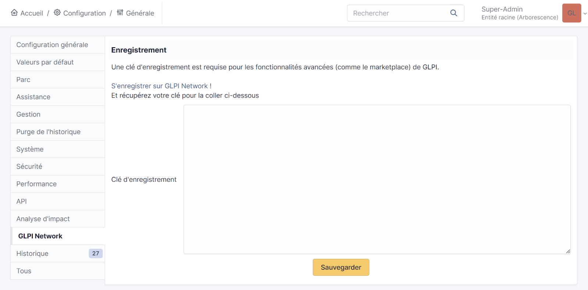
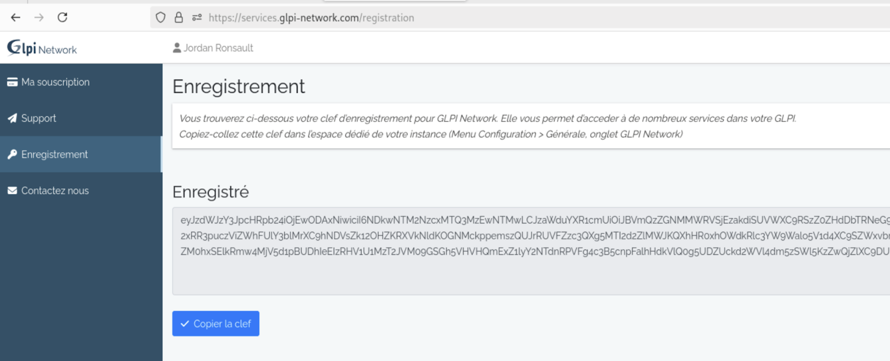
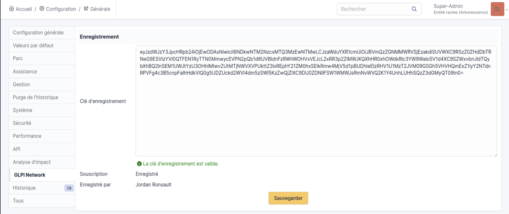
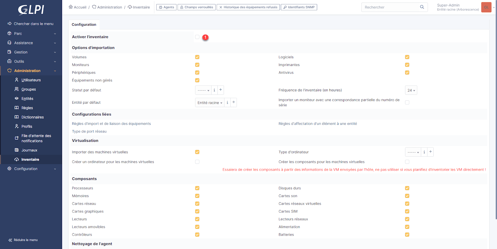
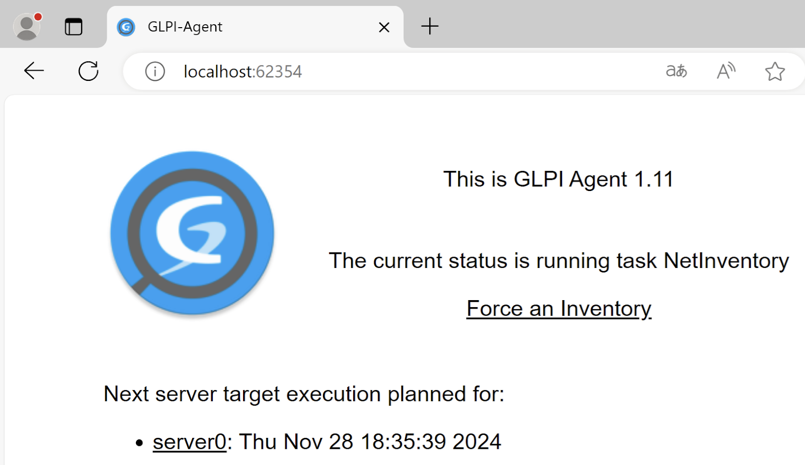
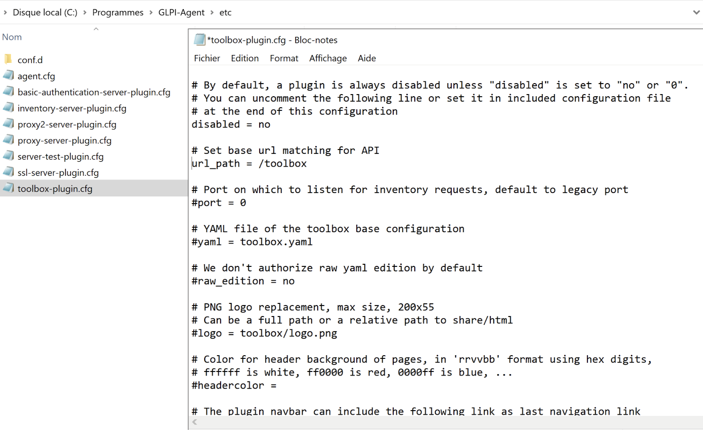
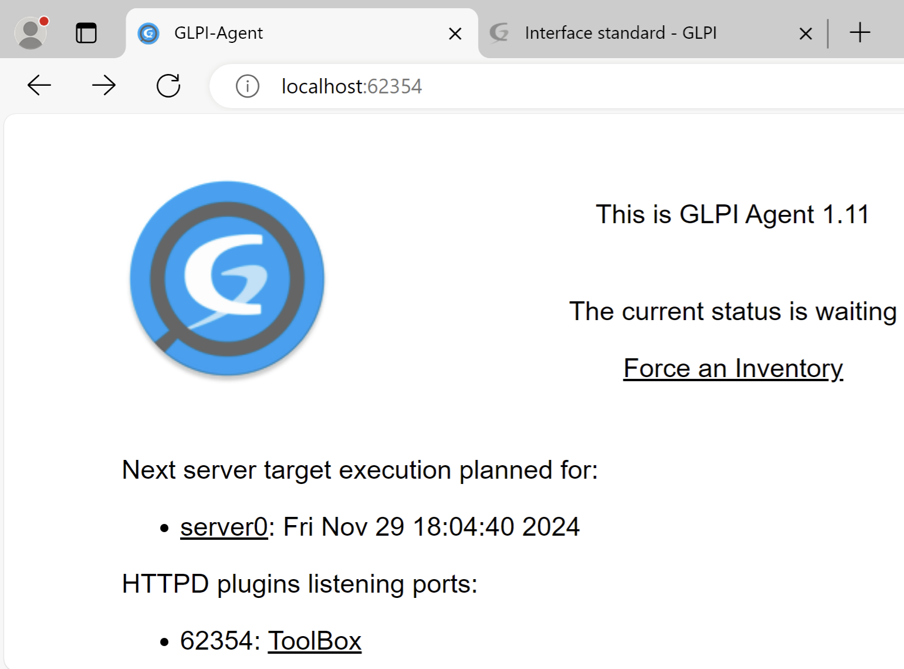
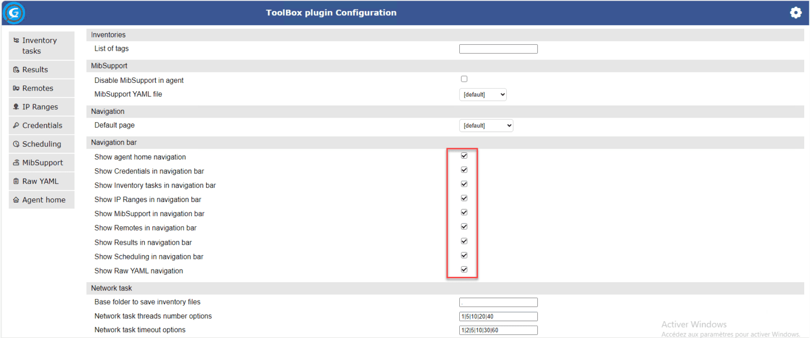
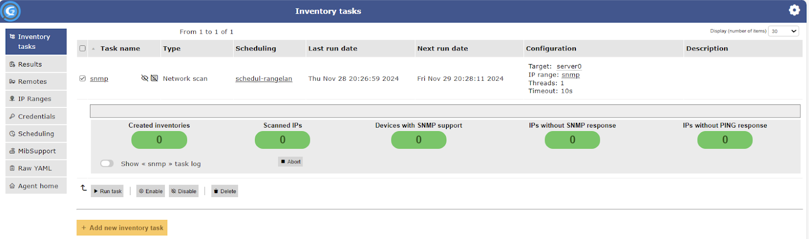

:titre: Plugin, Agents GLPI et Inventaires de Parc
:module: Centre de services
:duree: 120
:description: Ce module a pour objectif de former les apprenants à la gestion des utilisateurs et des habilitations dans GLPI, à l'automatisation de l'inventaire des équipements IT et à la maîtrise des outils et techniques GLPI.
include::../../../../adoc/libs/header-module.adoc[]

ifeval::["{visible-on-html}" !=  "yes"]
:docinfo: shared
:docinfodir: ../../../../adoc/libs
endif::[]

== Objectifs pédagogiques

// tag::objectifs[]
* Installer et configurer les plugins nécessaires à l’inventaire GLPI.
* Mettre en place et automatiser l’inventaire des équipements, incluant la configuration réseau et la planification des tâches.
* Vérifier et suivre les données pour garantir un inventaire fiable et à jour.
// end::objectifs[]

// tag::deroulement[]

== Présentation des plugins

GLPI est une plateforme modulaire qui permet d’ajouter des fonctionnalités via des **plugins**. Ces modules complémentaires :

* **Étendent les capacités** de GLPI sans modifier le produit de base.
* **Sont disponibles** dans un catalogue officiel : https://plugins.glpi-project.org.
* Peuvent être installés via le **Marketplace GLPI** (disponible depuis la version 9.5), qui simplifie leur gestion et mise à jour.

=== Principaux domaines couverts par les plugins :

* Rapports et graphiques.
* Gestion de l’inventaire (par exemple : FusionInventory).
* Gestion administrative.
* Assistance (HelpDesk).
* Importation de données.

== Installation des plugins

Deux méthodes principales permettent d’installer un plugin dans GLPI

=== Installation manuelle

* Téléchargement du plugin au format Gzip ou Bzip2 depuis le catalogue officiel.
* Extraction dans le dossier **GLPI/plugins**.
* Activation depuis l’interface graphique dans **Configuration** → **Plugins**.

=== Installation via le Marketplace

* Inscription **OBLIGATOIRE** et gratuite sur le site https://services.glpi-network.com/register
* Récupération et saisie d’une clé d’enregistrement pour activer le Marketplace.
* Installation directe des plugins compatibles avec votre version de GLPI.

**Attention** : La compatibilité d’un plugin dépend de la version de GLPI. Lors d’une mise à jour majeure de GLPI, il peut être nécessaire de mettre à jour les plugins.

== Récupération et saisie clé d’enregistrement pour le Marketplace.

Pour pouvoir utiliser le marketplace il faut une clé d’enregistrement 

**Sur GLPI**

* Aller sur **Configuration** / **Générale** / **GLPI Network**
* S’inscrire sur GLPI Network
* Récupérer votre clé d'enregistrement
* Sauvegarder la clé sur GLPI 

Le marketplace est accessible 

include::../../../../adoc/libs/slide-notitle.adoc[]

include::../../../../adoc/libs/slide-notitle.adoc[]

include::../../../../adoc/libs/slide-notitle.adoc[]

== Inventaire natif de GLPI

Avec les versions antérieures à GLPI 10, l’inventaire automatique nécessitait l’installation de plugins tiers tels que FusionInventory ou OCSInventory. 

Depuis la version 10 de GLPI, cette fonctionnalité est directement intégrée dans GLPI, simplifiant ainsi son utilisation.

include::../../../../adoc/libs/slide-notitle.adoc[]

L’inventaire automatique permet de collecter et centraliser dans GLPI des informations essentielles sur vos équipements, notamment :

* Les caractéristiques générales des ordinateurs ;
* La liste des logiciels installés ;
* Les connexions réseau ;
* L’état des antivirus ;
* …

== Activer l'inventaire automatique

GLPI 10 intègre une fonctionnalité d’inventaire automatique mais celle-ci n’est pas activée par défaut.

=== Accéder aux paramètres d'inventaire

* Connectez-vous à l’interface administrateur de GLPI.
* Dans le menu principal, cliquez sur Administration, puis sélectionnez Inventaire.

=== Activer l'inventaire

== Installation agent GLPI

**GLPI Agent** est nécessaire pour collecter les informations et propose deux modes de fonctionnement :

* **Service Windows** (exécution permanente en arrière-plan).
* **Tâche planifiée** (exécution à intervalles définis).

=== Étapes pour installer GLPI Agent

* Rendez-vous sur la page officielle du projet : https://github.com/glpi-project/glpi-agent pour télécharger l’agent
* **Lancer l’installation** : choix du type d’installation Complete
** **Remote target** : Saisissez l’URL de votre serveur GLPI et décochez Quick installation
** **SSL** : Passez cette étape si vous n’utilisez pas encore de certificat SSL 
** **Proxy** : Si un proxy est nécessaire pour accéder au serveur,

include::../../../../adoc/libs/slide-notitle.adoc[]

** **Choisir le mode d'exécution** : sélectionner “As a windows service” 
*** Cocher les cases Run inventory et glpi-agent monitor
** Activez les options de **debug** et définissez le niveau de log à 2 pour faciliter le dépannage en cas de problème.
** **Finaliser l’installation** 

== Page d'administration de l'agent GLPI

* Accessible via l’url : `127.0.0.1:62354`
* Permet de forcer le déclenchement d’un inventaire 
* Voir la planification de la prochaine exécution 
* Gestion de la toolbox pour utiliser la découverte et l’inventaire réseaux après activation 

include::../../../../adoc/libs/slide-notitle.adoc[]

== Préparation de l'inventaire

Avant de commencer l’importation des données d’inventaire, il est crucial de préparer correctement le serveur GLPI

include::../../../../adoc/libs/slide-notitle.adoc[]

* **Affectation des lieux et des entités** :
** Définir des règles pour associer automatiquement les équipements inventoriés à un lieu géographique ou à une entité organisationnelle.
* **Cohérence des relations utilisateur-équipement** :
** Veiller à ce qu’un utilisateur soit correctement associé à son poste ou ses périphériques.
* **Optimisation des données collectées** :
** L’inventaire par défaut peut être très volumineux. Il est recommandé de limiter les données collectées en définissant une **liste noire** pour exclure certains types d’équipements ou d’informations.

== Toolbox - Inventaire réseau

Bien que les composants soient installés, l’accès à la découverte et l’inventaire réseaux doit être configuré.

include::../../../../adoc/libs/slide-notitle.adoc[]

* Accédez au dossier etc de l'installation de GLPI Agent. 
* Copiez `toolbox-plugin.cfg` et renommez-le en `toolbox-plugin.local`.
* Ouvrez `toolbox-plugin.local` et :
** Dé-commentez `disabled = no`.
** Supprimez ou commentez `include "toolbox-plugin.local"`.

include::../../../../adoc/libs/slide-notitle.adoc[]

* Redémarrez le service `glpi-agent`.
* Sur la page d’administration de l’agent le menu Toolbox doit être présent

include::../../../../adoc/libs/slide-notitle.adoc[]

* Cliquer sur la toolbox

include::../../../../adoc/libs/slide-notitle.adoc[]

* Aller sur les préférences en haut à droite (roue dentée) et activer toutes les cases de la navigation bar

== Configuration de l’inventaire réseau

Maintenant que notre toolbox est prête on va configurer en 3 étapes le scan réseau

include::../../../../adoc/libs/slide-notitle.adoc[]

* **Configurer des credentials** informations d’authentification nécessaires :
** **SNMP** : pour interroger les équipements réseau
** **WinRM** ou **SSH** : pour des parcs machines
* **Définir des plages d’adresses IP à scanner** : Identifier les segments de réseau à inventorier.
* **Créer une tâche d’inventaire** : Automatiser la collecte des données.
* Cliquez sur **Create Credential** pour valider.

Cette étape permet à GLPI Agent de communiquer avec vos équipements réseau.

== Configuration des credentials

* Accédez au menu **Credentials** dans GLPI Agent.
* Cliquez sur **Add Credential** pour créer une nouvelle entrée.

include::../../../../adoc/libs/slide-notitle.adoc[]

[cols="1,1"]
|===

a|
* Configurez les paramètres :
** **Nom** : nom explicite (ex. : "SNMP - Réseau principal").
** **Type** : Sélectionnez SNMP et précisez la version 
** **Nom de la communauté** : Saisissez la communauté SNMP utilisée sur vos équipements.

_Attention : Le nom de la communauté est sensible à la casse, assurez-vous de le saisir correctement._
a| image::./assets/11-config.png[]

|===

* Cliquez sur **Create Credential** pour valider.

Cette étape permet à GLPI Agent de communiquer avec vos équipements réseau.

== Configuration des IP ranges

Une fois les credentials configurés, nous devons indiquer quelles plages d’adresses IP doivent être analysées.

* Accédez au menu **IP Ranges** et cliquez sur **Add new IP range**.

include::../../../../adoc/libs/slide-notitle.adoc[]

[cols="1,1"]
|===

a|
* Configurez les paramètres suivants :
** **Nom** : nom explicite (ex. : "Plage bureau principal").
** **Adresse de début** et **Adresse de fin** : Spécifiez les limites de la plage IP (ex. : 192.168.10.200 à 192.168.10.254).
** **Credential associé** : Sélectionnez le credential SNMP configuré à l’étape précédente.
a| image::./assets/12-config.png[]

|===

include::../../../../adoc/libs/slide-notitle.adoc[]

* Cliquez sur **Add Credential** pour lier ce credential à la plage, puis sur **Add IP range** pour finaliser.

Cette configuration permettra à GLPI Agent de scanner uniquement les adresses spécifiées.

== Planification des tâches d’inventaire

La planification détermine la fréquence à laquelle les tâches d’inventaire sont exécutées.

* Rendez-vous dans le menu **Scheduling** et cliquez sur **Add new scheduling**.

include::../../../../adoc/libs/slide-notitle.adoc[]

[cols="1,1"]
|===

a|
* Remplissez les champs :
** Nom : Donnez un titre à la planification (ex. : "Scan hebdomadaire").
** Intervalle : Spécifiez le délai entre deux scans (par exemple, une fois par semaine).
* Cliquez sur Add pour enregistrer.
a| image::./assets/13-planif.png[]

|===

== Création tâches d'inventaire

La tâche d’inventaire : processus central qui exécute le scan du réseau 

* Menu **Inventory Task** / **Add new inventory task**.

include::../../../../adoc/libs/slide-notitle.adoc[]

[cols="1,1"]
|===

a|
* Configurez les paramètres :
** **Nom** 
** **Planification**
** **IP Range**
* Cliquez sur **Create inventory** task pour valider.
a| image::./assets/14-tasks.png[]

|===

Astuce : Vous pouvez réduire le temps d’exécution en augmentant le nombre de threads dans les paramètres de la tâche d’inventaire.

== Exécution / suivi de l'inventaire

La tâche est créée mais désactivée par défaut. Pour l’activer :

* Sélectionnez la tâche et cliquez sur **Enable**.
* Pour lancer immédiatement la tâche, sélectionnez-la et cliquez sur **Run task**.

Pendant l’exécution, vous pouvez suivre les logs en temps réel pour vérifier la progression.

include::../../../../adoc/libs/slide-notitle.adoc[]

== Vérification de l'inventaire

Une fois la tâche terminée, les équipements inventoriés apparaîtront dans GLPI

include::../../../../adoc/libs/slide-notitle.adoc[]

Accédez à la section **Parc** > **Matériels réseau**.

Vous y trouverez les équipements identifiés, tels que les switchs, routeurs et imprimantes.

* **Pour les switchs** : Les ports et leur configuration sont affichés. GLPI peut également établir des liens avec d’autres équipements connectés.
* **Pour les imprimantes** : Des informations comme le nombre d’impressions ou l’état des consommables sont remontées.

Les équipements non reconnus ou inaccessibles seront placés dans **Équipements non gérés**. Cela inclut les appareils qui ont répondu au ping mais n'ont pas fourni d'informations détaillées.

// tag::demo[]

== Démonstration

[NOTE.speaker]
--
**Sur le serveur GLPI :**

* Montrer l’activation de GLPI network 
* Activer l’inventaire automatique

**Sur une machine :**

* Installer l’agent GLPI avec le type “Complète” 
* Mise en place de la Toolbox
* Paramétrer un inventaire avec un scan réseau 
--

// end::demo[]

// end::deroulement[]

== Conclusion
// tag::conclusion[]
* **Compétences techniques maîtrisées :**
** Installation et configuration des plugins GLPI.
** Activation et gestion de l’Agent GLPI pour l’inventaire automatisé.
** Configuration des credentials, plages IP et paramètres réseau.
** Création, planification et exécution des tâches d’inventaire.

include::../../../../adoc/libs/slide-notitle.adoc[]

* **Atouts techniques acquis :**
** Automatisation complète des processus d’inventaire.
** Suivi et vérification précis des équipements IT.
** Optimisation des ressources réseau pour une gestion efficace.
// end::conclusion[]