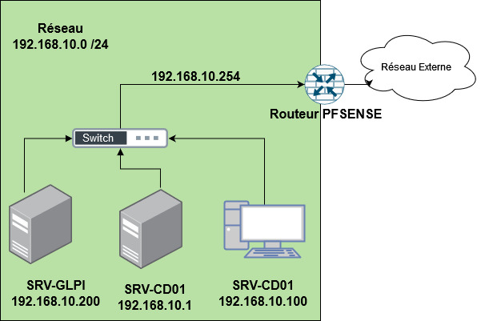
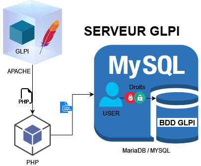
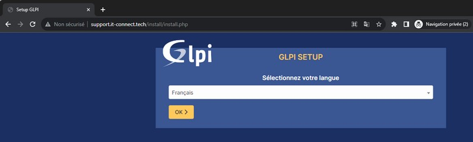
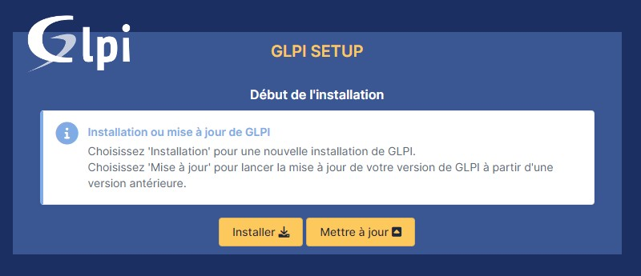
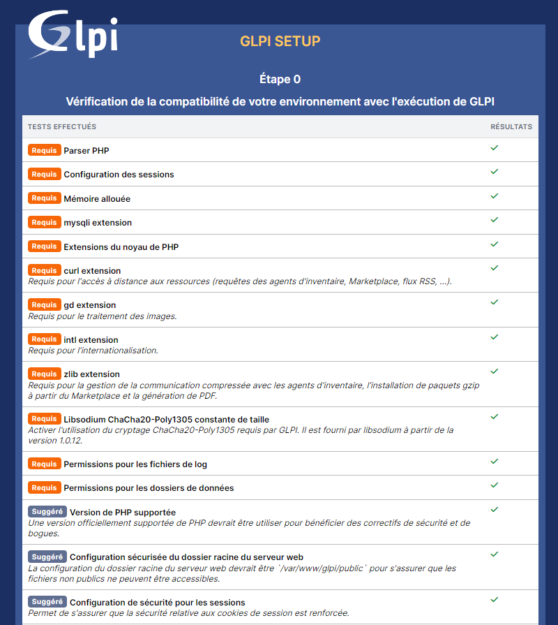
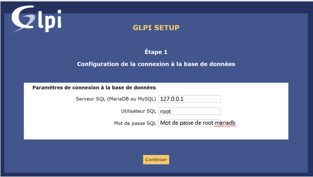
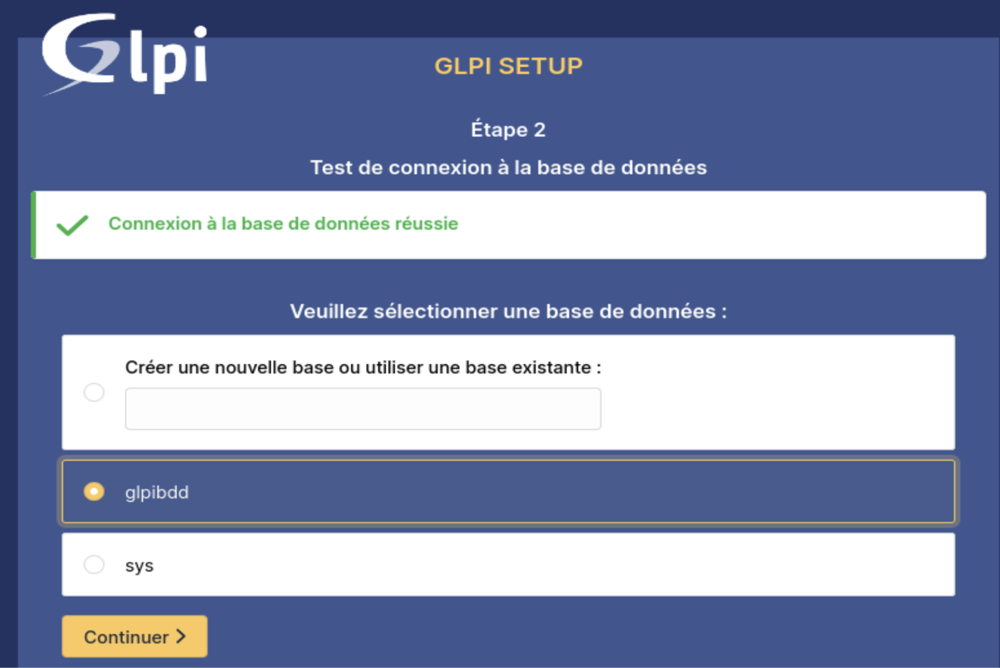

:titre: Présentation et installation GLPI
:module: Centre de services
:duree: 180
:description: Comprendre le fonctionnement de GLPI et savoir le mettre en place.
include::../../../../adoc/libs/header-module.adoc[]

ifeval::["{visible-on-html}" !=  "yes"]
:docinfo: shared
:docinfodir: ../../../../adoc/libs
endif::[]

== Objectifs pédagogiques

// tag::objectifs[]
* Comprendre le rôle et l'utilité de GLPI dans la gestion IT.
* Apprendre à préparer un serveur avec les prérequis nécessaires, incluant les extensions PHP et une base de données sécurisée.
* Maîtriser l’installation et la configuration de GLPI, incluant Apache et PHP-FPM.
* Renforcer la sécurité en supprimant les fichiers sensibles et en modifiant les paramètres par défaut.
* Finaliser l’installation via l’interface web pour utilisation.
// end::objectifs[]

// tag::deroulement[]

== Présentation de l’environnement de test GLPI

Pour illustrer le cours GLPI voici l’environnement de test que nous utiliserons dans ce module nous ne nous occuperons que du serveur SRV-GLPI :



=== Environnement de test que nous utiliserons

* L’entreprise TpeDigital, gestionnaire IT.
* Possède un domaine : tpedigital.lcl  => 192.168.10.0/24
* Serveurs contrôleur de domaine : Windows Serveur 2022
* Clients: Windows 11
* Serveur Linux GLPI: Debian12
* Firewall: PFsense bridgé sur le réseau externe

=== Contexte de la demande

* Administrateur bureautique/système
* Mise en place de la solution GLPI au sein de l’entreprise
* Gestion et hébergement par tpedigital
* Authentification centralisée et habilitations GLPI dynamiques
* Inventaire du matériel de tpedigital
* Traitement uniformisé et automatisé des tickets
* Inventaire automatique des machines du groupe 

== Présentation de GLPI

**G.L.P.I**: **G**estion **L**ibre de **P**arc **I**nformatique

* ITSM (Information Technology Service Management) conforme à ITIL
* Logiciel libre sous licence GPL 100% libre
* Logiciel complet de gestion de parc et de centre de services
* Plusieurs langues et plug-ins disponibles

include::../../../../adoc/libs/slide-notitle.adoc[]

* Installation possible sous Windows et Linux
* S’adapte à toutes les typologies de système d’information 
* L’éditeur de GLPI est la société teclib‘
** URL de teclib’ : https://www.teclib-edition.com/fr/
** URL de GLPI : https://glpi-project.org/fr/
*** Dans GLPI Project vous avez toute la documentation 
**** Administrateur / utilisateur / développeur
**** GLPI Agent / GLPI Plugin

== Prérequis GLPI

GLPI est une application web qui nécessite :

* Un serveur web ;
* PHP ;
* Une base de données.

=== Serveur web

GLPI requiert un serveur web qui supporte PHP, tel que :

http://httpd.apache.org/[Apache 2] (ou plus récent);
http://nginx.org/[Nginx];
https://www.lighttpd.net/[lighttpd];
http://www.iis.net/[Microsoft IIS].

=== PHP

[cols="1,1,1"]
|===

| GLPI Version | Minimum PHP | Maximum PHP

| 10.0.X | 7.4 | 8.3

|===

== Extensions PHP obligatoires

* **dom**, **fileinfo**, **filter**, **libxml**, **json**, **simplexml**, **xmlreader**, **xmlwriter** : ces extensions PHP sont activées par défaut et sont utilisées pour diverses opérations 
* **curl** : utilisé pour l’accès à distance aux ressources
* **gd** : utilisé pour la manipulation d’images ;
* **intl** : utilisé pour l’internationalisation ;
* **mysqli** : utilisé pour la connexion à la base de données ;
* **session** : utilisé pour le support des sessions ;
* **zlib** : utilisé pour la gestion de la communication compressée avec les agents d’inventaire, l’installation de packages gzip depuis la place de marché et la génération de PDF.

=== Extensions PHP optionnelles

* **bz2**, **Pharzip** : activer la prise en charge des formats de packages les plus courants 
* **exif**: renforcer la sécurité sur la validation des images ;
* **ldap**: permettre l’utilisation de l’authentification via un serveur LDAP distant ;
* **openssl**: permettre l’envoi d’e-mails à l’aide de SSL/TLS ;
* **Zend OPcache**: améliorer les performances du moteur PHP.

// tag::demo[]

== Démonstration

[NOTE.speaker]
--
À partir d’ici réaliser toutes les étapes au fur et à mesure. Jusqu’à l’installation complète de GLPI 
sur le serveur SRV-GLPI

Prérequis : avoir un serveur Debian 12 fraîchement installé et avoir un accès web 
--

// end::demo[]

== Préparation du serveur GLPI

**Mise à jour des paquets sur la machine Debian 12**. Pensez également à lui attribuer une adresse IP et à effectuer la configuration du système.

```sh
sudo apt-get update && sudo apt-get upgrade
```

=== Installation du socle LAMP

**Linux, Apache2, MariaDB, PHP.**

Sous **Debian 12**, qui est la dernière version stable de Debian, **PHP 8.2** est distribué par défaut dans les dépôts officiels.

```sh
sudo apt-get install apache2 php mariadb-server
```

Installation de toutes les extensions nécessaires à GLPI.

```sh
sudo apt-get install php-xml php-common php-json php-mysql php-mbstring php-curl php-gd php-intl php-zip php-bz2 php-imap php-apcu
```

Si GLPI est couplé avec un annuaire LDAP comme l'Active Directory, installation de l'extension LDAP de PHP. 

```sh
sudo apt-get install php-ldap
```

== Installation serveur BDD

* GLPI a besoin pour fonctionner de stocker des informations en base de données, pour cela il se repose sur un SGBD (Système de Gestion de Base de Données)

[cols="1,1"]
|===

a| Les SGBD pris en charge par GLPI sont : 

* MySQL
* MariaDB
a| image::./assets/06-serveur.png[]

|===

=== Composants du serveur GLPI



=== Sécurisation MariaDB

```sh
mysql_secure_installation
Change the root password? [Y/n] n  	# mot de passe pour l’utilisateur root dans MySQL
Remove anonymous users? [Y/n] Y	# ne permettre l’accès à mariadb que pour root
Disallow root login remotely? [Y/n] Y  	# empêcher un accès distant à mariadb
Remove test database and access to it? [Y/n] Y 	 # supprimer la base de données de test
Reload privilege tables now? [Y/n] Y  	# recharger mariadb avec cette nouvelle configuration
```

=== Paramétrage MariaDB

Connexion au Shell du SGBD MariaDB.

```sh
mysql -u root -p
```

Création d’une base de données.

```sh
mysql>create database glpibdd;
```

Affectation des droits à l’utilisateur root de mariadb.

```sh
mysql>grant all privileges on glpibdd.* to root@localhost identified by “MotDePass”flu;
mysql>flush privileges;
```

**RAPPEL : Toutes les commandes MySQL doivent se terminer par un point-virgule.**

== Installation de GLPI

À partir du GitHub de GLPI, récupérez le lien vers la dernière version. 

Ici, c'est la version GLPI 10.0.17 qui est installée.

https://github.com/glpi-project/glpi/releases/[GitHub de GLPI]

L'archive sera téléchargée dans le répertoire "/tmp" :

```sh
cd /tmp
wget https://github.com/glpi-project/glpi/releases/download/10.0.17/glpi-10.0.17.tgz
```

include::../../../../adoc/libs/slide-notitle.adoc[]

Décompression de l'archive .tgz dans le répertoire "/var/www/", ce qui donnera le chemin d'accès "/var/www/glpi" pour GLPI.

```sh
sudo tar -xzvf glpi-10.0.17.tgz -C /var/www/
```

Définir l'utilisateur "www-data" correspondant à Apache2, en tant que propriétaire sur les fichiers GLPI.

```sh
sudo chown www-data /var/www/glpi/ -R
```

== Sécurisation de GLPI

Afin de sécuriser notre installation de GLPI nous allons sortir certaines données comme le préconisent les recommandations de l'éditeur.

=== Le répertoire `/etc/glpi` 

Ce répertoire va recevoir les fichiers de configuration de GLPI, nous donnons également les droits à l’utilisateur www-data

```sh
sudo mkdir /etc/glpi
sudo chown www-data /etc/glpi/
sudo mv /var/www/glpi/config /etc/glpi
```

=== Le répertoire `/var/lib/glpi`

Ce répertoire va recevoir la plupart des fichiers GLPI (CSS, Plugin,...), nous donnons également les droits à l’utilisateur www-data

```sh
sudo mkdir /var/lib/glpi
sudo chown www-data /var/lib/glpi/
sudo mv /var/www/glpi/files /var/lib/glpi
```

=== Le répertoire /var/log/glpi 

Ce répertoire va recevoir les fichiers de log de GLPI, nous donnons également les droits à l’utilisateur www-data.

```sh
sudo mkdir /var/log/glpi
sudo chown www-data /var/log/glpi
```

== Fichier de configuration GLPI

Nous devons configurer GLPI pour déclarer les nouveaux répertoires fraîchement créés.

=== Fichier `downstream.php`

Ce fichier indique le chemin vers le répertoire de configuration

```sh
<?php
define('GLPI_CONFIG_DIR', '/etc/glpi/');
if (file_exists(GLPI_CONFIG_DIR . '/local_define.php')) {
    require_once GLPI_CONFIG_DIR . '/local_define.php'; }
```

== Configuration Apache pour GLPI

Nous devons configurer apache pour que la page web de GLPI soit accessible

=== Fichier `Mon_URL_GLPI.conf`

```sh
sudo vim /etc/apache2/sites-available/glpi.tpedigital.lcl.conf
```

```sh
<VirtualHost *:80>
    ServerName glpi.tpedigital.lcl
    DocumentRoot /var/www/glpi/public
# If you want to place GLPI in a subfolder of your site (e.g. your virtual host is serving multiple applications),
# you can use an Alias directive. If you do this, the DocumentRoot directive MUST NOT target the GLPI directory itself.
# Alias "/glpi" "/var/www/glpi/public"
    <Directory /var/www/glpi/public>
        Require all granted
        RewriteEngine On
        # Redirect all requests to GLPI router, unless file exists.
        RewriteCond %{REQUEST_FILENAME} !-f
        RewriteRule ^(.*)$ index.php [QSA,L]
    </Directory>
</VirtualHost>
```

include::../../../../adoc/libs/slide-notitle.adoc[]

Nous devons activer ce nouveau site dans Apache2

```sh
sudo a2ensite glpi.tpedigital.lcl.conf
```

On désactive le site par défaut lié à l’installation d’apache car il est inutile :

```sh
sudo a2dissite 000-default.conf
```

On active le module "rewrite" utilisé dans le fichier de configuration du VirtualHost 

```sh
sudo a2enmod rewrite
```

On redémarre le service Apache2

```sh
sudo systemctl restart apache2
```

== Mise en place de PHP FPM

**Deux options pour exécuter PHP avec Apache2 :**

* **Module PHP (libapache2-mod-php8.2)**
** Intégré à chaque processus Apache.
** Moins performant.
* **PHP-FPM (FastCGI Process Manager)**
** Service indépendant.
** Plus performant et flexible.
** Recommandé pour les environnements modernes.

=== Pourquoi choisir PHP-FPM ?

* **Meilleures performances** : Séparation des processus PHP et Apache, gestion optimisée des ressources.
* **Modularité** : Configuration indépendante pour chaque application ou site (via des pools).
* **Sécurité renforcée** : Exécution sous des utilisateurs spécifiques, réduction des risques.
* **Compatibilité multi-serveur** : Fonctionne aussi avec Nginx, contrairement au module Apache.

=== Configuration requise pour PHP-FPM

Installer PHP-FPM puis activer deux modules dans Apache2 avant de recharger Apache2 :

* La configuration de PHP-FPM,.
* Le `mod_proxy_fcgi` dans Apache2

```sh
sudo apt-get install php8.2-fpm

sudo a2enmod proxy_fcgi setenvif
sudo a2enconf php8.2-fpm
sudo systemctl reload apache2
```

include::../../../../adoc/libs/slide-notitle.adoc[]

Configurez de PHP-FPM. dans le fichier php.ini de fpm rechercher et activer l'option `session.cookie_httponly` avec la valeur 1

```sh
sudo vim /etc/php/8.2/fpm/php.ini
```

```sh
; https://php.net/session.cookie-httponly
session.cookie_httponly = 1
```

Il faut relancer PHP-FPM pour appliquer les modifications

```sh
sudo systemctl restart php8.2-fpm.service
```

include::../../../../adoc/libs/slide-notitle.adoc[]

Re-configurer le fichier VirtualHost afin d’indiquer à Apache2 d'utiliser PHP-FPM pour le traitement des fichiers PHP. (balisé en rouge)

```sh
<VirtualHost *:80>
    ServerName glpi.tpedigital.lcl
    DocumentRoot /var/www/glpi/public
# If you want to place GLPI in a subfolder of your site (e.g. your virtual host is serving multiple applications),
# you can use an Alias directive. If you do this, the DocumentRoot directive MUST NOT target the GLPI directory itself.
# Alias "/glpi" "/var/www/glpi/public"
    <Directory /var/www/glpi/public>
        Require all granted
        RewriteEngine On
        # Redirect all requests to GLPI router, unless file exists.
        RewriteCond %{REQUEST_FILENAME} !-f
        RewriteRule ^(.*)$ index.php [QSA,L]
    </Directory>
    <FilesMatch \.php$>
       SetHandler "proxy:unix:/run/php/php8.2-fpm.sock|fcgi://localhost/"
    </FilesMatch>
</VirtualHost>
```

Relancer Apache2 : 

```sh
sudo systemctl restart apache2
```

== Setup web de préconfiguration

Pour installer GLPI, ouvrez un navigateur web et accédez à l'adresse correspondant à GLPI. Cette adresse est celle définie dans le fichier de configuration Apache2 (paramètre `ServerName`).

include::../../../../adoc/libs/slide-notitle.adoc[]

Sur le setup sélectionner les éléments  suivants :  

Choix de la langue :



include::../../../../adoc/libs/slide-notitle.adoc[]

Nouvelle installation :



include::../../../../adoc/libs/slide-notitle.adoc[]

Vérification Prérequis :



include::../../../../adoc/libs/slide-notitle.adoc[]

Connexion à la BDD : 



include::../../../../adoc/libs/slide-notitle.adoc[]

Sélection de la  Bdd



Suivez ensuite les étapes de l’assistant d’installation 

include::../../../../adoc/libs/slide-notitle.adoc[]

Une fois l’installation terminée GPLI nous donne la liste des comptes par défaut et de leurs rôles: 

[cols="1,1"]
|===

a|
* glpi/glpi pour le compte administrateur
* tech/tech pour le compte technicien
* normal/normal pour le compte normal
* post-only/postonly pour le compte postonly
a| image::./assets/13-setup-6.png[]

|===

include::../../../../adoc/libs/slide-notitle.adoc[]

**Modifier les mots de passe des comptes par défaut** : Cliquez sur les liens présents dans l'encadré orange pour effectuer cette opération.

**Supprimer le fichier `install.php`** : Ce fichier n'est plus requis et constitue un risque potentiel de sécurité. Relancez l'installation après sa suppression.

```sh
sudo rm /var/www/glpi/install/install.php
```

**Votre GLPI est prêt à être utilisé et configuré en fonction de votre environnement de production**

// end::deroulement[]

== Conclusion
// tag::conclusion[]
L'installation de GLPI requiert 

* Une préparation rigoureuse des prérequis techniques
* Une configuration précise du serveur,
* Une sécurisation de l’installation. 

Une attention particulière doit être portée à 

* La configuration web (Apache2 et PHP-FPM) 
* La suppression des fichiers à risque. 

Ces étapes garantissent une installation stable, performante et sécurisée de GLPI.
// end::conclusion[]