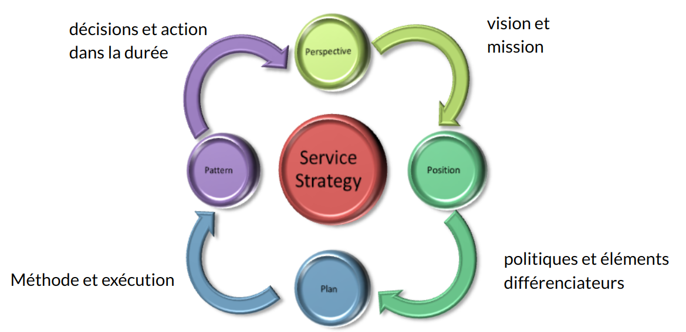

:titre: Stratégie des services
:module: Centre de services
:duree: 60
:description: Ce module est une introduction à la stratégie des services ITIL
include::../../../../adoc/libs/header-module.adoc[]

ifeval::["{visible-on-html}" !=  "yes"]
:docinfo: shared
:docinfodir: ../../../../adoc/libs
endif::[]

== Objectifs pédagogiques

// tag::objectifs[]
* Acquérir une compréhension de la stratégie des services ITIL V3 en tant que levier stratégique pour la DSI.
* Savoir aligner les services IT sur les besoins métiers et les objectifs organisationnels, tout en développant une offre compétitive dans un environnement en constante évolution.
* Comprendre les notions financières comme le ROI et le TCO
// end::objectifs[]

// tag::deroulement[]

== Objectifs principaux de la stratégie des services

**Développer l'offre de service :**

* Identifier les opportunités de création ou d'amélioration des services pour répondre aux besoins évolutifs des clients.
* Faire des analyses de marché pour voir les tendances et anticiper les attentes.

include::../../../../adoc/libs/slide-notitle.adoc[]

**Évolution vers un rôle stratégique :**

* Intégrer la gestion des services à la stratégie globale de la DSI pour devenir un levier de compétitivité.
* Transformer les services en atouts stratégiques grâce à une meilleure compréhension des objectifs métier.
* Positionner la gestion des services comme une composante essentielle de la transformation numérique.

include::../../../../adoc/libs/slide-notitle.adoc[]

**Création de valeur pour les clients :**

* Identifier les attentes explicites et implicites des clients et aligner les services sur leurs besoins.
* Maximiser la valeur perçue par le client en améliorant l'efficacité, la fiabilité et la disponibilité des services.
* Mesurer régulièrement la satisfaction client et ajuster les services pour maintenir une valeur ajoutée.

== Rôle de la stratégie des services

**Production de qualité :**

* Fournir des services conformes aux attentes des clients, en réduisant les risques et en anticipant les conflits.
* Maintenir un équilibre entre la satisfaction client et l’optimisation des coûts.

include::../../../../adoc/libs/slide-notitle.adoc[]

**Planification stratégique :**

* Élaborer des plans à court et long termes pour aligner les services sur les objectifs stratégiques de l'organisation.
* Adapter les services existants ou en créer de nouveaux en fonction des priorités métier et des conditions de marché.

**Réponse aux demandes métier :**

* Garantir une flexibilité dans l’offre de services pour s'adapter aux besoins changeants des métiers.
* Développer des avantages concurrentiels en innovant sur les prestations proposées.

== Processus de la stratégie des services

**Gestion de la stratégie de services**

* Évaluer l'environnement concurrentiel et les capacités internes pour définir une stratégie alignée sur les opportunités du marché.
* Effectuer des analyses SWOT (Forces, Faiblesses, Opportunités, Menaces) pour guider la prise de décision stratégique.

include::../../../../adoc/libs/slide-notitle.adoc[]

**Gestion du portefeuille de services**

* Maintenir un inventaire dynamique des services proposés, en développement ou retirés.
* Décrire chaque service avec des informations précises sur les coûts, la valeur ajoutée et l’impact sur les objectifs de l’organisation.

== Processus détaillés de la stratégie des services

**Gestion des demandes :**

* Identifier et analyser les besoins des clients, tout en surveillant les évolutions technologiques.
* Prioriser les demandes en fonction de leur impact sur les objectifs métier et la faisabilité.

include::../../../../adoc/libs/slide-notitle.adoc[]

**Gestion financière :**

* Calculer les coûts directs et indirects des services pour garantir une rentabilité optimale.
* Fixer les prix en tenant compte de la valeur perçue par les clients, des marges cibles et de la compétitivité.

**Gestion de la relation métier :**

* Établir des canaux de communication efficaces entre la DSI et les métiers pour mieux comprendre leurs attentes.
* Construire des relations de confiance pour renforcer la collaboration et la satisfaction client.

== Les quatre "P"

* **Perspective** : Définir la vision stratégique de la DSI,
* **Positionnement** : Identifier les atouts compétitifs des services sur le marché.
* **Plans** : Établir et prioriser des plans détaillés pour atteindre les objectifs stratégiques
* **Pérennisation** : Allouer les ressources nécessaires pour assurer la continuité des services.

include::../../../../adoc/libs/slide-notitle.adoc[]

== Terminologie

**ROI (Retour sur Investissement) :**

* Mesure de la rentabilité d’un service en comparant les bénéfices générés aux coûts engagés. Indispensable pour évaluer et justifier les investissements dans les services.

**TCO (Coût Total de Possession) :**

* Évaluation globale des coûts associés à un service, incluant l'acquisition, la maintenance, et les coûts cachés. Aide à définir des prix justes et à contrôler les dépenses.

include::../../../../adoc/libs/slide-notitle.adoc[]

**Catalogue des Services :**

* Liste détaillée des services disponibles pour les clients, avec leurs caractéristiques (objectifs, coûts, délais). Permet une communication claire et un alignement sur les besoins.

**SLA (Service Level Agreement) :**

* Accord formel entre le fournisseur et le client définissant les niveaux de service attendus et les engagements réciproques. Garantit la qualité et la transparence.

**Valeur :**

* Résultat perçu par le client en termes de bénéfices par rapport aux coûts et efforts consentis. C’est l’objectif central de toute stratégie de service.

// end::deroulement[]

== Conclusion
// tag::conclusion[]
La stratégie des services est un pilier essentiel pour positionner la DSI comme un acteur stratégique dans l’organisation.

Elle doit :

* créer de la valeur en alignant les services sur les attentes des clients,
* maintenir une gestion rigoureuse des coûts et des ressources.

La planification stratégique, associée à des outils comme le portefeuille des services et les SLA, garantit une réponse agile et compétitive aux demandes des métiers.

La capacité à anticiper les évolutions et à maintenir une relation de confiance avec les parties prenantes, fait de la DSI un partenaire clé dans la transformation numérique.
// end::conclusion[]