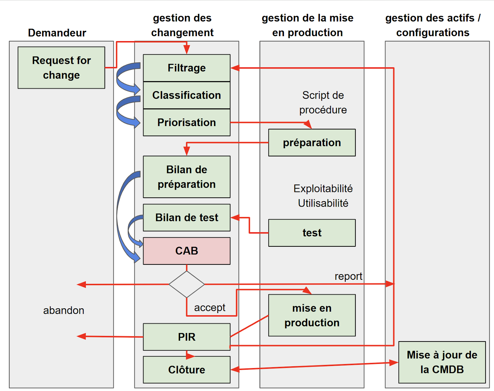

:titre: La transition des services
:module: Centre de services
:duree: 90
:description: Ce module est une introduction à la transition des services ITIL
include::../../../../adoc/libs/header-module.adoc[]

ifeval::["{visible-on-html}" !=  "yes"]
:docinfo: shared
:docinfodir: ../../../../adoc/libs
endif::[]

== Objectifs pédagogiques

// tag::objectifs[]
* **Comprendre et appliquer la gestion des changements** pour minimiser les risques et assurer une transition efficace des services.
* **Maîtriser les processus de gestion des configurations et des actifs de service** à l'aide d'outils adaptés.
* **Planifier et exécuter des mises en production et des déploiements** en choisissant les modes les plus appropriés.
* **Exploiter la gestion des connaissances** pour améliorer la documentation, la formation et l’efficacité opérationnelle.
// end::objectifs[]

// tag::deroulement[]

== Introduction à la transition des services

* **Objectif** : Faciliter l'intégration des services nouveaux ou améliorés en production tout en assurant une transition douce et efficace, alignée sur les objectifs stratégiques de l'entreprise.
* **Importance** : Ce processus joue un rôle crucial pour respecter les attentes en matière de coûts, délais et qualité des livrables initialement définis lors de la conception des services.

=== Rôle de la transition des services

* **Réalisation** : Exécuter les étapes de construction et de mise en œuvre des services selon les plans.
* **Test et Validation** : S'assurer que les services fonctionnent comme prévu sans erreurs significatives.
* **Déploiement** : Introduire les services dans l'environnement de production en minimisant les perturbations.
* **Gestion des Ressources** : Mobiliser et optimiser les ressources nécessaires pour une mise en œuvre réussie.

include::../../../../adoc/libs/slide-notitle.adoc[]

* **Documentation** : Créer et actualiser les documents de support et d'exploitation des services.
* **Surveillance et Amélioration** : Suivre les performances des services et identifier les opportunités d'amélioration.
* **Qualité et Sécurité** : Respecter les normes de qualité et de sécurité tout au long du processus.
* **Perception Client** : Évaluer et améliorer continuellement la satisfaction client.

== Gestion des changements

La gestion des changements est initiée par une demande formelle de modification (RFC) et est essentielle pour contrôler les adaptations des services informatiques.

=== Objectifs

* **Efficacité des Procédures** : Assurer que les méthodes pour gérer les changements sont à la fois efficaces et efficientes.
* **Enregistrement des CI** : Veiller à ce que toutes modifications des éléments de configuration soient correctement documentées dans le CMS.
* **Minimisation des Risques** : Répondre aux besoins évolutifs des clients tout en limitant les risques de perturbation des services existants.

== Processus de demande de changement

**RFC** : Chaque changement proposé doit être formalisé par une RFC, qui comprend plusieurs éléments clés :

* **Identifiant Unique** : Permet de suivre la demande à travers tout le processus.
* **Détails du Demandeur** : Inclure le nom et le département du demandeur pour faciliter la communication.
* **Description du Changement** : Une explication détaillée de ce qui est proposé, pourquoi, et comment.

include::../../../../adoc/libs/slide-notitle.adoc[]

* **Analyse des Risques** : Évaluer les risques associés au changement proposé.
* **Ressources Nécessaires** : Estimer les besoins en ressources humaines et matérielles.
* **Calendrier** : Définir les étapes importantes du déploiement du changement.

== Priorisation des changements

**Tableau de Priorité** : Établir un code de priorité basé sur l'urgence et l'impact du changement, de 1 (critique) à 5 (standard), pour hiérarchiser les actions et allouer les ressources de manière appropriée.

[cols="1,1", grid="none", frame="none"]
|===

a| image::./assets/04-priorisation.png[]
a| image::./assets/04-priorisation-2.png[]

|===

== Les types de changements

**Changement Normal :**

* Ce type requiert une analyse complète 
* et l'approbation du CAB avant de procéder.
* nécessité d’évaluation et de suivi (contrôle), en fonction des risques

include::../../../../adoc/libs/slide-notitle.adoc[]

**Changement Standard :**

* Moins risqué, 
* fait partie d'un ensemble préapprouvé 
* ne nécessite pas de revue supplémentaire.

**Changement Urgent :**

* Pour les situations critiques 
* nécessitant une intervention immédiate, 
* validée par l'ECAB. (Emergency Change Advisory Board, comité des changements urgents)

== Cycle de vie d'un changement

**Étapes** : De l'initiation à la clôture, incluant la demande de changement, l'évaluation, la classification, la préparation, le test, et la mise en production, suivies par la révision post-implémentation.

include::../../../../adoc/libs/slide-notitle.adoc[]

[NOTE.speaker]
--
**PIR** signifie **Post Implementation Review**. Le PIR est une évaluation qui se réalise après la mise en œuvre d'un changement ou d'un projet pour vérifier si les objectifs ont été atteints, évaluer comment le changement a été intégré dans l'environnement de production, et identifier les leçons apprises afin d'améliorer les processus futurs. Cette revue est cruciale pour s'assurer que le changement répond aux attentes et pour apporter des ajustements nécessaires en cas de besoins non satisfaits ou de problèmes survenus.
--

== Les 7 "R" de la gestion des changements

**Détail des '7 R'** : vous aidera à vous poser les questions essentielles lors de l’analyse d’une RFC. Vous pourrez ainsi établir le périmètre de ce changement 

include::../../../../adoc/libs/slide-notitle.adoc[]

* **Raised (requis)** : Identification du demandeur.
* **Reason (raison)** : Raison du changement.
* **Return (retour)** : Bénéfice attendu du changement.
* **Risks (risque)** : Risques associés.

include::../../../../adoc/libs/slide-notitle.adoc[]

* **Resources** : Ressources requises pour le changement.
* **Responsible (responsable)** : Responsable de la mise en œuvre.
* **Relationship (Relation)** : Interactions avec d'autres changements ou services.

== Gestion des actifs de services et des configurations

Assure l'identification, le contrôle, et l'enregistrement précis des actifs de services et des éléments de configuration (CI) tout au long de leur cycle de vie.

=== Activités clés

* **Identification et Définition** : Sélectionner et définir les CI, avec un niveau de détail approprié pour chaque élément.
* **Contrôle des CI** : Maintenir un contrôle rigoureux pour s'assurer que seuls les CI autorisés sont enregistrés et mis à jour dans la CMDB.
* **Gestion des États** : Produire régulièrement des rapports sur l'état et la conformité des CI pour surveiller leur intégrité et performance.
* **Vérifications et Audits** : Effectuer des audits réguliers pour valider l'exactitude des informations et la conformité des CI avec les politiques internes et les exigences réglementaires.

== Outils de gestion des configurations

**CMS (Configuration Management System) :** Un ensemble d'outils conçu pour gérer les données de configuration.

* centralise la gestion des informations 
* soutient la gestion de plusieurs CMDBs pour créer une vue fédérée et intégrée des données de configuration.

include::../../../../adoc/libs/slide-notitle.adoc[]

**CMDB (Configuration Management Database) :** Une base de données utilisée pour stocker des informations sur les éléments de configuration. 

* enregistre les attributs des CI et les relations entre eux, 
* vital pour la gestion des services.

**DML (Definitive Media Library) :** Dépôt sécurisé

* Contient les versions autorisées de tous les logiciels CI, 
* Leur documentation associée et les licences nécessaires. 
* assure que seules les versions approuvées et vérifiées sont utilisées dans l'environnement de production.

== Gestion de la mise en production et des déploiements

* Valide, organise et planifie le déploiement des services (nouveaux ou mis à jour) de façon « industrielle », en garantissant la valeur apportée, dans le respect des SLA.
* Crée et fournit le document à l’exploitation des services
* S’assure que les utilisateurs ont reçu les informations et sont formés pour utiliser les nouveaux services
* Gestion des versions, convention de nommage, le R.A.C.I, les délais…

== Les différents modes de déploiement

* **Mode Push** : Le déploiement est à l’initiative d’un centre vers les sites utilisateurs cibles. Déploiement d’une mise à jour sur l’ensemble des utilisateurs concernés.
* **Mode Pull** : Le déploiement est mis à disposition des utilisateurs sur un serveur. Les utilisateurs vont initier le déploiement à leur convenance.
* **Big bang** : Le déploiement est effectué en une seule opération vers tous les utilisateurs.

include::../../../../adoc/libs/slide-notitle.adoc[]

* **Par phase** : Le déploiement s’effectue selon un plan en tenant compte des périmètres définis par le client. 
* **Manuel** : Déploiement avec l’aide du personnel de la DSI avec contrôles et surveillance. 
* **Automatique** : Fortement conseillé, déploiement sans l’aide du personnel de la DSI.

== Gestion de la connaissance

* **Accès à l'Information** : Fournir aux collaborateurs l'accès à l'information pertinente avec le niveau de détail requis pour leur rôle.
* **Fiabilité et Compréhension** : Assurer que l'information disponible est fiable, à jour, et présentée de manière à être facilement compréhensible.
* **Soutien aux Décisions** : Faciliter la prise de décision rapide et éclairée à tous les niveaux de l'organisation.

include::../../../../adoc/libs/slide-notitle.adoc[]

* **Identification des Exigences** : Déterminer les besoins en information des utilisateurs et des parties prenantes.
* **Architecture de Données** : Définir une architecture capable de supporter et de sécuriser les données.
* **Mise en Place d'Outillages** : Sélectionner et configurer les outils nécessaires pour gérer efficacement les données.
* **Procédures Opérationnelles** : Écrire et maintenir les procédures qui régissent la création, le stockage, l'accès, et la mise à jour des informations dans la base de connaissances.

// end::deroulement[]

== Conclusion
// tag::conclusion[]
La transition des services dans ITIL v3 constitue une étape clé pour garantir la continuité et la qualité des services informatiques lors de leur évolution ou de leur mise en place 

**Gestion des changements** : Un processus structuré permet de minimiser les risques et de mieux répondre aux besoins de l’organisation grâce à la priorisation et à la classification des changements.

**Cycle de vie des changements** : De la demande au déploiement, chaque étape doit être documentée et suivie pour garantir une transition réussie.

include::../../../../adoc/libs/slide-notitle.adoc[]

**Gestion des configurations** : L’utilisation d’outils adaptés et une gestion rigoureuse des actifs permettent de maintenir une vision claire et précise des composants du système.

**Mise en production** : Les modes de déploiement doivent être choisis en fonction du contexte pour garantir une introduction efficace des services tout en réduisant les perturbations.

**Gestion des connaissances** : La documentation et la centralisation des informations facilitent la formation, la résolution des problèmes et l'amélioration continue.
// end::conclusion[]