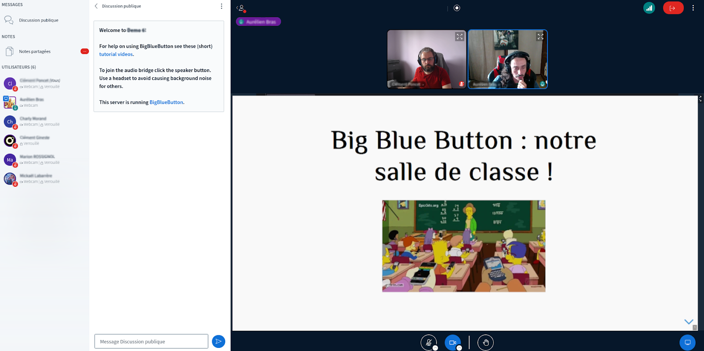

:titre: Outils O'clock
:module: Onboarding
:duree: 45
:description: Comprendre les outils O'clock pour s'authentifier
include::../../../../adoc/libs/header-module.adoc[]

ifeval::["{visible-on-html}" !=  "yes"]
:docinfo: shared
:docinfodir: ../../../adoc/libs
endif::[]

// tag::objectifs[]
// end::objectifs[]

// tag::deroulement[]
== KeyCloak

* = Single Sign-On (SSO)
* permet d'avoir un compte "central" pour plusieurs app/outils
* comme Google, Facebook, etc.
* par et pour O'clock uniquement

== 👤 Ton compte

* email reçu ce matin
* identifiant = ton email `prenom.nom@oclock.school``
* mot de passe = `azertyuiop1234`
* mot de passe à changer à la première connexion !

== 📨 La boîte mail O’clock

* `prenom.nom@oclock.school`
* https://mail.oclock.school/
* connexion grâce à KeyCloak

=== ⚠️ Restrictions

* envoi aux adresses `@oclock.school` uniquement
* conservation des emails 90 jours max

=== 🚀 Let's go !

Tout le monde se connecte à sa boîte mail et vient mettre un message dans le tchat quand il a réussi

https://mail.oclock.school/

== 🧑‍🏫 Big Blue Button : notre salle de classe !

🔖  https://bbb.oclock.school/ - _à mettre dans les favoris !_

image::./assets/bbb-1.png[,,500]

=== La liste des cours

Il n'y a plus qu'à rejoindre votre cours pour la journée 😊

image::./assets/bbb-2.png[]

=== Et nous voilà en cours 🤩

=== La discussion générale
Le chat reste le principal outil de communication entre vous, votre formateur et éventuellement vos collègues.

* Courtoisie et respect sont attendus 🙏
* On évite les hors-sujets pendant le cours 🙅‍♂️
* On n'hésite jamais à poser une question 🍬

=== Les sondages

Le formateur a la possibilité de créer des sondages ou quizz afin de savoir où vous en êtes, votre état d'esprit...

Testons un sondage là ici tout de suite maintenant 😛

=== Les MP

"Chef, je crois que j'ai cassé mon ordi…”

En cliquant sur le nom d'un collègue ou formateur dans la liste des participants, vous ouvrez un chat personnel avec cette personne.

Bonne pratique: pour prévenir le formateur / tuteur qu'on a un souci technique...🆘 

// end::deroulement[]

