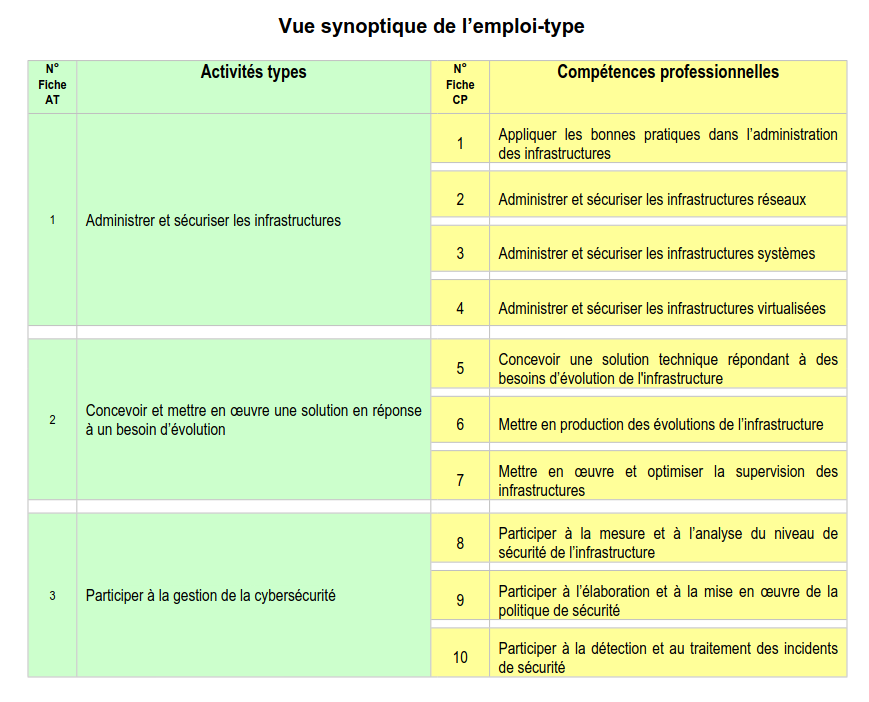
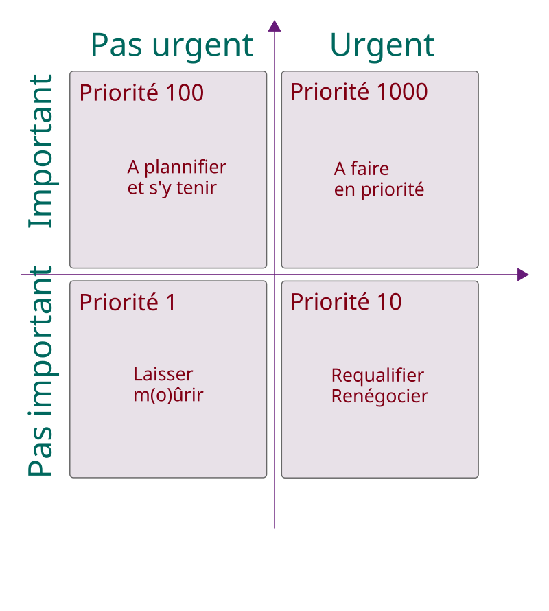

:titre: Présentation du titre professionnel
:module: Onboarding
:duree: 30
:description: Modalités et informations sur le titre pro
include::../../../../adoc/libs/header-module.adoc[]

ifeval::["{visible-on-html}" !=  "yes"]
:docinfo: shared
:docinfodir: ../../../adoc/libs
endif::[]

// tag::objectifs[]
// end::objectifs[]

// tag::deroulement[]
== 📜 Titre professionnel Administrateur d'infrastructures sécurisées

image::https://media1.giphy.com/media/v1.Y2lkPTc5MGI3NjExaGx4NWVrYnd3aWE2OXlqMHdqbTdwYjQya2xwaHVtaDAzdTg1bWt3biZlcD12MV9pbnRlcm5hbF9naWZfYnlfaWQmY3Q9Zw/IPbS5R4fSUl5S/200.webp[]

=== 🎓 Validation du TP

* **Trois blocs de compétences (Activités Types) - avec 3 ou 4 CP**
* Validation partielle ou absence de validation
* 1 an pour le repasser et 3 essais

=== 📗📙 REAC & RE

https://drive.google.com/file/d/1\--lIyjfvFDGRGx5xCDNnMhP_Xjg-nCP9/view?usp=sharing[REAC ↔ RÉFÉRENTIEL EMPLOI ACTIVITES COMPETENCES]

https://drive.google.com/file/d/1aIh_GRkF4Uy4Ud0lg03sRkMeG_bWM3NL/view?usp=sharing[RE ↔ RÉFÉRENTIEL D'ÉVALUATION]

== 🔍 Vue synoptique de l'emploi-type

=== 1️⃣ Activité Type 1

**Administrer et sécuriser les infrastructures**

* Appliquer les bonnes pratiques dans l'administration des infrastructures (_ITIL, SLA, GLPI_)

* Administrer et sécuriser les infrastructures réseaux (_Réseaux de base, réseaux avancés_)

* Administrer et sécuriser les infrastructures systèmes (_Windows Server, Linux_)

* Administrer et sécuriser les infrastructures virtualisées (_Virtualisation, Cloud computing, forunisseurs cloud_)

=== 2️⃣ Activité Type 2

**Concevoir et mettre en oeuvre une solution en réponse à un besoin d'évolution**

* Concevoir une solution technique répondant à des besoins d'évolution de l'infrastructure (_Conteneurisation, clusters, )gestion de projet_

* Mettre en production des évolutions de l'infrastructure (_Virtualisation, sauvegarde, sécurité_)

* Mettre en oeuvre et optimiser la supervision des infrastructures (_Nagios, Zabbix, Centreon, monitoring_)

=== 3️⃣ Activité Type 3

**Participer à la gestion de la cybersécurité**

* Participer à la mesure et à l'analyse du niveau de sécurité de l'infrastructure (_Réseaux avancées, pentest_)

* Participer à l'élaboration et à la mise en oeuvre de la politique de sécurité (_Gouvernance_)

* Participer à la détection et au traitement des incidents de sécurité (_Pentest / Audit, sécurité_)

== 📝 Le dossier professionnel

* Doit valider toutes les compétences
* Sert à démontrer vos compétences mises en pratique individuellement
* Pour chaque Activité Type, vous utiliserez au mini 1 et au maxi 3 réalisations
* Vous pouvez être succinct dans vos explications
* Soyez pertinents dans vos choix

== 📝 Le dossier de projet

* Un à trois projet(s) qui couvre(nt) les compétences obligatoires
* Vous DEVEZ savoir défendre les choix de chaque membre de l'équipe
* Si vous trouvez ça pertinent, mettez le dedans ! Il doit faire entre 30 et 50 pages (hors annexe, sommaire et page de garde)
* Sert à démontrer vos connaissances et compétences mises en oeuvre en équipe
* Le dossier de projet devra être imprimé et remis à votre jury le jour J !

=== 🆘 Comment ça se remplit ?

Pensez à profiter des journées asynchrones pour faire avancer vos dossiers.

Au fur et à mesure des saisons, on vous invite fortement à mettre de côté les projets qui vous semblent pertinents pour le dossier professionnel, cela vous évitera un tri à faire en fin de formation.

== De l'aide de France Travail ? 🤔

https://www.francetravail.fr/candidat/vos-recherches/les-aides-financieres/recherche-demploi---laide-au-dep.html[Recherche d'emploi - L'aide au déplacement)

## Des tips !

* Entraidez-vous ! Mais attention, entraide ne veut pas dire copier 😜
* Travaillez à votre rythme
* Pensez à cette matrice d’Eisenhower :

// end::deroulement[]