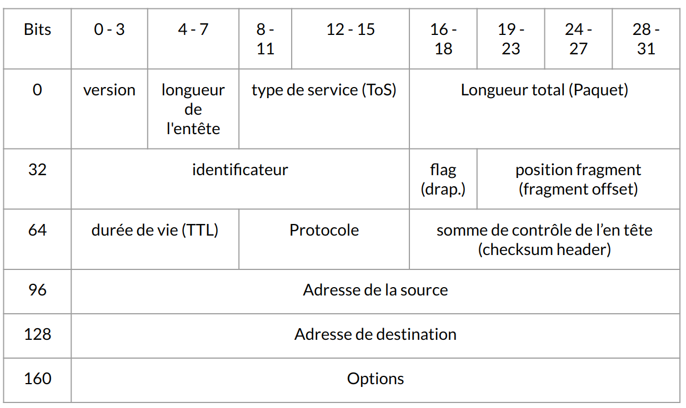
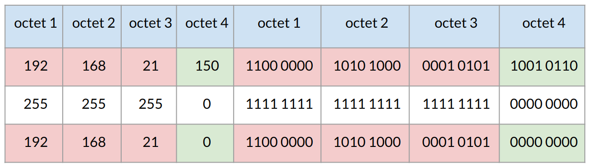
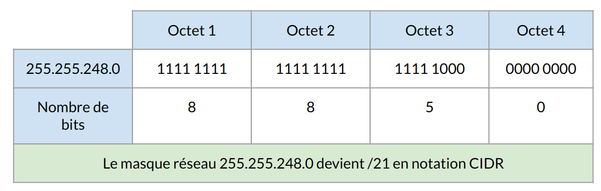

:titre: Adressage IPv4
:module: Réseau
:duree: 60
:description: Comprendre les principes fondamentaux de l'adressage IPv4, y compris la structure des adresses, les en-têtes de paquets, les rôles de l'ICANN et de l'IANA, et les cinq RIRs.
include::../../../../adoc/libs/header-module.adoc[]

ifeval::["{visible-on-html}" !=  "yes"]
:docinfo: shared
:docinfodir: ../../../../adoc/libs
endif::[]

== Objectifs pédagogiques

// tag::objectifs[]
* Expliquer le format d’une adresse IPv4, ses classes d’adresses, et son rôle dans l’identification et le routage des appareils au sein des réseaux IP.
* Décrire la structure de l’en-tête IPv4, en détaillant chaque champ (adresse source et destination, longueur totale, TTL, etc.) et leur rôle dans le traitement des paquets réseau.
* Apprendre à calculer et utiliser les masques de sous-réseau pour diviser des réseaux en sous-réseaux, et effectuer des conversions entre décimal et binaire pour les masques.
* Expliquer la notation CIDR et son utilité pour représenter des plages d’adresses de manière efficace, et savoir l’utiliser dans la conception et l’optimisation des réseaux.
// end::objectifs[]

// tag::deroulement[]
== IPv4

Une adresse IPv4 est constituée de 32 bits découpés en 4 octets distincts.

Une adresse IPv4 est composée :

* d’un identifiant réseau (**ID_Réseau**)
* d’un identifiant d’hôte unique sur le réseau logique (**ID_Hôtes**)

include::../../../../adoc/libs/slide-notitle.adoc[]

Pour communiquer avec d’autres hôtes sur son réseau logique, un hôte réseau a besoin :

* d’une adresse IP
* d’un masque de sous-réseau.

À partir de son adresse IP et son masque de sous-réseau, l’hôte réseau va calculer :

* son adresse de réseau logique
* son adresse de diffusion

== En-tête IPv4

include::../../../../adoc/libs/slide-notitle.adoc[]

* **Version** :  4 bits avec le numéro de version du protocole Internet, IPv4 ou IPv6
* **longueur de l’entête** : 4 bits, qui contiennent des informations sur la longueur de l’en-tête IP (IP header lenght), 
** Pas toujours constante. La longueur totale de l’en-tête est calculée à partir de cette valeur multipliée par 32 bits. 
** la valeur la plus petite possible sera 5, correspond donc à une longueur d’en-tête de 160 bits (20 octets) quand aucune option n’est ajoutée. 
** Le maximum est la valeur 15, pour 480 bits ( 60 octets). 

include::../../../../adoc/libs/slide-notitle.adoc[]

* **Type de service (ToS)** :  bits 8 à 15 (Type of Service) peuvent contenir des instructions pour le traitement et la priorisation du datagramme. 
** la fiabilité, 
** le débit
** le délai de transmission des données.
* **Longueur totale** : taille totale du paquet de données, la taille des données utiles est ajoutée à la longueur de l’en-tête. Le champ ayant une longueur de 16 bits, la limite maximale est de 65 635 octets. 

include::../../../../adoc/libs/slide-notitle.adoc[]

* **Identificateur** : L’ensemble des fragments d’un datagramme ont le même numéro d’identification que celui qu’ils reçoivent de l’expéditeur. l’hôte cible peut alors assigner des fragments individuels à un datagramme spécifique.
* **Drapeau** : 3 bits flag donnant les directive de fragmentation 
** Bit 1 : réservé et a toujours la valeur 0
** bit 2 :  Don’t Fragment indique si le paquet peut être fragmenté : (0)= oui / (1) = non
** bit 3 : More Fragments indique si d’autres fragments suivent : (1)= oui il y a d’autre fragment / (0) = non le paquet est complet dernier fragment

include::../../../../adoc/libs/slide-notitle.adoc[]

* **Position Fragment** : donné l'endroit où se trouve un seul fragment, ce qui permet de compiler à nouveau l’ensemble du datagramme.
** La longueur de 13 bits signifie qu’un datagramme peut être divisé en un maximum de 8192 fragments.
* **Durée de vie** :  Time to live permet d’éviter qu’un paquet migre de noeuds indéfiniment. 
** durée de vie max 255 secondes 
** a chaque passage dans un noeud le TTL est réduit de 1 jusqu’à 0

include::../../../../adoc/libs/slide-notitle.adoc[]

* **Protocole : 8 bit permettant d’affecter le protocole de transport au paquet de données** 
** **Valeur 6 = TCP**
** **valeur 17 = UDP**
** https://www.iana.org/assignments/protocol-numbers/protocol-numbers.xhtml[Protocol Numbers (iana.org)]
* **Somme des contrôle de l’entête** : Checksum » de 16 bits = somme de contrôle de l’en-tête.
** En raison de la diminution du TTL, il est recalculer pour chaque nœud de réseau. 

include::../../../../adoc/libs/slide-notitle.adoc[]

* **Adresse source et destination** :   32 bits, soit 4 octets, sont réservés à l’adresse IP l’hôte source et 32 bits pour l’adresse IP l’hôte cible
* **Options** : étend le protocole IP avec des informations supplémentaires non incluses dans la conception standard
** Security : indique la confidentialité d’un datagramme
** Record Route : affiche tous les nœuds réseau traversés pour tracer l’itinéraire du paquet
** Time Stamp : ajoute l’heure à laquelle un nœud en particulier a été passé

== ICANN et IANA

=== ICANN (Internet Corporation for Assigned Names and Numbers)

* **Fonction principale** : Gouvernance globale de l'allocation des adresses IP, en assurant une distribution équitable et technique des adresses IP et des noms de domaine à travers le monde.
* **Coordination** : Assure la coordination mondiale des systèmes de noms de domaine pour garantir un fonctionnement universel et sans accroc d'Internet.
* **Politique** : Développe et implémente des politiques pour l'allocation des numéros IP en collaboration avec la communauté mondiale d'Internet.

=== IANA (Internet Assigned Numbers Authority)

* **Fonction principale** : Gestion des espaces d'adresses IP, y compris les allocations aux RIRs.
* **Administration des DNS Root** : Gère la zone racine du système de noms de domaine, essentielle pour le fonctionnement global d'Internet.
* **Maintenance des registres IP** : Maintient les registres techniques, détaillant les affectations et standards de protocoles Internet.

== RIRs (Regional Internet Registries)

Les RIRs sont des organisations responsables de la gestion et de l'allocation des ressources en numéros Internet (adresses IP et ASN - Autonomous System Numbers) dans des régions géographiques spécifiques.

=== Liste des cinq RIRs:

* **ARIN (North America)**
* **RIPE NCC (Europe, Middle East, and parts of Central Asia)**
* **APNIC (Asia-Pacific region)**
* **LACNIC (Latin America and the Caribbean)**
* **AFRINIC (Africa)**

=== Processus d'allocation:

* **Demandes** : Les organisations doivent justifier leurs besoins en adresses IP en fonction de leur utilisation prévue et de la croissance attendue.
* **Évaluation** : Les demandes sont évaluées sur la base de politiques régionales spécifiques, souvent conçues pour assurer une utilisation équitable et rationnelle des adresses IP.
* **Allocation** : Les adresses sont attribuées pour soutenir le développement et l'expansion de l'Internet dans leur région, avec des politiques adaptées aux besoins locaux.

== Masque et Conversion

La fonction `&logique` permet de calculer l’adresse de réseau logique

[cols="1,1"]
|===

a|
Configuration d’un hôte

* Adresse IP : 192.168.21.150
* Masque : 255.255.255.0

a| image::./assets/05-masque-1.png[]

|===

include::../../../../adoc/libs/slide-notitle.adoc[]

L’adresse IP `192.168.21.150` avec le masque 255.255.255.0 provient du réseau logique 192.168.21.0

* En rouge : ID RÉSEAU
* En Vert : ID Hôtes : 
** Toutes les valeurs de l’id hôte à 0 = adresse de réseau
** Toutes les valeurs de l’id hôte à 1 = adresse de diffusion (broadcast)

include::../../../../adoc/libs/slide-notitle.adoc[]

* Obtenir l’adresse de réseau : passer tous les bits de l’`ID_Hôtes` à 0
* Obtenir l’adresse de diffusion : passer tous les bits de l’`ID_Hôtes` à 1  
* Obtenir le masque de sous-réseau : passer tous les bits de l’`ID_Réseau` à 1
* Obtenir le nombre d’hôtes : prendre le nombre de bits (n) de l’`ID_Hôtes`  
** Utiliser la formule : Nbre d’hôtes = 2^n – 2

== Notation CIDR

La notation CIDR (Classless Inter Domain Routing) publiée en septembre 1993 (RFC 1518 et 1519)

Suppression du masque de sous-réseau, remplacer par le préfixe

Le préfixe représente le nombre de bits de l'ID Réseau

include::../../../../adoc/libs/slide-notitle.adoc[]

_Adresse IP : 192.168.21.150_

_Masque : 255.255.248.0_

// tag:demo[]

== Démonstration

[NOTE.speaker]
--
**Utilisation de Wireshark**

Wireshark est un analyseur de paquets réseau très puissant qui permet de visualiser en détail les en-têtes des paquets IP :

* **Étape 1** : Installez Wireshark.
* **Étape 2** : Lancez Wireshark et sélectionnez l'interface réseau sur laquelle vous souhaitez capturer le trafic.
* **Étape 3** : Démarrez la capture et laissez passer un certain nombre de paquets.
* **Étape 4** : Recherchez un paquet IPv4 dans la liste des paquets capturés (vous pouvez filtrer en tapant ip dans la barre de filtre).
* **Étape 5** : Sélectionnez le paquet pour voir les détails de l'en-tête IPv4. Wireshark affiche tous les champs (version, TTL, adresses source et destination, etc.) sous forme lisible et détaillée.

Dans les outils ci-dessus, vous pourrez voir notamment :

* **Version** : Version de l’IP (ici, 4 pour IPv4).
* **Longueur de l’en-tête (IHL)** : Longueur de l’en-tête en mots de 32 bits.
* **Type de Service (TOS)** : Indique la priorité du paquet.
* **Longueur Totale** : Longueur totale du paquet (en-tête + données).
* **Identification, Flags, Fragment Offset** : Utilisés pour la fragmentation.
* **TTL (Time To Live)** : Durée de vie du paquet avant expiration.
* **Protocole** : Indique le protocole de la couche supérieure (TCP, UDP).
* **Checksum de l’en-tête** : Permet de vérifier l’intégrité de l’en-tête.
* **Adresse Source et Adresse Destination** : IP de l’expéditeur et du destinataire.

**Configuration DHCP**

Configurer un serveur DHCP sur une machine virtuelle et montrer comment un client reçoit automatiquement une adresse IP lorsqu'il se connecte au réseau.

**Configuration Manuelle**

Démontrer comment attribuer manuellement une adresse IP à un dispositif dans les paramètres réseau de systèmes d'exploitation comme Windows ou Linux.

--

// end::demo[]

// end::deroulement[]

== Conclusion
// tag::conclusion[]
**Structure d'IPv4 : **

Une adresse IPv4 est composée de 32 bits, segmentée en quatre octets, représentée en format décimal pointé pour simplifier la lecture et la gestion.

**Gestion et Allocation : **

L'ICANN et l'IANA régulent la distribution globale des adresses IP, tandis que les RIRs gèrent l'allocation régionale selon des politiques spécifiques à chaque zone.

include::../../../../adoc/libs/slide-notitle.adoc[]

**Configuration d'IPv4 :**

Les adresses IPv4 peuvent être configurées dynamiquement via DHCP ou statiquement pour un contrôle accru, essentiel dans les réseaux complexes.

**Sécurité : **

Les vulnérabilités comme l'ARP spoofing et l'IP spoofing nécessitent des protections robustes, incluant firewalls et systèmes de détection d'intrusions.

**Défis et Avenir : **

L'épuisement des adresses IPv4 pousse à l'utilisation de techniques comme le NAT et motive la transition vers IPv6 pour des capacités de réseau étendues.
// end::conclusion[]