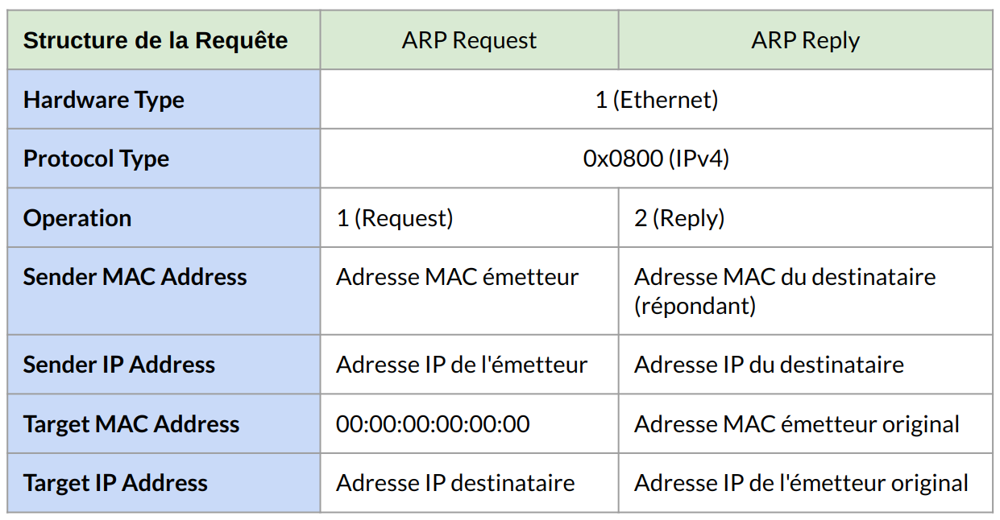

:titre: ARP
:module: Réseau
:duree: 60
:description: ARP est un protocole de la couche 2 du modèle OSI qui permet de faire le lien entre une adresse IP et une adresse MAC.
include::../../../../adoc/libs/header-module.adoc[]

ifeval::["{visible-on-html}" !=  "yes"]
:docinfo: shared
:docinfodir: ../../../../adoc/libs
endif::[]


== Objectifs pédagogiques

// tag::objectifs[]
* Comprendre le rôle du protocole ARP
* Analyser la structure d’une trame ARP
* Étudier le fonctionnement d’une requête ARP
* Utiliser la commande ARP sous Windows
* Utiliser la commande ARP sous Linux
// end::objectifs[]

// tag::deroulement[]
== Qu’est ce que l’ARP

* ARP est un protocole de couche 2 (liaison de données) qui sert d'interface entre la couche liaison de données 2 et la couche réseau 3 du modèle OSI.
* Il est décrit dans la RFC 826 et fait partie intégrante de la suite de protocoles TCP/IP.
* Fonctionne en conjonction avec l'IPv4; pour l'IPv6, une alternative appelée NDP (Neighbor Discovery Protocol) est utilisée.

=== Son rôle

* Permet de résoudre les adresses IP en adresses MAC, un processus crucial pour l'envoi de trames sur un réseau local.
* Fonctionne uniquement dans le même segment de réseau, c'est-à-dire qu'il ne traverse pas les routeurs.

== Trame ARP

**Format de Trame ARP**: Composé de plusieurs champs sur 28 byte :

* **Hardware Type (HTYPE)**: Indique le type de matériel, généralement "1" pour Ethernet.
* **Protocol Type (PTYPE)**: Indique le protocole de couche réseau. Pour IPv4, la valeur est 0x0800.
* **Hardware Size (HLEN)** et Protocol Size (PLEN): Tailles respectives des adresses matérielles et des adresses de protocole (6 pour MAC, 4 pour IPv4).

include::../../../../adoc/libs/slide-notitle.adoc[]

* **Operation (OPER)**: Indique le type d'opération ARP (1 pour request, 2 pour reply, 3 RARP request, 4 RARP reply).
* **Sender MAC Address (SMA)** : Adresse MAC de l'émetteur.
* **Sender IP Address (SIA)** : Adresse IP de l'émetteur.
* **Target MAC Address (TMA)** : Adresse MAC du destinataire (0s pour une requête).
* **Target IP Address (TIA)** : Adresse IP du destinataire.

include::../../../../adoc/libs/slide-notitle.adoc[]


== Requête ARP

**Émission d'une Requête ARP diffusion en Mode Broadcast:**

* La requête ARP est envoyée en broadcast sur le réseau local (adresse MAC destination: FF:FF:FF:FF:FF ).
* Le champ "Target MAC Address" est rempli avec des zéros (00:00:00:00:00:00) car l'adresse MAC cible est inconnue.

include::../../../../adoc/libs/slide-notitle.adoc[]



=== Structure de la Table ARP

* Stocke des associations dynamiques entre les adresses IP et MAC.
* Chaque entrée inclut:
** Adresse IP.
** Adresse MAC.
** Marqueur temporel pour l'expiration de l'entrée.
* Les systèmes d'exploitation mettent en cache ces entrées pour une durée spécifique (par exemple, 60 secondes sur Windows, 30 secondes sur Linux).

=== Gestion des Entrées ARP

* Entrées dynamiques: Ajoutées automatiquement via le processus ARP.
* Entrées statiques: Peuvent être ajoutées manuellement 
* Expiration des entrées pour éviter les conflits d'adresse et maintenir l'actualité des correspondances.

== Commandes ARP sous Windows

=== Afficher la Table ARP

`arp -a` : Affiche toutes les entrées de la table ARP pour toutes les interfaces réseau.
`arp -a [adresse IP]`: Affiche l'entrée ARP pour une adresse IP spécifique.

=== Ajouter une Entrée Statique

```sh
arp -s [adresse IP] [adresse MAC]
```

Les entrées statiques persistent jusqu'au prochain redémarrage ou jusqu'à ce qu'elles soient supprimées.

=== Supprimer une Entrée : 

```sh
arp -d [adresse IP]
```

Supprime l'entrée ARP pour l'adresse IP spécifiée.

== Commandes ARP sous Linux

=== Afficher la Table ARP

```sh
arp -n 
```

=== Ajouter une Entrée Statique: les entrées statiques sont supprimées au redémarrage.

```sh
sudo arp -s [adresse IP] [adresse MAC]
```

=== Supprimer une Entrée

```sh
sudo arp -d [adresse IP]
```

=== Gestion avec ip (Outil Moderne):

* **Afficher la Table ARP**

```sh
ip neigh
```

* **Ajouter une Entrée**

```sh
sudo ip neigh add [adresse IP] lladdr [adresse MAC] dev [interface]
```

* **Supprimer une Entrée**

```sh
sudo ip neigh del [adresse IP] dev [interface]
```

// tag::demo[]

== Démonstration

[NOTE.speaker]
--
Dans packet tracer 
en mode simulation effectuer un ping entre deux machines

montrer les filtres dans packet tracer pour ne garder que les trames ARP

montrer l'en tête ARP dans les paquets qui transitent et request et en en reply (Slide 5 du module)

sur une des machines montrer les commandes pour afficher et purger la table arp 
--

// end::demo[]

// end::deroulement[]

== Conclusion
// tag::conclusion[]
ARP Permet de résoudre les adresses IP en adresses MAC, un processus crucial pour l'envoi de trames sur un réseau local.

Fonctionne uniquement dans le même segment de réseau, c'est-à-dire qu'il ne traverse pas les routeurs.

La table stocke les associations entre les adresses IP et MAC.

Chaque entrée inclut:

* Adresse IP.
* Adresse MAC.
* Marqueur temporel pour l'expiration de l'entrée.
// end::conclusion[]