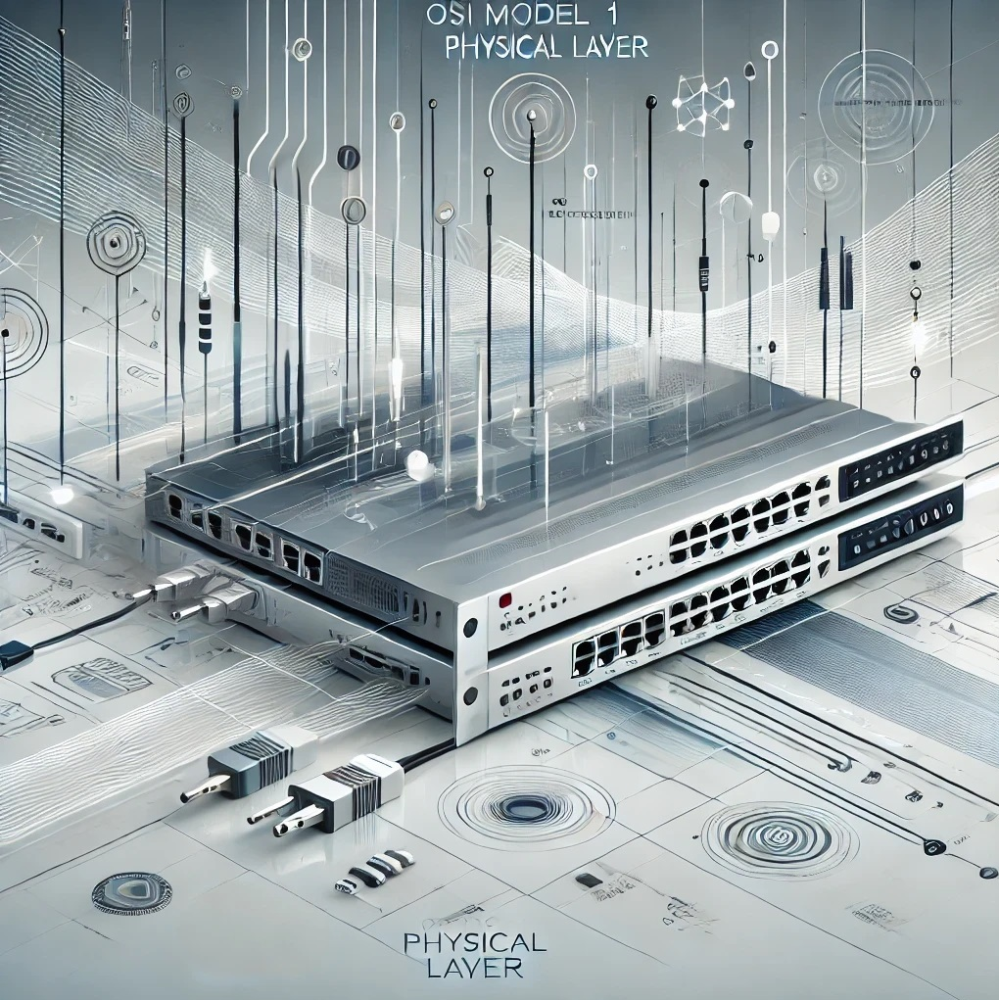
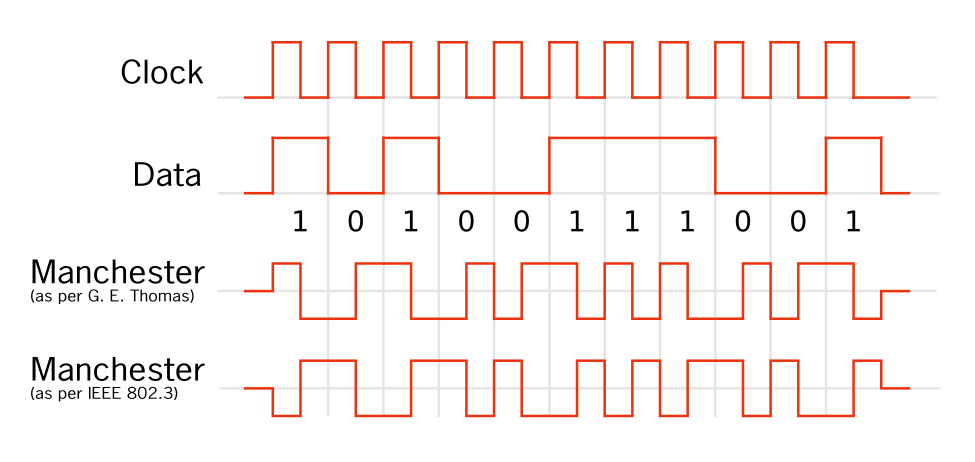
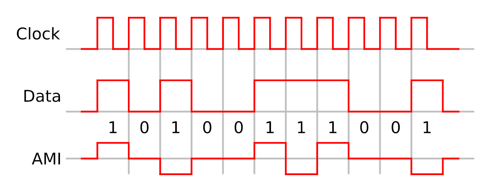

:titre: La couche Physique
:module: Réseau
:duree: 120
:description: La couche physique est la première couche du modèle OSI.
include::../../../../adoc/libs/header-module.adoc[]

ifeval::["{visible-on-html}" !=  "yes"]
:docinfo: shared
:docinfodir: ../../../../adoc/libs
endif::[]

== Objectifs pédagogiques

// tag::objectifs[]
* Comprendre le rôle de la couche physique
* Maîtriser la modulation et le codage
* Connaître les méthodes de codage
* Connaître les équipements de la couche physique
// end::objectifs[]

// tag::deroulement[]

== La couche physique

* Responsable de la transmission des données brutes sous forme de signaux électriques, optiques ou radio, entre les dispositifs d'un réseau. 
* Elle définit les aspects physiques de la communication, comme les connexions, les câbles, les tensions, les fréquences, gérer les dispositifs matériels qui permettent la transmission des bits.

include::../../../../adoc/libs/slide-notitle.adoc[]

La couche physique est essentielle dans le réseau, elle sert de fondation pour toutes les couches supérieures en fournissant les moyens physiques de transmission des données.

== Principales caractéristiques de la couche physique

=== Supports de transmission : 

* Gère les supports physiques de transmission
* Les câbles (cuivre, fibre optique), le Wi-Fi, et autres méthodes de transmission sans fil.

=== Signalisation : 

Définit comment les bits sont transformés en signaux. (ex : un bit "1" peut correspondre à un certain niveau de tension, et un bit "0" à un autre)

=== Topologie réseau : 

Englobe les aspects de la topologie du réseau (bus, les étoiles, les anneaux)

=== Synchronisation des bits : 

Assure la synchronisation des bits pour que les dispositifs comprennent les débuts et les fins des signaux.

=== Connecteurs et interfaces :

Définit la typologie  des connecteurs, la configuration des broches, et les normes électriques ( Ethernet, USB, etc.).

=== Débit : 

Le débit de transfert des données est également géré par cette couche, c'est-à-dire la vitesse à laquelle les données peuvent être envoyées.

=== Exemples de dispositifs dans la couche physique :

* **Câbles** : RJ45, fibre optique, coaxial.
* **Périphériques** : Répéteurs, hubs, modems (qui se situent entre la couche 1 et la couche 2).
* **Normes** : Ethernet (au niveau physique), USB, Bluetooth.

== Modulation et codage

Pour transmettre des bits de manière fiable, la couche physique emploie des techniques 

* De **modulation** (pour les ondes radio) 
* De **codage** (pour transformer les données binaires en signaux). 

== La modulation

La **modulation** consiste à modifier une onde porteuse (comme une onde radio) pour transmettre de l'information.

* **Modulation d'Amplitude (AM)** : L'amplitude de l'onde porteuse est modifiée en fonction de l'information à transmettre. Elle est simple mais sensible aux interférences et au bruit.
* **Modulation de Fréquence (FM)** : La fréquence de l'onde porteuse est modifiée en fonction de l'information. Plus résistante au bruit que l'AM, elle est souvent utilisée pour la radio et la télévision.
* **Modulation de Phase (PM)** : La phase de l'onde porteuse est modifiée. Utilisée principalement dans les communications numériques, elle est moins fréquente pour les signaux analogiques.

== Le codage pour la Transformation des Données Binaires en Signaux

=== Codage de Ligne

Le codage de ligne transforme une suite de bits en une série de signaux adaptés pour la transmission sur un canal physique.

=== NRZ (Non-Return to Zero) : 

* Chaque bit est représenté par un niveau de signal haut pour 1, bas pour 0
* Pas de  retour à un niveau de référence entre chaque bit.
* sensible aux erreurs de synchronisation, surtout sur de longues séquences de bits identiques.

image::./assets/04-codage.png[]

=== Manchester : 

* Utilisé en Ethernet
* Change le signal au milieu de chaque intervalle de bit. 
* Un changement vers le haut représente un 1, et vers le bas un 0.
* Ce codage facilite la synchronisation, mais double la bande passante nécessaire.

=== Bipolaire AMI (Alternate Mark Inversion) 

* Utilisé dans les lignes téléphoniques, 
* Chaque bit 1 est représenté par une impulsion alternée positive ou négative, 
* Les 0 par l'absence de signal. 
* Ce type de codage est moins sensible aux interférences.

== Le codage de canal

* introduit de la redondance dans le signal 
* lors de la transmission permet la détection et la correction des erreurs causées par
** Le bruit
** L’atténuation 
** Les interférences. 

=== Exemple de codage de canal

* **Code de Hamming** : Utilisé pour détecter et corriger des erreurs simples. Il insère des bits de contrôle dans les données pour identifier et corriger des erreurs ponctuelles.
* **Codes de Reed-Solomon** : Ces codes, utilisés dans les CD, les DVD et les communications sans fil, ajoutent des bits redondants qui permettent de corriger plusieurs erreurs en série.
* **Code de convolutions** : Utilisé dans les communications spatiales et les réseaux sans fil, il génère une séquence redondante à partir des bits d'entrée, permettant de reconstruire les données perdues en cas d'erreurs.

== Le codage source 

* concerne la compression des données pour minimiser la quantité de bits transmis
* Optimise l’utilisation de la bande passante 
* Réduit les besoins en stockage. 
** **Compression sans perte** : Permet de réduire la taille des données sans en perdre d’information 
** **Compression avec perte** : Élimine certaines informations pour réduire significativement la taille des données, en acceptant une légère dégradation de la qualité (exemples : MP3 pour l’audio, JPEG pour les images).

== Les équipements spécifiques à la couche physique

=== Répéteurs : 

Amplifient ou régénèrent le signal pour qu'il puisse parcourir de plus longues distances sans perte.

=== Multiplexeurs (MUX) :

Permettent de combiner plusieurs signaux pour les faire passer simultanément sur un même support de transmission pour augmenter l'efficacité de la bande passante.

=== Amplificateurs optiques : 

* Dans les réseaux à fibre optique, ils amplifient les signaux lumineux sans conversion en signal électrique
* Permet des transmissions sur des centaines de kilomètres.

=== Le Câblage : 

vu au module suivant 

== Normes et standards

Les normes de la couche physique sont variées et évoluent avec les progrès technologiques.

=== Ethernet (norme IEEE 802.3) : 

* Chaque évolution d’Ethernet propose des améliorations en termes de vitesse et de distance maximale supportée. 
* 1000BASE-T correspond à Gigabit Ethernet sur câble en cuivre de catégorie 5e, 
* 1000BASE-LX utilise de la fibre optique pour des distances allant jusqu’à 5 km.

=== Fibre optique : 

* Des normes comme OM3 et OM4 pour la fibre permettent des transmissions à très haut débit sur des distances courtes à moyennes. 
* les normes OS1 et OS2 concernent la fibre monomode, qui est adaptée aux longues distances.

=== Standards pour la transmission sans fil : 

* la norme IEEE 802.11 est divisée en sous-catégories (
** 802.11a, 802.11b, 802.11ac, 802.11ax, etc.), chacune apportant des améliorations en débit, portée, ou gestion des interférences.

=== Standards pour la transmission sans fil : 

La norme IEEE 802.11 est divisée en sous-catégories chacune apportant des améliorations en débit, portée, ou gestion des interférences.

[cols="1,1,1,1,1,1", options="header"]
|===
| Norme     | Année | Bande de fréquence | Débit Max Théorique | Portée         | Caractéristique

| 802.11a   | 1999  | 5 GHz              | 54 Mbps             | Moyenne (20m)  | Réduction des interférences, faible portée en 5 GHz
| 802.11b   | 1999  | 2,4 GHz            | 11 Mbps             | Longue (35m)   | Bonne portée, mais sensible aux interférences
|===

include::../../../../adoc/libs/slide-notitle.adoc[]

[cols="1,1,1,1,1,1", options="header"]
|===
| Norme     | Année | Bande de fréquence | Débit Max Théorique | Portée         | Caractéristique
| 802.11g   | 2003  | 2,4 GHz            | 54 Mbps             | Longue (30m)   | Compatibilité avec 802.11b, meilleure vitesse
| 802.11n   | 2009  | 2,4 GHz et 5 GHz   | 600 Mbps            | Longue (70m)   | MIMO (multiples antennes) pour améliorer débit et portée
|===

include::../../../../adoc/libs/slide-notitle.adoc[]

[cols="1,1,1,1,1,1", options="header"]
|===
| Norme     | Année | Bande de fréquence | Débit Max Théorique | Portée         | Caractéristique
| 802.11ac  | 2013  | 5 GHz              | 6,9 Gbps            | Moyenne (35m)  | Amélioration de la gestion des interférences, MU-MIMO
| 802.11ax  | 2019  | 2,4 GHz et 5 GHz   | 9,6 Gbps            | Très longue (>70m) | OFDMA, gestion avancée pour les environnements denses
|===

== Enjeux de sécurité et maintenance dans la couche physique

Même si la couche physique est souvent perçue comme une infrastructure passive, elle comporte des enjeux de sécurité et de maintenance spécifiques.

=== Protection contre les écoutes

Les câbles en cuivre peuvent être vulnérables aux écoutes physiques via des méthodes comme l’interception électromagnétique (en se servant des champs émis par les câbles). Pour y remédier, les réseaux sensibles utilisent souvent la fibre optique, qui est plus difficile à intercepter.

=== Protection physique

Les câbles doivent être protégés contre les environnements extrêmes (température, humidité) et les accès non autorisés. 

=== Maintenance

La couche physique est soumise à l'usure et aux dommages physiques. Le vieillissement des câbles, les courts-circuits et les interférences peuvent provoquer des interruptions de service, d'où l'importance de suivre un programme de maintenance préventive et de disposer d'outils de diagnostic.

// end::deroulement[]

== Conclusion
// tag::conclusion[]
* **Rôle de la Couche Physique**
** Convertit les données numériques en signaux (électriques, lumineux, radio) pour la transmission.
** Assure la synchronisation des bits et le débit, en définissant la bande passante.
* **Équipements de Transmission**
** **Répéteurs** : Amplifient les signaux pour contrer l’atténuation sur les longues distances.
** **Hubs** : Connexions simples, mais obsolètes.
** **Multiplexeurs** (MUX) : Optimisent l’utilisation des fibres optiques avec le multiplexage en longueurs d’onde (WDM).

include::../../../../adoc/libs/slide-notitle.adoc[]

* **Techniques Avancées**
** **Modulation et Codage** : OFDM en Wi-Fi, codage NRZ et Manchester en Ethernet pour réduire les erreurs de transmission.
** **Multiplexage** : FDM pour les ondes radio et WDM pour la fibre optique, augmentant la capacité de transmission.
// end::conclusion[]