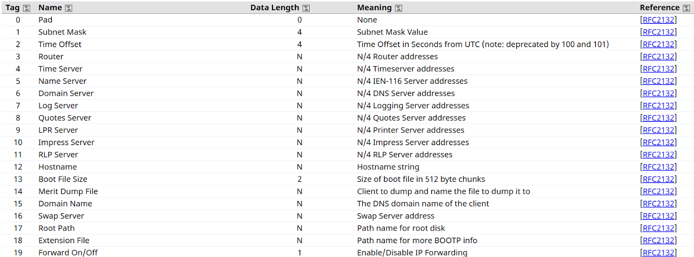
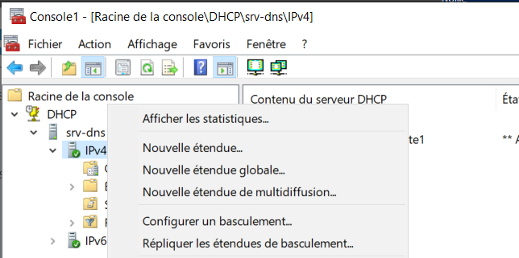
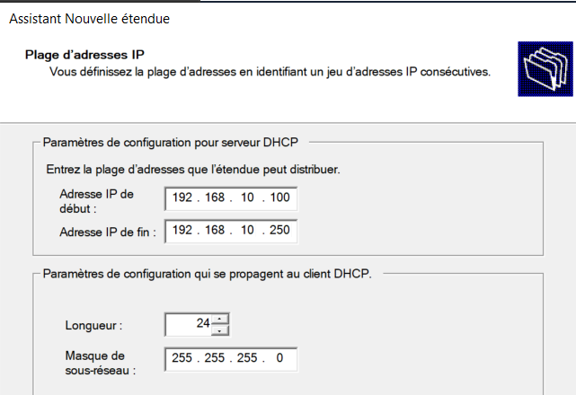
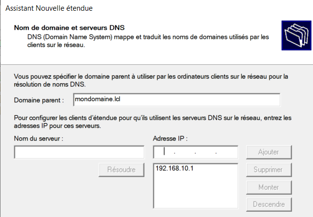
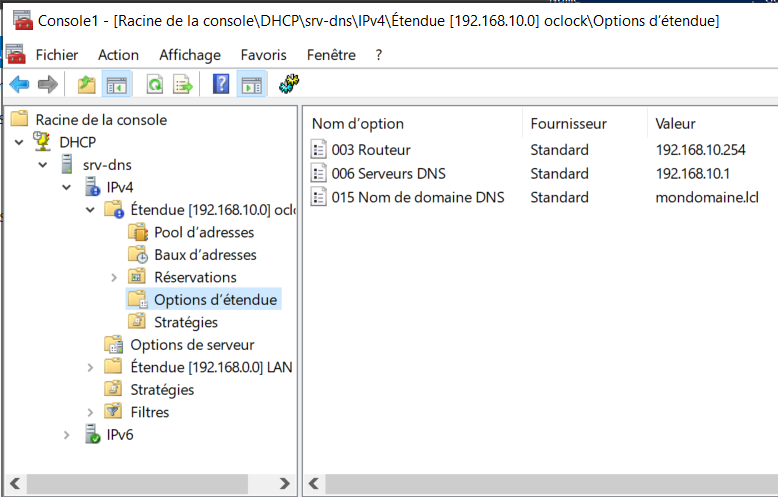
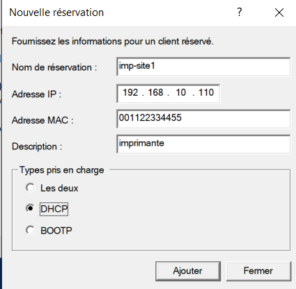

:titre: Service DHCP
:module: Réseau
:duree: 120
:description: Comment installer et configurer un serveur DHCP sur Windows Server
include::../../../../adoc/libs/header-module.adoc[]

ifeval::["{visible-on-html}" !=  "yes"]
:docinfo: shared
:docinfodir: ../../../../adoc/libs
endif::[]

== Objectifs pédagogiques

// tag::objectifs[]
* Comprendre les options et le fonctionnement du service DHCP
* Installer et configurer le service DHCP
* Gérer et optimiser le service DHCP
// end::objectifs[]

// tag::deroulement[]

== Présentation

Le serveur DHCP permet d’assurer la configuration IP automatique pour les appareils connectés (PC, smartphones, imprimantes réseau).

**Configuration IP inclut :**

Adresse IP - Masque de réseau - Passerelle - Adresse de DNS

=== Processus d’attribution

* La machine envoie un **DHCP DISCOVER**.
* Le serveur DHCP répond par un **DHCP OFFER**.
* La machine envoie un **DHCP REQUEST**.
* Le serveur confirme par un **DHCP ACK**.

Les échanges reposent sur le protocole UDP, via les ports suivants :

* Coté client le port (source) : 68
* Le serveur est à l’écoute sur le port : 67

=== Bail IP

* Durée du bail (ex. 7 jours).
* Libération de l'IP si la machine quitte le réseau.

**Relais DHCP** : Pour fournir des configurations IP à plusieurs réseaux.

== Options DHCP

Au cœur des échanges entre le client et le serveur il y a les options 

* déterminent les informations transmises par le serveur au client et inversement 

caractérisées par : 

* Un identifiant (valeur comprise entre 0 et 221) 
* Un nom
* Une description

include::../../../../adoc/libs/slide-notitle.adoc[]

La liste exhaustive des Options  est disponible sur le site de l’IANA : 

https://www.iana.org/assignments/bootp-dhcp-parameters/bootp-dhcp-parameters.xhtml[Dynamic Host Configuration Protocol (DHCP) and Bootstrap Protocol (BOOTP) Parameters]

== Positionnement des options DHCP

Les options sont configurées sur un serveur DHCP selon plusieurs niveaux

* Globalement au niveau du service 
* Sur un réseau ou une étendue 
* Sur une réservation donnée 
* Le choix du positionnement détermine quels clients la récupéreront 
* Si une même option est définie avec des valeurs différentes à plusieurs niveaux, c’est la valeur appliquée au plus près de l’objet qui l’emporte. 

== Mise en place du service

Sur Windows la mise en place du DHCP se fait par l’ajout d’un rôle serveur 

[cols="1,1"]
|===

a|
Installation du rôle 

* Ouvrez la console **Gestionnaire de serveur**. / **Ajouter des rôles et des fonctionnalités**.
* Ajouter le rôle DHCP 
* Terminer l’assistant 
a| image::./assets/04-dhcp.png[]

|===

== Gestion du service

La gestion du service peut être réalisée via sa console de gestion accessible soit : 

* via le gestionnaire de serveur dans les outils
* en ajoutant le composant enfichable DHCP dans la console MMC
* Les options devant s’appliquer à tous les clients sont configurées au niveau du protocole en Options de serveur 
* A chaque réseau à desservir est associée une étendue
* Les réservations sont associées à une étendue Sous Windows 

include::../../../../adoc/libs/slide-notitle.adoc[]

[cols="1,1"]
|===
a| image::./assets/05-dhcp.png[]
a| image::./assets/05-dhcp-2.png[]
|===

== Créer une étendue DHCP

Une étendue DHCP va permettre de déclarer une plage d'adresses IP que le serveur DHCP peut distribuer aux postes clients qui se connectent au réseau.

Un serveur DHCP peut contenir plusieurs étendues et distribuer des adresses IP sur des réseaux différents du sien, mais ceci implique l'utilisation de la fonctionnalité relais DHCP.

include::../../../../adoc/libs/slide-notitle.adoc[]

Dans la console DHCP, effectuez un clic droit sur "IPv4" puis sur "Nouvelle étendue".

include::../../../../adoc/libs/slide-notitle.adoc[]

Dans l’assistant de configuration qui s’ouvre définir les éléments suivants : 

* Nom de l’étendue ; Ce nom sera affiché dans la console DHCP
* Plage d'adresses IP : Plage IP de distribution aux clients DHCP avec le masque de sous-réseau.

=== Ajout d'exclusions et de retard

Permet d’exclure certaines adresses IP de la plage définie précédemment.

[cols="1,1"]
|===
a| Exemple nous souhaitons exclure les @IP 200 à 210 déjà utilisée par des imprimantes.
a| La durée du bail correspond à la durée pendant laquelle le client pourra bénéficier de l'adresse IP fournie par le serveur DHCP. valeur par défaut 8 jours

a| image::./assets/06-dhcp-4.png[]
a| image::./assets/06-dhcp-5.png[]
|===

include::../../../../adoc/libs/slide-notitle.adoc[]

[cols="1,1"]
|===
a| Configuration des paramètre DHCP : permettre de définir des paramètres supplémentaires comme l'attribution d'une passerelle et d'un DNS.
a| Routeur (passerelle par défaut) : passerelle par défaut qui sera configurée sur les postes clients

a| image::./assets/06-dhcp-6.png[]
a| image::./assets/06-dhcp-7.png[]
|===

=== Nom de domaine et serveurs DNS

* Vous pouvez spécifier le nom de domaine Active Directory dans la zone **Domaine parent**
* indiquez le ou les serveurs DNS à distribuer à vos clients. 
* Si l'étendue est à destination des postes de travail de votre organisation, 
** spécifier les adresses IP de vos contrôleurs de domaine pour que la résolution de noms sur votre nom de domaine soit opérationnelle.

include::../../../../adoc/libs/slide-notitle.adoc[]

**La résolution WINS**  ; étant obsolète, il n'est pas nécessaire de renseigner un serveur. Laissez vide et poursuivez.

=== Activer la zone

dans notre console de gestion  on retrouve l’étendue et les options DHCP configurées

il ne reste plus qu'à effectuer un test avec un client configurer en DHCP 

== Réservation DHCP

Une réservation DHCP assure qu’un client obtienne toujours la même adresse IP

pour faire une réservation il faut fournir : 

* un nom pour la réservation
* l'adresse IP à réserver 
* l'adresse MAC associée.  ATTENTION au format de l'adresse MAC, retirez tous les séparateurs habituels, notamment ":" et "-". 
* Pour les "Types pris en charge", choisissez "DHCP". 
* Le choix "BOOTP" fait référence à un protocole d'amorçage pour faire démarrer des machines sur le réseau, notamment pour le déploiement d'une image.

include::../../../../adoc/libs/slide-notitle.adoc[]

// tag::demo[]

== Démonstration

[NOTE.speaker]
--
Montrer la mise en place et la configuration d’un serveur DHCP
--

// end::demo[]

// end::deroulement[]

== Conclusion
// tag::conclusion[]
* Compréhension des options et du fonctionnement du service DHCP
* Capacité à installer et configurer le service DHCP
* Connaissance de la gestion et de l'optimisation du service DHCP
// end::conclusion[]