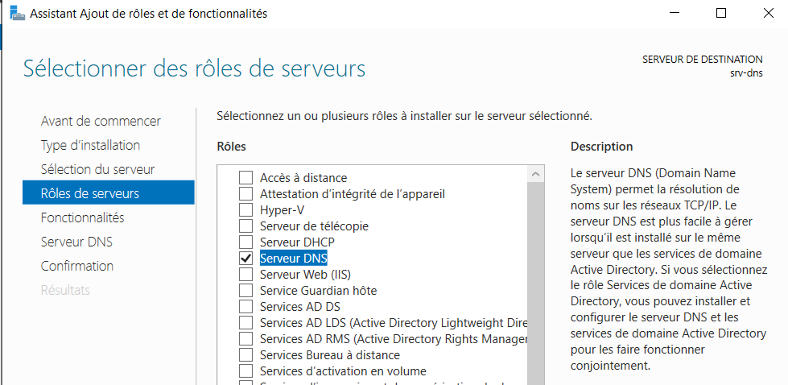

:titre: Installation DNS sur Windows
:module: Réseau
:duree: 90
:description: Comment installer et configurer un serveur DNS sur Windows Server
include::../../../../adoc/libs/header-module.adoc[]

ifeval::["{visible-on-html}" !=  "yes"]
:docinfo: shared
:docinfodir: ../../../../adoc/libs
endif::[]


== Objectifs pédagogiques

// tag::objectifs[]
* Installer et configurer le rôle DNS sur Windows Server
* Créer et gérer différentes zones de recherche DNS
* Assurer la maintenance et la gestion des zones DNS
// end::objectifs[]

// tag::deroulement[]

== Mise en place du rôle DNS

Sur Windows la mise en place du DNS se fait par l’ajout d’un rôle serveur 

=== Installation du rôle

* Ouvrez la console Gestionnaire de serveur. / Ajouter des rôles et des fonctionnalités.
* Cochez la case Serveur DNS puis cliquez sur le bouton Ajouter des fonctionnalités dans la fenêtre qui s’affiche.



Le rôle est maintenant installé mais n’est pas opérationne. Il est nécessaire de le configurer 

== Création d'une zone de recherche directe

Les zones de recherche directe se charge de la résolution des noms en adresses IP. 

La création de zone nécessite l’appartenance de l’opérateur au groupe Administrateurs.

=== Mise en place

* Ouvrez la console DNS.
* Déroulez `srv-dns` puis **Zones de recherche directes**.
* clic droit sur le dossier **Zones de recherche directes** puis sélectionnez **Nouvelle zone**.

Trois types de zones peuvent être créés :

* **Zone primaire** : le serveur peut modifier les enregistrements de sa zone, il a des accès en lecture et en écriture aux enregistrements.
* **Zone secondaire** : ce type de zone est une copie d’une zone primaire. Le serveur ne peut pas modifier les enregistrements contenus dans la zone. Son but est de répondre aux requêtes faites par les clients.
* **Zone de stub** : la zone contient uniquement les enregistrements SOA, NS et A des serveurs DNS responsables de la zone.

== Création d’une zone de recherche directe secondaire

* Dans l’assistant, sélectionnez **Zone secondaire** et cliquez sur **Suivant**.
* **Entrez le nom de la zone**, ici `Formation.local`, puis cliquez sur **Suivant**.
* Dans le champ **Serveur maître**, entrez l’adresse IP du serveur ayant autorité sur la zone 

**Remarque** : Si un message d’erreur de transfert de zone s’affiche, configurez les transferts de zone sur le serveur maître.

=== Configuration des Transferts de Zone

Pour les zones non intégrées à Active Directory, les transferts de zone doivent être configurés manuellement.

* Sur le serveur **DNS primaire (AD)**, ouvrez la **console DNS**.
* Faites un clic droit sur la zone `Formation.local` et sélectionnez **Propriétés**.
* Allez dans l’onglet **Transferts de zone**.
* Cochez **Autoriser les transferts de zone** et sélectionnez **Uniquement vers les serveurs suivants**.
* Cliquez sur **Modifier** et ajoutez l’adresse IP du serveur secondaire

== Création d’une zone de recherche directe principale

Une zone principale permet la gestion des enregistrements DNS en lecture et en écriture, souvent utilisée pour les zones intégrées à Active Directory.

* Sur le serveur, ouvrez la **console DNS**.
* créer une **Nouvelle zone**.
* Choisissez **Zone principale** et laissez les paramètres par défaut.
* Sélectionnez la réplication vers **tous les serveurs DNS dans le domaine** 
* Entrez le nom de la zone, par exemple `Forms.msft`, puis cliquez sur **Suivant**.
* Choisissez **N’autoriser que les mises à jour dynamiques sécurisées** pour améliorer la sécurité.

=== Création d’une Zone de Recherche Inversée

Les zones de recherche inversée permettent de résoudre une adresse IP en nom d’hôte.

* Ouvrez la **console DNS**.
* Dans **Zones de recherche inversée**, faites un clic droit et sélectionnez **Nouvelle zone**.
* Dans le champ **ID réseau**, entrez l’adresse réseau (ex: `192.168.1` pour le sous-réseau `192.168.1.0/24`).
* Activez uniquement les **mises à jour dynamiques sécurisées**.

=== Création d’une Zone GlobalNames

La zone GlobalNames facilite la résolution de noms simples (non qualifiés) sans recours à WINS.

* Dans la **console DNS**, créez une **Nouvelle zone** sous **Zones de recherche directes**.
* Sélectionnez **Zone principale** et laissez la zone intégrée à AD avec une réplication vers **tous les serveurs DNS de la forêt**.
* Nommez la zone **GlobalNames**.
* Sélectionnez **Ne pas autoriser les mises à jour dynamiques**.
* Cliquez sur **Terminer**.

include::../../../../adoc/libs/slide-notitle.adoc[]

* Pour activer la prise en charge de la zone GlobalNames, ouvrez une **invite de commandes** en tant qu’administrateur et exécutez :

```sh
dnscmd [servername] /config /enableglobalnamessupport 1
```

// tag::demo[]

== Démonstration

[NOTE.speaker]
--
configurer un serveur DNS sur Windows Serveur 

montrer les différents menu de la console DNS
--

// end::demo[]

// end::deroulement[]

== Conclusion
// tag::conclusion[]
**Types de Zones :**

* **Primaire** : Modifiable, accès en lecture/écriture.
* **Secondaire** : Copie en lecture seule d'une primaire.
* **Stub** : Contient seulement les enregistrements essentiels (SOA, NS, A).

**Création de Zones :**

* **Recherche directe** : Conversion de noms en IP (primaire ou secondaire).
* **Recherche inversée** : Conversion IP en noms.
* **GlobalNames** : Permet la résolution de noms simples pour remplacer partiellement WINS.

include::../../../../adoc/libs/slide-notitle.adoc[]

**Réplication des Zones :**

* **Avec AD** : Automatique pour zones intégrées.
* **Transfert de zone manuel** : Pour zones non intégrées, nécessite configuration.

**Commandes Clés :**

* **dnscmd** : Active GlobalNames sur chaque serveur DNS pour résoudre des noms statiques.
// end::conclusion[]