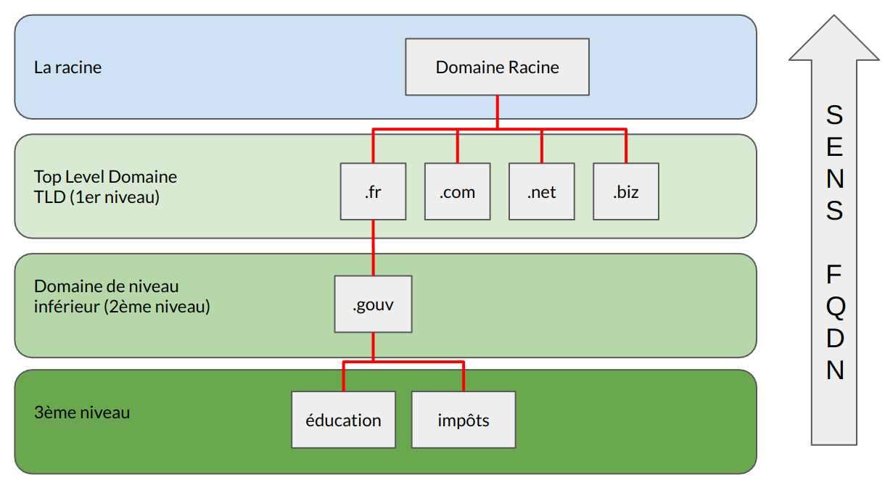
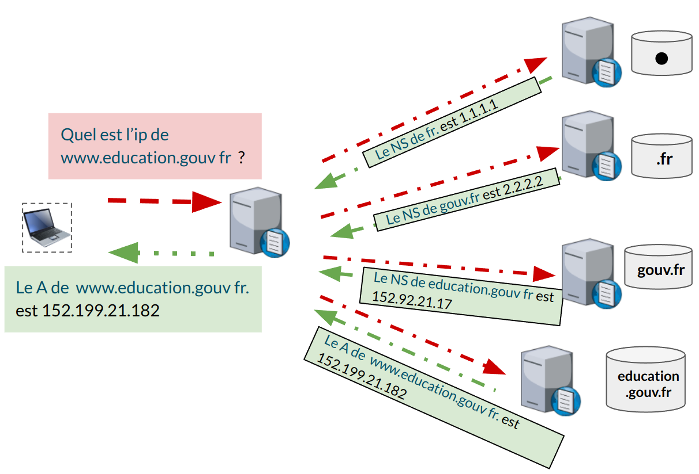
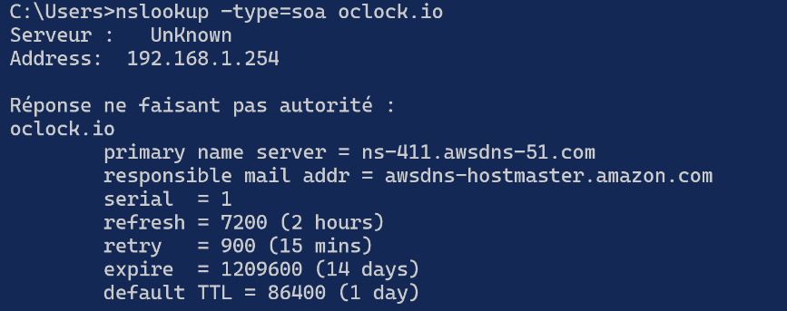
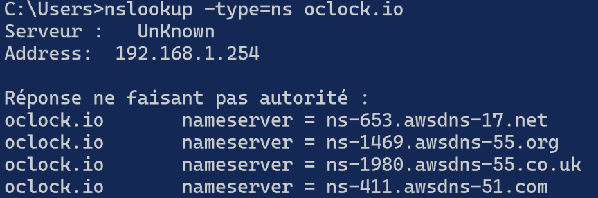
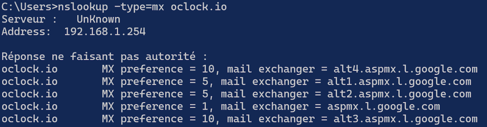

:titre: DNS
:module: Réseau
:duree: 90
:description: Ce module est consacré à la résolution de noms de domaine (DNS). Nous aborderons les principes de fonctionnement du DNS, les types de requêtes, et les bonnes pratiques pour garantir la disponibilité et la sécurité du système de résolution de noms.
include::../../../../adoc/libs/header-module.adoc[]

ifeval::["{visible-on-html}" !=  "yes"]
:docinfo: shared
:docinfodir: ../../../../adoc/libs
endif::[]

== Objectifs pédagogiques

// tag::objectifs[]
* Comprendre le fonctionnement et la hiérarchie DNS
* Maîtriser les types et mécanismes de requêtes DNS
* Configurer les zones DNS et les enregistrements
// end::objectifs[]

// tag::deroulement[]

== La résolution de nom DNS

DNS (Domain Name System) :  permet d'associer des noms de domaine ou d’hôtes  à des adresses IP.

=== Le cache DNS

* Contient des correspondances entre des noms d’hôtes déjà résolus et leurs adresses IP
* Il conserve aussi les réponses négatives aux requêtes du client. Il se gère avec la commande ipconfig.

=== Le service DNS

Les clients DNS interrogent leur(s) serveur(s) DNS pour leurs requêtes de résolution.

=== Le fichier hosts

Les modifications effectuées dans ce fichier (ajout et suppression d’entrées) sont reportées dans le cache DNS dès l’enregistrement du fichier.

== Hôtes et domaines

DNS permet la résolution de **noms d’hôtes pleinement qualifiés** (ou **FQDN** pour **F**ully **Q**ualified **D**omain **N**ame) en adresse IP.

[cols="1,1"]
|===

a| image::./assets/02-hotes.png[]
a| 
* **pc1 = nom d’hôte**
* **local.fr = nom de domaine**
* **pc1.local.fr = FQDN**

|===

=== Les noms de domaines

* Partie commune à plusieurs hôtes d’un espace de noms.
* Le nom pleinement qualifié unique à l’échelle mondiale.Pour que l’hôte soit visible par d’autres hôtes d’un autres espaces de noms. 

Il y a deux manières d’utiliser les espaces de noms :

* Usage privé : pour avoir un espace de nom interne uniquement.
* Usage public : référencé vers l'extérieur  sur Internet.

== Hiérarchisation des domaines

Le  DNS utilise un espace de nom hiérarchique

tous les espaces de noms respectent cette hiérarchie 

include::../../../../adoc/libs/slide-notitle.adoc[]

Construction FQDN : education.gouv.fr

== Type de DNS

=== DNS Type : DNS Résolveur et DNS hébergeur

* La résolution de noms externes à notre organisation nécessite un serveur DNS résolveur.
* La mise en place d’un service de nommage interne (AD) nécessite un serveur DNS hébergeur.
* Le résolveur et l’hébergeur peuvent être cumulés sur le même serveur ou sur 2 serveurs distincts 

ces deux types de serveurs interagissent pour traiter les requêtes des utilisateurs

Une bonne gestion  permet d’améliorer l'efficacité du réseau et l'expérience utilisateur.

=== Le  DNS résolveur : 

* Traite les requêtes des utilisateurs pour résoudre les noms de domaine en adresses IP.
* Ne gère pas d’espace de nom
* Agit comme intermédiaire entre l'utilisateur et les serveurs DNS hébergeurs.

== Interrogation DNS

Deux types de requêtes peuvent être adressés à un serveur DNS :

* Les requêtes **récursives** :
** Le serveur qui répond doit fournir une **réponse complète** 
* Les requêtes **itératives** :
** Le serveur qui envoie la requête accepte **une réponse partielle** à la question posée.
** La réponse sera **une indication** lui permettant d’avancer dans son processus de résolution.

=== Requêtes récursives

include::../../../../adoc/libs/slide-notitle.adoc[]

== Redirection DNS

Une redirection DNS est un mécanisme qui permet à un serveur DNS génere sa réponse aux requêtes en s'appuyant sur d'autres serveurs DNS. 

Ce processus est essentiel pour optimiser la gestion des requêtes et la distribution de charge sur les réseaux étendus.

=== Redirection non conditionnelle :

* sans configuration particulière le serveur DNS interroge directement les serveurs DNS racine ou supérieurs pour résoudre les requêtes de ses clients.
* souvent notre FAI

=== Redirection conditionnelle :

* Un serveur DNS peut être configuré pour faire appel à des **redirecteurs ciblés** pour des **espaces de noms identifiés**. Il s’agit de **redirecteurs conditionnels**.
* Résoudre des espaces de noms privés non référencés et non résolvables dans l’arborescence d’espaces de
* noms publics.

== Mise en cache DNS

Lorsqu'un serveur DNS résout une requête, 

* il stocke le résultat dans son cache local. 
* permet de répondre plus rapidement aux futures requêtes 
* pendant la période définie par le TTL (Time To Live).
* Les réponses négatives sont également mises en cache pour éviter de répéter des requêtes infructueuses,

=== Gestion du TTL

* Le TTL est une valeur en secondes qui détermine le temps qu’une entrée reste dans le cache DNS avant d'être rafraîchie ou supprimée. 
* Une gestion efficace du TTL peut réduire la charge sur les serveurs DNS et améliorer les performances globales du réseau.

=== Impact sur l'expérience utilisateur

Une mise en cache efficace réduit les délais de réponse pour l'utilisateur final, améliorant ainsi l'expérience utilisateur lors de l'accès à des sites Web et des services en ligne.

== DNS hébergeur

* prend en charge la gestion des enregistrements DNS pour un ou plusieurs domaines.
* Répond aux requêtes DNS en fournissant des informations sur les espaces de noms qu'il gère.
* Assure la disponibilité et l'intégrité des données DNS.
* Autorité pour le ou les espaces de noms qu’il gère
* Répondre aux requêtes pour les noms de domaine qu’il gère.
* Met à jour et maintient  les enregistrements DNS conformément aux politiques de l'organisation et aux exigences de sécurité. (type A, AAAA, MX, CNAME …)

== Zones DNS

* Une zone DNS est une partie de l'espace de noms DNS gérée par un serveur DNS particulier. 
* Chaque zone est responsable d'une section spécifique de l'arborescence DNS, comme un domaine.

=== Zone directe :

* Contient des enregistrements qui lient des noms de domaine à des adresses IP.
* enregistrements présents dans des zones directes : SOA, NS, A, AAAA, CNAME, MX, SRV

=== Zone inverse : 

* Contient des enregistrements qui mappent des adresses IP à des noms de domaine,
* facilite la vérification de l'identité d’un domaine associé à une adresse IP.
* enregistrements présents dans des zones inverses : SOA, NS, PTR

== Types d'enregistrement

=== SOA (Start of Authority)

Détaille l'autorité responsable de la zone, incluant le serveur principal, le contact administratif, et des informations essentielles sur la gestion de la zone.

=== NS (Name Server)

Indique les serveurs DNS faisant autorité pour la zone.

=== A et AAAA

Liens directs entre noms de domaine et adresses IPv4 ou IPv6.

[cols="1,1"]
|===

a| image::./assets/10-type-3.png[]
a| image::./assets/10-type-4.png[]

|===

=== MX (Mail Exchange)

Spécifie les serveurs de messagerie pour le domaine.

=== CNAME (Canonical Name)

Permet de créer des alias de noms de domaine.

=== SRV (Service)

Identifie les services spécifiques au sein du domaine et les serveurs qui les hébergent.

== Résolution des requêtes DNS

Les enregistrements DNS peuvent être statiques (fixés manuellement) ou dynamiques (mis à jour automatiquement pour refléter les changements dans le réseau).

=== Étapes détaillées de la résolution DNS :

* **Vérification d'autorité** : Le serveur DNS vérifie s'il a l'autorité pour répondre directement à la requête pour le domaine spécifié.
* **Consultation du cache** : Si la réponse n'est pas immédiatement disponible, le serveur consulte son cache pour voir si la réponse y réside déjà.
* **Utilisation des redirecteurs** : Si la réponse n'est pas dans le cache, le serveur peut utiliser un redirecteur pour déléguer la requête à un autre serveur.
* **Requête aux serveurs racine** : Si aucune réponse n'est trouvée via les redirecteurs, le serveur peut interroger les serveurs racine pour obtenir des informations sur le serveur faisant autorité pour le domaine en question.

== Transfert de zone

Processus d’échanges de données d’une zone entre un serveur maître et un serveur esclave

include::../../../../adoc/libs/slide-notitle.adoc[]

* Le serveur DNS esclave interroge le maître pour obtenir le numéro de version de la zone
* Le serveur DNS maître fournit en retour le numéro de version de la zone
* Si le numéro de version reçu est supérieur au numéro de version connu, le serveur esclave initie une requête IXFR (incrémentale) ou AXFR (complet)
* Si le transfert de zone est autorisé vers celui qui lui a adressé la requête, le serveur DNS maître répond alors en fournissant les mises à jour de la zone ou toute celle-ci

include::../../../../adoc/libs/slide-notitle.adoc[]

* C’est le serveur esclave qui interroge son serveur maître afin d’obtenir les MAJ
* Néanmoins, le serveur maître a la possibilité de prévenir les serveur esclave.
* Quand une modification est effectuée dans sa zone, le numéro de série de celle-ci est incrémenté et le serveur maître émet une requête DNS de type Notify à destination des serveurs esclaves.
* Suite à la réception de cette requête, le serveur esclave initiera le processus de transfert de zone précédemment décrit.

// end::deroulement[]

== Conclusion
// tag::conclusion[]
**DNS (Domain Name System) : **

Système de résolution qui traduit les noms de domaine en adresses IP, facilitant l'accès aux ressources réseau sans mémoriser les adresses numériques.

**Fonctionnement : **

Utilise une structure hiérarchique avec des serveurs racine, TLD (Top-Level Domain) et serveurs de noms pour fournir une résolution rapide et efficace.

include::../../../../adoc/libs/slide-notitle.adoc[]

**Types de Requêtes DNS : **

Comprend les requêtes récursives (lorsqu'un serveur demande la résolution complète) et itératives (lorsque le serveur répond avec une référence à un autre serveur).

**Enregistrements DNS : **

Comprend des types d’enregistrements comme A (adresse), MX (mail), et CNAME (alias), chacun définissant une ressource spécifique dans le réseau
// end::conclusion[]