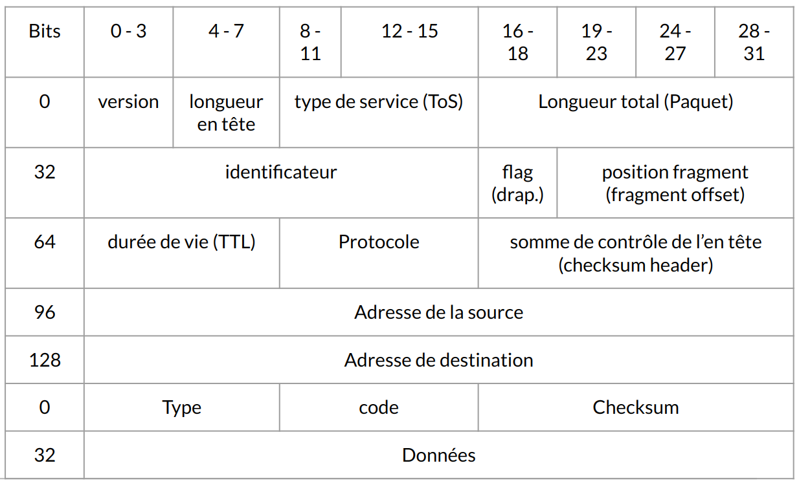
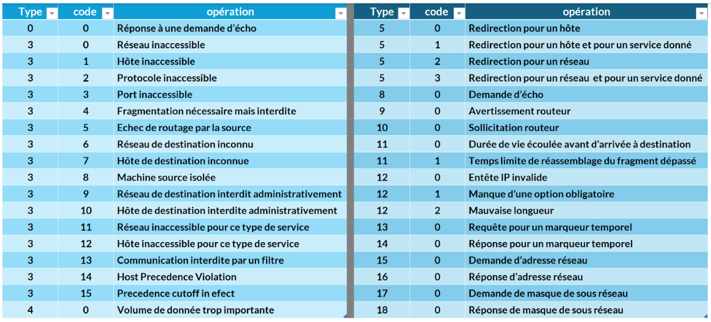

:titre: ICMP Communication
:module: Réseau
:duree: 90
:description: Comprendre le fonctionnement d'ICMP
include::../../../../adoc/libs/header-module.adoc[]

ifeval::["{visible-on-html}" !=  "yes"]
:docinfo: shared
:docinfodir: ../../../../adoc/libs
endif::[]

== Objectifs pédagogiques

// tag::objectifs[]
* Expliquer le fonctionnement du protocole ICMP, sa structure d’en-tête, et son utilisation pour le diagnostic et la gestion des réseaux IP.
* Connaître les différents types et codes ICMP (par exemple, Echo Request, Destination Unreachable) et leur rôle dans le signalement des erreurs et le contrôle des connexions réseau.
* Maîtriser les outils basés sur ICMP (tels que ping et traceroute) et les outils de surveillance réseau qui exploitent ICMP pour détecter les pannes, surveiller les performances et assurer la connectivité.
// end::objectifs[]

// tag::deroulement[]

== Protocole ICMP

ICMP Internet Control Message Protocol sert à  la gestion et le diagnostic des réseaux. 

* **Objectif Principal : **
** Mécanisme pour transmettre des informations de contrôle et des erreurs concernant les opérations de la couche réseau à d'autres nœuds du réseau.

include::../../../../adoc/libs/slide-notitle.adoc[]

* **Fonctionnement :**
** **Encapsulation dans IP** : Les messages ICMP sont encapsulés dans des paquets IP pour leur transmission.
* **Types de Messages :**
** **Messages d'erreur** :  Utilisés pour signaler des problèmes rencontrés pendant le traitement des paquets IP.
** **Messages de requête et de réponse** : Comme "Echo Request" et "Echo Reply" 

include::../../../../adoc/libs/slide-notitle.adoc[]

* **Utilisations** :
** **Diagnostic réseau** : Permet de tester la présence et de mesurer la réactivité des hôtes sur un réseau
** **Détection de routage** : déterminer le chemin pris par les paquets à travers le réseau.
* **Sécurité** :
** **Vulnérabilités** : Peut être exploité pour des attaques, notamment le déni de service (DoS) et le ping flood.
** **Mesures de protection** : Configurer le pare-feux pour bloquer ou filtrer le trafic ICMP 

include::../../../../adoc/libs/slide-notitle.adoc[]

* **Importance** :
** **Essentiel pour la maintenance du réseau** : Fournit des retours vitaux sur l'état du réseau, aidant à identifier et à résoudre les problèmes.
** **Fonctionne en arrière-plan** : Bien que les utilisateurs finaux interagissent rarement directement avec ICMP, il est fondamental pour les opérations et la gestion du réseau.

== En tête ICMP

ICMP (Internet Control Message Protocol), couche réseau OSI

Défini par les documents RFC 792 et RFC 1122

include::../../../../adoc/libs/slide-notitle.adoc[]

== Type et code ICMP

* TYPE est un octet qui indique quel est le type de message ICMP envoyé.
* CODE est un octet qui code des informations diverses.

include::../../../../adoc/libs/slide-notitle.adoc[]

La combinaison Type + Code nous permet de définir la nature de la trame ICMP

include::../../../../adoc/libs/slide-notitle.adoc[]

* Le checksum 16 bits qui permet de détecter et corriger les erreurs de transmission.
* Le champ DONNÉES correspond aux données du paquet ICMP, parfois précédées de bits de bourrage (pour que l'en-tête ICMP ait une taille fixe)

== Outils et Protocoles ICMP

=== Commandes de Base

* **Ping** : Teste la connectivité réseau via des paquets ICMP Echo Request et Echo Reply.
* **Traceroute / Tracert** : Identifie le chemin parcouru par les paquets jusqu'à une destination spécifique, en exploitant les messages ICMP Time Exceeded.
* **Ping6** : Version IPv6 de ping, utilisant ICMPv6.

=== Outils Avancés

* **MTR (My Traceroute)** : Combinaison de ping et traceroute, donnant un rapport en temps réel des réponses ICMP de chaque saut.
* **Nping** : Outil de la suite Nmap, capable d'envoyer différents types de paquets ICMP pour tester les réponses du réseau.
* **Fping** : Version de ping capable d'envoyer des requêtes ICMP Echo simultanément à plusieurs hôtes.
* **Hping3** : Outil flexible pour l'envoi de paquets ICMP (et autres types) avec de nombreuses options de personnalisation.

===  Utilitaires Spécifiques

* **Arping** : Envoie des requêtes ARP qui utilisent également ICMP pour identifier les hôtes dans un réseau local.
* **Tcptraceroute** : Utilise TCP mais peut utiliser ICMP pour tracer le chemin des paquets si les paquets TCP sont bloqués.
* **Smokeping** : Surveille la latence du réseau en utilisant ICMP pour générer des graphiques de la latence.
* **Pathping** : Outil Windows combinant les fonctionnalités de ping et traceroute pour un diagnostic réseau détaillé.

include::../../../../adoc/libs/slide-notitle.adoc[]

* **Icmpush** : Permet d'envoyer des paquets ICMP manuellement configurés.
* **IPerf/JPerf** : Bien que principalement utilisés pour tester la bande passante TCP/UDP, ils peuvent également être configurés pour tester la connectivité réseau via ICMP.
* **Scapy** : Outil puissant pour la création et l'envoi de paquets sur mesure, y compris les paquets ICMP, pour des tests avancés.

== Outils de monitoring

* **PingPlotter** : Outil qui trace le chemin des paquets vers une destination et surveille la performance du réseau, utilisant ICMP.
* **Nessus/Tenable** : Bien que principalement un scanner de vulnérabilités, il utilise des paquets ICMP pour certaines analyses de réseau.
* **Wireshark** : Capture et analyse le trafic réseau, y compris les paquets ICMP, pour le diagnostic et l'analyse de la sécurité réseau.
* **NetScanTools** : Suite d'outils pour le réseau, utilisant ICMP pour plusieurs de ses fonctions de diagnostic réseau.

// tag::demo[]

== Démonstration

[NOTE.speaker]
--
faire un ping dans packet tracer entre deux machines et montrer l’en tête icmp pour retrouver la structure énoncée à la slide 5 du module
--

// end::demo[]

// end::deroulement[]

== Conclusion
// tag::conclusion[]
Avant de s'intéresser au routage il est important  de bien appréhender comment fonctionne la communication de deux machines qui sont soit sur le même segment réseau soit sur des segments différents .
// end::conclusion[]