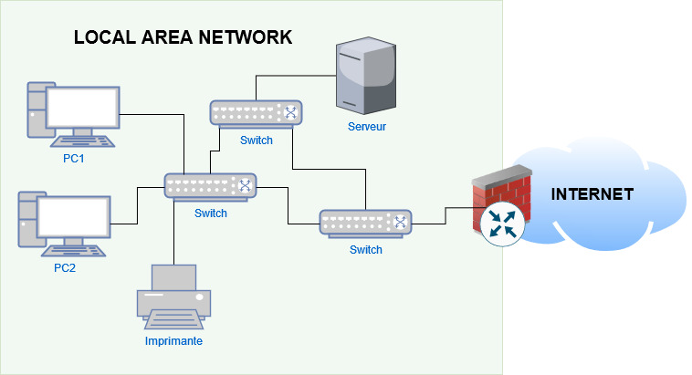
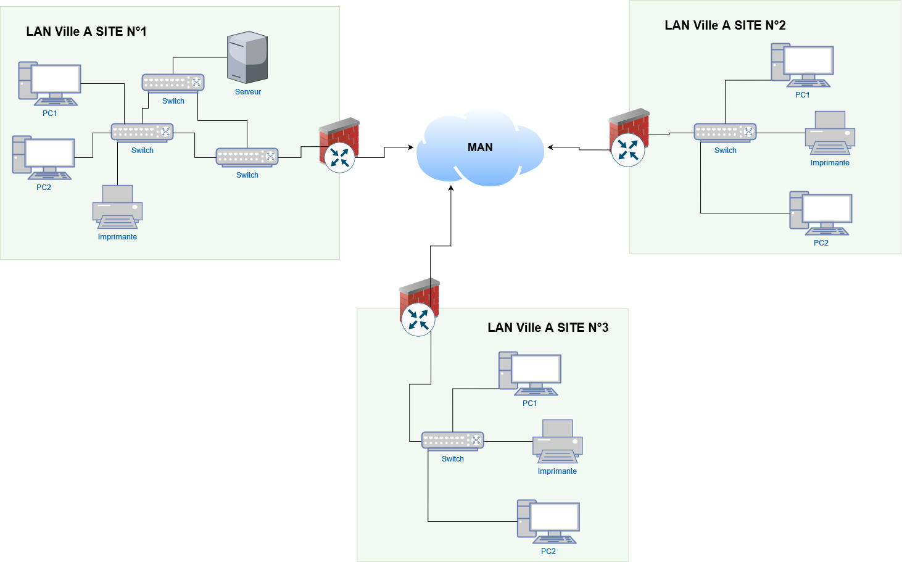
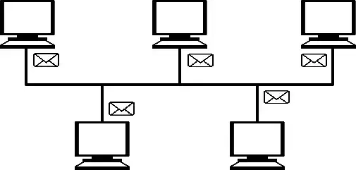
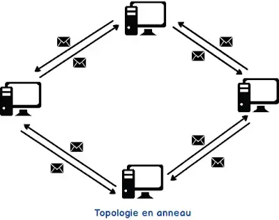
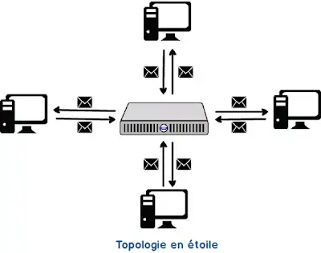
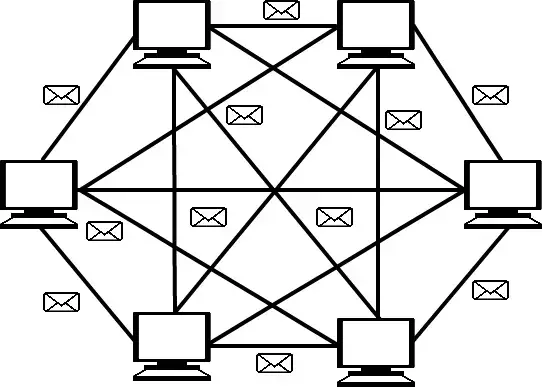

:titre: Introduction aux réseaux
:module: Réseau
:duree: 90
:description: Cours d'introduction aux réseaux informatiques
include::../../../../adoc/libs/header-module.adoc[]

ifeval::["{visible-on-html}" !=  "yes"]
:docinfo: shared
:docinfodir: ../../../../adoc/libs
endif::[]

== Objectifs pédagogiques

// tag::objectifs[]
* Définir ce qu’est un réseau informatique et expliquer son importance dans le partage de ressources et la communication entre dispositifs.
* Identifier les grandes étapes de l’évolution des réseaux informatiques, en comprenant les principales avancées technologiques et leur impact.
* Décrire et distinguer les types de réseaux en fonction de leur échelle : LAN (Local Area Network), MAN (Metropolitan Area Network), et WAN (Wide Area Network).
* Comprendre les principales topologies réseau (Linéaire/Bus, Anneau, Étoile, Maillée), et identifier leurs avantages, limitations, et contextes d’utilisation.
// end::objectifs[]

// tag::deroulement[]
== Qu'est-ce qu'un réseau informatique ?

Un réseau informatique est un ensemble d'ordinateurs, de serveurs, de périphériques réseau, et autres appareils interconnectés afin de partager des informations et des ressources. Un réseau peut être constitué de quelques ordinateurs dans un bureau ou de millions de systèmes connectés à travers le monde.

=== Exemple de réseaux locaux :

* Le réseau d’une entreprise qui permet de partager des fichiers, des imprimantes, des scanners.
* Le réseau domestique, qui permet de connecter des ordinateurs, des smartphones et des télévisions intelligentes à Internet.

=== Exemple de réseaux étendus :

Le réseau global Internet, qui connecte des millions de réseaux locaux à travers le monde.

== Pourquoi utiliser des réseaux informatiques ?

* **Partage de ressources** : Une imprimante, un scanner, ou un disque dur externe peut être partagé entre plusieurs ordinateurs d'un réseau.
* **Communication** : Les réseaux permettent aux utilisateurs de communiquer entre eux via divers moyens : emails, chats, conférences audio/vidéo.
* **Partage de données** : Les fichiers peuvent être stockés sur un serveur central accessible à tous les utilisateurs du réseau.
* **Gestion centralisée et sécurité** : Les administrateurs réseau peuvent gérer l'accès aux ressources, appliquer des règles de sécurité (pare-feu, restrictions d'accès), et surveiller l'activité du réseau.

== Histoire des réseaux

* **Années 1960** : Naissance d'ARPANET, précurseur d'Internet, un réseau développé par le département de la Défense des États-Unis pour la communication entre chercheurs.
* **Années 1980** : L’émergence des LAN (Local Area Networks) permet de connecter des ordinateurs dans des bureaux ou des écoles.
* **Années 1990** : Explosion d'Internet avec le World Wide Web, révolutionnant les communications et l'accès aux informations.
* **Aujourd’hui** : Les réseaux sont omniprésents avec la montée des réseaux sans fil et de l’Internet des objets (IoT).

== Types de réseaux selon la portée

=== LAN (Local Area Network)

Réseau qui couvre une petite zone géographique, généralement un bâtiment ou un groupe de bâtiments.

**Caractéristiques** : Hautes vitesses de transfert, faible latence, contrôle et gestion simplifiés.

=== MAN (Metropolitan Area Network)

Réseau couvrant une zone géographique plus grande qu'un LAN, comme une ville entière.

**Caractéristiques** : Vitesse modérée, gère plusieurs LAN dans des zones proches.

=== WAN (Wide Area Network)

Réseau couvrant une large zone géographique, reliant des villes, des pays, voire des continents.

**Caractéristiques** : Vaste portée géographique, gestion complexe, souvent plus lent qu’un LAN.

=== WLAN (Wireless LAN)

Réseau local sans fil permettant de connecter des appareils sans câble, généralement via Wi-Fi.

**Caractéristiques** : Mobilité accrue pour les utilisateurs, mais vulnérable aux interférences et aux problèmes de sécurité.

== LAN - Local Area Network

Un LAN est un réseau couvrant une zone géographique restreinte comme une maison, un immeuble ou un campus d'entreprise. Il permet de connecter des ordinateurs et autres dispositifs en vue de partager des ressources.

=== Avantages :

* **Hautes performances** : Les LANs sont souvent très rapides grâce à la faible distance entre les dispositifs (jusqu'à 1 Gbps ou plus).
* **Sécurité contrôlée** : Le contrôle d'accès est facile à gérer dans un LAN.

include::../../../../adoc/libs/slide-notitle.adoc[]

== MAN - Metropolitan Area Network

Un MAN est un réseau couvrant une zone géographique plus large qu'un LAN (Local Area Network) mais plus petite qu'un WAN (Wide Area Network), généralement une ville ou une grande agglomération. Il est utilisé pour interconnecter plusieurs LANs situés dans une même région métropolitaine.

=== Avantages

* **Interconnexion à l'échelle urbaine** : Relier les réseaux locaux de différentes entités dans une même ville.
* **Haute vitesse** : Débits plus rapides et plus fiables que les WANs grâce à l'utilisation de la fibre optique ou de connexions dédiées.

include::../../../../adoc/libs/slide-notitle.adoc[]

== WAN - Wide Area Network

Un WAN est un réseau qui s'étend sur de grandes distances géographiques, parfois au niveau d'une nation ou d’un continent. Les WANs relient plusieurs réseaux locaux (LANs) ensemble.

=== Avantages

* **Connectivité mondiale** : Les WANs permettent la communication entre des utilisateurs situés dans différentes parties du monde.
* **Accès aux ressources à distance** : Un employé peut accéder à distance aux fichiers de son entreprise grâce à un WAN.

=== Exemples de réseaux WAN :

* Internet est le WAN le plus connu, reliant des millions de réseaux locaux.
* Une entreprise multinationale utilisant un WAN pour connecter ses bureaux situés dans différentes villes ou pays.

== Topologie réseau

Une topologie de réseau désigne la manière dont les différents composants d'un réseau (périphériques, câbles, routeurs, etc.) sont physiquement ou logiquement interconnectés.

Le choix de la topologie dépend des besoins en performance, coût, et redondance.

=== Importance des topologies

La structure d'un réseau influe sur la manière dont les données circulent, sur la gestion du trafic, sur les performances globales du réseau ainsi que sur sa tolérance aux pannes.

=== Topologies physiques versus logiques

* **Topologie physique** : Représente la disposition réelle des câbles et des périphériques.
* **Topologie logique** : Désigne le flux des données à travers le réseau, qui peut différer de la topologie physique.

== Topologie linéaire (Bus)

Tous les nœuds sont connectés à un câble unique. Avantages : simplicité, faible coût. Inconvénients : collisions fréquentes, faible redondance.

== Topologie en anneau 

Chaque nœud est connecté à deux autres, formant un cercle. Avantages : transmission ordonnée, possibilité de redondance.   Inconvénients : panne d’un nœud peut affecter tout le réseau.

== Topologie en étoile

Tous les nœuds sont reliés à un commutateur central. Avantages : tolérance aux pannes, facilité de gestion. Inconvénients : point de défaillance central, coût élevé.

== Topologie maillée

Chaque nœud est connecté à plusieurs autres. Avantages : haute redondance et fiabilité. Inconvénients : coûts élevés et gestion complexe.

// end::deroulement[]

== Conclusion
// tag::conclusion[]
* Connaître les différents types de réseaux (LAN, MAN, WAN, WLAN).
* Apprendre les topologies réseau : étoile, bus, anneau, maillée, hybride.
* Identifier les avantages et inconvénients de chaque topologie.
* Savoir comment implémenter une topologie en étoile dans Packet Tracer.
// end::conclusion[]