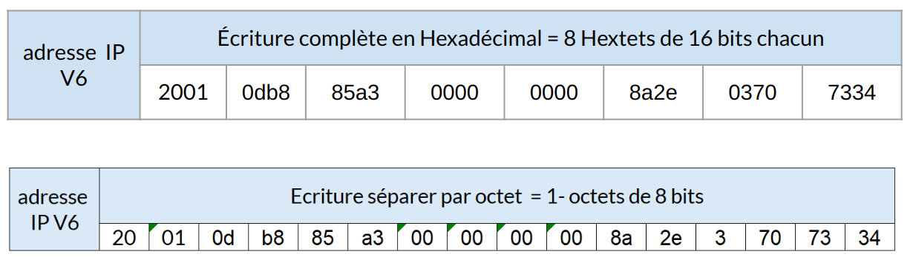
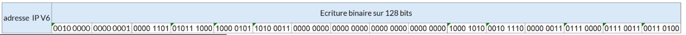
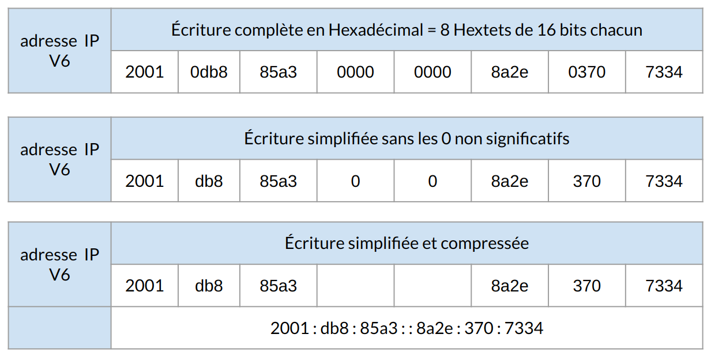
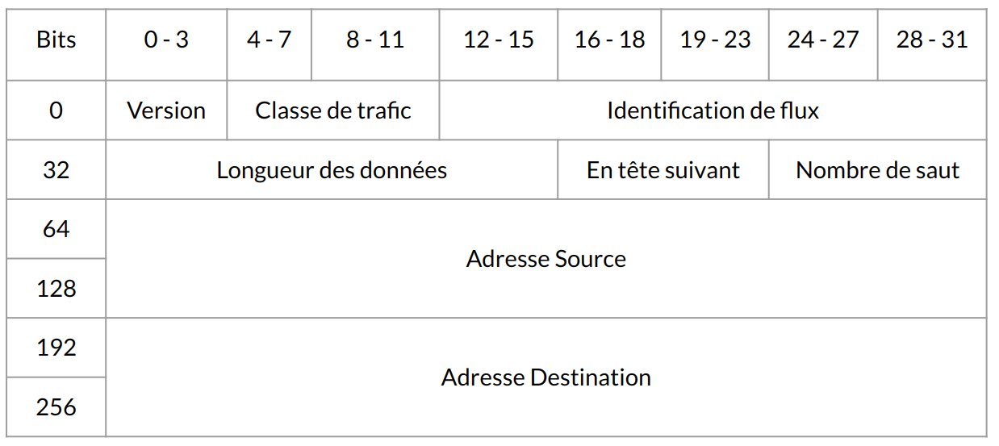
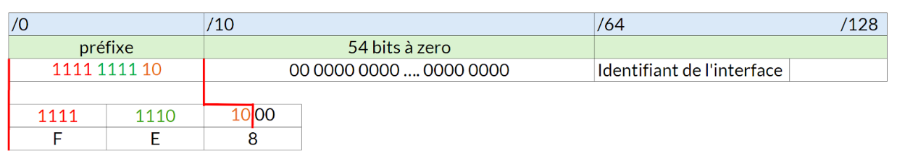
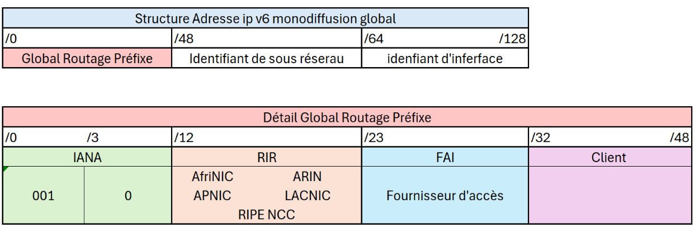
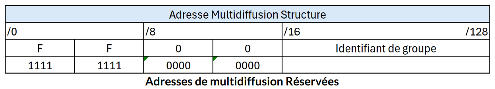

:titre: IPv6
:module: Réseau
:duree: 90
:description: Comprendre le fonctionnement d'IPv6
include::../../../../adoc/libs/header-module.adoc[]

ifeval::["{visible-on-html}" !=  "yes"]
:docinfo: shared
:docinfodir: ../../../../adoc/libs
endif::[]

== Objectifs pédagogiques

// tag::objectifs[]
* Expliquer le format d'IPv6, sa structure étendue, les simplifications d’écriture, et les avantages apportés en termes de capacité d'adressage et de performance.
* Identifier les différentes adresses IPv6 (monodiffusion, multidiffusion, lien local, global unique) et utiliser la notation CIDR pour optimiser l’organisation des réseaux.
* Décrire l’en-tête simplifié d’IPv6, les préfixes particuliers pour les adresses, et les principes d'auto configuration pour les adresses de lien local, assurant une connectivité sans intervention manuelle.
// end::objectifs[]

// tag::deroulement[]

== Définition

La nouvelle génération du Protocole Internet qui remplace IPv4 pour répondre à la pénurie d'adresses IP et à d'autres limitations techniques.

=== Différences Clés:

* **Espace d'adressage** : IPv4 utilise 32 bits pour les adresses, offrant 4,3 milliards d'adresses. IPv6 utilise 128 bits, offrant environ 3.4×10383.4 \times 10^{38}3.4×1038 adresses.
* **Simplicité de configuration** : Auto-configuration sans état et avec état (SLAAC, DHCPv6).
* **Sécurité intégrée** : IPv6 a été conçu avec la sécurité à l'esprit, intégrant nativement IPSec pour le chiffrement et l'authentification.

**Importance**: IPv6 est crucial pour la croissance continue d'Internet, permettant la connectivité pour des milliards de nouveaux appareils et optimisant la performance du réseau.

== Structure IPv6

**Structure de Base** : Une adresse IPv6 est constituée de 128 bits, habituellement représentée par 8 groupes de 4 chiffres hexadécimaux.

2001 : 0db8 : 85a3 : 0000 : 0000 : 8a2e : 0370 : 7334

include::../../../../adoc/libs/slide-notitle.adoc[]

== Ecriture simplifiée

**L’écriture simplifié d’une adresse IP V6 peut être faite en supprimant les zéros initiaux de chaque bloc et les groupes de zéros **

2001 : 0db8 : 85a3 : 0000 : 0000 : 8a2e : 0370 : 7334

include::../../../../adoc/libs/slide-notitle.adoc[]

== En-tête IPv6

include::../../../../adoc/libs/slide-notitle.adoc[]

* L'entête IPV6 contrairement à IPV4 à une taille fixe de 320 bits soit 40 Octets
* **Version** :  4 bits avec le numéro de version du protocole Internet, IPv4 ou IPv6
* **Classe de trafic** :  8 bits équivalents à l’entrée ToS IPV4.

include::../../../../adoc/libs/slide-notitle.adoc[]

* **Identification du flux** : 20 bits FlowLabel, permet d’identifier les flux de données à partir de paquets de donnés en continu. 
** permet de réserver la bande passante et d’optimiser le routage. La liste suivante explique les informations d’en-tête supplémentaires du protocole IP amélioré :
* **Longueur de données** : 16 bits pour donner la taille des données utilisateur transportées, y compris l’en-tête de l’extension.
* **En-tête suivant** : 8 bits Next Header est l’équivalent de la spécification du protocole dans IPv4? affectation du protocole de transport utilisé.

include::../../../../adoc/libs/slide-notitle.adoc[]

* **Nombre de sauts** : 8 Bit Hop Limit nombre maximum de noeuds intermédiaires qu’un paquet peut traverser avant d‘être rejeté. 
** Comme pour TTL dans IPv4, la valeur est réduite d’au moins 1 pour chaque nœud. 
* **Adresse source et destination** :   128 bits, sont réservés à l’adresse IP l’hôte source et 128 bits pour l’adresse IP l’hôte cible

== Gains apportés par IPv6

* Extension significative de l'espace d'adressage :
** Globalement : offre jusqu'à 340 sextillions d'adresses.
** Dans les réseaux locaux : fournit jusqu'à 18,4 quintillions d'adresses.
* Abolition du besoin de conversion entre adresses publiques et privées grâce à la suppression du NAT.
* Elimination des adresses de diffusion (broadcast) dans le réseau.
* Optimisation des procédures de routage.

include::../../../../adoc/libs/slide-notitle.adoc[]

* Renforcement des fonctionnalités liées à la mobilité et à la sécurité des réseaux.
* Rationalisation de l'attribution des préfixes dans les adresses.
* Faculté d'assigner plusieurs adresses à une interface unique.
* Auto-configuration des adresses réseau sans recourir à DHCP.
* Mise en place de stratégies pour la transition du protocole IPv4 vers IPv6.

== IPv6 et notation CIDR

Les réseaux sont identifiés en utilisant la notation CIDR : 

* la première adresse du réseau est suivie par une barre oblique « / » 
* puis par un entier compris entre 0 et 128, lequel indique la longueur en bits du préfixe du réseau, à savoir de la partie commune des adresses déterminées par le réseau.

include::../../../../adoc/libs/slide-notitle.adoc[]

Voici des exemples d’adresses réseau IPv6 avec leurs ensembles d’adresses déterminées :

* Le préfixe 2001:db8:1f89::/48 représente l’ensemble des adresses qui commence à 2001:db8:1f89:0:0:0:0:0 et finit à 2001:db8:1f89:ffff:ffff:ffff:ffff:ffff.
* Le préfixe 2000::/3 représente les adresses de 2000:0:0:0:0:0:0:0 à 3fff:ffff:ffff:ffff:ffff:ffff:ffff:ffff.
* Le préfixe fc00::/7 représente les adresses de fc00:0:0:0:0:0:0:0 à fdff:ffff:ffff:ffff:ffff:ffff:ffff:ffff.
* Le préfixe fe80::/10 représente les adresses de fe80:0:0:0:0:0:0:0 à febf:ffff:ffff:ffff:ffff:ffff:ffff:ffff.
* Le préfixe ::1/128 correspond à la seule adresse 0:0:0:0:0:0:0:1.

== Préfixe d’adresse IPv6 particuliers

|===
| Adresse IP V6   | Description | Équivalence IP V4

| ::/0
| Représente tous les réseaux et est utilisée comme route par défaut
| 0.0.0.0/0

| ::/128
| Adresse source d’un hôte en cours d'acquisition de son adresse réseau
| 0.0.0.0

| ::1/128
| Adresse de bouclage
| 127.0.0.1

| FE80::/10
| Envoi individuel sur liaison locale
| Adresse APIPA

| FF00::/8
| Adresse multidiffusion
| 224.0.0.0/4

| FC00::/8
| Plage d'adresse privée, réservée à l'utilisation sur les réseaux locaux domestiques et d'entreprises. Doublon possible, utilisées sur plusieurs réseaux IP privés
| 10.0.0.0/8, 172.16.0.0/12, 192.168.0.0/16

| 2000::/3
| Plage d'adresse publique, routable sur Internet, globalement uniques (doublon impossible)
| 
|===

== Adresse de monodiffusion configuration automatique du lien local

* Générée de façon  dynamique par un hôte
* Permet une communication entre hôtes du même lien réseau
* Premier hextet contient « FE80 »
* Définit avec un préfixe en /10, utilisation avec un préfixe en /64
* Adresse non routable

include::../../../../adoc/libs/slide-notitle.adoc[]

== Adresse de monodiffusion Globale unique

Adresses uniques routables sur Internet (équivalent aux @IPv4 publiques)

* Ces adresses dépendent du réseau 2000 : : /3
* Le premier hextet peut prendre les valeurs de 2000 à 3FFF
* Internet en IPv6 utilise le réseau 2001 : : /3 (< 2% des adresses IPv6)

include::../../../../adoc/libs/slide-notitle.adoc[]

Préfixe de routage global

* Attribué à un client ou à un site par un fournisseur (FAI)
* Dépend de l’IANA (Internet Assigned Numbers Authority)

== Adresse de multidiffusion

Adresse de multidiffusion

* Remplacent les adresses de diffusion IPv4
* Dépendent du réseau FF00 : : /8
* De FF00 à FF0F, adresses réservées et permanentes

include::../../../../adoc/libs/slide-notitle.adoc[]

include::../../../../adoc/libs/slide-notitle.adoc[]

[cols="1,1,1"]
|===

a| **Adresse de multidiffusion de noeud local**

**FF01::1** => tous les noeuds locaux
**FF01::2** => tous les routeurs locaux
**FF01::FB** => Multidiffusion DNS

a| **Adresse de multidiffusion de lien local**

**FF02::1** => tous les noeuds du lien local
**FF02::2** => tous les routeurs du lien local
**FF02::1:2** => Serveurs et agents relais DHCP du lien local
**FF02::FB** => Multidiffusion DNS

a| **Adresse de multidiffusion de noeud local**

**FF05::2** => tous les noeuds locaux
**FF05::1:3** => Serveurs DHCP d’un site
**FF05::FB** => Multidiffusion DNS

|===

== IP V6 d’un Hôte

* Adresses IPv6 attribuées à une machine hôte :
** Une adresse de boucle locale (::1/128)
** Une adresse de monodiffusion lien-local pour chaque interface (FE80::)
** Une ou plusieurs adresses de monodiffusion unique locale(FD00::)
** Une ou plusieurs adresses de monodiffusion global unique (2000::)

=== Les adresses de multidiffusion

* L’adresse multidiffusion “tous les nœuds” de portée locale au lien (FF02::1)
* Les adresses multidiffusion de nœuds sollicités associées aux adresses unicast
* Les adresses multidiffusion des groupes auxquels l’hôte est abonné pour chaque interface

// tag::demo[]

== Démonstration

Dans packet tracer 

en mode simulation effectuer un ping entre deux machines configurées en ipV6 

@Ipv6 pc1 => 2001:db8:1:1::3 /64
@Ipv6 pc2 => 2001:db8:1:1::2 /64

montrer les filtres dans packet tracer pour ne garder que les trames icmpV6

montrer l'en tête IPV6  dans les paquets qui transite 

on peut remonter les slides “notion 4 : En tête IPV6” pour revoir la structure 

possible de le faire avec wireshark (capture ipv6 et analyse de la trame) 

// end::demo[]

// end::deroulement[]

== Conclusion
// tag::conclusion[]
**IPv6 Introduction** : IPv6, successeur d'IPv4, offre un espace d'adressage massivement étendu, des améliorations en termes de configuration automatique et de sécurité, et est essentiel pour supporter la croissance future d'Internet.

**Structure des Adresses** : Les adresses IPv6 sont longues de 128 bits, divisées en huit groupes de quatre chiffres hexadécimaux, incluant des segments pour les préfixes de routage, les identifiants de sous-réseaux, et les identifiants d'interface.

**Simplification des Adresses** : IPv6 permet la simplification des adresses par l'élimination des zéros inutiles et par l'usage de "::" pour condenser les séquences de zéros, facilitant leur utilisation.

include::../../../../adoc/libs/slide-notitle.adoc[]

**Avantages de l'IPv6** : Un espace d'adressage quasi illimité, auto-configuration sans état, sécurité intégrée via IPSec, et amélioration de la gestion de la qualité de service (QoS).

**Types d'Adresses** : IPv6 inclut des adresses de monodiffusion pour des communications directes, des adresses de multidiffusion pour les transmissions de groupe, et des adresses d'anycast pour la connexion à l'interface la plus proche.
// end::conclusion[]