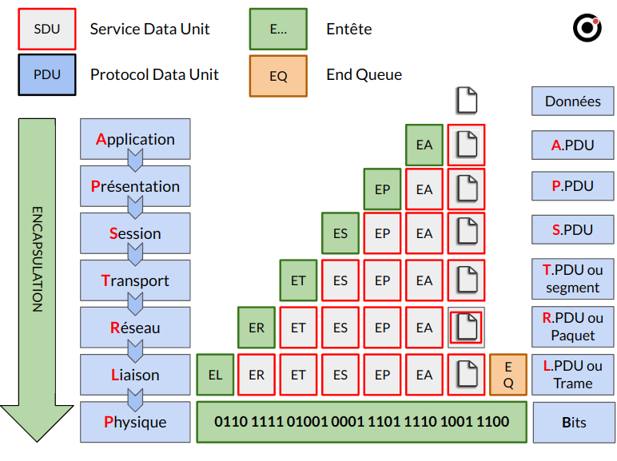
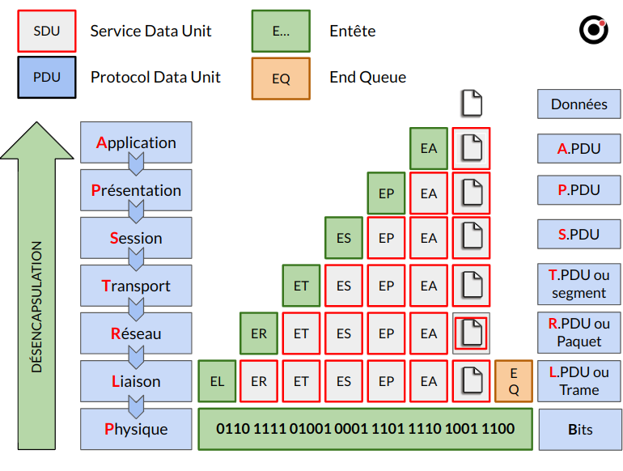

:titre: Modèle OSI
:module: Réseau
:duree: 90
:description: Maîtrise du modèle OSI et des couches du modèle OSI
include::../../../../adoc/libs/header-module.adoc[]

ifeval::["{visible-on-html}" !=  "yes"]
:docinfo: shared
:docinfodir: ../../../../adoc/libs
endif::[]

== Objectifs pédagogiques

// tag::objectifs[]
* Expliquer le rôle du modèle OSI dans la standardisation des communications réseau et sa contribution à l’interopérabilité entre systèmes.
* Identifier et décrire chacune des sept couches du modèle OSI (Physique, Liaison de données, Réseau, Transport, Session, Présentation, Application), en précisant les fonctions spécifiques de chaque couche.
* Comprendre le rôle de chaque couche 
* Expliquer le processus d’encapsulation des données lors de leur passage dans chaque couche OSI, et le processus de désencapsulation lors de la réception
// end::objectifs[]

// tag::deroulement[]

== Modèle OSI (Open Systems Interconnection)

* Présenté en 7 couches indépendantes et communicantes
* Permet la communication entre les systèmes d’information en réseau
* Gérer par l’organisme de normalisation ISO (International Organization for Standardization)

=== Protocole

* Ensemble de règles permettant la communication réseau entre systèmes d’information
* Exemple : **I**nternet **P**rotocol ( protocoles utilisés sur Internet puis dans les réseaux locaux)

=== PDU (Protocol Data Unit / Unité de données de Protocole)

* Unité de mesure des données échangées dans un réseau
* Constitué de plusieurs éléments distincts :
** Infos  de contrôle de protocole (PCI : Protocol Control Information)
** Des unités de données de service (SDU : Service Data Unit)

== Couches du modèle OSI

[cols="1,1"]
|===

a| **Couche OSI**
a| **Rôle**

a| 1 - Physique
a| Gère la transmission de données sous forme de signaux électriques, optiques ou radio

a| 2 - Liaison
a| Assure un transfert de données fiable entre deux nœuds connectés directement sur le même support.

a| 3 - Réseau
a| Gère le routage et le transfert des paquets de données entre des réseaux distincts.

|===

include::../../../../adoc/libs/slide-notitle.adoc[]

[cols="1,1"]
|===

a| **Couche OSI**
a| **Rôle**

a| 4 - Transport
a|  Fournit une communication de bout en bout fiable ou non fiable entre deux hôtes.

a| 5 - Session
a| Gère et contrôle les dialogues (sessions) entre les applications sur les hôtes.

|===

include::../../../../adoc/libs/slide-notitle.adoc[]

[cols="1,1"]
|===

a| **Couche OSI**
a| **Rôle**

a| 6 - Présentation
a| Assure l’indépendance des données, la traduction, le chiffrement et la compression des données pour la couche application.

a| 7 -  Application
a| Fournit des services de communication réseau directement aux applications de l'utilisateur.

|===

== Couche 1 : Physique

**Son rôle** : Gérer la transmission de données sous forme de signaux électriques, optiques ou radio.

=== Ses fonctions

* **Codage des signaux** : Convertir les bits numériques en signaux physiques pour le support de transmission.
* **Débits de données** : Définir les taux de transmission, synchronisation des bits et modulation.
* **Spécifications matérielles** : Définir les caractéristiques électriques, mécaniques (connecteurs, brochage) et procédurales pour les supports physiques (câbles, fibres optiques, etc.).
* **Topologie physique** : Définir la configuration des liens physiques et des dispositifs connectés.

== Couche 2 : Liaison de données

**Son rôle** : Assurer un transfert de données fiable entre deux nœuds connectés directement sur le même support.

=== Ses fonctions

* **Encapsulation** : Organiser les bits en trames (frames) et ajouter des en-têtes de contrôle.
* **Adressage physique** : Utiliser des adresses MAC pour identifier les dispositifs sur un segment de réseau.
* **Contrôle d’accès au support (MAC)** : Gérer l'accès au support partagé, éviter les collisions (CSMA/CD pour Ethernet).
* **Contrôle d’erreur** : Détection et correction d'erreurs via CRC (Cyclic Redundancy Check) pour vérifier l'intégrité des trames.
* **Contrôle de flux** : Utiliser des mécanismes de contrôle de flux pour éviter la saturation du récepteur.

== Couche 3 : Réseau

**Son rôle** : Gérer le routage et le transfert des paquets de données entre des réseaux distincts.

=== Ses fonctions

* **Routage** : Déterminer le chemin optimal pour les paquets en utilisant des algorithmes de routage (OSPF, BGP).
* **Adressage logique** : Utiliser des adresses IP (IPv4/IPv6) pour identifier de manière unique les dispositifs sur un réseau.
* **Fragmentation** : Diviser les paquets en morceaux plus petits si nécessaire pour s'adapter aux MTU (Maximum Transmission Unit) des réseaux intermédiaires.
* **Gestion du trafic** : Contrôler la congestion du réseau et la qualité de service (QoS) en classant et en priorisant les paquets.

== Couche 4 : Transport

**Son rôle** : Fournir une communication de bout en bout fiable ou non fiable entre deux hôtes.

=== Ses fonctions

* **Segmentation et réassemblage** : Diviser les données en segments et les réassembler à la destination.
* **Contrôle de flux** : Gérer le débit de données pour éviter l'engorgement, à l'aide de protocoles comme TCP (fenêtrage glissant).
* **Contrôle d’erreur** : Utiliser des numéros de séquence et des accusés de réception pour assurer la livraison fiable des segments (TCP).
* **Multiplexage/démultiplexage** : Gérer les ports pour identifier les différentes applications (via les numéros de ports TCP/UDP).
* **Protocoles principaux** : TCP (Transmission Control Protocol) pour la communication fiable, UDP (User Datagram Protocol) pour la communication non fiable.

== Couche 5 : Session

**Son rôle** : Gérer et contrôler les dialogues (sessions) entre les applications sur les hôtes.

=== Ses fonctions

* **Gestion des sessions** : Établir, maintenir et terminer les sessions entre les applications.
* **Contrôle du dialogue** : Gérer les modes de communication, tels que la moitié-duplex ou le duplex intégral.
* **Synchronisation** : Ajouter des points de synchronisation dans le flux de données pour permettre la reprise après une interruption (points de reprise).
* **Gestion des transactions** : Coordonner les dialogues pour des applications comme le transfert de fichiers ou la communication client-serveur.

== Couche 6 : Présentation

**Son rôle** : Assurer l’indépendance des données, la traduction, le chiffrement et la compression des données pour la couche application.

=== Ses fonctions

* **Traduction de données** : Convertir les données entre différents formats (par exemple, ASCII, EBCDIC, JPEG).
* **Chiffrement/Déchiffrement** : Assurer la confidentialité des données en les chiffrant avant la transmission et en les déchiffrant à la réception.
* **Compression/Décompression** : Réduire la taille des données pour optimiser la vitesse de transmission et la bande passante.

== Couche 7 : Application

**Son rôle** : Fournir des services de communication réseau directement aux applications de l'utilisateur.

=== Ses fonctions

* **Interface utilisateur** : Fournir des services et des interfaces pour que les applications puissent interagir avec le réseau (comme les navigateurs web, clients de messagerie).
* **Gestion des protocoles** : Gérer les protocoles spécifiques à l'application tels que HTTP, FTP, SMTP, DNS.
* **Services réseau** : Assurer des services comme la gestion des fichiers, l’impression, les services de messagerie et les services web.

== Encapsulation

== Désencapsulation

// end::deroulement[]

== Conclusion
// tag::conclusion[]
Les réseaux et les communications fonctionnent sur le modèle OSI

Connaître les 7 couches leurs imbrications, leurs rôles et les fonctions qu’elles remplissent est indispensable à une vision globale du réseau dans les systèmes d’informations. 
// end::conclusion[]