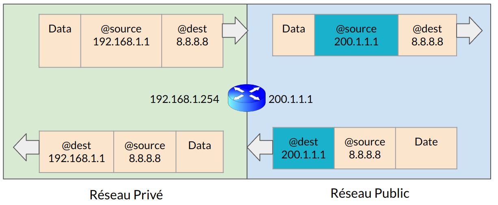

:titre: Routeur NAT / PAT
:module: Réseau
:duree: 90
:description: Comprendre les concepts fondamentaux de NAT et PAT
include::../../../../adoc/libs/header-module.adoc[]

ifeval::["{visible-on-html}" !=  "yes"]
:docinfo: shared
:docinfodir: ../../../../adoc/libs
endif::[]


== Objectifs pédagogiques

// tag::objectifs[]
* Comprendre les concepts fondamentaux de NAT et PAT
* Identifier les différents types de NAT
* Maîtriser le concept de NAT Statique
* Comprendre le fonctionnement du NAT Dynamique
* Appliquer le NAT Overload (PAT) et ses spécificités
// end::objectifs[]

// tag::deroulement[]

== NAT/PAT c'est quoi ?

=== Qu'est-ce que le NAT ?

* Méthode utilisée par les routeurs pour traduire les adresses IP privées en adresses IP publiques et vice versa.
* Permettre à plusieurs dispositifs sur un réseau privé d'accéder à Internet en utilisant une seule adresse IP publique.

=== Qu'est-ce que le PAT ?

* Extension du NAT qui permet de multiples connexions à Internet avec une seule adresse IP en utilisant des numéros de port uniques pour distinguer les flux de trafic.
* Maximiser l'utilisation des adresses IP disponibles et supporter plusieurs connexions simultanées.

=== Types de NAT

* NAT Statique : Mapping un-à-un de l'adresse IP privée à l'adresse IP publique.
* NAT Dynamique : Mapping d'adresses privées à un pool d'adresses publiques disponibles.
* Nat Overlay ou PAT.

include::../../../../adoc/libs/slide-notitle.adoc[]



== NAT statique

Le NAT statique permet la mise en place d’une infrastructure 1 pour 1

1 IP privée pour une IP publique

include::../../../../adoc/libs/slide-notitle.adoc[]

```sh
interface fa 0/1 
description LAN
ip address 192.168.10.254 255.255.255.0
ip nat inside
!
interface fa 0/2
description WAN 
ip address 200.1.1.254 255.255.255.0
ip nat outside
!
ip nat inside source static 192.168.1.1 200.1.1.1
ip nat inside source static 192.168.1.2 200.1.1.2
ip nat inside source static 192.168.1.3 200.1.1.3
...
```

=== Interface fa 0/1

* **interface fa 0/1** : Indique que la configuration qui suit concerne l'interface Fast Ethernet 0/1.
* **description LAN** : Description pour l'interface, 
* **ip address 192.168.10.254 255.255.255.0** : Attribue une adresse IP statique à l'interface. 
* **ip nat inside** : Déclare cette interface comme la face "intérieure" pour la traduction d'adresse réseau (NAT).

=== Interface fa 0/2

* **interface fa 0/2** : Indique que la configuration qui suit concerne l'interface Fast Ethernet 0/2.
* **description WAN** : Description pour l'interface,
* **ip address 200.1.1.254 255.255.255.0** : Attribue une adresse IP statique à l'interface.
* **ip nat outside** : Déclare cette interface comme la face "extérieure" pour la traduction d'adresse réseau (NAT). 

=== Règles de NAT statique

* **ip nat inside source static 192.168.1.1 200.1.1.1** : Configure une traduction statique entre l'adresse interne 192.168.1.1 et l'adresse externe 200.1.1.1. Chaque paquet originaire de 192.168.1.1 apparaîtra sur le réseau externe comme venant de 200.1.1.1.
* **ip nat inside source static 192.168.1.2 200.1.1.2** : Pareil que ci-dessus, mais pour l'adresse interne 192.168.1.2 qui sera traduite en 200.1.1.2.
* **ip nat inside source static 192.168.1.3 200.1.1.3** : Pareil que ci-dessus, pour l'adresse interne 192.168.1.3 qui sera traduite en 200.1.1.3.

=== Cette configuration 

* permet à des adresses IP spécifiques sur un réseau interne d'être visibles sur un réseau externe 
* avec des adresses IP différentes, spécifiquement mappées pour chacune. 

Utilisé pour rendre accessibles depuis l'extérieur des serveurs hébergés en interne, comme des serveurs web ou de messagerie, en utilisant des adresses IP publiques spécifiques.

== NAT dynamique

le NAT dynamique permet une relation plusieurs pour un (many-to-one) ou parfois plusieurs pour plusieurs (many-to-many).

include::../../../../adoc/libs/slide-notitle.adoc[]

```sh
interface fa 0/1 
 description LAN
 ip address 192.168.10.254 255.255.255.0
 ip nat inside
!
interface fa 0/2
 description WAN 
 ip address 200.1.1.254 255.255.255.0
 ip nat outside
!
ip nat pool Entreprise 200.1.1.1 200.1.1.3 netmask 255.255.255.0
ip nat inside source list 10 pool Entreprise
!
access-list 10 permit 192.168.10.1
access-list 10 permit 192.168.10.2
...
```

=== Interface fa 0/1

* **interface fa 0/1** : Indique que la configuration qui suit concerne l'interface Fast Ethernet 0/1.
* **description LAN** : Ajoute une description à l'interface 
* **ip address 192.168.10.254 255.255.255.0** : Attribue une adresse IP statique et un masque de sous-réseau à l'interface. 
* **ip nat inside** : Marque l'interface comme le côté "intérieur" pour le processus de NAT

=== Interface fa 0/2

* **interface fa 0/2** : Indique que la configuration s'appliquera à l'interface FastEthernet 0/2.
* **description WAN** : Ajoute une description à l'interface 
* **ip address 200.1.1.254 255.255.255.0** : Attribue une adresse IP statique et un masque de sous-réseau à l'interface. 
* **ip nat outside** : Marque cette interface comme le côté "extérieur" pour le processus de NAT,

=== Pool de NAT et Règle de NAT

* **ip nat pool Entreprise 200.1.1.1 200.1.1.3 netmask 255.255.255.0 :**
** Crée un pool de NAT nommé "Entreprise" 
** avec une plage d'adresses IP allant de 200.1.1.1 à 200.1.1.3 
** avec un masque de sous-réseau de 255.255.255.0. 
** Ce pool sera utilisé pour assigner des adresses IP externes aux dispositifs internes lorsqu'ils accèdent à Internet.

include::../../../../adoc/libs/slide-notitle.adoc[]

* **ip nat inside source list 10 pool Entreprise :**
** Configure la traduction d'adresses en utilisant la liste d'accès 10 pour déterminer
*** quelles adresses IP internes peuvent utiliser les adresses du pool "Entreprise". 
** Les paquets provenant des adresses spécifiées dans la liste d'accès 10 seront traduits en utilisant une adresse du pool Entreprise lorsqu'ils traversent l'interface externe.

=== Listes d'accès

* **access-list 10 permit 192.168.10.1** : 
** Autorise l’IP 192.168.10.1 à utiliser le NAT, 
** permet à ce dispositif de se voir attribuer une adresse IP du pool Entreprise lorsqu'il communique avec l'Internet.
* **access-list 10 permit 192.168.10.2** : 
** Autorise l'adresse IP 192.168.10.2 de la même manière que ci-dessus.

include::../../../../adoc/libs/slide-notitle.adoc[]

Cette configuration NAT permet 

* A des dispositifs spécifiques sur le réseau local d'accéder à Internet
* Utiliser une adresse IP publique dynamiquement assignée à partir du pool "Entreprise". 
* Optimise l'utilisation des adresses IP publiques disponibles et assure que chaque dispositif peut établir des sessions indépendantes sur Internet.

== NAT Overlay = PAT

**PAT** = **P**ort **A**ddress **T**ranslation.

Permet de faire correspondre plusieurs adresses IP privées à une seule adresse publique.

Pour se faire, notre routeur va jouer sur les numéros de ports.

=== Exemple

Le poste 1 envoie un paquet vers Internet

* IP Source : 192.168.0.1 / Port source 1234
* Le routeur reçoit ce paquet, met son adresse IP WAN à la place de l’IP Source et va choisir un nouveau port dynamique (4567).
* Il reste en écoute sur le port 4567.
* S’il reçoit un paquet sur ce port, il va le retransmettre au poste 192.168.0.1 puis il va arrêter d’écouter sur ce port.

include::../../../../adoc/libs/slide-notitle.adoc[]

```sh
interface FastEthernet0/1 
 description LAN
 ip address 192.168.10.254 255.255.255.0
 ip nat inside
!
interface FastEthernet0/2
 description WAN 
 ip address 200.1.1.254 255.255.255.0
 ip nat outside
!
ip nat inside source list 10 interface FastEthernet0/2 overload
!
access-list 10 permit 192.168.10.0 0.0.0.255
```

`ip nat inside source list 10 interface FastEthernet0/2 overload`

* Configure le NAT dynamique. 
* "List 10" liste d'accès qui spécifie les adresses IP qui seront traduites. 
* L'option "overload" permet le PAT (Port Address Translation), 


// tag::demo[]

== Démonstration

[NOTE.speaker]
--

* Sur packet tracer faire une configuration de Vlan : 

**Routeur 1: configuration **

```sh
enable
configure terminal 

interface GigabitEthernet 0/0/0 
ip address 192.168.10.1 255.255.255.0 
ip nat inside 
no shutdown 

interface GigabitEthernet 0/0/1 
ip address 209.165.200.225 255.255.255.252 
ip nat outside no shutdown 

access-list 1 permit 192.168.10.0 0.0.0.255 
ip nat inside source list 1 interface GigabitEthernet 0/1 overload 

end 
write memory
```

**Routeur 1: vérification**

```sh
enable
show running-config                    ! Voir toute la configuration du routeur, y compris NAT
show ip nat translations                ! Voir les traductions NAT actives (liens entre IP privée et publique)
show ip nat statistics                  ! Voir les statistiques NAT (comptage des paquets et nombre de traductions)
show ip interface brief                 ! Afficher l'état des interfaces et leurs adresses IP
show running-config | include ip nat    ! Afficher uniquement les lignes de configuration NAT
ping 209.165.200.226                    ! Tester la connectivité pour vérifier que le NAT fonctionne (remplacez l'IP par une IP accessible)
```
--

// end::demo[]

// end::deroulement[]

== Conclusion
// tag::conclusion[]
NAT et PAT assurent l'accès sécurisé à Internet et maximisent l’utilisation des adresses IPv4 publiques en traduisant les adresses privées et en exploitant les ports.

**NAT (Network Address Translation) : **

* Traduit les adresses IP privées en adresses publiques
* NAT cache les adresses internes, renforçant la sécurité et optimisant l’utilisation des adresses IPv4 publiques.

include::../../../../adoc/libs/slide-notitle.adoc[]

**Types de NAT :**

* Statique : Liens fixes entre adresses privées et publiques.
* Dynamique : Associe les adresses en fonction de la demande.

**PAT (Port Address Translation) :** 

Permet à plusieurs appareils de partager une seule adresse publique en utilisant des numéros de port uniques, 
permet donc à un grand nombre d'appareils peuvent accéder à Internet via une seule adresse publique.


// end::conclusion[]