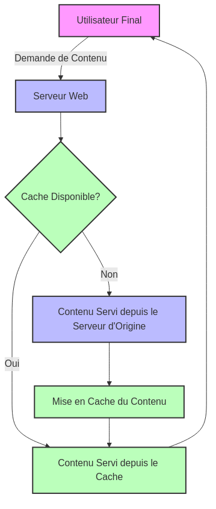
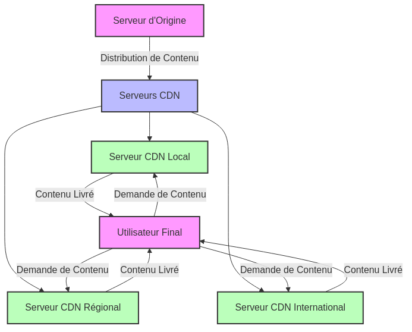
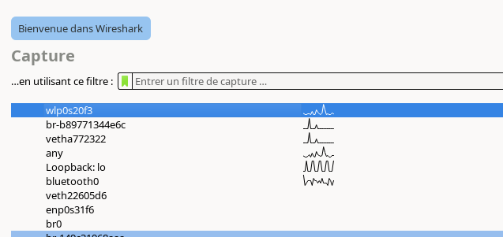
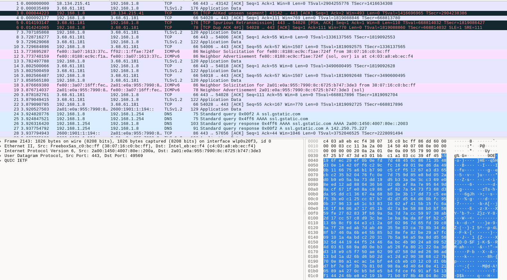

:titre: Optimisation des Performances Réseau
:module: Réseau
:duree: 60
:description: Optimiser les performances du réseau
include::../../../../adoc/libs/header-module.adoc[]

ifeval::["{visible-on-html}" !=  "yes"]
:docinfo: shared
:docinfodir: ../../../../adoc/libs
endif::[]

== Objectifs pédagogiques

// tag::objectifs[]
* Comprendre la gestion de la bande passante et QoS
* Connaître des techniques de réduction de la latence
* Savoir capturer et analyser le trafic réseau à l'aide de Wireshark
// end::objectifs[]

// tag::deroulement[]

== Bande passante et QoS

* **Bande passante** : représente la capacité maximale de transmission de données d'un réseau, généralement mesurée en bits par seconde (bps)
** Une bande passante adéquate est essentielle pour garantir que les applications réseau fonctionnent efficacement sans goulots d'étranglement.

* **Qualité de Service (QoS)** : ensemble de technologies utilisées pour gérer et prioriser le trafic réseau, garantissant une performance optimale pour les applications critiques
** QoS aide à maintenir la qualité des services essentiels tels que la VoIP, la vidéoconférence, et les applications en temps réel

=== Techniques pour gérer la bande passante

**Limitation de débit (Rate Limiting) :**

* Explication : Technique qui impose une limite sur la quantité de données pouvant être transférées sur le réseau en un temps donné.
* Utilisation : Empêche certains appareils ou applications de consommer une part disproportionnée de la bande passante totale, évitant ainsi les encombrements.

include::../../../../adoc/libs/slide-notitle.adoc[]

**Priorisation du trafic :**

* Explication : Technique qui accorde une priorité plus élevée à certains types de trafic (par exemple, la VoIP ou le streaming vidéo) par rapport à d'autres.
* Utilisation : Assure que les applications critiques reçoivent la bande passante nécessaire pour fonctionner efficacement, même en cas de congestion.

=== Fonctionnement de la QoS

* La QoS utilise des mécanismes tels que le marquage des paquets, le contrôle de la file d'attente et la gestion du trafic pour organiser et prioriser les données traversant le réseau.
* Les paquets de données sont classés en différentes catégories selon leur importance, et le réseau est configuré pour traiter chaque catégorie en conséquence.

=== Avantages de la QoS :

* **Amélioration des performances des applications** : En garantissant une bande passante suffisante pour les applications critiques, QoS améliore leur réactivité et leur fiabilité.
* **Réduction des latences** : QoS aide à minimiser les délais de transmission pour les applications sensibles au temps, comme la VoIP et la vidéoconférence.
* **Utilisation efficace de la bande passante** : En organisant et en priorisant le trafic, QoS permet une utilisation plus efficace des ressources réseau disponibles.

== Sources de latence

=== Distance physique

* Explication : Plus la distance entre deux points de communication est grande, plus le temps nécessaire pour transférer des données augmente.
* Exemple : La communication entre des serveurs situés sur des continents différents peut entraîner une latence perceptible.

=== Congestion réseau

* Explication : Lorsque trop de données tentent de traverser un segment de réseau simultanément, cela peut provoquer des embouteillages et augmenter les temps d'attente.
* Exemple : Les heures de pointe sur Internet, où de nombreux utilisateurs se connectent en même temps, peuvent entraîner une congestion.

=== Temps de traitement

* Explication : Chaque routeur ou commutateur sur un chemin de données doit traiter les paquets, ce qui prend du temps.
* Exemple : Des équipements réseau sous-dimensionnés ou mal configurés peuvent ajouter des retards supplémentaires.

=== Problèmes de configuration

* Explication : Des configurations inefficaces ou incorrectes peuvent entraîner des cheminements non optimaux et des retards inutiles.
* Exemple : Des boucles de routage ou des chemins de données mal configurés peuvent augmenter la latence.

== Techniques de réduction de la latence

=== Optimisation des routes

* Explication : En ajustant les itinéraires que prennent les paquets de données, on peut réduire le nombre de sauts et donc le temps de transmission.
* Méthodes : Utiliser des protocoles de routage dynamiques (comme OSPF ou BGP) pour choisir les chemins les plus rapides, et éviter les routes congestionnées.

=== Mise en cache

* Explication : Stocker temporairement des copies de données fréquemment demandées à proximité de l'utilisateur final pour réduire le temps d'accès.
* Utilisation : Les serveurs de cache peuvent être déployés pour stocker des pages web, des fichiers multimédias et d'autres contenus statiques.

include::../../../../adoc/libs/slide-notitle.adoc[]

=== Réseaux de distribution de contenu (CDN)

* Explication : Les CDN répartissent le contenu sur plusieurs serveurs situés dans le monde entier, rapprochant les données des utilisateurs finaux.
* Avantages : Réduction de la latence en diminuant la distance entre le serveur et l'utilisateur, et en équilibrant la charge de trafic.

include::../../../../adoc/libs/slide-notitle.adoc[]

== Surveillance et diagnostic réseau

On va utiliser **Wireshark** qui est un incontournable pour capturer et analyser le trafic réseau.

=== Qu'est-ce que Wireshark ?

* Wireshark est un analyseur de protocoles réseau open-source qui permet de capturer et d'examiner le trafic traversant un réseau en temps réel.
* Il est largement utilisé par les professionnels de l'informatique pour le dépannage, l'analyse, le développement de logiciels et l'éducation.

=== Fonctionnalités de Wireshark

* **Capture de paquets** : Wireshark capture tous les paquets qui traversent un réseau, permettant une analyse détaillée de chaque paquet.
* **Filtrage des paquets** : Utilise des filtres pour afficher uniquement les paquets d'intérêt, facilitant l'analyse des grandes quantités de données.
* **Analyse des protocoles** : Prend en charge de nombreux protocoles, offrant des détails sur la structure et le contenu des paquets.
* **Visualisation des données** : Propose des graphiques et des statistiques pour aider à identifier des tendances et des anomalies dans le trafic.

=== Installer Wireshark

* Télécharger et installer Wireshark à partir du site officiel : https://www.wireshark.org/download.html

=== Comment capturer et analyser le trafic réseau

**Capture de trafic :**

* Sélectionner l'interface réseau souhaitée (ethernet, wi-fi, bluetooth).
* Cliquer sur "Démarrer" pour commencer à capturer le trafic réseau.

include::../../../../adoc/libs/slide-notitle.adoc[]

**Analyse du trafic :**

* Appliquer des filtres pour isoler le trafic spécifique  (par exemple, trafic HTTP, DNS).
* Examiner les détails des paquets capturés, y compris les en-têtes et les données, pour identifier les comportements et anomalies réseau.

// tag::demo[]

== Démonstration

Wireshark

[NOTE.speaker]
--
* Configurer Wireshark pour capturer le trafic réseau sur une interface réseau.
* Effectuer des activités réseau qui peuvent générer des retransmissions, comme interrompre une connexion Internet et la rétablir pendant un téléchargement.
* Observer les remontées dans Wireshark pour identifier les problèmes de latence ou de perte de paquets.
--

// end::demo[]

// end::deroulement[]

== Conclusion
// tag::conclusion[]
* Compréhension de ce qu'est la bande passante et la QoS
* Connaissance de techniques de réduction de la latence
* Capacité à capturer et analyser le trafic réseau à l'aide de Wireshark
// end::conclusion[]