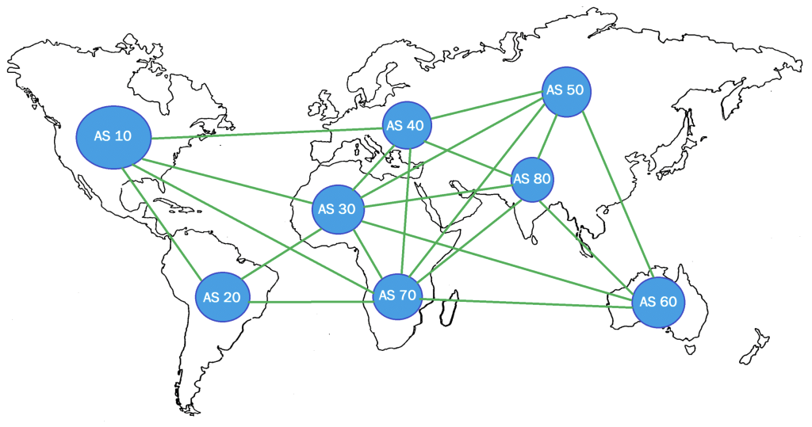
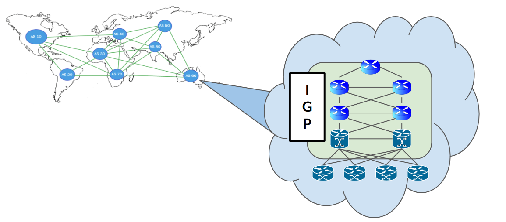
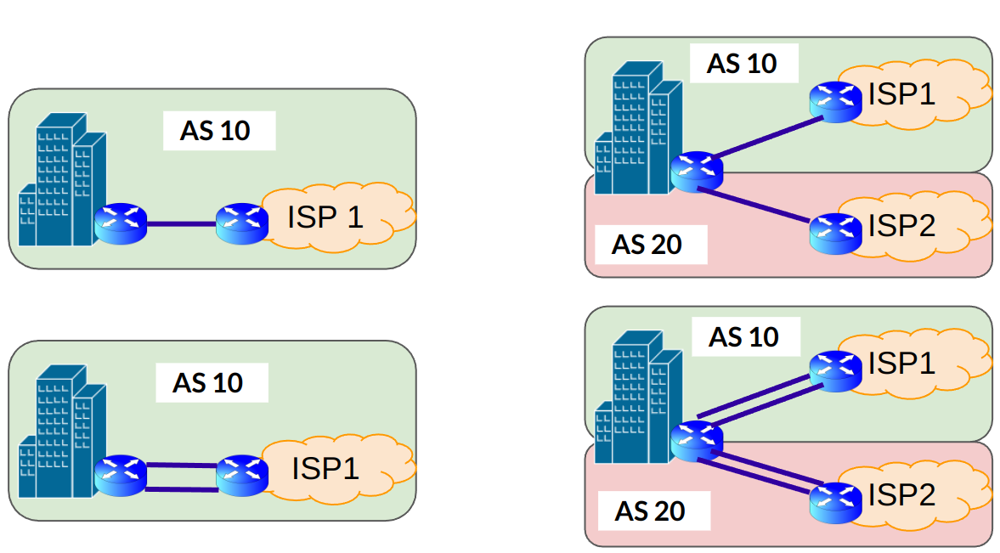
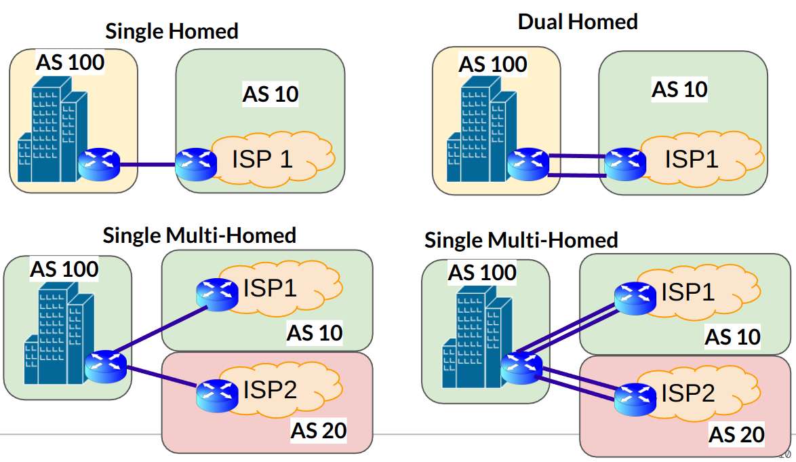
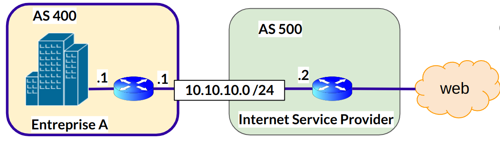

:titre: Protocole BGP
:module: Réseau
:duree: 120
:description: Le protocole BGP permet de gérer les routes entre les réseaux autonomes. Il est utilisé pour les connexions inter-domaines.
include::../../../../adoc/libs/header-module.adoc[]

ifeval::["{visible-on-html}" !=  "yes"]
:docinfo: shared
:docinfodir: ../../../../adoc/libs
endif::[]


== Objectifs pédagogiques

// tag::objectifs[]
* Comprendre les concepts de Système Autonome (AS) et de BGP
* Différencier les connexions avec et sans BGP
* Configurer et dépanner BGP
// end::objectifs[]

// tag::deroulement[]

== Introduction

Internet relie plusieurs réseaux à une échelle mondiale, formant un réseau de réseaux. 

* Internet est un Cloud composé de plusieurs petits Cloud
* fonctionne entièrement avec le protocole BGP
* que chaque petit Cloud représente un Internet Service Provider (ISP)
* chaque ISP possède des plages d’adresses IP publiques ainsi que des numéros d’AS

include::../../../../adoc/libs/slide-notitle.adoc[]



== AS (Autonome System)

Chaque AS est composé de 

* plusieurs routeurs 
* qui utilisent des protocoles IGP (Interior Gateway Protocols) pour gérer le routage interne
** RIP
** OSPF
** EIGRP pour gérer le routage interne.

Internet fonctionne principalement grâce au protocole BGP (Border Gateway Protocol), essentiel pour la gestion des routes entre différents AS.

include::../../../../adoc/libs/slide-notitle.adoc[]



== Distribution des adresses IP

**IANA** (Internet Assigned Numbers Authority) est responsable de l'allocation globale des adresses IP et délègue cette tâche à cinq RIRs régionales:

* **AFRINIC** pour l'Afrique
* **APNIC** pour l'Asie et le Pacifique
* **ARIN** pour l'Amérique du Nord
* **LACNIC** pour l'Amérique Latine et les Caraïbes
* **RIPE NCC** pour l'Europe, le Moyen-Orient et certaines parties de l'Asie

=== Attribution

**Les numéros d'AS (Autonomous System Numbers ASN)** sont attribués pour 

* permettre un routage distinct et autonome à travers Internet. 
* Système supervisé par l'IANA, qui délègue certaines attributions aux RIRs régionales .

== AS Number

AS = Autonomus System (système autonome) :

* défini par la RFC 1771
* sur 16 bits soit 65 535 possibilités
* géré par l’IANA et ses délégations

Les fonctions des numéros d’AS sont les suivants : 

* L’AS 0 = Réservé
* De l’AS 1 à l’AS64 495 = géré par l’IANA pour un usage publique
* De l’AS 64 496 à l’AS 64 511 = Réservé pour de la documentation
* De l’AS 64 512 à l’AS 65 534 = Usage privée
* L’AS 65 535 = Réservé

== BGP

**BGP** = **B**order **G**ateway **P**rotocol est défini comme le seul protocole EGP

* Contrairement à RIP, EIGRP, OSPF qui sont des protocoles  IGP (interior Gateway Protocol)

protocole  EGP (Exterior Gateway Protocol) 

* Utilisés pour échanger des informations de routage entre différentes organisations. 


include::../../../../adoc/libs/slide-notitle.adoc[]

BGP garde les mêmes rôles:

* apprendre des routes de ses voisins
* choisir la meilleure route à emprunter
* changer de route en cas de dysfonctionnement

Chaque réseau BGP appartenant à une même entreprise forme un AS identifié par un ASN.

le protocole BGP va fonctionner différemment en fonction de ce numéro ASN

* **iBGP (Internal BGP)** : Gère le routage à l'intérieur d'un même ASN.
* **eBGP (External BGP)** : Gère le routage entre différents ASN.

== Connexion sans BGP

Les scénarios où BGP n'est pas utilisé peuvent être pour: 

* Des réseaux utilisant des connexions simples à un seul AS ( fournisseur de services Internet,) 
* pas assez de bande passante (le protocole BGP est très gourmand en termes d’update).

include::../../../../adoc/libs/slide-notitle.adoc[]



== Connexion avec BGP

On utilise BGP pour

* besoin d’une haute disponibilité via plusieurs fournisseurs d’accès Internet
* vous êtes un fournisseur d’accès internet
* vous devez être joint à tout moment (exemple : Google, American Express)
* vous devez annoncer au monde entier quand vous avez perdu un lien

include::../../../../adoc/libs/slide-notitle.adoc[]

**Il existe 4 types d’architecture BGP :**



== Configuration BGP



include::../../../../adoc/libs/slide-notitle.adoc[]

Configuration du routeur de site Entreprise A

```sh
Ro-EntA(config)# router bgp 400
Ro-EntA(config-router)# neighbor 10.10.10.2 remote-as 500
Ro-EntA(config-router)# network 192.168.10.0 mask 255.255.255.0
```

`Router bgp 400` : Active le protocole BGP pour le numéro d’AS 400.

`Neighbor 10.10.10.2 remote-as 500` : Renseigner nos voisins avec leurs numéro AS

`Network 192.168.10.0 mask 255.255.255.0`

[NOTE.speaker]
--
* permet d’informer un réseau présent dans la table de routage
* ne permet pas de chercher un neighbor sur cette liaison comme OSPF ou EIGRP
* ce réseau doit obligatoirement dans la table de routage
* prend en compte les masques et non les wildcard mask
--

== Dépannage BGP

**Dépannage** et vérification de la configuration du routeur de site Entreprise A

=== Vérification des Sessions:  

`show ip bgp summary`

* Vérifier l'état des sessions BGP. 
* Affiche l'état des voisins BGP, les numéros d'AS, les adresses IP et le nombre de préfixes reçus.

=== Analyse des Routes: 

La commande `show ip bgp` permet de visualiser la table BGP en détail, y compris les chemins et les attributs associés à chaque route.

```sh
Ro-EntA# show ip bgp summary
Ro-EntA# show ip bgp 
```

le protocole BGP va choisir sa meilleure route en fonction du nombre d’équipements qui le sépare de sa destination. 

il prend uniquement en compte le nombre d’ASN traversé.

// end::deroulement[]

== Conclusion
// tag::conclusion[]
BGP est le protocole standard pour le routage entre systèmes autonomes sur Internet, offrant un contrôle flexible, une grande scalabilité, et une stabilité essentielle pour les grandes infrastructures réseau.

**Protocole de routage externe (EGP) : **

Utilisé pour échanger des routes entre différents systèmes autonomes (AS), assurant la connectivité entre réseaux distincts, comme ceux des fournisseurs d’accès Internet.

include::../../../../adoc/libs/slide-notitle.adoc[]

**Utilisation des chemins multiples : **

Contrairement aux protocoles IGP, BGP choisit les meilleurs chemins en fonction de critères complexes et peut gérer des routes multiples entre deux AS.

**Stabilité et contrôle : **

BGP privilégie la stabilité et le contrôle du routage inter-domaines plutôt que la vitesse de convergence. Il est conçu pour minimiser les changements fréquents de routes, ce qui est essentiel pour les échanges entre grands réseaux.

// end::conclusion[]