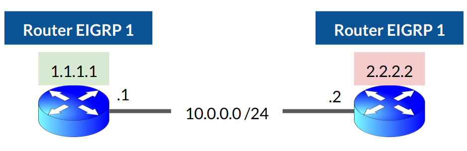
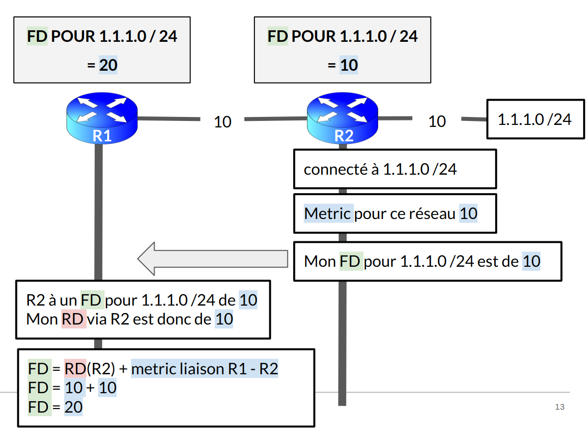
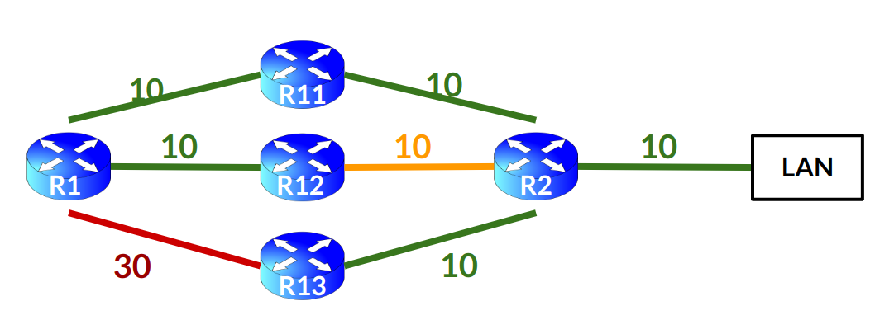
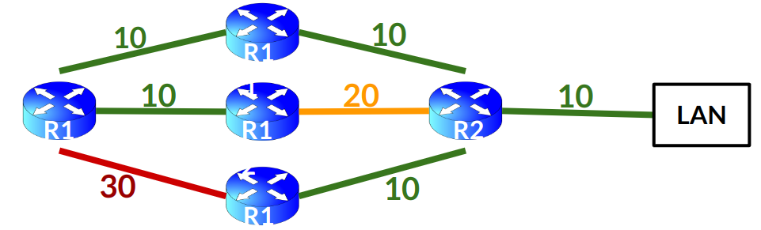
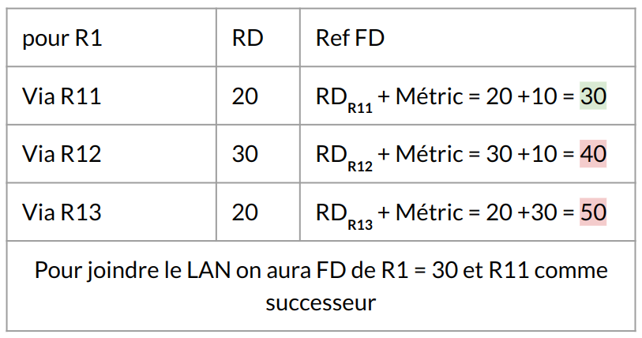
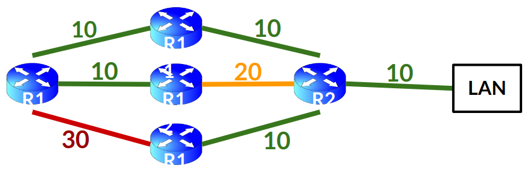
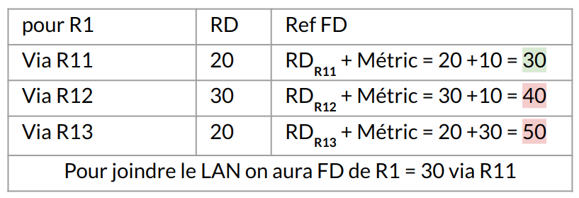
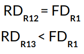
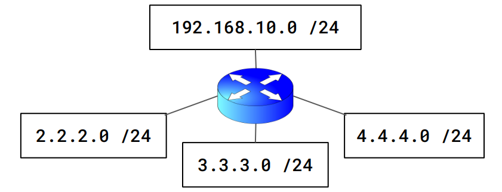

:titre: Protocole EIGRP
:module: Réseau
:duree: 120
:description: Le protocole EIGRP est un protocole de routage propriétaire Cisco. Il est basé sur un algorithme de routage à vecteur de distance amélioré. Il permet de configurer des routes dynamiques sur des routeurs Cisco.
include::../../../../adoc/libs/header-module.adoc[]

ifeval::["{visible-on-html}" !=  "yes"]
:docinfo: shared
:docinfodir: ../../../../adoc/libs
endif::[]


== Objectifs pédagogiques

// tag::objectifs[]
* Comprendre les tables d’EIGRP et leur fonction
* Maîtriser les concepts de voisinage et calcul de routes dans EIGRP
* Configurer EIGRP et utiliser les commandes de diagnostic
// end::objectifs[]

// tag::deroulement[]

== EIGRP Enhanced Interior Gateway Routing Protocol

* Protocole de routage dynamique 
* Propriétaire **Cisco Systems** 
* Conçu pour les réseaux de grande envergure 
* Combine les avantages des protocoles à **vecteur de distance** et des protocoles à **état de lien**

include::../../../../adoc/libs/slide-notitle.adoc[]

* protocole **IGP**
* protocole **Classless**
* utilise le **Distance Vector**
* envoi des “Updates Messages” à ses neighbor’s et en Multicast sur l’adresse **224.0.0.10**, afin d’informer de la topologie existante
* les “Updates Messages” n’utilisent pas TCP ou l’UDP mais **RTP** (Reliable Transport Protocol)

== Les Trois Tables

EIGRP utilise trois tables pour organiser et gérer les informations de routage

=== Neighbor Table (Table des voisins) :

* Répertorie tous les voisins EIGRP d'un routeur (les routeurs adjacents avec lesquels il a établi une connexion directe).
* Mise à jour régulièrement via des paquets Hello

=== Topology Table (Table de topologie) :

* Contient toutes les routes connues par un routeur. 
* Stocke la route optimale vers une destination,
* Toutes les routes alternatives possibles,
* avec leurs métriques associées (Reported Distance, Feasible Distance).

=== Routing Table (Table de routage) :

* Contient uniquement les routes les plus optimales,
* Calculées à partir des informations de la table de topologie.
* C’est cette table qui est utilisée pour décider de l'acheminement des paquets.

=== La table de voisinage

Répertorie tous les voisins EIGRP d'un routeur (les routeurs adjacents avec lesquels il a établi une connexion directe
se décompose en trois points : 

* **Router ID** : Identifiant unique du routeur dans le réseau.
* **Neighbors** : Routeurs adjacents connectés directement.
* **Neighbor Table** : Tableau qui stocke les informations des voisins.

== Le Router ID

* Le **RID** est un identifiant unique pour chaque routeur dans un réseau EIGRP. 
* Par défaut, le RID est l'IP la plus élevée configurée sur les interfaces du routeur. 
* Il est possible de définir manuellement le **RID** pour éviter tout conflit ou pour des raisons d'administration plus simple.

=== Exemple de commande pour configurer un Router ID

```sh
Router(config-router)# eigrp router-id [adresse IP]
```

=== Le Router-ID est défini comme suit

* **Priorité 1** : le Router ID renseigné manuellement.
* **Priorité 2** : L’adresse IP **la plus élevée** configurée sur une interface **loopback**.
* **Priorité 3** : L’adresse IP **la plus élevée** configurée sur une interface **physique**.

Cette adresse IP permet de pouvoir être identifié par les routeurs EIGRP voisins.

== Les voisins

Les **Neighbors** (voisins) : routeurs adjacents qui participent à EIGRP. 

* Découverts via les  paquets **Hello**, échangés régulièrement entre les routeurs.
* Si un routeur cesse de recevoir des paquets Hello d’un voisin,  il considère ce voisin comme inactif et le retire de la table de voisinage.
** **Hello Timer** : Temps pendant lequel les paquets Hello sont envoyés (5 secondes sur Ethernet).
** **Hold Timer** : Si aucun paquet Hello n’est reçu dans un certain délai, le voisin est considéré comme inactif.

=== Les conditions pour devenir neighbor (voisin)

* EIGRP – **Authentification** identique.
* EIGRP – **Valeur K** identique (Cisco recommande de ne pas changer cette valeur!).
* EIGRP – **Numéro d’AS** identique ( router eigrp X ).
* EIGRP – Appartenir à un **même réseau**.
* EIGRP – **Router-ID unique** (non obligatoire, mais fortement conseillé).

include::../../../../adoc/libs/slide-notitle.adoc[]

**Nos deux routeurs se considèrent comme “Neighbors” si :**



* EIGRP – **Authentification** identique.
* EIGRP – **Valeur K** identique 
* EIGRP – **Numéro d’AS** identique ( router eigrp X ).
* EIGRP – Appartenir à un **même réseau**.
* EIGRP – **Router-ID unique**

include::../../../../adoc/libs/slide-notitle.adoc[]

**Neighbor Table** stocke les informations sur les voisins directs, y compris :

* Le **Router ID** des voisins.
* **L’interface** via laquelle chaque voisin est connecté.
* Le **temps d’inactivité** avant que le voisin ne soit déclaré inactif.

Permet de s’assurer d’inclure que les voisins actifs dans les calculs de routage.

La commande `show ip eigrp neighbors` permet d’afficher la table

```sh
R1# show ip eigrp neighbors
IP-EIGRP neighbors for process 1
H   Address   Interface   Hold  Uptime      SRTT   RTO 	Q  	Seq
                                 (sec)  	  (ms)   	      Cnt 	Num
0   2.2.2.2     Fa0/0      15   2:04:17      40    1000	27	  1
1
...
```

== Commandes table de voisinage

```sh
R1# show ip eigrp neighbors
IP-EIGRP neighbors for process 1
H   Address   Interface   Hold  Uptime      SRTT   RTO 	Q  	Seq
                                 (sec)  	  (ms)   	      Cnt 	Num
0   2.2.2.2     Fa0/0      15   2:04:17      40    1000	27	  1
1
...
```

[NOTE.speaker]
--
* **H ** (**H**andle) = Classement par ordre d’arrivée de nos voisins (0 , 1 , 2 , 3 , ect.)
* **Address** = Router-ID de notre voisin
* **Interface** = Interface d’interconnexion avec notre voisin
* **Hold Time** = Temps d’attente maximum pour recevoir un paquet Hello de notre voisin, 15 secondes par défaut
* **Uptime** =  Depuis quand notre voisin est UP
* **SRTT** (**S**mooth **R**ound **T**rip **T**ime) = Temps de retransmission
* **RTO** (**R**etransmission **T**ime**O**ut) =  Temps de retransmission maximum avant Time off
* **Q Cnt** (**Q**ueue **C**ou**nt**) = Nombre de paquets en attente d’être retransmis (Update, Reply, Query). Si ce nombre est supérieur à 0, présence de congestions réseau.
* **Seq Number** (**Seq**uence **Number**)  =  Le dernier numéro de séquence de paquet reçu par notre voisin
--


== La table Topology

* Contient toutes les routes connues par un routeur. 
* Stocke la route optimale vers une destination,
* Toutes les routes alternatives possibles,
* avec leurs métriques associées (Reported Distance, Feasible Distance).

include::../../../../adoc/libs/slide-notitle.adoc[]

Une fois que deux routeurs sont officiellement des neighbors, ils vont s’échanger tout ce qu’ils savent en matière de routage.

Chaque routeur va envoyer :

* les réseaux qu’il sait joindre
* la distance entre lui et ce réseau

Pour ce faire, il y a deux termes à retenir :

* **Reported Distance (RD)** = La distance qui sépare notre voisin à un réseau
* **Feasible Distance (FD)** = La distance qui me sépare de ce réseau.
* **Metric** : Valeur numérique identifiant chaque liaison

include::../../../../adoc/libs/slide-notitle.adoc[]



include::../../../../adoc/libs/slide-notitle.adoc[]

* **Étape 1** : R2 est directement connecté au réseau 1.1.1.0 /24.
* **Étape 2** : R2 calcule le **Metric** entre ce réseau et lui-même et en conclue son **FD**.
* **Étape 3** : R2 envoie son **FD** à R1.
* **Étape 4** : R1 reçoit le **FD** de R2 et le nomme **RD**.
* **Étape 5** : R1 calcule le **Metric** entre R1 et R2, fait l’addition entre le **RD** et le  **Metric** pour avoir  son **FD**.

La **Reported Distance (RD)** ou **Advertised Distance (AD)**

distance qu'un voisin EIGRP annonce comme étant la meilleure distance vers une destination.

* **Reported Distance** : Distance entre un voisin vers une destination
* (**RD**) et(**AD**) veulent dirent la même chose.

== Calcul de routes

**R1** possède 3 neighbors (**R11**, **R12**, et **R13**) :

* Ces 3 routeurs sont capables de joindre le réseau **LAN**.
* Ces 3 routeurs vont l’annoncer à R1.

**R1** va donc mettre dans sa **Topology Table** ces informations.

include::../../../../adoc/libs/slide-notitle.adoc[]

Les  questions sont : 

* Quel chemin va prendre **R1** pour joindre le **LAN** ?
* Quel routeur sera choisi comme possible successeur en cas de défaillance ?



include::../../../../adoc/libs/slide-notitle.adoc[]

Quel chemin va prendre **R1** pour joindre le **LAN** ?



include::../../../../adoc/libs/slide-notitle.adoc[]

Pour joindre le LAN on a : 

[cols="1,1,1", grid="none", frame="none"]
|===
| R11 FD = 20
| R12 FD = 30
| R13 FD = 20
|===



include::../../../../adoc/libs/slide-notitle.adoc[]

Quel routeur sera choisi comme successeur en cas de défaillance ?





include::../../../../adoc/libs/slide-notitle.adoc[]

Pour choisir son possible successeur (Feasible Successor) le routeur va comparer son FD avec les RD des voisins et non avec les réf FD de chaque chemin,



Le  Feasible Successor sera donc  R13, EIGRP fonctionne comme ça

== La table de routage

* Contient uniquement les routes réellement utilisées pour acheminer le trafic. 
* Ces routes sont sélectionnées à partir des meilleures options présentes dans la **table de topologie**.
* La route ayant la référence **Feasible Distance** la plus faible est choisie pour être installée dans la table de routage.

include::../../../../adoc/libs/slide-notitle.adoc[]

* Accessible via la commande : `show ip route`

```sh
R1# show ip route
Codes: C - connected, S - static, I - IGRP, R - RIP, M - mobile, B - BGP
D - EIGRP, EX - EIGRP external, O - OSPF, IA - OSPF inter area
E1 - OSPF external type 1, E2 - OSPF external type 2, E - EGP
i - IS-IS, L1 - IS-IS level-1, L2 - IS-IS level-2, * - candidate
default U - per-user static route
Gateway of last resort is not set

D     LAN     [80/30] via 1.1.11.254, 00:01:17, FastEthernet0/11
```

* **D** = Route EIGRP
* **90** = Administrative Distance
* **30** = FD = Metric

== Configuration EIGRP



**étape 1 : Activation du protocole EIGRPSPF**

```sh
R1(config)# router EIGRP [numéro d’AS]
```

le `[numéro d’AS]` à la fin de la commande  doit être identique au routeur voisin

Le protocole EIGRP est activé mais aveugle, il ne sait pas :

* quel réseau activer 
* A quel routeur distribuer ses informations

include::../../../../adoc/libs/slide-notitle.adoc[]

**étape 2 : Définir le routeur ID et donner un nom au routeur**

```sh
R1(config)# router EIGRP 1
R1(config-router)# EIGRP router-id 10.10.10.1
```

include::../../../../adoc/libs/slide-notitle.adoc[]

**Étape 3 – Déclarer des réseaux dans EIGRP**

Déclaration des réseaux à inclure dans le processus de routage.

La commande **network**, spécifie les réseaux que le routeur doit annoncer dans EIGRP.

```sh
Router(config-router)# network [adresse réseau] [masque inverse]
```

Notre routeur a 4 réseaux qui lui sont directement connectés :

[cols="1,1"]
|===

a| * 192.168.1.0 /24
* 2.2.2.0 /24
* 3.3.3.0 /24
* 4.4.4.0 /24
a| ```sh
R1(config)# router eigrp 1
R1(config-router)# network 192.168.1.0 0.0.0.255
R1(config-router)# network 2.2.2.0 0.0.0.255
R1(config-router)# network 3.3.3.0 0.0.0.255
R1(config-router)# network 4.4.4.0 0.0.0.255
```
|===

include::../../../../adoc/libs/slide-notitle.adoc[]

Pour éviter de travailler en mode CLASSFULL (Classe A , B et C), activez l’auto-summary

```sh
R1(config)# router eigrp 1
R1(config-router)# no auto-summary 
```

**Synthèse de la configuration de R1**

```sh
R1(config)# router eigrp 1
R1(config-router)# EIGRP router-id 10.10.10.1
R1(config-router)# network 192.168.1.0 0.0.0.255
R1(config-router)# network 2.2.2.0 0.0.0.255
R1(config-router)# network 3.3.3.0 0.0.0.255
R1(config-router)# network 4.4.4.0 0.0.0.255
R1(config-router)# passive-interface FastEthernet 0/0
R1(config-router)# no auto-summary
```

// tag::demo[]

== Démonstration

[NOTE.speaker]
--
mettre en pratique la configuration du cours notion 10 dans PAcket Tracer

```sh
R1>enable
R1#configure terminal
R1(config)# interface GigabitEthernet 0/0/0 
R1(config-if)#ip address 192.168.1.254 255.255.255.0 
R1(config-if)#no shutdown
R1(config-if)# exit
R1(config)# interface GigabitEthernet 0/0/1 
R1(config-if)#ip address 2.2.2.254 255.255.255.0 
R1(config-if)#no shutdown
R1(config-if)# exit
R1(config)# interface GigabitEthernet 0/0/2 
R1(config-if)#ip address 3.3.3.254 255.255.255.0 
R1(config-if)#no shutdown
R1(config-if)# exit
R1(config)# interface GigabitEthernet 0/0/3
R1(config-if)#ip address 4.4.4.254 255.255.255.0 
R1(config-if)#no shutdown
R1(config-if)# exit
R1(config)# router eigrp 1
R1(config-router)# EIGRP router-id 10.10.10.1
R1(config-router)# network 192.168.1.0 0.0.0.255
R1(config-router)# network 2.2.2.0 0.0.0.255
R1(config-router)# network 3.3.3.0 0.0.0.255
R1(config-router)# network 4.4.4.0 0.0.0.255
R1(config-router)# passive-interface FastEthernet 0/0
R1(config-router)# no auto-summary
R1(config-router)# exit
R1(config)#exit
R1#show ip route
```
--

// end::demo[]

// end::deroulement[]

== Conclusion
// tag::conclusion[]
**Nature hybride d'EIGRP : **

EIGRP combine des éléments des protocoles à vecteur de distance et des protocoles à état de lien, offrant flexibilité et efficacité.

**Algorithme DUAL :**

L’algorithme propriétaire DUAL garantit une convergence rapide et évite les boucles en permettant un basculement instantané vers des routes de secours.

include::../../../../adoc/libs/slide-notitle.adoc[]

**Métriques avancées : **

EIGRP utilise plusieurs métriques (bande passante, délai, fiabilité, charge) pour sélectionner les routes les plus optimales, permettant une évaluation fine de la qualité des chemins.

**Convergence rapide et faible utilisation de bande passante : **

EIGRP envoie des mises à jour incrémentales uniquement lors de changements, minimisant ainsi l'impact sur la bande passante.

**Compatibilité multi-protocole : **

EIGRP prend en charge IPv4 et IPv6, ce qui le rend adapté aux environnements modernes et évolutifs.
// end::conclusion[]