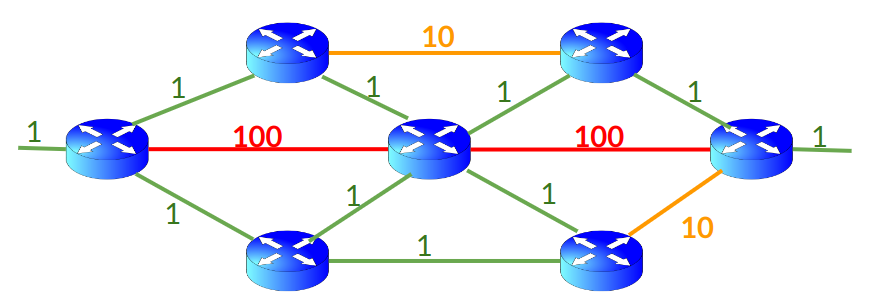
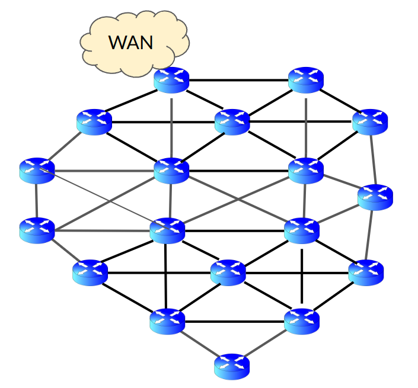
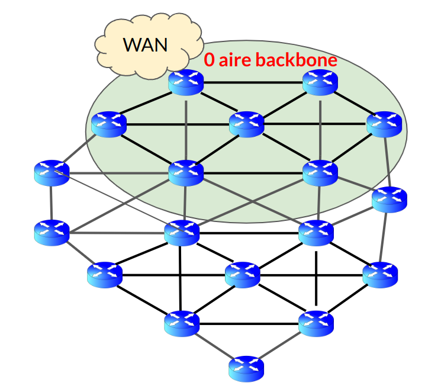
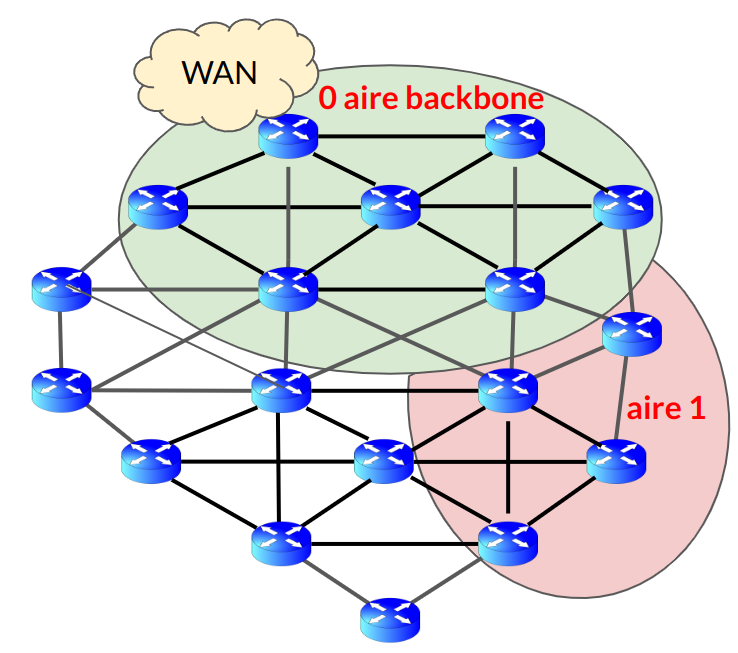
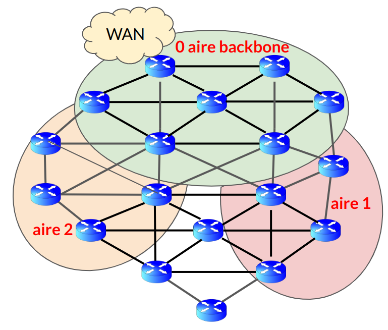
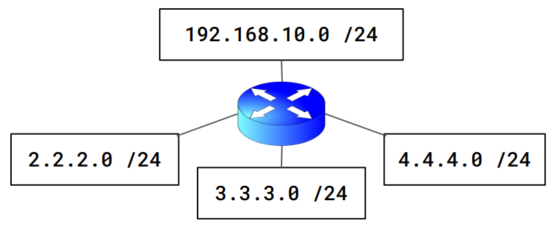
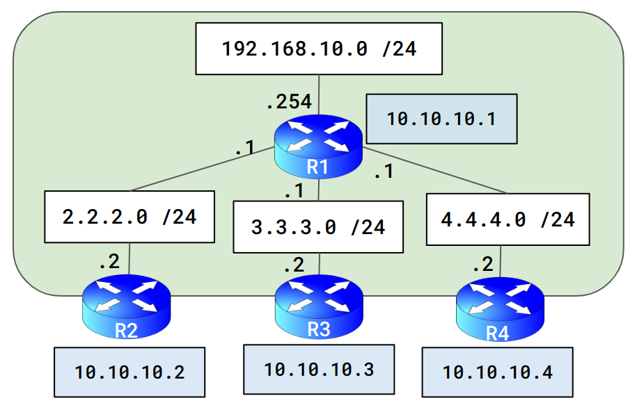

:titre: Protocole OSPF
:module: Réseau
:duree: 120
:description: Le protocole OSPF est un protocole de routage interne qui permet de déterminer le meilleur chemin pour acheminer des paquets de données entre les routeurs d'un réseau. Il est basé sur l'algorithme de Dijkstra et permet de déterminer le chemin le plus court entre deux routeurs. Dans ce module, vous apprendrez à configurer le protocole OSPF sur des routeurs Cisco.
include::../../../../adoc/libs/header-module.adoc[]

ifeval::["{visible-on-html}" !=  "yes"]
:docinfo: shared
:docinfodir: ../../../../adoc/libs
endif::[]


== Objectifs pédagogiques

// tag::objectifs[]
* Comprendre les bases d’OSPF et sa terminologie
* Maîtriser les aires OSPF et les types de configurations associées
* Configurer OSPF et gérer les routes
// end::objectifs[]

// tag::deroulement[]
== Introduction

Vous ne savez pas lequel choisir entre RIP, EIGRP et OSPF ?

**RIP** = Trop vieux. | **EIGRP** = propriétaire CISCO | **OSPF** = Protocole normalisé (le plus utilisé) 

=== OSPF (Open Shortest Path First)

Protocole de routage à état de lien qui calcule le chemin le plus court entre le routeur source et tous les autres routeurs dans le même domaine de routage à l'aide de l'algorithme de Dijkstra.

* **Métrique**:  le coût est utilisé pour déterminer le meilleur chemin. Calculé en fonction de la bande passante de la connexion,.Coût, généralement inversement proportionnel à la bande passante.
* **Rapidité de convergence et efficacité** : OSPF offre une convergence plus rapide que RIP de part l'utilisation immédiate des nouvelles informations de routage dès qu'elles deviennent disponibles.

== Tables OSPF

* **Table de voisinage**: Liste tous les routeurs OSPF voisins directement connecté.  Pour se faire se base sur un identifiant `router-id`  
* **LSDB (Link State Database)**: Contient toutes les informations sur l'état des liens (LSAs) du réseau. Chaque routeur construit une LSDB complète indépendamment pour visualiser la topologie du réseau entier.
* **Table de routage**: Utilise les informations de la LSDB pour déterminer les meilleurs chemins vers chaque réseau.

=== Processus OSPF

* **Détection des voisins**: Les routeurs échangent des paquets Hello toutes les 2 secondes pour identifier et maintenir les relations de voisinage.
* **Échange des états des liens**: Après l'établissement des relations de voisinage, les routeurs échangent des LSAs pour construire leurs LSDB.
* **Calcul du meilleur chemin**: Utilise l’algorithme de Dijkstra pour calculer le chemin le plus court vers tous les réseaux.

== Choix de la route

* OSPF ne prendra pas le chemin le + cours 
* utilisera la route ayant étant la mieux classée
** une note donnée à chaque liaison 
** plus la note est faible plus la liaison est rapide
** le meilleur chemin est le chemin avec le coût le plus faible

include::../../../../adoc/libs/slide-notitle.adoc[]



Ici le coût le plus court = 202

le coût du meilleur chemin = 6 

== Router ID et Aires OSPF

=== Router ID (RID)

Chaque routeur dans un réseau OSPF doit avoir un ID unique RID défini suivant cet ordre de  priorité : 

* Priorité 1 : RID renseigné dans la configuration du routeur avec la commande `router-id`
* Priorité 2 : Adresse ip la plus élevé sur une interface de loopback 
* Priorité 3 : Adresse ip la plus élevé sur une interface physique

=== Les aires OSPF (Areas)

* Chaque aire maintient sa propre base de données d'état de lien,
* Tous les routeurs partagent une base de données commune de l'état des liens
* Permet d’améliorer la charge de routage, 
* Permet de diviser un grand réseau en plusieurs aires hiérarchiques. 
* Réduit la quantité de données de routage à traitée par chaque routeur.
* Aire 0 (Backbone Area): Toutes les autres aires doivent être connectées à l’aire 0. 

=== Virtual Links

Utilisés pour connecter des aires OSPF non contiguës à l'aire 0 si une connexion directe n'est pas possible.

include::../../../../adoc/libs/slide-notitle.adoc[]



include::../../../../adoc/libs/slide-notitle.adoc[]

étape 1 : on définit une aire 0 “aire Backbone” 

* une aire maximum 15 routeur (préconisation Cisco)



include::../../../../adoc/libs/slide-notitle.adoc[]

étape 2 : on définit deux aires supplémentaire aire 1 et 2

* Toutes les autres aires doivent être directement connectées à l’aire 0



include::../../../../adoc/libs/slide-notitle.adoc[]

étape 2 : on définit deux aires supplémentaire aire 1 et 2

* Toutes les autres aires doivent être directement connectées à l’aire 0



include::../../../../adoc/libs/slide-notitle.adoc[]

[cols="1,1"]
|===

a| étape 3 : définir  une aire 3 isolée (non connectée directement à l’aire 0) est possible

* mise en place d’un Virtual Circuit (VC), tunnel entre aire 3 et aire 0 en passant par aire 1 ou 2
a| image::./assets/04-rid-5.png[]
|===

== OSPF Terminologie

=== Routeurs internes

* Toutes leurs interfaces dans une seule aire OSPF
* Traitent uniquement les informations de routage intra-zone

=== ABR (Area Border Routers)

* Connecte une zone à la zone backbone ou à d'autres zones.
* Résume les informations de routage et gère les données entrant et sortant de la zone.

=== ASBR = Autonomous system Boundary routeur 

* Fait la liaison entre un système autonome OSPF et/ou un autre système de routage
* Distribue des informations sur les routes externes au système autonome OSPF

=== DR (Designated Router)

* Routeur principal, gère les informations d'état de lien dans un réseau multi-accès
* Permet de réduire le nombre de relations d'adjacence OSPF 
* Permet de réduire le trafic d'échange d'état de lien sur ces réseaux.

=== BDR (Backup Designated Router) 

Routeur de secours pour le DR prend  le relais sans interruption significative du service 

== Types de LSA et Leurs Rôles dans OSPF

=== Les LSAs (Link State Advertisements) 

* Paquets de données utilisés par OSPF pour échanger des informations de topologie entre les routeurs. 
* Chaque LSA décrit une portion du réseau, 
* permet à tous les routeurs de construire une carte complète du réseau
* objectif calculer les meilleures routes possibles.

=== LSA Type 1: Router LSA

* **Rôle**: Décrit les états des liens d'un routeur à tous les autres dans la même zone OSPF.
* **Propagation**: Ne traverse pas les limites des aires (zones).
* **Utilisation**: Permet à chaque routeur de connaître la structure du réseau au sein de sa zone, essentiel pour le calcul des routes intra-zone.
* **Détails supplémentaires**: Contient des informations sur les interfaces actives du routeur, les liens avec d'autres routeurs, et les coûts associés.

=== LSA Type 2: Network LSA

* **Rôle**: Émis par le Designated Router (DR) pour décrire les routeurs connectés à un réseau multi-accès.
* **Propagation**: Limitée à la zone OSPF dans laquelle le LSA est originaire.
* Aide à la compréhension de la disposition des routeurs sur les segments de réseau, comme les LANs, où plusieurs routeurs peuvent se connecter via un même réseau.

=== LSA Type 3: Summary LSA

* **Rôle**: Utilisé par les Area Border Routers (ABR) pour propager des informations sur les routes inter-zones à d'autres zones.
* **Propagation**: Traversent les frontières des zones pour atteindre la zone backbone (Area 0) et d'autres zones non-backbone.
* **Utilisation**: Permet aux routeurs de zones différentes de connaître les routes accessibles dans d'autres zones, crucial pour le routage inter-zone.

=== LSA Type 4: ASBR-Summary LSA

* **Rôle**: Transmet des informations sur les routeurs ASBR (Autonomous System Boundary Routers) à toutes les zones.
* **Propagation**: Traversent les zones pour informer les routeurs où se trouvent les ASBR pour les routes vers des réseaux externes.
* **Utilisation**: Essentiel pour permettre aux routeurs de trouver des routes vers des réseaux qui sont hors de l'AS OSPF.

=== LSA Type 5: External LSA

* **Rôle**: Propage des informations sur les routes externes provenant d'autres protocoles de routage ou de réseaux connectés à un ASBR.
* **Propagation**: Peut se propager à travers toutes les zones dans l'OSPF excepté les stub areas.
* **Utilisation**: Intègre les routes provenant de sources externes dans la base de données OSPF, permettant un routage intégré entre OSPF et d'autres protocoles.

=== LSA Type 6: Multicast OSPF LSA

* **Rôle**: Utilisé pour le support multicast dans OSPF (non pris en charge par beaucoup de vendeurs, y compris Cisco).
* **Propagation**: Spécifique à la mise en œuvre.
* **Utilisation**: Permet la propagation des informations pour les services multicast au sein de l'OSPF.

=== LSA Type 7: NSSA External LSA

* **Rôle**: Similaire au type 5, mais utilisé dans les Not-So-Stubby Areas (NSSA) pour permettre la propagation d'informations sur les routes externes.
* **Propagation**: Limitée aux NSSA où ils sont convertis en type 5 LSAs par l'ABR avant d'être propagés à d'autres zones.
* **Utilisation**: Permet aux zones NSSA de recevoir des informations sur les routes externes tout en limitant la portée de ces informations.

=== LSA Type 8-10: Opaque LSAs

* **Rôle**: Types de LSA utilisés pour étendre OSPF pour supporter des applications et fonctionnalités supplémentaires.
* **Propagation et Utilisation**: Diversifiée selon les types; les Opaque LSAs peuvent être utilisés pour tout, depuis la distribution d'informations de routage étendues jusqu'à la prise en charge de nouvelles fonctionnalités OSPF.

== Aire standard

* **Zone Standard**: 
** Zone de base d'OSPF , toutes les types de LSA sont autorisés. 
** Utilisée pour des réseaux où la filtration des routes n'est pas une priorité.

include::../../../../adoc/libs/slide-notitle.adoc[]

[cols="4,6"]
|===
a| 
**LSA qui circulent dans une aire standard :**

* LSA Type 1: Router LSA
* LSA Type 2: Network LSA
* LSA Type 3: Summary LSA
* LSA Type 4: ASBR-Summary LSA
* LSA Type 5: External LSA

a| image::./assets/08-aire.png[]
|===

== Aire Stub

**Zone stub: **

```sh
R1(config-router)# ospf [AREA] stub
```

* Limite la propagation des routes externes à la zone 
* LSA de type 4 et 5 sont retiré, 
* permet de réduire la quantité d'informations nécessaires à traiter par les routeurs.
* le routeur ABR devient la seule porte de sortie de notre aire !
** Pour joindre les réseaux externes à notre aire OSPF, nous devrons passer par le routeur ABR, autant mettre une passerelle par défaut vers ce dernier !

include::../../../../adoc/libs/slide-notitle.adoc[]

[cols="4,6"]
|===
a| 
**LSA qui circulent dans une aire stub:**

* LSA Type 1: Router LSA
* LSA Type 2: Network LSA
* LSA Type 3: Summary LSA
* [.line-through]#LSA Type 4: ASBR-Summary LSA#
* [.line-through]#LSA Type 5: External LSA#


a| image::./assets/09-aire.png[]
|===

== Aire totally stubby

**Zone Totally Stubby: **

* version plus restrictive d'une zone stub,
* Ne permet pas les routes inter-zones (LSA de type 3) ni les routes externes, 
* Réseaux avec des besoins de sécurité accrus et moins de nécessité de connaître les routes extérieures

include::../../../../adoc/libs/slide-notitle.adoc[]

[cols="4,6"]
|===
a| 
**LSA qui circulent dans une aire stub:**

* LSA Type 1: Router LSA
* LSA Type 2: Network LSA
* [.line-through]#LSA Type 3: Summary LSA#
* [.line-through]#LSA Type 4: ASBR-Summary LSA#
* [.line-through]#LSA Type 5: External LSA#

a| image::./assets/10-aire.png[]
|===

== Aire NSSA

**Zone NSSA (Not So Stubby Area): **

* Permet l'introduction de routes externes limitées 
* utilisation de LSA de type 7, 
* offre un compromis entre une zone stub et une nécessité de connectivité externe.

include::../../../../adoc/libs/slide-notitle.adoc[]

[cols="4,6"]
|===
a| 
**LSA qui circulent dans une aire stub:**

* LSA Type 1: Router LSA
* LSA Type 2: Network LSA
* LSA Type 3: Summary LSA
* LSA Type 4: ASBR-Summary LSA
* LSA Type 5: External LSA
* LSA Type 7 : NSSA External LSA

a| image::./assets/11-aire.png[]
|===

== Configuration OSPF



include::../../../../adoc/libs/slide-notitle.adoc[]

étape 1 : Activation du protocole OSPF, 

```sh
R1(config)# router ospf X
```

* le numéro X à la fin de la commande  n’a aucune  importance mettez  ce que vous voulez ,
* Le protocole OSPF est activé mais aveugle, il ne sait pas :
** quel réseau activer 
** A quel routeur distribuer ses informations

étape 2 : Définir le routeur ID et donner un nom au routeur

```sh
R1(config)# router ospf 1
R1(config-router)# router-id 10.10.10.1
```

include::../../../../adoc/libs/slide-notitle.adoc[]

étape 3 : Définir les réseau directement connecté, pour notre protocole OSPF

```sh
192.168.1.0 /24
2.2.2.0 /24
3.3.3.0 /24
4.4.4.0 /24
R1(config)# router ospf 1
R1(config-router)# network 192.168.1.0 0.0.0.255 area 0
R1(config-router)# network 2.2.2.0 0.0.0.255 area 0
R1(config-router)# network 3.3.3.0 0.0.0.255 area 0
R1(config-router)# network 4.4.4.0 0.0.0.255 area 0
```

`network`

* permet de déclarer ce réseau aux autres routeur OSPF
* chercher dans ce réseau d’autre routeur OSPF 

include::../../../../adoc/libs/slide-notitle.adoc[]

`0.0.0.255`

pour déclarer un réseau, un masque de type Wildcard (masque inversé) est attendu par le protocole OSPF

`area 0`

Positionner le routeur à l’intérieur de l’aire 0.

include::../../../../adoc/libs/slide-notitle.adoc[]



include::../../../../adoc/libs/slide-notitle.adoc[]

récapitulation de configuration du routeur OSPF 

```sh
R1(config)# router ospf 1
R1(config-router)# router-id 10.10.10.1
R1(config-router)# network 192.168.1.0 0.0.0.255 area 0
R1(config-router)# network 2.2.2.0 0.0.0.255 area 0
R1(config-router)# network 3.3.3.0 0.0.0.255 area 0
R1(config-router)# network 4.4.4.0 0.0.0.255 area 0
R1(config-router)# passive-interface FastEthernet 0/0
```

== Commandes OSPF

Voir les routeur OSPF voisins, commande  : `show ip ospf neighbor`

```sh
R1# show ip ospf neighbor

Neighbor ID     Pri    State      Dead Time    Address     Interface
10.10.10.2      1      FULL/DR    00:00:39     1.1.1.2     FastEthernet0/2
10.10.10.3      1      FULL/DR    00:00:39     2.2.2.2     FastEthernet0/3
10.10.10.4      1      FULL/DR    00:00:39     3.3.3.2     FastEthernet0/4
```

include::../../../../adoc/libs/slide-notitle.adoc[]

Voir les informations apprisent par OSPF, commande  : `show ip ospf database`

```sh
R1# show ip ospf database 
            OSPF Router with ID (10.10.10.1) (Process ID 1)
                Router Link States (Area 0)
Link ID         ADV Router      Age         Seq#       Checksum Link count
10.10.10.2      10.10.10.2      200         0x80000003 0x00dea8 2
10.10.10.3      10.10.10.3      163         0x80000003 0x005c22 2
10.10.10.1      10.10.10.1      135         0x80000007 0x0078c0 4
10.10.10.4      10.10.10.4      135         0x80000003 0x00d99b 2
                Net Link States (Area 0)
Link ID         ADV Router      Age         Seq#       Checksum
2.2.2.1         10.10.10.1      200         0x80000001 0x00d620
3.3.3.1         10.10.10.1      163         0x80000002 0x00b53c
4.4.4.1         10.10.10.1      135         0x80000003 0x009557
```

include::../../../../adoc/libs/slide-notitle.adoc[]

Voir la Table de routage 

```sh
R1# show ip route

Codes: C - connected, S - static, I - IGRP, R - RIP, M - mobile, B - BGP
       D - EIGRP, EX - EIGRP external, O - OSPF, IA - OSPF inter area
       N1 - OSPF NSSA external type 1, N2 - OSPF NSSA external type 2
       E1 - OSPF external type 1, E2 - OSPF external type 2, E - EGP
       i - IS-IS, L1 - IS-IS level-1, L2 - IS-IS level-2, ia - IS-IS inter area
       * - candidate default, U - per-user static route, o - ODR
       P - periodic downloaded static route

Gateway of last resort is not set

     2.0.0.0/24 is subnetted, 1 subnets
C       2.2.2.0 is directly connected, FastEthernet0/2
     3.0.0.0/24 is subnetted, 1 subnets
C       3.3.3.0 is directly connected, FastEthernet0/3
     4.0.0.0/24 is subnetted, 1 subnets
C       4.4.4.0 is directly connected, FastEthernet0/4
C    192.168.1.0/24 is directly connected, FastEthernet0/1
O    192.168.2.0/24 [110/2] via 2.2.2.2, 00:01:53, FastEthernet0/2
O    192.168.3.0/24 [110/2] via 3.3.3.2, 00:01:15, FastEthernet0/3
O    192.168.4.0/24 [110/2] via 4.4.4.2, 00:00:47, FastEthernet0/4
```

// tag::demo[]

== Démonstration

[NOTE.speaker]
--
Rejouer l’exemple donnée des slides 19 à 21 

reprendre l’exemple de la slide 19, 

```sh
R1(config)# router ospf 1
R1(config-router)# router-id 10.10.10.1
R1(config-router)# network 192.168.1.0 0.0.0.255 area 0
R1(config-router)# network 2.2.2.0 0.0.0.255 area 0
R1(config-router)# network 3.3.3.0 0.0.0.255 area 0
R1(config-router)# network 4.4.4.0 0.0.0.255 area 0
R1(config-router)# passive-interface FastEthernet 0/0
```

Voir les informations apprisent par OSPF, commande 

```sh
R1# show ip ospf database 
```

Voir la Table de routage 

```sh
R1# show ip route
```
--

// end::demo[]

// end::deroulement[]

== Conclusion
// tag::conclusion[]
**Protocole OSPF**: Protocole de routage basé sur l'état des liens pour les grands réseaux IP.

**Tables OSPF:**

* Table de voisinage: Liste les routeurs voisins.
* LSDB (Link State Database): Contient les données topologiques du réseau.
* Table de routage: Utilise la LSDB pour déterminer les meilleurs chemins.

**Processus OSPF:**

* Détection des voisins et échange des LSAs pour construire la LSDB.
* Calcul du meilleur chemin via l'algorithme de Dijkstra.

include::../../../../adoc/libs/slide-notitle.adoc[]

**Router ID (RID)**: Identifiant unique du routeur, souvent l'IP la plus haute configurée.

**Aires OSPF:**

* **Aire 0 (Backbone Area)**: Noyau central reliant toutes les autres aires.
* **Virtual Links**: Connectent des aires non contiguës à l'aire 0.

**Configuration initiale**: Cruciale pour éviter les complications ultérieures.
// end::conclusion[]