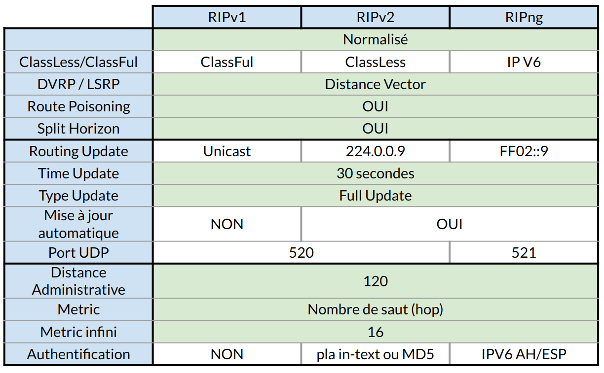
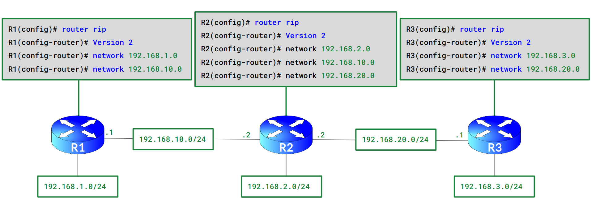
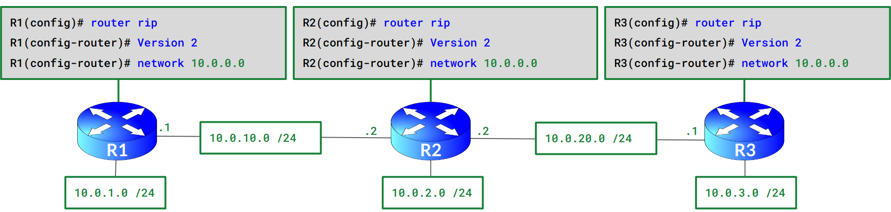
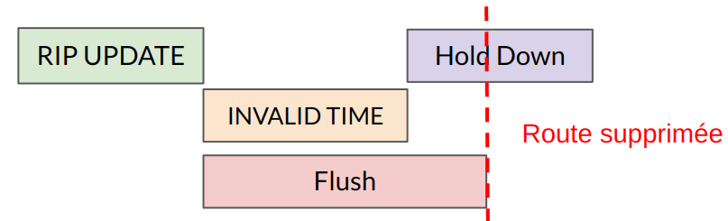
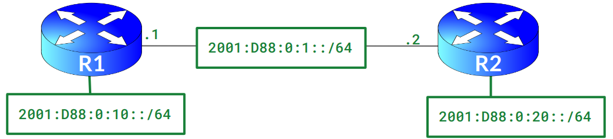

:titre: Protocole RIP
:module: Réseau
:duree: 120
:description: Le protocole RIP (Routing Information Protocol) est un protocole de routage dynamique utilisé pour échanger des informations de routage entre les routeurs.
include::../../../../adoc/libs/header-module.adoc[]

ifeval::["{visible-on-html}" !=  "yes"]
:docinfo: shared
:docinfodir: ../../../../adoc/libs
endif::[]


== Objectifs pédagogiques

// tag::objectifs[]
* Comprendre les versions de RIP et leurs différences
* Analyser des exemples d’utilisation et de configuration de RIP
* Maîtriser la configuration et les mises à jour de RIPng pour IPv6
// end::objectifs[]

// tag::deroulement[]

== Introduction

Protocoles de routage parmis les plus anciens, désormais rarement employé. 

Aborder son fonctionnement permet de mieux comprendre le routage dynamique.

include::../../../../adoc/libs/slide-notitle.adoc[]

**RIP** = **R**outing **I**nformation **P**rotocol, se décline en trois versions :

* RIPv1 (Classful)
* RIPv2 (Classless)
* RIPng (IPv6)

* protocole normalisé
* protocole IGP
* "Distance Vector" (Métrique) avec un maximum de 15 sauts
* transmet sa table de routage complète à ses "neighbors" par le biais de
** Split-horizon
** Route-poisoning
* diffuse périodiquement sa table de routage à ses "neighbors" (toutes les 30 secondes)

== RIP v1 vs RIP v2 vs RIPng

Le protocole de routage RIP doit être utilisé seulement en dernier recours.  Si nécessaire, privilégiez la version 2 du protocole RIP.

=== Comparaison



== Exemple 1

* Tous les réseaux utilisent des réseaux de Classe C. 
* Nécessaire de spécifier tous nos réseaux en /24



== Exemple 2

* Tous nos réseaux sont sur une adresse de Classe A.



include::../../../../adoc/libs/slide-notitle.adoc[]

Le routeur R2 est connecté à trois réseaux ClassLess du réseau 10.0.0.0 /8 (10.0.2.0 /24, 10.0.10.0 /24, 10.0.20.0 /24)

[cols="1,1"]
|===

a| 
si R1, R2 et R3 sont sur RIPv1, notre routage RIP deviendra inutilisable 
tout le monde annonçant le même réseau.

* R2 informera R1 et R3  qu'il possède le réseau 10.0.0.0 /8.
* R1 et R3 ayant la même configuration
* informent leurs voisins qu’ils possèdent le réseau 10.0.0.0 /8.
a| 
si R1, R2 et R3 sont sur RIPv2, 

* R2 informera R1 et R3 des  trois réseaux ClassLess du réseau 10.0.0.0 /8 (10.0.2.0 /24, 10.0.10.0 /24, 10.0.20.0 /24) qu’il connait

|===

== Mise à jour RIP

Nos routeurs s’attendent à recevoir des nouvelles de leurs voisins toutes les 30 secondes. En cas d’absence de nouvelles, plusieurs minuteurs seront activés :

* **Update** :Fréquence d’envoi des mises à jour 30 secondes par défaut 
* **Invalid** :Considère l’itinéraire invalide après X secondes et le place en mode Hold Down 180 secondes par défaut 
* **Hold Down** : Ignore les mises à jour de routage concernant ce réseau (sauf si cette mise à jour présente une Métrique plus faible) 180 secondes par défaut 
* **Flush** : Supprime la route de la table de routage 240 secondes par défaut 

include::../../../../adoc/libs/slide-notitle.adoc[]



```sh
R1(config-router)# timers basic [update] [Invalid] [Hold Down] [Flush]
R1(config)# router rip
R1(config-router)# timers basic 30 180 180 240
```

== Configuration RIPng (IP V6)



```sh
R1(config)# ipv6 unicast-routing !Active le routage pour le protocole ipv6.
R1(config)# ipv6 router rip FINGER_RIP_NG  !Active le protocole RIPng en globalitée.
R1(config-router)# exit
R1(config)# interface FastEthernet 0/0
R1(config-if)# ipv6 address 2001:DB8:0:1::1/64
R1(config-if)# ipv6 rip FINGER_RIP_NG enable 
R1(config-if)# exit
```

```sh
R2(config)# ipv6 unicast-routing
R2(config)# ipv6 router rip FINGER_RIP_NG
R2(config-router)# exit
R2(config)# interface FastEthernet 0/0
R2(config-if)# ipv6 address 2001:DB8:0:1::2/64
R2(config-if)# ipv6 rip FINGER_RIP_NG enable !Active le protocole RIPng sur l’interface, il cherchera donc des Neighbor sur ce réseau et diffusera ce réseau de la bulle RIPng.
R2(config-if)# exit
```

// tag::demo[]

== Démonstration

[NOTE.speaker]
--
Mettre en place l’exemple de la slide 5 dans packet tracer 

Routeur 1

```sh
Router>enable
Router#configure terminal
Router(config)#router rip
Router(config-router)#version 2
Router(config-router)#network 192.168.1.0
Router(config-router)#network 192.168.10.0
Router(config-router)#exit
Router(config)#interface GigaBitEthernet 0/0/0
Router(config-if)#ip address 192.168.10.1 255.255.255.0
Router(config-if)#no shutdown
Router(config-if)#exit
Router(config)#interface GigaBitEthernet 0/0/1
Router(config-if)#ip address 192.168.1.254 255.255.255.0
Router(config-if)#no shutdown
Router(config-if)#exit
Router(config)#exit
```

Routeur 2

```sh
Router>enable
Router#configure terminal
Router(config)#router rip
Router(config-router)#version 2
Router(config-router)#network 192.168.2.0
Router(config-router)#network 192.168.10.0
Router(config-router)#network 192.168.20.0
Router(config-router)#exit
Router(config)#interface GigaBitEthernet 0/0/0
Router(config-if)#ip address 192.168.20.2 255.255.255.0
Router(config-if)#no shutdown
Router(config-if)#exit
Router(config)#interface GigaBitEthernet 0/0/1
Router(config-if)#ip address 192.168.2.2 255.255.255.0
Router(config-if)#no shutdown
Router(config-if)#exit
Router(config)#interface GigaBitEthernet 0/0/2
Router(config-if)#ip address 192.168.10.2 255.255.255.0
Router(config-if)#no shutdown
Router(config-if)#exit
Router(config)#exit
```

Routeur 3

```sh
Router>enable
Router#configure terminal
Router(config)#router rip
Router(config-router)#version 2
Router(config-router)#network 192.168.3.0
Router(config-router)#network 192.168.20.0
Router(config-router)#exit
Router(config)#interface GigaBitEthernet 0/0/0
Router(config-if)#ip address 192.168.20.1 255.255.255.0
Router(config-if)#no shutdown
Router(config-if)#exit
Router(config)#interface GigaBitEthernet 0/0/1
Router(config-if)#ip address 192.168.3.254 255.255.255.0
Router(config-if)#no shutdown
Router(config-if)#exit
Router(config)#exit
```

une fois la configuration faire des show ip route sur les trois routeurs pour montrer les routes RIP
--

// end::demo[]

// end::deroulement[]

== Conclusion
// tag::conclusion[]
**Protocole RIP** : Ancien protocole de routage avec trois versions (RIPv1, RIPv2, RIPng).

**Caractéristiques** : Protocole IGP normalisé utilisant la métrique "Distance Vector" avec un maximum de 15 sauts.

**Méthodes de mise à jour** : Utilisation de Split-horizon et Route-poisoning pour la gestion des tables de routage, avec des mises à jour toutes les 30 secondes.

include::../../../../adoc/libs/slide-notitle.adoc[]

**Comparaison des versions :**

* **RIPv1** : unicast, sans authentification.
* **RIPv2** : multicast, avec authentification et mises à jour automatiques.
* **RIPng** : pour IPv6, similaire à RIPv2 en termes d'authentification.

**Utilisation recommandée** : Privilégier EIGRP ou OSPF sauf en absence d'alternatives.

**Configuration** : Commandes pour activer et configurer RIP, gérer les réseaux et les timers.

**Gestion des pannes** : Techniques comme Split-horizon et Route Poisoning pour maintenir l'intégrité des routes en cas de panne.
// end::conclusion[]