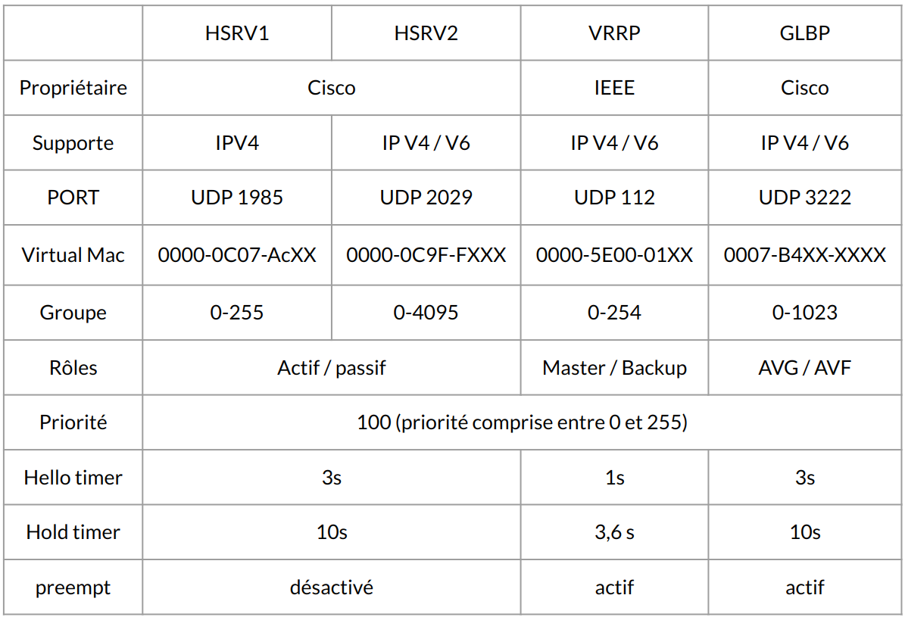

:titre: Redondance et Haute Disponibilité dans les Réseaux
:module: Réseau
:duree: 60
:description: La redondance réseau est un élément clé pour garantir la continuité de service. Dans ce module, nous aborderons les différents protocoles de redondance au premier saut de réseau (FHRP) et les avantages de chacun.
include::../../../../adoc/libs/header-module.adoc[]

ifeval::["{visible-on-html}" !=  "yes"]
:docinfo: shared
:docinfodir: ../../../../adoc/libs
endif::[]

== Objectifs pédagogiques

// tag::objectifs[]
* Comprendre le rôle et les types de protocoles FHRP
* Comparer les trois principaux protocoles FHRP
* Explorer les types d’architectures FHRP
// end::objectifs[]

// tag::deroulement[]

== FHRP : First Hop Redundancy Protocol

**FHRP** : First Hop Redundancy Protocol, mécanisme qui permet la redondance au premier saut de réseau.

* prévient l'interruption de la connectivité Internet lorsqu'un routeur tombe en panne en entreprise.
* Sans FHRP, si le routeur principal échoue, les PC ne peuvent pas se connecter à l'Internet malgré la présence d'un routeur secondaire.

=== Fonctionnement et Avantages du FHRP

* **Mécanisme de FHRP** : 
** Fonctionne en permettant à plusieurs routeurs de former un ensemble qui agit comme une seule passerelle par défaut. 
** Les routeurs dans ce groupe partagent une adresse IP virtuelle et une adresse MAC qui sont présentées aux hôtes du LAN.

include::../../../../adoc/libs/slide-notitle.adoc[]

* **Avantages clés :**
** La redondance augmente la disponibilité du réseau, 
** Réduit les interruptions de service et
** Améliore la robustesse du réseau contre les pannes de matériel. 
** Simplifie la gestion du réseau en réduisant le nombre de changements manuels nécessaires lorsqu'un routeur échoue.
** Continuité du service et aucune interruption pour les utilisateurs finaux, amélioration de la fiabilité du réseau.

include::../../../../adoc/libs/slide-notitle.adoc[]

* **Répartition de charge :**
* Certains protocols FHRP comme GLBP (Gateway Load Balancing Protocol), offrent également des capacités de répartition de charge,
* Permet à plusieurs routeurs de gérer le trafic entrant de manière équitable, ce qui optimise l'utilisation des ressources réseau.

== 3 principaux protocoles FHRP

les trois principaux protocoles utilisés pour implémenter le FHRP sont :

=== HSRP (Hot Standby Router Protocol)

* Propriétaire CISCO
* Mode de fonctionnement : Active / Standby qui permet la configuration d'un routeur actif et d'un ou plusieurs routeurs en veille

=== VRRP (Virtual Router Redundancy Protocol)

* Référence : Défini dans la RFC 5798
* standard ouvert ( interopérabilité entre différents constructeur)
* Mode de fonctionnement : Master / Backup

=== GLBP (Gateway Load Balancing Protocol)

* Propriétaire CISCO
* Mode de fonctionnement : Active / Active
* Fonctionnalité additionnelle : Load Balancing sur les deux liens actifs

=== Comparatif

== Types d'architectures

architecture la plus courante dans les petites entreprises, si le routeur vient à tomber, les clients ne peuvent plus sortir vers l’extérieur

[cols="1,1"]
|===

a| Client configuré avec la passerelle 
par défaut  : **.252**
a| image::./assets/04-archi.png[]

|===

Afin de mettre en place de la redondance pour se prévenir d’une panne, il est préférable de mettre en place un second routeur

include::../../../../adoc/libs/slide-notitle.adoc[]

[cols="1,1"]
|===

a| Mise en place un second routeur

Le problème de cette architecture

* nos clients n’ont qu’une seule passerelle par défaut de configurer (.252).
* En cas de défaillance il faudra passer sur tous les postes clients pour changer leurs configurations réseau. 
* Cette solution n’est pas viable. 

Solution mise en place de FHRP
a| image::./assets/04-archi-2.png[]

192.168.10.0 /24

Client configuré avec la passerelle par défaut  : **.252**

|===

include::../../../../adoc/libs/slide-notitle.adoc[]

[cols="1,1"]
|===

a| FHRP va permettre d’avoir une passerelle par défaut “Virtuel”. 

* IP associée à une adresse MAC virtuelle.
* Paramètres hébergés par un de nos routeurs.
a| image::./assets/04-archi-3.png[]

192.168.10.0 /24

Client configuré avec la passerelle par défaut  : **.254**

|===

include::../../../../adoc/libs/slide-notitle.adoc[]

En cas de panne d’un des routeurs, 

* Le temps de basculement en cas de panne
* l’élection du routeur principale 
* le type d’échange entre nos deux routeurs 
* vont dépendre du protocole utilisé
** HSRP, 
** VRRP 
** GLBP
* Les deux adresses vont être supportées par le second routeur. 
* panne non perceptible par nos clients.

// end::deroulement[]

== Conclusion
// tag::conclusion[]
**FHRP** : Fournit une redondance pour les passerelles par défaut dans un réseau, assurant une continuité de la connexion si la passerelle principale devient inaccessible.

**Types de FHRP :**

* **HSRP (Hot Standby Router Protocol)** : Protocole propriétaire de Cisco, où un routeur est actif et un autre en veille, prêt à prendre le relais en cas de défaillance.
* **VRRP (Virtual Router Redundancy Protocol)** : Standard ouvert, fonctionnant de manière similaire à HSRP, permettant également un basculement automatique.
* **GLBP (Gateway Load Balancing Protocol)** : Protocole Cisco qui, en plus de la redondance, répartit le trafic entre 
plusieurs passerelles.

include::../../../../adoc/libs/slide-notitle.adoc[]

**Fonctionnement** : FHRP crée une adresse IP virtuelle partagée entre les routeurs du groupe. 

**Avantage principal** : Maintient la connectivité réseau sans intervention manuelle, en basculant automatiquement vers une passerelle de secours.

// end::conclusion[]