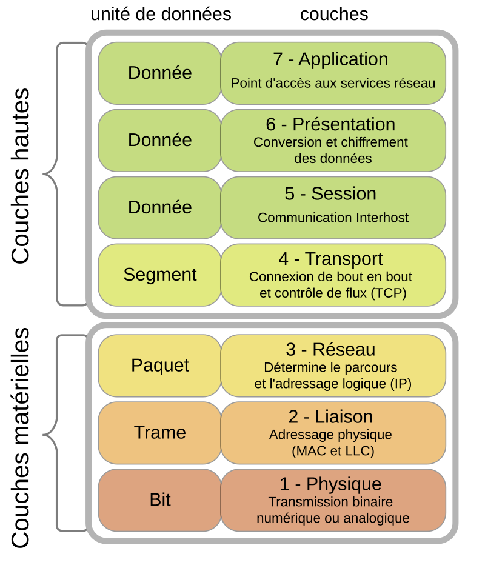
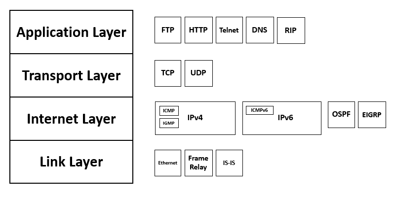
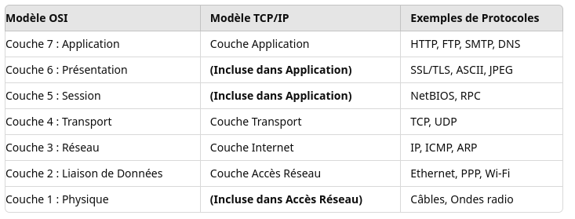
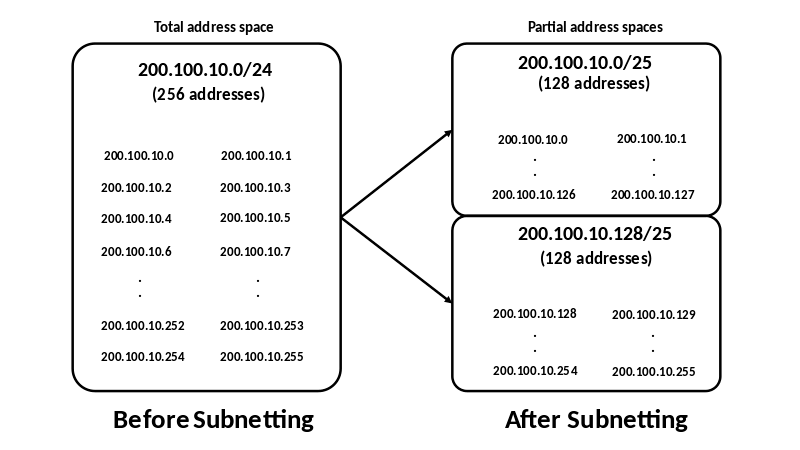
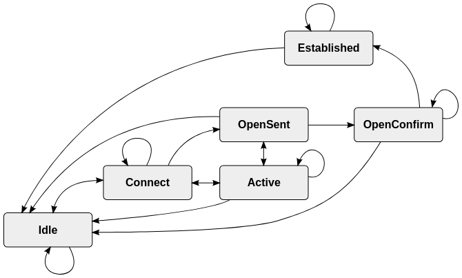
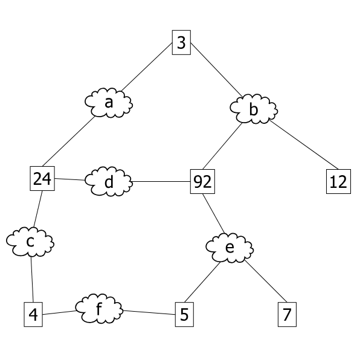
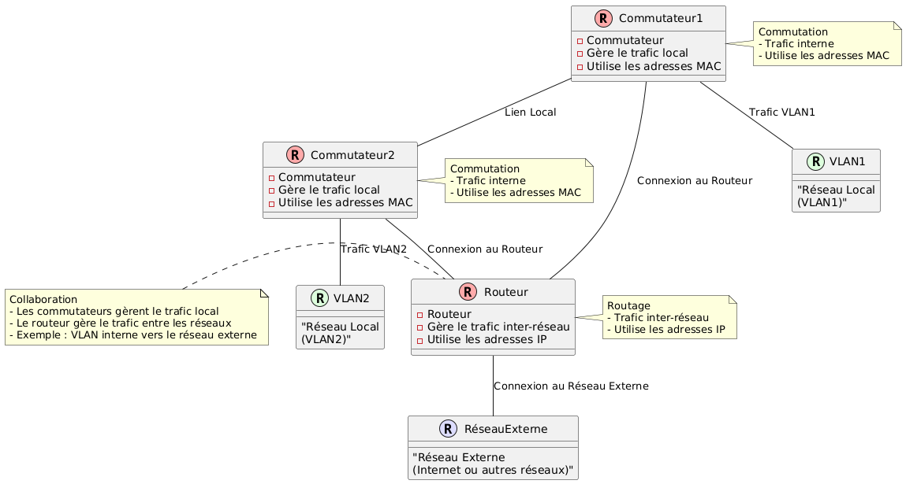
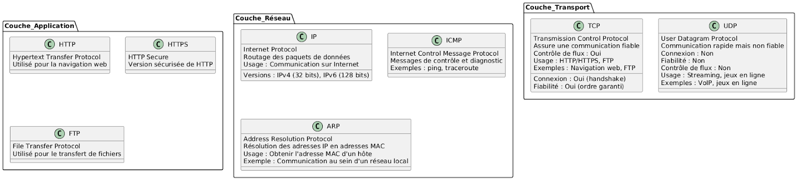

:titre: Remise à niveau réseau
:module: Réseau
:duree: 165
:description: Rafraîchissement sur les concepts de base des réseaux
include::../../../../adoc/libs/header-module.adoc[]

ifeval::["{visible-on-html}" !=  "yes"]
:docinfo: shared
:docinfodir: ../../../adoc/libs
endif::[]

== Objectifs pédagogiques

// tag::objectifs[]
* Comprendre et savoir expliquer le modèle OSI et le modèle TCP/IP.
* Maîtriser les concepts d'adressage IP, incluant IPv4 et IPv6.
* Appréhender les principes du routage et de la commutation dans les réseaux.
* Connaître et manipuler les principaux protocoles réseaux.
// end::objectifs[]

// tag::deroulement[]
== Modèle OSI et modèle TCP/IP

=== Modèle OSI

[NOTE.speaker]
--
**Couche Physique (Layer 1) :**

* **Rôle** : Transmet les données sous forme de bits via des supports physiques comme les câbles ou les ondes radio.
* **Exemples** : Ethernet, Wi-Fi, câbles fibre optique.

**Couche Liaison de Données (Layer 2) :**

* **Rôle** : Gère la transmission des données entre deux nœuds adjacents et assure la détection d'erreurs.
* **Exemples** : MAC (Media Access Control), Ethernet, Switches.

**Couche Réseau (Layer 3) :**

* **Rôle** : Gère l'acheminement des paquets de données entre les différents réseaux. C'est ici que le routage se fait.
* **Exemples** : IP (Internet Protocol), Routeurs.

**Couche Transport (Layer 4) :**

* **Rôle** : Assure la livraison complète et correcte des données, avec des services comme le contrôle de flux et la correction d'erreurs.
* **Exemples** : TCP (Transmission Control Protocol), UDP (User Datagram Protocol).

**Couche Session (Layer 5) :**

* **Rôle** : Gère et contrôle les connexions entre ordinateurs, y compris l'établissement, la gestion et la terminaison des sessions.
* **Exemples** : RPC (Remote Procedure Call), NetBIOS.

**Couche Présentation (Layer 6) :**

* **Rôle** : Convertit les données pour qu'elles puissent être interprétées correctement par l'application, gère également la compression et le cryptage des données.
* **Exemples** : SSL/TLS, ASCII, JPEG.

**Couche Application (Layer 7) :**

* **Rôle** : Fournit des services de réseau aux applications de l'utilisateur, comme les services de messagerie, de navigation web, etc.
* **Exemples** : HTTP, FTP, SMTP, DNS.
--

=== Modèle TCP/IP

[NOTE.speaker]
--
**Couche Accès Réseau (Link Layer) :**

* **Rôle** : Combine les couches Physique et Liaison de Données du modèle OSI. Elle gère les technologies de transmission et les protocoles d'accès au réseau.
* **Correspondance OSI** : Couches 1 (Physique) et 2 (Liaison de Données).
* **Exemples** : Ethernet, Wi-Fi.

**Couche Internet (Internet Layer) :**

* **Rôle** : Gère l'adressage, le routage, et la transmission de paquets sur le réseau.
* **Correspondance OSI** : Couche 3 (Réseau).
* **Exemples** : IP (Internet Protocol).

**Couche Transport (Transport Layer) :**

* **Rôle** : Assure la livraison des données entre les systèmes finaux, gère le contrôle de flux, la segmentation, et la correction d'erreurs.
* **Correspondance OSI** : Couche 4 (Transport).
* **Exemples** : TCP, UDP.

**Couche Application (Application Layer) :**

* **Rôle** : Gère les protocoles de communication pour les applications réseau, en englobant les fonctions des couches Session,Présentation, et Application du modèle OSI.
* **Correspondance OSI** : Couches 5 (Session), 6 (Présentation), et 7 (Application).
* **Exemples** : HTTP, FTP, SMTP.
--

=== Importance de ces modèles

**Diagnostic des problèmes réseau**

* permettent d’identifier rapidement l’origine des problèmes réseau en séparant les étapes de la communication
* Exemple : si un problème est identifié sur la couche Réseau, les administrateurs peuvent se concentrer sur les protocoles et équipements de cette couche, comme les routeurs et le routage IP

**Compréhension des interactions**

* aide à concevoir des systèmes plus robustes et à anticiper les problèmes potentiels
* particulièrement important lors de la mise en oeuvre de nouvelles technologies ou la gestion d’environnements réseau complexes

=== Comparatif OSI et TCP/IP

// tag::exercice[]
== Exercice

* Un utilisateur tente d’accéder à un site web via un navigateur, mais la page ne se charge pas.

* Un problème de lenteur est détecté lors d’un transfert de fichier via FTP

**Pour ces deux situations, quelles sont les couches potentiellement impliquées, et que faut-il vérifier concrètement pour chaque couche impliquée ?**

[NOTE.speaker]
--
**Scénario 1** : Un utilisateur tente d'accéder à un site web via un navigateur, mais la page ne se charge pas.

* **Couches impliquées :**
** **Couche 7 (Application)** : Vérification du protocole HTTP/HTTPS utilisé.
** **Couche 4 (Transport)** : Vérification des connexions TCP (établissement et maintenance des connexions).
** **Couche 3 (Réseau)** : Vérification du routage IP, adresses IP correctes.
** **Couche 2 (Liaison de Données)** : Vérification des connexions au réseau local, configuration du switch.
** **Couche 1 (Physique)** : Vérification des câbles, du signal Wi-Fi.

**Scénario 2** : Problème de lenteur lors du transfert de fichiers via FTP.

* **Couches impliquées :**

** **Couche 7 (Application)** : Vérification de la configuration du serveur FTP.
** **Couche 4 (Transport)** : Contrôle des segments TCP, congestion éventuelle.
** **Couche 3 (Réseau)** : Vérification des routes IP, des goulots d'étranglement.
** **Couche 2 (Liaison de Données)** : Contrôle des collisions sur le réseau local.
** **Couche 1 (Physique)** : Vérification du matériel réseau.
--
// end::exercice[]

== Adressage IP (IPv4 et IPv6)

=== IPv4

* **Structure :**
** composées de 32 bits, divisés en 4 octets (8 bits chacun)
** généralement écrites en notation décimale séparée par des points `192.168.1.1`
** chaque octet peut varier de 0 à 255, permettant un total de 2³² possibilités (env. 4,3 milliards d’adresses)

include::../../../../adoc/libs/slide-notitle.adoc[]

* **Classes d’adresses :**
** **Classe A** : `1.0.0.0` à `126.0.0.0` (16 millions d'adresses par réseau, 128 réseaux maximum).
** **Classe B** : `128.0.0.0` à `191.255.0.0` (65 536 adresses par réseau, 16 384 réseaux maximum).
** **Classe C** : `192.0.0.0` à `223.255.255.0` (256 adresses par réseau, 2 millions de réseaux maximum).
** **Classe D** : `224.0.0.0` à `239.255.255.255` (Réservée pour le multicast).
** **Classe E** : `240.0.0.0` à `255.255.255.255` (Réservée pour des usages futurs et expérimentations).

include::../../../../adoc/libs/slide-notitle.adoc[]

* **Masque de sous-réseau**
** utilisé pour diviser un réseau en sous-réseaux plus petits 
** définit la portion de l’adresse IP qui est utilisée pour l’identification du réseau par rapport à la portion utilisée pour les hôtes
** **Exemple** : pour l’adresse `192.168.1.1` avec un masque de sous-réseau `255.255.255.0`, les 24 premiers bits sont utilisés pour l’identification du réseau, les 8 derniers pour les hôtes

include::../../../../adoc/libs/slide-notitle.adoc[]

* **CIDR (Classless Inter-Domain Routing)**
** permet d’assigner des adresses IP et des routes sans se limiter aux classes traditionnelles
** utilise la notation /n pour indiquer le nombre de bits dans le masque de sous-réseau
** **Exemple** : l’adresse `192.168.1.0/24` signifie que les 24 premiers bits sont utilisés pour l’identification du réseau, avec 256 adresses disponibles pour les hôtes

=== IPv6

* **Structure**
** composées de 128 bits, divisés en 8 groupes de 16 bits chacun, et écrites en notation hexadécimale séparée par des deux-points 
** chaque groupe peut varier de `0000` à `ffff`, permettant un total de 2¹²⁸ adresses, soit environ 3 x 10³⁸ adresses

* **Notation**
** Complète: `2001:0db8:85a3:0000:0000:8a2e:0370:7334`
** Abrégée : `2001:db8:85a3::8a2e:370:7334`

include::../../../../adoc/libs/slide-notitle.adoc[]

* **Avantages par rapport à IPv4**
** espace d’adressage étendu
** autoconfiguration stateless
** sécurité intégrée (IPsec)
** simplification des en-têtes pour améliorer les performances

* **Transition d’IPv4 à IPv6**
** via des techniques telles que la double pile (dual stack), la translation d’adresse (NAT64) et les tunnels 6to4
** les réseaux doivent adopter progressivement IPv6 tout en continuant de supporter IPv4 pendant la transition

=== Sous-réseautage

* **Définition**
** consiste à diviser un réseau en plusieurs sous-réseaux plus petits pour améliorer la gestion, la performance et la sécurité
** permet une meilleure utilisation de l’espace d’adresse IP et facilite l’organisation et l’isolation des différents segments réseau

include::../../../../adoc/libs/slide-notitle.adoc[]

* **Calcul de taille du sous-réseau :**
** il faut déterminer le nombre de bits nécessaires pour le nombre souhaité de sous-réseaux et d’hôtes
** Exemple : Pour créer 8 sous-réseaux à partir d’un réseau `192.168.1.0/24`, on doit emprunter 3 bits de l’espace d’hôtes (2³ = 8 sous-réseaux)
** Autre exemple
*** réseau initial : `192.168.1.0/24`
*** nouveau masque : `/27` (35-5 bits pour les hôtes)
*** sous-réseaux : `192.168.1.0/27`, `192.168.1.32/27`, `192.168.1.64/27`, etc.

include::../../../../adoc/libs/slide-notitle.adoc[]

== Routage et communication

=== Routage

* **Principes** 
** processus de détermination du meilleur chemin pour acheminer les paquets de données d’un réseau à un autre
** utilise des tables de routage pour décider où envoyer les paquets en fonction de leur adresse de destination

include::../../../../adoc/libs/slide-notitle.adoc[]

* **Tables de routage**
** contient des informations sur les routes disponibles pour y acheminer des paquets, y compris les adresses de destination, les masques de sous-réseau et les routes de passerelle
** Exemple :
*** Destination : `192.168.1.0`
*** Masque : `255.255.255.0`
*** Passerelle : `192.168.0.1`

include::../../../../adoc/libs/slide-notitle.adoc[]

* **Types de routage**
** statique : les routes sont définies manuellement
** dynamique : utilise des protocoles de routage pour échanger des informations de routage et mettre à jour les tables de routage automatiquement

include::../../../../adoc/libs/slide-notitle.adoc[]

* **Procotoles de routage**
** **RIP** : Routing Information Protocol, un protocole de routage à vecteur de distance qui utilise le nombre de sauts comme métrique pour déterminer le meilleur chemin
** **OSPF** : Open Shortest Path First, un protocole de routage à état de lien qui utilise une carte complète du réseau pour déterminer le chemin le plus court
** **BGP** : Border Gateway Protocol, un protocole de routage inter-domaines utilisé pour échanger des informations de routage entre différents systèmes autonomes sur Internet

=== Routage BGP

=== Commutation

* **Rôle des commutateurs**
** appareils réseau qui connectent plusieurs dispositifs au sein d’un réseau local (LAN) et utilisent les adresses MAC pour acheminer les trames de données uniquement vers les ports concernés
** ils créent des tables d’adresses MAC pour savoir quel port utiliser pour chaque adresse MAC source

include::../../../../adoc/libs/slide-notitle.adoc[]

* **Tables MAC**
** Contient les adresses MAC associées aux ports du commutateur
** Exemple : 
*** Adresse MAC : `00:1A:2B:3C:4D:5E`
*** Port : `1`

include::../../../../adoc/libs/slide-notitle.adoc[]

* **VLANs (Virtual LANs)** :
** une technique qui permet de diviser un réseau physique en plusieurs réseaux logiques isolés. Permet de segmenter le réseau pour améliorer la sécurité et la gestion
** Exemple : VLAN 10 pour les services, VLAN 20 pour la comptabilité

include::../../../../adoc/libs/slide-notitle.adoc[]

* **Spanning Tree Protocol (STP)**
** prévient les boucles de commutation en créant une topologie de réseau sans boucle
** identifie et désactive les chemins redondants qui pourraient créer des boucles dans le réseau

=== Spanning Tree Protocol

[NOTE.speaker]
--
Explication du STP avec schémas : https://fr.wikipedia.org/wiki/Spanning_Tree_Protocol
--

=== Interaction routeur / commutateur

== Protocoles réseau

=== 💻 Couche application

**HTTP (HyperText Transfer Protocol)** :

* **Fonction** : transmission de documents hypertextes (pages web) sur le web.
* **Port** : 80
* **Usage** : communication entre les navigateurs web et les serveurs web.
* **Exemple** : `http://www.example.com`

include::../../../../adoc/libs/slide-notitle.adoc[]

**HTTPS (HyperText Transfer Protocol Secure)** :

* **Fonction** : version sécurisée de HTTP, chiffre les données échangées pour protéger la confidentialité et l'intégrité.
* **Port** : 443
* **Usage** : transactions sécurisées sur Internet, telles que les achats en ligne et la gestion des comptes bancaires.
* **Exemple** : `https://www.example.com`

include::../../../../adoc/libs/slide-notitle.adoc[]

**FTP (File Transfer Protocol)** :

* **Fonction** : transfert de fichiers entre un client et un serveur.
* **Ports** : 21 (contrôle), 20 (données)
* **Usage** : téléchargement et upload de fichiers sur des serveurs FTP.
* **Exemple** : `ftp://ftp.example.com`

include::../../../../adoc/libs/slide-notitle.adoc[]

**DNS (Domain Name System)** :

* **Fonction** : résout les noms de domaine en adresses IP et vice versa.
* **Port** : 53
* **Usage** : conversion des noms de domaine (comme `www.example.com`) en adresses IP numériques.
* **Exemple** : `www.example.com` → `192.0.2.1`

include::../../../../adoc/libs/slide-notitle.adoc[]

**DHCP (Dynamic Host Configuration Protocol)** :

* **Fonction** : assigne automatiquement des adresses IP et autres paramètres réseau aux dispositifs sur un réseau.
* **Port** : 67 (serveur), 68 (client)
* **Usage** : simplifie la gestion des adresses IP en attribuant automatiquement des adresses aux dispositifs lorsqu'ils se connectent au réseau.
* **Exemple** : configuration automatique d'une adresse IP sur un ordinateur.

=== 🚚 Couche transport 

**TCP (Transmission Control Protocol) :**

* **Fonction** : communication fiable, ordonnée et sans erreur entre les applications via des connexions.
* **Caractéristiques** :
** **Connexion** : établit une connexion avant le transfert des données (handshake en trois étapes).
** **Fiabilité** : garantit la livraison des paquets et leur ordre.
** **Contrôle de flux** : utilise des mécanismes pour éviter la surcharge.
* **Usage** : applications nécessitant une transmission fiable comme HTTP/HTTPS, FTP.
* **Exemple** : navigation web, transfert de fichiers.

include::../../../../adoc/libs/slide-notitle.adoc[]

**UDP (User Datagram Protocol) :**

* **Fonction** : communication rapide mais non fiable entre les applications.
* **Caractéristiques** :
** **Connexion** : pas de connexion établie avant le transfert des données.
** **Fiabilité** : pas de garantie de livraison ou d’ordre des paquets.
** **Contrôle de flux** : aucun mécanisme de contrôle de flux.
* **Usage** : applications nécessitant une faible latence comme le streaming vidéo, les jeux en ligne.
* **Exemple** : VoIP, jeux en ligne.

=== 🛜 Couche réseau

**IP (Internet Protocol) :**

* **Fonction** : routage des paquets de données entre les hôtes sur un réseau.
* **Versions** :
** **IPv4** : utilise des adresses de 32 bits, par exemple `192.168.1.1`.
** **IPv6** : utilise des adresses de 128 bits, par exemple `2001:0db8:85a3:0000:0000:8a2e:0370:7334`.
* **Usage** : fondamental pour la communication sur Internet.

include::../../../../adoc/libs/slide-notitle.adoc[]

**ICMP (Internet Control Message Protocol) :**

* **Fonction** : messages de contrôle et de diagnostic des réseaux, comme les erreurs et les informations de diagnostic.
* **Exemples** :
** `ping` : vérifie la connectivité entre deux hôtes.
** `traceroute` : détermine le chemin des paquets entre deux hôtes.

include::../../../../adoc/libs/slide-notitle.adoc[]

**ARP (Address Resolution Protocol) :**

* **Fonction** : résout les adresses IP en adresses MAC au sein d'un réseau local.
* **Usage** : obtenir l'adresse MAC d'un hôte à partir de son adresse IP.
* **Exemple** : lorsqu'un ordinateur veut envoyer des données à un autre sur le même réseau local, il utilise ARP pour obtenir l'adresse MAC de l'hôte cible.

=== Récapitulatif des principaux protocoles réseau

// end::deroulement[]

== Conclusion

* Compréhension des modèles OSI et TCP/IP et leur application dans le diagnostic réseau.
* Maîtrise des concepts d’adressage IP, incluant le sous-réseautage en IPv4 et IPv6.
* Connaissance des principes de routage et de commutation, avec une capacité à configurer des routes et des VLANs.
* Familiarité avec les principaux protocoles réseaux et leur usage dans les différentes couches du modèle TCP/IP.
