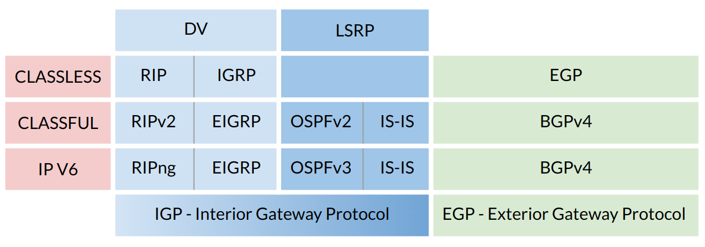

:titre: Routage dynamique
:module: Réseau
:duree: 150
:description: Comprendre l'intérêt et le fonctionnement du routage dynamique
include::../../../../adoc/libs/header-module.adoc[]

ifeval::["{visible-on-html}" !=  "yes"]
:docinfo: shared
:docinfodir: ../../../../adoc/libs
endif::[]


== Objectifs pédagogiques

// tag::objectifs[]
* Introduire les principaux protocoles de routage, notamment RIP, OSPF, EIGRP et BGP, et expliquer leur rôle dans la gestion des routes réseau.
* Analyser le fonctionnement interne des protocoles de routage, y compris leurs méthodes de calcul de routes et mise à jour des tables de routage.
* Expliquer la distinction entre les protocoles de routage IGP (Interior Gateway Protocol) et EGP (Exterior Gateway Protocol), et leur utilisation respective au sein et entre les réseaux.
// end::objectifs[]

// tag::deroulement[]
== Introduction

Le routage dynamique permet d’ajuster automatiquement les tables de routage en fonction des différents mouvement de la topologie du réseau.

quatre fonctions principales permettent de faire cela 

* L’acquisition d’information : le routeur collecte les informations de routage de ses voisins
* Le partage d’information : Le routeur diffuse les informations de routage à ses voisins
* choix de la meilleur route : si plusieurs routes le choix se fait en fonction du protocole de routage utilisé (RIP, EIGRP, OSPF …) 
* Capacité d’adaptation : Détection et réaction aux mouvement dans la topologie du réseau (variation du débit, lien coupé …)

== Protocoles de routages

Protocoles courants de routage dynamique : 

* RIP
* OSPF
* EIGRP
* BGP

=== RIP : Routing Information Protocole

* **Utilise UDP comme protocole de transport**
* **Métrique** : Basée sur le nombre de sauts (hop count).
* **Valeur maximale** : 15 (16 signifie inatteignable).
* **Mise à jour périodique** : RIP envoie des mises à jour complètes de la table de routage toutes les 30 secondes par défaut à tous les routeurs voisins, 
* **Timers** : Le RIP utilise plusieurs timers pour gérer la stabilité des informations de routage,comme les timers de mise à jour, d'invalidité, de suppression et de récupération.

=== OSPF (Open Shortest Path First)

protocole de routage à état de lien qui calcule le chemin le plus court entre le routeur source et tous les autres routeurs dans le même domaine de routage à l'aide de l'algorithme de Dijkstra.

* **Métrique** :  le coût est utilisé pour déterminer le meilleur chemin. Calculé en fonction de la bande passante de la connexion,.Coût, généralement inversement proportionnel à la bande passante.
* **Valeur typique** : Dépend de la bande passante; par exemple, 100 Mbps a un coût de 10, 1 Gbps a un coût de 1.

include::../../../../adoc/libs/slide-notitle.adoc[]

* **Zones OSPF** : Permet d’améliorer la charge de routage, 
** Permet de diviser un grand réseau en plusieurs zones hiérarchiques. 
** Chaque zone maintient sa propre base de données d'état de lien,
** réduit la quantité de données de routage à traitée par chaque routeur.
* **Rapidité de convergence et efficacité** : OSPF offre une convergence plus rapide que RIP de part l'utilisation immédiate des nouvelles informations de routage dès qu'elles deviennent disponibles.

=== EIGRP (Enhanced Interior Gateway Routing Protocol)

Protocole de routage avancé développé par Cisco, combine des caractéristiques des protocoles à vecteur de distance et à état de lien.

* **Métrique composite** : Basée sur la bande passante, le délai (et optionnellement la charge et la fiabilité).
* **Valeur** : Calculée via une formule complexe incluant bande passante et délai.
* **Mise à jour conditionnelle** : Contrairement au RIP, l'EIGRP envoie des mises à jour partielles, réduisant la charge sur le réseau. Ces mises à jour ne sont envoyées que lorsque l'état d'une route change, ce qui optimise considérablement l'utilisation de la bande passante

=== BGP (Border Gateway Protocol)

* **Métrique** : Utilise l'attribut MED (Multi-Exit Discriminator) pour influencer les décisions de routage entre des routes équivalentes reçues de différents systèmes autonomes.
* **Valeur** : Assignée par l'administrateur, sans valeur fixe ou typique universelle.

== Mécanismes des protocoles

Chacun de ces protocoles possède des caractéristiques et des mécanismes distincts. 



[NOTE.speaker]
--
**DISTANCE VECTOR(DV) / DVRP (Distance Vector Routing Protocols) :**

Construction de tables de routage basé sur la "distance" jusqu'à la destination.
Dans DVRP, la "distance" est généralement mesurée en nombre de sauts (hops) entre le routeur source et le routeur de destination.

**LSRP (Link State Routing Protocols) :**

Les protocoles mettent à jour leurs tables de routage en fonction de l'état des liens avec leurs voisins.
Ils évaluent le réseau en prenant en compte l'état de chaque lien
--

include::../../../../adoc/libs/slide-notitle.adoc[]

La principale différence  entre le routage "classful" et "classless",  est basée sur l'utilisation et l'interprétation des masques de sous-réseau.

=== Classful

* Les adresses IP sont catégorisées en classes (A, B ou C) selon leurs premiers bits.
* Les masques de sous-réseau sont prédéfinis par classe :

```sh
Classe A : 255.0.0.0		 Classe B : 255.255.0.0		 Classe C : 255.255.255.0
```

* Les routeurs en mode classful ne communiquent pas le masque de sous-réseau lors des mises à jour entre routeurs, nécessitant une connaissance des masques standard par classe.

=== Classless :

* Permet l'utilisation de n'importe quel masque de sous-réseau pour avoir une division plus fine des réseaux.
* Les masques de sous-réseau sont communiqués avec l'adresse IP lors des annonces, permettant des subdivisions et agrégations plus précises et optimisant l'utilisation de l'espace d'adressage IP.
* Le routage classless est la norme en raison de sa flexibilité et de son efficacité, tandis que le routage classful est souvent considéré comme obsolète.

== IGP/EGP

Il y a deux principales catégories de protocoles de routage dynamique :

* IGP
* EGP

=== IGP (Interior Gateway Protocols) :

* Utilisés à l’intérieur d’un système autonome unique (AS).
* Employés dans une organisation ou entreprise sous une administration unifiée.
* Principaux protocoles IGP :
** RIP (Routing Information Protocol)
** OSPF (Open Shortest Path First)
** IS-IS (Intermediate System to Intermediate System)
** IGRP (Interior Gateway Routing Protocol) : spécifique à Cisco.
** EIGRP (Enhanced Interior Gateway Routing Protocol) : également spécifique à Cisco.

=== EGP (Exterior Gateway Protocols) :

* Etablir des connexions de routage entre différents systèmes autonomes.
* Permet de connecter plusieurs IGP et coordonner le trafic Internet 
* Principaux protocoles EGP :
** EGP (Exterior Gateway Protocol) : largement obsolète aujourd’hui.
** BGP (Border Gateway Protocol) : principal protocole EGP actuel

=== Différences clés entre IGP et EGP :

_Interior Gateway Protocol (IGP) :_

* Conçu pour opérer à l'intérieur d'un AS.
* Administration centralisée de tous les équipements actifs.

_Exterior Gateway Protocol (EGP) :_

* Protocole de routage externe.
* Fournit une interconnexion entre différents IGP.
* Agit comme un pont entre divers systèmes autonomes.

// end::deroulement[]

== Conclusion
// tag::conclusion[]
**RIP : **

Protocole simple, basé sur la distance, limité en scalabilité, adapté aux petits réseaux.

**OSPF : **

Protocole hiérarchique, basé sur l’algorithme SPF, offrant une convergence rapide et adapté aux grands réseaux.

**EIGRP et BGP : **

EIGRP est un protocole interne optimisé pour Cisco, tandis que BGP est indispensable pour le routage entre domaines autonomes (réseaux d’organisations différentes).

include::../../../../adoc/libs/slide-notitle.adoc[]

**Mécanismes des Protocoles : **

Compréhension des différences entre distance vector et état de lien, essentiels pour optimiser les chemins et la résilience du réseau.

**IGP vs EGP :** 

Distinction claire entre routage interne (IGP) et routage externe (EGP), soulignant l'importance du choix de protocole en fonction de l’architecture réseau.
// end::conclusion[]