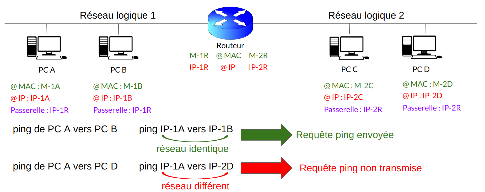
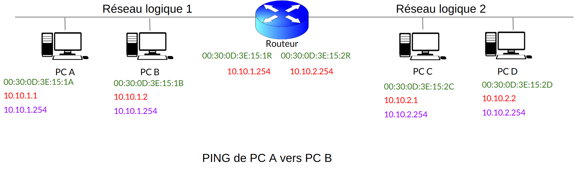
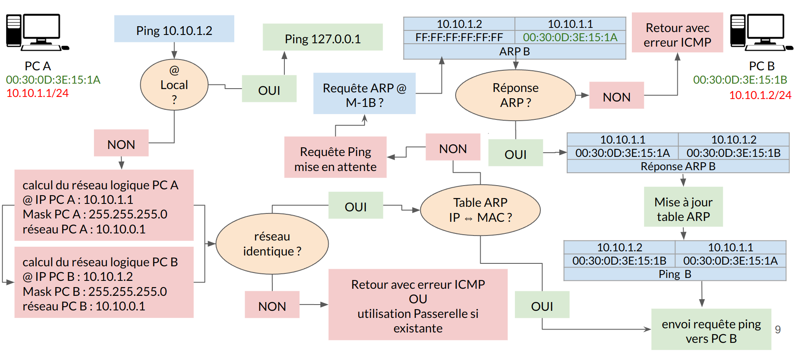
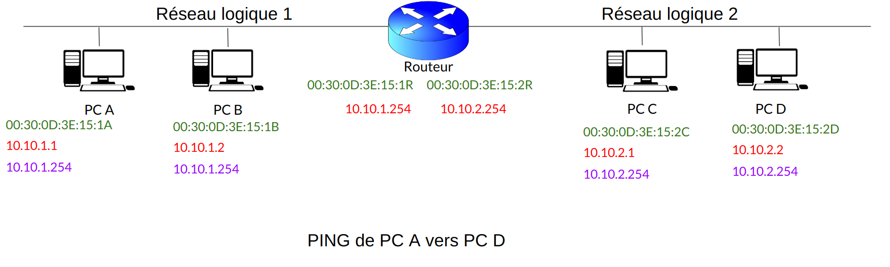
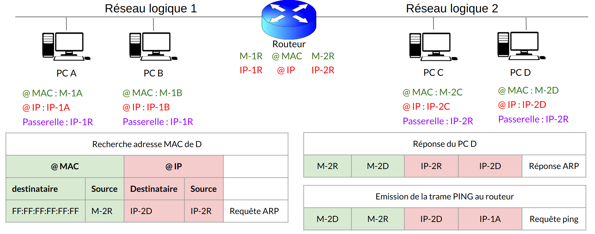
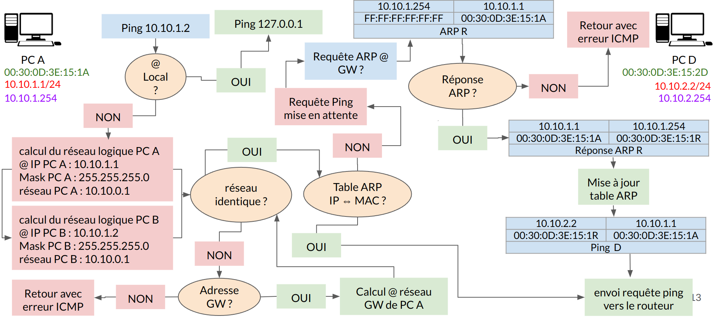
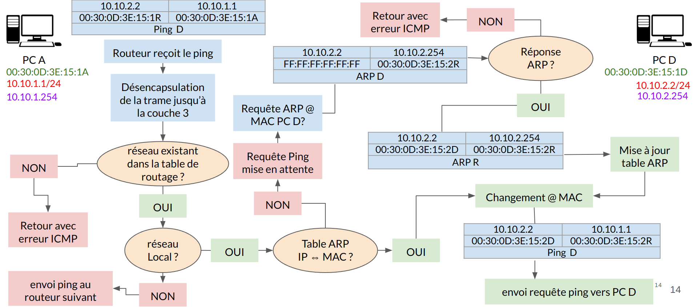

:titre: Principe du routage
:module: Réseau
:duree: 150
:description: Comprendre l'intérêt et le fonctionnement du routage
include::../../../../adoc/libs/header-module.adoc[]

ifeval::["{visible-on-html}" !=  "yes"]
:docinfo: shared
:docinfodir: ../../../../adoc/libs
endif::[]


== Objectifs pédagogiques

// tag::objectifs[]
* Routage principes
* Routage les métriques
* Routage configuration de base
* Communication dans un même réseau logique
* Communication ping segment réseau identique 
* Communication dans des réseaux logiques différents 
* Routeur mode de configuration 
// end::objectifs[]

// tag::deroulement[]
== Généralités

Le routage permet de faire circuler des paquets d’un point A à un point B, le routeur ou le PC s’appuie sur leurs table de routage qui se compose de :

* **Réseau de destination** : L'adresse IP du réseau de destination pour lequel la route est définie.
* **Masque réseau** : Le masque de sous-réseau associé à l'adresse IP du réseau de destination.
* **Passerelle** : L'adresse IP de la passerelle (next hop) à utiliser pour atteindre le réseau de destination.
* **Interface** : L'adresse IP de l'interface locale à utiliser pour envoyer les paquets à la passerelle.
* **Métrique** : La valeur de métrique associée à la route, qui est utilisée pour déterminer la route préférée parmi plusieurs routes possibles vers une destination.

== Les métriques

Les métriques dans le routage peuvent varier en fonction du protocole de routage utilisé et les spécificités du réseau. 

Voici un aperçu des valeurs de métrique typiques utilisées par différents protocoles de routage :

* **Route statique (pas de Protocole de routage dynamique)** : Basée sur la priorisation 
* **RIP (Routing Information Protocol)** : Basée sur le nombre de sauts (hop count).
* **OSPF (Open Shortest Path First)** : Coût, généralement inversement proportionnel à la bande passante.

include::../../../../adoc/libs/slide-notitle.adoc[]

* **EIGRP (Enhanced Interior Gateway Routing Protocol)** : Basée sur la bande passante, le délai 
* **IS-IS (Intermediate System to Intermediate System)** : Peut utiliser n'importe quelle valeur attribuée par l'administrateur, souvent basée sur la bande passante ou d'autres paramètres de performance.
* **BGP (Border Gateway Protocol)** : Utilise l'attribut MED (Multi-Exit Discriminator) pour influencer les décisions de routage entre des routes équivalentes reçues de différents systèmes autonomes.

== Routeur : initialisation

Nouveau routeur :

Etape 1 : Effacer la configuration de base , doit impérativement être fait

```sh
Router> enable
Router# write erase
Erasing the nvram filesystem will remove all configuration files! Continue ? [confirm] 
[ok]
Erase of nvram: complete
%SYS-7-NV_BLOCK_INIT: Initialized the geometry of nvram
Router# reload
System configuration has been modified. save? [yes/no] : no
Proceed with reload? [confirm]
```

include::../../../../adoc/libs/slide-notitle.adoc[]

Etape 2 : Le routeur va redémarrer et demander s’il doit générer une configuration de base? la réponse est non 

```sh
--- System Configuration Dialog --- 
Would you like to enter the initial configuration dialoge?			[yes/no] : no
```

=== Configuration de base

Etape 1 : Nommer le routeur

```sh
router> enable
router# configure terminal
router (config)# hostname RT_01
RT_01(config)#
```

include::../../../../adoc/libs/slide-notitle.adoc[]

Etape 2 : Configurer les adresses IP du routeur

```sh
RT_01(config)# interface FastEthernet 0/0 !On se positionne sur l’interface souhaité
RT_01(config-if)# no shutdown !les port d’un routeur sont fermés par défaut
RT_01(config-if)# description VERS_RESEAU_1 !info connexion routeur
RT_01(config-if)# ip address 10.10.1.254 255.255.255.0 !Adresse IP et masque réseau
RT_01(config-if)# exit

RT_01(config)# interface FastEthernet 0/1
RT_01(config-if)# no shutdown
RT_01(config-if)# description VERS_RESEAU_2
RT_01(config-if)# ip address 10.10.2.254 255.255.255.0
RT_01(config-if)# exit
```

== Communication dans un même réseau logique



include::../../../../adoc/libs/slide-notitle.adoc[]



== Communication ping segment réseau identique



== Communication dans des réseaux logiques différents

**PING PC A vers PC D** dans les prochains schémas

include::../../../../adoc/libs/slide-notitle.adoc[]



include::../../../../adoc/libs/slide-notitle.adoc[]


include::../../../../adoc/libs/slide-notitle.adoc[]



include::../../../../adoc/libs/slide-notitle.adoc[]



include::../../../../adoc/libs/slide-notitle.adoc[]



== Routeur mode de configuration

l’OS d’un équipement actif possède plusieurs mode de configuration 

=== Les modes chez Cisco

User mode : `Router>`

enable mode ::  permet de vérifier l’état du système	`Router#`

```sh
Router> enable
Router#
```

include::../../../../adoc/libs/slide-notitle.adoc[]

Configuration mode : Accéder à la configuration de notre équipement `Router(config)#`

```sh
Router# configure terminal
Router(config)#
```

include::../../../../adoc/libs/slide-notitle.adoc[]

Sub-Config mode : permet de configurer une interface `Router(config-if)#` 

```sh
Router(config)# interface FastEthernet 0/1 
Router(config-if)#
```

=== Les commandes de base

Vérification de la configuration :

```sh
Router# show running-configuration
Router# show startup-configuration
```

sauvegarde de la configuration

```sh
Router# copy running-configuration startup-configuration
```

Afficher les commandes disponibles

```sh
Router# ?
```

include::../../../../adoc/libs/slide-notitle.adoc[]

Sortir / revenir au mode de configuration précédent :

```sh
Router(config)# exit
Router# 
```

Description pour commenter nos interfaces (facultatif mais obligatoire) :

```sh
Router(config)# interface FastEthernet 0/1
Router(config-if)# Description BUREAU_14_PRISE_71
Router(config-if)# exit
```

// tag::demo[]

== Démonstration

[NOTE.speaker]
--
Dans Packet tracer effectuer la configuration d’un routeur et montrer les différentes commandes abordée dans le cours ; 

Nouveau routeur :

Etape 1 : Effacer la configuration de base , doit impérativement être fait

```sh
Router> enable
Router# write erase
Erasing the nvram filesystem will remove all configuration files! Continue ? [confirm] 
[ok]
Erase of nvram: complete
%SYS-7-NV_BLOCK_INIT: Initialized the geometry of nvram
Router# reload
System configuration has been modified. save? [yes/no] : no
Proceed with reload? [confirm]
```

Etape 2 : Le routeur va redémarrer et demander s’il doit générer une configuration de base? la réponse est non 

```sh
--- System Configuration Dialog --- 
Would you like to enter the initial configuration dialoge?			[yes/no] : no
```

Etape 3 : Nommer le routeur

```sh
router> enable
router# configure terminal
router (config)# hostname RT_01
RT_01(config)#
```

Etape 4 : Configurer les adresses IP du routeur (insister sur les marquer de positionnement (config)(config-if)

```sh
RT_01(config)# interface FastEthernet 0/0 !On se positionne sur l’interface souhaité
RT_01(config-if)# no shutdown !les port d’un routeur sont fermés par défaut
RT_01(config-if)# description VERS_RESEAU_1 !info connexion routeur
RT_01(config-if)# ip address 10.10.1.254 255.255.255.0 !Adresse IP et masque réseau
RT_01(config-if)# exit

RT_01(config)# interface FastEthernet 0/1
RT_01(config-if)# no shutdown
RT_01(config-if)# description VERS_RESEAU_2
RT_01(config-if)# ip address 10.10.2.254 255.255.255.0
RT_01(config-if)# exit
```

Montrer les commandes de base abordée dans le cours

Vérification de la configuration :

```sh
Router# show running-configuration
Router# show startup-configuration
```

sauvegarde de la configuration

```sh
Router# copy running-configuration startup-configuration
```

Afficher les commandes disponible 

```sh
?
```

Description pour commenter nos interfaces (facultatif mais obligatoire) :

```sh
Router(config)# interface FastEthernet 0/1
Router(config-if)# Description BUREAU_14_PRISE_71
Router(config-if)# exit
```

--

// end::demo[]

// end::deroulement[]

== Conclusion
// tag::conclusion[]
**Principes de Routage :**

Définir le chemin optimal pour les données à travers le réseau. et utiliser des métriques (distance, coût, bande passante) pour déterminer le meilleur itinéraire.

**Configuration de Base du Routeur :**

* Paramétrer les interfaces du routeur.
* Configurer les routes statiques et dynamiques.

**Communication dans un Même Réseau Logique :**

* Les périphériques communiquent directement via des adresses IP.
* Utilisation de la commande ping pour tester la connectivité sur le même segment réseau.

include::../../../../adoc/libs/slide-notitle.adoc[]

**Communication entre Réseaux Logiques Différents :**

* Utilisation d’un routeur pour relayer le trafic entre segments distincts.
* Assure la communication entre des sous-réseaux différents.

**Mode de Configuration du Routeur :**

* Configurer le routeur en ligne de commande (CLI).
* Définir les interfaces, les routes et les protocoles pour optimiser le routage.
// end::conclusion[]