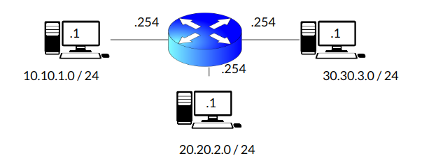
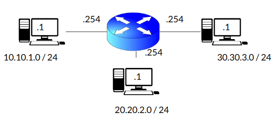
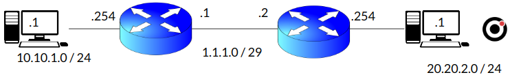
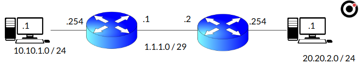

:titre: Routage statique
:module: Réseau
:duree: 60
:description: Comprendre l'intérêt et le fonctionnement du routage statique
include::../../../../adoc/libs/header-module.adoc[]

ifeval::["{visible-on-html}" !=  "yes"]
:docinfo: shared
:docinfodir: ../../../../adoc/libs
endif::[]


== Objectifs pédagogiques

// tag::objectifs[]
* Expliquer le format d’une adresse IPv4, ses classes d’adresses, et son rôle dans l’identification et le routage des appareils au sein des réseaux IP.
* Décrire la structure de l’en-tête IPv4, en détaillant chaque champ (adresse source et destination, longueur totale, TTL, etc.) et leur rôle dans le traitement des paquets réseau.
* Apprendre à calculer et utiliser les masques de sous-réseau pour diviser des réseaux en sous-réseaux, et effectuer des conversions entre décimal et binaire pour les masques.
* Expliquer la notation CIDR et son utilité pour représenter des plages d’adresses de manière efficace, et savoir l’utiliser dans la conception et l’optimisation des réseaux.
// end::objectifs[]

// tag::deroulement[]

== Introduction

Une table de routage peut se remplir de trois manières différentes : 

* Par déduction : si une des interfaces du routeur est dans le réseau cible, alors le réseau est connu 
* Manuellement : Ajout de route en lignes de commandes 
* Dynamiquement : Utilisation de protocole de routages dynamique 

== Route statique : création / suppression et route par défaut

=== Création d'une route statique

```sh 
R1(config)# ip route 10.10.1.0 255.255.255.0 1.1.1.254 name Réseau_1
```

```sh
R1(config)# ip route 10.10.1.0 255.255.255.0 FastEthernet 1/0 name Réseau_1
```

* `10.10.1.0` = réseau cible
* `255.255.255.0` = masque de réseau
* `1.1.1.254` = adresse IP du routeur voisin
* `FastEthernet 1/0` = interface ethernet connecté au routeur voisin
* `name` = important de bien nommer les routeurs

=== Supprimer une route statique :  

on rajoute `“no”` devant notre création de route statique

```sh
R1(config)# no ip route 10.10.1.0 255.255.255.0 1.1.1.254 name Réseau_1
```

Pour créer une route statique par défaut :

```sh
R1(config)# ip route 0.0.0.0 0.0.0.0 2.2.2.254 name DEFAULT_GATEWAY
```

Le réseau `0.0.0.0/0` contient toutes les adresses IPV4, ce qui va rediriger tout les paquets vers `2.2.2.254`

== Table de routage

Visualiser la table de routage :

```sh
Router# show ip route
```

Résultat :

```sh
Codes: C — connected, S — static, R — RIP, M — mobile, B — BGP, D — EIGRP, EX — EIGRP external, O — OSPF, IA — OSPF inter area, N1 — OSPF NSSA external type 1, N2 — OSPF external type 2, i — IS–IS, su — IS–IS  inter area, * — candidate default, U — per–user static route, o — ODR, P — periodic downloaded static route
Gateway of last resort is 2.2.2.254 to network 0.0.0.0
1.1.1.0/24 is subnetted, 1 subnets
C 1.1.1.0 is directly connected, FastEthernet1/0
S 10.10.1.0/24 [1/0] via 1.1.1.254
C 192.168.0.0/24 is directly connected, FastEthernet 2/0
s* 0.0.0.0/0 [1/0] via 2.2.2.254
```

== Distance Administrative

* valeur comprise entre 0 et 255
* permet de choisir quelle route prendre quand la table de routage propose plusieurs routes possibles 
* la distance prioritaire est 0
* la distance la moins prioritaire 255

include::../../../../adoc/libs/slide-notitle.adoc[]

[cols="1,1"]
|===
| Source Route        | Distance Administrative

| Interface connectée | 0

| Route Statique      | 1

| EIGRP summary route | 5

| E-BGP               | 20

| Internal EIGRP      | 90

| IGRP                | 100

| OSPF                | 110

|===

include::../../../../adoc/libs/slide-notitle.adoc[]

[cols="1,1"]
|===
| Source Route        | Distance Administrative

| IS–IS               | 115

| RIP                 | 120

| EGP                 | 140

| External EIGRP      | 170

| Internal BGP        | 200

| Unknown             | 255
|===

== Cas de figure DA et Masque

**Cas de figure 1** :  deux routes avec la distance administrative (DA) identique   

Le masque le plus restrictif l’emporte : 

```sh
R1(config)# ip route 10.10.1.0 255.255.255.0 1.1.1.254 
R1(config)# ip route 10.10.0.0 255.255.0.0 2.2.2.254
```

pour atteindre le `10.10.1.1` le routeur prendra la route avec le masque en `/24` qui est plus restrictif que le `/16` donc ici la route `Réseau_1`

**Cas de figure 2** :  deux routes avec la même DA et le même Masque

Le routeur utilise toutes les routes valides  pour l'équilibrage de charge. 

include::../../../../adoc/libs/slide-notitle.adoc[]

**Per-packet load balancing :**

* Paquet envoyé alternativement sur chacun des chemins disponibles. 
** garantir une distribution équitable du trafic, 
** Peut perturber l'ordre des paquets (temps de transit )
** problématique pour certaines applications comme la voix ou la vidéo sur IP.

**Per-destination or per-flow load balancing** : (préférable)

* Maintient tous les paquets d'une même session ou flux sur le même chemin.
* Le routeur utilise des critères comme l'adresse IP source et destination pour déterminer le chemin que chaque flux utilisera. 
* Réduit les problèmes liés à la séquence des paquets tout en fournissant une bonne distribution du trafic.

== Apprentissage des routes par déduction



```sh
RT_01(config)# interface FastEthernet 0/1
RT_01(config-if)# ip address 10.10.1.254 255.255.255.0 
RT_01(config-if)# no shutdown 
RT_01(config-if)# exit

RT_01(config)# interface FastEthernet 0/2
RT_01(config-if)# ip address 20.20.2.254 255.255.255.0
RT_01(config-if)# no shutdown 
RT_01(config-if)# exit

RT_01(config)# interface FastEthernet 0/3
RT_01(config-if)# ip address 30.30.3.254 255.255.255.0
RT_01(config-if)# no shutdown 
RT_01(config-if)# exit
```

include::../../../../adoc/libs/slide-notitle.adoc[]



```sh
RT_01# Show ip route
Gateway of last resort is not set
C 10.10.1.0 is directly connected, FastEthernet0/1
C 20.20.2.0 is directly connected, FastEthernet0/2
C 30.30.3.0 is directly connected, FastEthernet0/3
```

Par déduction des interfaces le routeur sait comment contacter ces trois réseau

== Apprentissage manuel des routes



include::../../../../adoc/libs/slide-notitle.adoc[]

**Configuration des interfaces**

```sh
RT_01(config)# interface FastEthernet 0/1
RT_01(config-if)# description LAN
RT_01(config-if)# ip address 10.10.1.254 255.255.255.0 
RT_01(config-if)# no shutdown 
RT_01(config-if)# exit

RT_01(config)# interface FastEthernet 0/2
RT_01(config-if)# description WAN
RT_01(config-if)# ip address 1.1.1.1 255.255.255.248
RT_01(config-if)# no shutdown 
RT_01(config-if)# exit
```

```sh
RT_02(config)# interface FastEthernet 0/1
RT_02(config-if)# description LAN
RT_02(config-if)# ip address 20.20.2.254 255.255.255.0 
RT_02(config-if)# no shutdown 
RT_02(config-if)# exit

RT_02(config)# interface FastEthernet 0/2
RT_02(config-if)# description WAN
RT_02(config-if)# ip address 1.1.1.2 255.255.255.248
RT_02(config-if)# no shutdown 
RT_02(config-if)# exit
```

include::../../../../adoc/libs/slide-notitle.adoc[]



include::../../../../adoc/libs/slide-notitle.adoc[]

**Configuration du routage statique : interfaces**

```sh
RT_01(config)# ip route 20.20.2.0 255.255.255.0 1.1.1.2 
RT_02(config)# ip route 10.10.1.0 255.255.255.0 1.1.1.1 
```

TIP: RT_01 et RT_02 connaissent les réseaux : +
10.10.1.0/24 ET 20.20.2.0/24

**Vérification : **

```sh
RT_01# Show ip route
Gateway of last resort is not set
C 10.10.1.0 is directly connected, FastEthernet0/1
S 20.20.2.0/24 [1/0] via 1.1.1.2
C 1.1.1.0 is directly connected, FastEthernet0/2

RT_02# Show ip route
Gateway of last resort is not set
S 10.10.1.0/24 [1/0] via 1.1.1.1
C 20.20.2.0 is directly connected, FastEthernet0/1
C 1.1.1.0 is directly connected, FastEthernet0/2
```

// tag::demo[]

[NOTE.speaker]
--

**Démo 1 : reprise dans Packet Tracer de l’exemple de cours slide 8 déduction de route **

```sh
RT_01(config)# interface FastEthernet 0/1
RT_01(config-if)# ip address 10.10.1.254 255.255.255.0 
RT_01(config-if)# no shutdown 
RT_01(config-if)# exit

RT_01(config)# interface FastEthernet 0/2
RT_01(config-if)# ip address 20.20.2.254 255.255.255.0
RT_01(config-if)# no shutdown 
RT_01(config-if)# exit

RT_01(config)# interface FastEthernet 0/3
RT_01(config-if)# ip address 30.30.3.254 255.255.255.0
RT_01(config-if)# no shutdown 
RT_01(config-if)# exit

RT_01# Show ip route
```

connecter un pc sur chaque segment réseau et faire des ping pour vérifier la bonne communication 

Démo 2 : reprise dans Packet Tracer de l’exemple de cours slide 10 apprentissage manuel de route 

routeur 1 

```sh
RT_01(config)# interface FastEthernet 0/1
RT_01(config-if)# description LAN
RT_01(config-if)# ip address 10.10.1.254 255.255.255.0 
RT_01(config-if)# no shutdown 
RT_01(config-if)# exit

RT_01(config)# interface FastEthernet 0/2
RT_01(config-if)# description WAN
RT_01(config-if)# ip address 1.1.1.1 255.255.255.248
RT_01(config-if)# no shutdown 
RT_01(config-if)# exit
RT_01(config)# ip route 20.20.2.0 255.255.255.0 1.1.1.2 
RT_01(config)# exit
RT_01# Show ip route
```

routeur 2

```sh
RT_02(config)# interface FastEthernet 0/1
RT_02(config-if)# description LAN
RT_02(config-if)# ip address 20.20.2.254 255.255.255.0 
RT_02(config-if)# no shutdown 
RT_02(config-if)# exit

RT_02(config)# interface FastEthernet 0/2
RT_02(config-if)# description WAN
RT_02(config-if)# ip address 1.1.1.2 255.255.255.248
RT_02(config-if)# no shutdown 
RT_02(config-if)# exit
RT_02(config)# ip route 10.10.1.0 255.255.255.0 1.1.1.1 
RT_01(config)# exit
RT_01# Show ip route
```

connecter un pc sur chaque segment réseau et faire des ping pour vérifier la bonne communication 
--
// end::demo[]

// end::deroulement[]

== Conclusion
// tag::conclusion[]
* **Routage Statique et Table de Routage** : Configuration manuelle de routes spécifiques dans la table de routage pour guider le trafic réseau de manière prédéfinie. Utilisé pour les réseaux simples ou les chemins critiques.
* **Création, Suppression et Route par Défaut** : Commandes permettant d'ajouter ou de retirer des routes. La route par défaut sert de chemin de secours pour tout trafic sans destination spécifique.
* **Distance Administrative (DA) et Masque de Sous-Réseau** : DA détermine la priorité d'une route (fiabilité), tandis que le masque de sous-réseau précise la portée et la spécificité des routes.
* **Apprentissage Manuel et par Déduction** : Approches pour définir le meilleur chemin ; manuellement par l'administrateur ou par déduction à partir des configurations existantes.
// end::conclusion[]