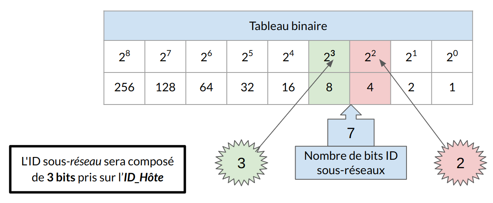
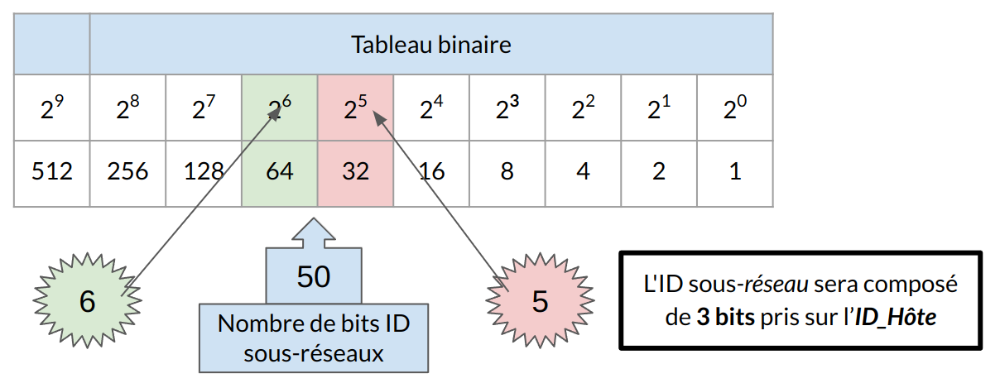

:titre: Sous-réseau
:module: Réseau
:duree: 120
:description: Comprendre le fonctionnement d'un sous-réseau
include::../../../../adoc/libs/header-module.adoc[]

ifeval::["{visible-on-html}" !=  "yes"]
:docinfo: shared
:docinfodir: ../../../../adoc/libs
endif::[]

== Objectifs pédagogiques

// tag::objectifs[]
* Expliquer comment le sous-réseautage segmente un réseau pour améliorer son organisation et sa sécurité.
* Savoir calculer des sous-réseaux selon une adresse IP et un masque, et adapter les sous-réseaux en fonction du nombre de sous-réseaux ou d’hôtes requis.
* Comprendre et utiliser le VLSM pour attribuer des sous-réseaux de tailles variables, optimisant l’utilisation des adresses IP.
// end::objectifs[]

// tag::deroulement[]

== Définition

La création de sous-réseaux : consiste à diviser un réseau IP unique en plusieurs sous-réseaux plus petits pour améliorer la gestion des adresses IP, la performance et la sécurité du réseau.

include::../../../../adoc/libs/slide-notitle.adoc[]

* Permettre de limiter l’impact des diffusions ARP
* Équilibrer le trafic réseau
* Isoler des machines
* Mettre en place un peu de sécurité
* Optimiser l’utilisation des adresses IP

Nouvelle partie dans l’adresse IP :

**ID_Réseau**

**ID_ss-réseau** (créé à partir de bits issus de l’**ID_Hôtes**)

**ID_Hôtes**

== Calcul de sous-réseaux

La création de sous-réseaux peut se faire suivant deux approches 

=== A partir du nombre de sous-réseaux désirés : 

dans ce cas de figure on divise en réseau en X sous-réseau de même taille

`S = 2^n`

`S` est le nombre de sous-réseaux désirés. 

`n` correspond au nombre de bits devant être masqués.

=== A partir du nombre d’adresse d’hôte désirées dans chaque sous-réseaux

dans ce cas de figure on divise en réseau en X sous-réseau  dimensionnés en fonction du nombre d’hôte qu’ils doivent accueillir 

`S = 2^n - 2`

`S` correspond au nombre d’hôtes désiré par sous-réseau. 

`n` correspond au nombre de bits devant être libre pour les hôtes 

== Découpage à partir du nombre de sous-réseaux désirés

include::../../../../adoc/libs/slide-notitle.adoc[]

[cols="1,1"]
|===

a| **postulat de départ : **

* Adresse de réseau 192.168.1..0 /24
* on veut diviser ce réseau en 7 Sous-réseau

a| Formule : `S = 2^n`

`S` est le nombre de sous-réseaux désirés. 

`n` correspond au nombre de bits devant être masqués.

|===

include::../../../../adoc/libs/slide-notitle.adoc[]

[cols="1,1,1,1"]
|===

a| image::./assets/03-decoupage-2.png[]
a| image::./assets/03-decoupage-3.png[]
a| image::./assets/03-decoupage-4.png[]
a| image::./assets/04-decoupage-5.png[]

|===

[cols="1,1"]
|===

a|
[.small]
Réseau SS-R0

[.small]
Masque réseau: **255.255.255.224 ou /27**

[.small]
Addresse réseau: **192.168.1.0**

[.small]
Adresse du premier hôte: **192.168.1.1**

[.small]
Adresse du dernier hôte: **192.168.1.30**

[.small]
Adresse de diffusion: **192.168.1.31**

[.small]
Nombre maximal d'hôtes: **29** 

a|
[.small]
Réseau SS-R 1

[.small]
Masque réseau: **255.255.255.224 ou /27**

[.small]
Addresse réseau: **192.168.1.32**

[.small]
Adresse du premier hôte: **192.168.1.33**

[.small]
Adresse du dernier hôte: **192.168.1.62**

[.small]
Adresse de diffusion: **192.168.1.63**

[.small]
Nombre maximal d'hôtes: **29**

|===

=== Adresse de réseau 10.0.0..0 /16 à découper en 3 sous-réseaux

[cols="1,1,1,1"]
|===

a| image::./assets/04-decoupage-6.png[]
a| image::./assets/04-decoupage-7.png[]
a| image::./assets/04-decoupage-8.png[]
a| image::./assets/04-decoupage-9.png[]

a| 
[.small]
Réseau 1

[.small]
Masque réseau: **255.255.192.0**

[.small]
@ réseau: **10.0.0.0**

[.small]
@ du premier hôte: **10.0.0.1**

[.small]
@ du dernier hôte: **10.0.63.254**

[.small]
@ de diffusion: **10.0.63.255**

[.small]
Nombre maximal d'hôtes: **16382**
a| 
[.small]
Réseau 2

[.small]
Masque réseau: **255.255.192.0**

[.small]
@ réseau: **10.0.64.0**

[.small]
@ du premier hôte: **10.0.64.1**

[.small]
@ du dernier hôte: **10.0.127.254**

[.small]
@ de diffusion: **10.0.127.255**

[.small]
Nombre maximal d'hôtes: **16382**
a| 
[.small]
Réseau 3

[.small]
Masque réseau: **255.255.192.0**

[.small]
@ réseau: **10.0.128.0**

[.small]
@ du premier hôte: **10.0.128.1**

[.small]
@ du dernier hôte: **10.0.191.254**

[.small]
@ de diffusion: **10.0.191.255**

[.small]
Nombre maximal d'hôtes: **16382**
a| 
[.small]
Réseau 4

[.small]
Masque réseau: **255.255.192.0**

[.small]
@ réseau: **10.0.192.0**

[.small]
@ du premier hôte: **10.0.192.1**

[.small]
@ du dernier hôte: **10.0.255.254**

[.small]
@ de diffusion: **10.0.255.255**

[.small]
Nombre maximal d'hôtes: **16382**

|===

== Découpage à partir du nombre d'hôtes désirés

include::../../../../adoc/libs/slide-notitle.adoc[]

[cols="1,1"]
|===

a| **postulat de départ : **

* Adresse de réseau 192.168.1..0 /24
* on veut diviser ce réseau avec  50 machines par Sous-réseau
a|
Formule : `S = 2^n - 2`

`S` correspond au nombre d’hôtes désiré par sous-réseau. 

`n` correspond au nombre de bits devant être libre pour les hôtes 
|===

=== Adresse de réseau 192.168.1.0  à découper en  sous-réseaux avec 50 machines par sous-réseaux

include::../../../../adoc/libs/slide-notitle.adoc[]

[cols="1,1,1,1"]
|===

a| image::./assets/05-decoupage-hotes-2.png[]
a| image::./assets/05-decoupage-hotes-3.png[]
a| image::./assets/05-decoupage-hotes-4.png[]
a| image::./assets/05-decoupage-hotes-5.png[]

a| 
[.small]
Réseau 1

[.small]
Masque réseau: **255.255.255.192**

[.small]
@ réseau: **192.168.1.0**

[.small]
@ du premier hôte: **192.168.1.1**

[.small]
@ du dernier hôte: **192.168.1.62**

[.small]
@ de diffusion: **192.168.1.63**

[.small]
Nombre maximal d'hôtes: **62**
a| 
[.small]
Réseau 2

[.small]
Masque réseau: **255.255.255.192**

[.small]
@ réseau: **192.168.1.64**

[.small]
@ du premier hôte: **192.168.1.65**

[.small]
@ du dernier hôte: **192.168.1.126**

[.small]
@ de diffusion: **192.168.1.127**

[.small]
Nombre maximal d'hôtes: **62**
a| 
[.small]
Réseau 3

[.small]
Masque réseau: **255.255.255.192**

[.small]
@ réseau: **192.168.1.128**

[.small]
@ du premier hôte: **192.168.1.129**

[.small]
@ du dernier hôte: **192.168.1.190**

[.small]
@ de diffusion: **192.168.1.191**

[.small]
Nombre maximal d'hôtes: **62**
a| 
[.small]
Réseau 4

[.small]
Masque réseau: **255.255.255.192**

[.small]
@ réseau: **192.168.1.192**

[.small]
@ du premier hôte: **192.168.1.193**

[.small]
@ du dernier hôte: **192.168.1.254**

[.small]
@ de diffusion: **192.168.1.255**

[.small]
Nombre maximal d'hôtes: **62**

|===

== VLSM (Variable Length Subnet Mask)

* **Subnetting avancé** : Permet une division plus précise du réseau pour répondre spécifiquement aux besoins en adresses IP de chaque segment de réseau, minimisant ainsi le gaspillage d'adresses.
* **Variable Length Subnet Mask (VLSM)** : Technique permettant d'utiliser des masques de sous-réseau de longueurs différentes au sein d'un même réseau, offrant ainsi une flexibilité et une utilisation optimale des adresses IP.
* **Méthodologie de calcul** : Déterminez d'abord les besoins en adresses de tous les sous-réseaux, puis attribuez des masques de sous-réseau appropriés en commençant par le sous-réseau nécessitant le plus grand nombre d'adresses.

=== Exemple : 

adresse **192.168.5.0/24**. Le réseau doit être subdivisé en sous-réseaux de tailles variées :

* réseau 1 : 120 hôtes.
* réseau 2 : 60 hôtes.
* réseau 3 : 30 hôtes.
* réseau 4 : 10 hôtes.

include::../../../../adoc/libs/slide-notitle.adoc[]

* 120 hôtes : 
** Masque **/25** (255.255.255.128), plage d’adresses **192.168.5.0 – 192.168.5.127**.
* 60 hôtes  : 
** Masque **/26** (255.255.255.192), plage d’adresses **192.168.5.128 – 192.168.5.191**.
* 30 hôtes : 
** Masque **/27** (255.255.255.224), plage d’adresses **192.168.5.192 – 192.168.5.223**.
* 10 hôtes  : 
** Masque **/28** (255.255.255.240), plage d’adresses **192.168.5.224 – 192.168.5.239**.

// end::deroulement[]

== Conclusion
// tag::conclusion[]
* savoir utiliser et comprendre les différentes méthodes de calcules de sous-réseau
** en fonction du nombre de réseau souhaité
** en fonction du nombre d'hôte 
** et de façon avance avec VLSM en fonction d’un nombre d’hôte variable par sous-réseau 
// end::conclusion[]