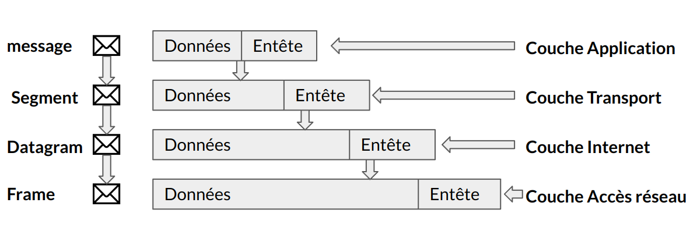

:titre: TCP / UDP
:module: Réseau
:duree: 60
:description: Comprendre le modèle TCP/IP et ses couches, étudier les caractéristiques des couches TCP/IP, et analyser les protocoles de transport TCP et UDP.
include::../../../../adoc/libs/header-module.adoc[]

ifeval::["{visible-on-html}" !=  "yes"]
:docinfo: shared
:docinfodir: ../../../../adoc/libs
endif::[]

== Objectifs pédagogiques

// tag::objectifs[]
* Comprendre le modèle TCP/IP et ses couches
* Étudier les caractéristiques des couches TCP/IP
* Analyser les protocoles de transport TCP et UDP
// end::objectifs[]

// tag::deroulement[]

== Présentation

**Historique :**

* Développé dans les années 1970 par le DARPA (Defense Advanced Research Projects Agency).
* Utilisé initialement dans le projet ARPANET, précurseur de l’Internet.

**Importance :**

* Permet la communication entre des réseaux hétérogènes.
* Utilisé massivement dans tous les réseaux modernes (Internet, Intranets).

=== Les 4 couches du modèle TCP/IP :

* Couche d’accès réseau (Network Access Layer).
* Couche Internet (Internet Layer).
* Couche Transport (Transport Layer).
* Couche Application (Application Layer).

**Notion clé :** Chaque couche a une fonction distincte dans le processus de transmission de données.

== Comparaison TCP/IP vs OSI

=== Modèle OSI (7 couches) :

* Un modèle théorique utilisé pour comprendre la communication réseau.
* Couché plus granulaires (couche de présentation, session, etc.).

=== Modèle TCP/IP (4 couches) :

* Plus simple et largement utilisé.
* Correspondance des couches :
** Couche Accès réseau = Couches physique et liaison de données (OSI).
** Couche Internet = Couche réseau (OSI).
** Couche Transport = Couche transport (OSI).
** Couche Application = Couches session, présentation, et application (OSI)

== Couche 1 : accès réseau

**Rôle** : Interface entre les dispositifs matériels et le réseau, permettant la transmission physique des données.

**Fonctions principales :**

* Définition des protocoles pour la transmission physique (Ethernet, Wi-Fi).
* Gestion des adresses matérielles (MAC address).
* Contrôle de l'accès au média (méthodes de détection de collisions comme CSMA/CD) Carrier Sense Multiple Access with Collision Detection

include::../../../../adoc/libs/slide-notitle.adoc[]

CSMA CD fonctionne en détectant l’apparition d’une collision. Une fois la collision détectée, CSMA CD met immédiatement fin à la transmission, évitant ainsi à l’émetteur de perdre beaucoup de temps à poursuivre. Les dernières informations peuvent être retransmises.

=== Ethernet

* Principal protocole utilisé pour les connexions filaires.
* Fonctionne selon une architecture de type CSMA/CD (Carrier Sense Multiple Access with Collision Detection).
* Trames Ethernet : structure détaillée (préambule, adresse MAC source et destination, champ type, données, CRC).

**Contrôle de redondance cyclique** ou **CRC** (cyclic redundancy check)  permet de détecter des erreurs de transmission ou de transfert par ajout, combinaison et comparaison de données redondantes, obtenues grâce au hachage.

=== Wi-Fi (802.11)

* Utilisé pour les connexions sans fil.
* Différences avec Ethernet : gestion de la connexion, collisions évitées par CSMA/CA (Collision Avoidance).

**CSMA CA** ne traite pas la récupération après une collision. Check si le support est en cours d’utilisation. Si occupé, l’émetteur attend jusqu’à ce qu’il soit inactif avant d’émettre. Minimise efficacement les risques de collision et permet une utilisation plus efficace du support.

=== Processus d’encapsulation :

* Les données des couches supérieures (Internet, Transport, Application) sont encapsulées dans des trames de la couche d’accès réseau.
* Chaque trame contient un en-tête spécifique (adresses MAC, contrôle d'erreur).

=== Transmission :

Les trames sont transmises sur le support physique (câbles, ondes radio).

== Couche 2 : Internet 

**Rôle** : Acheminement des paquets à travers différents réseaux, permettant ainsi la communication entre des hôtes situés sur des réseaux différents.

=== Protocole IP (Internet Protocol) :

* **Paquets de données** : Le protocole IP découpe les informations en paquets pour les envoyer sur le réseau, chaque paquet contient :
** **En-tête IP** (Header) : Informations de routage (adresse IP source, adresse IP de destination, etc.).
** **Données** : Le contenu réel à transmettre.
* Responsable de la fragmentation, du routage, et de la réassemblage des paquets
* **IPv4** : Format sur 32 bits, limite de 4,3 milliards d'adresses.
* **IPv6** : Format sur 128 bits, conçu pour pallier l'épuisement d'adresses IPv4

=== Protocole ICMP (Internet Control Message Protocol) :

* Utilisé pour les diagnostics réseau (exemple : ping).

=== Protocole ARP (Address Resolution Protocol) :

* Traduction d'une adresse IP en adresse MAC.

== Couche 3 : transport  TCP

**TCP (Transmission Control Protocol)** est un protocole de transport orienté connexion.

* Utilisé pour garantir la fiabilité et l’ordre des transmissions de données sur un réseau.

=== Fonctionnement de TCP

* **Connexion orientée** : Avant d'envoyer des données, TCP établit une connexion entre l'émetteur et le récepteur via un **handshake à trois voies**.
* **Fiabilité** : TCP vérifie que les données sont bien reçues à l'autre bout grâce à des mécanismes d'accusé de réception (ACK).
* **Contrôle de flux** : Il ajuste la quantité de données envoyées selon la capacité du récepteur pour éviter la surcharge.
* **Contrôle d'erreurs** : Utilisation de la **retransmission** en cas de perte ou d’erreur de paquets.
* **Segmentation et réassemblage** : TCP divise les données en segments et les réassembler dans le bon ordre à destination.

== TCP Caractéristiques

* **Fiabilité** : Garantie que les données arrivent intactes et dans le bon ordre.
* **Transmission ordonnée** : Les paquets sont reçus dans l'ordre d’envois
* **Contrôle de congestion** : Ajuste le débit en fonction de la congestion du réseau.

=== Utilisation de TCP

* **Web (HTTP/HTTPS)** : Pour des connexions fiables et sécurisées.
* **Emails (SMTP, IMAP, POP3)** : Transmission garantie des messages.
* **Transferts de fichiers (FTP)** : Assure que les fichiers sont reçus sans erreur.

=== Avantages et Inconvénients

* **Avantages :**
** Transmission fiable et garantie, Contrôle des erreurs et de la congestion.
* **Inconvénients :**
** Plus lent en raison du contrôle accru (accusés de réception, retransmissions).
** Moins efficace pour les petites données ou les applications temps réel.

== Protocole UDP

**UDP (User Datagram Protocol)** est un protocole de transport non orienté connexion.

* Plus simple et rapide que TCP, mais il n'assure ni la fiabilité ni l'ordre des données.

=== Fonctionnement de UDP

* **Sans connexion** : Il n'y a pas de processus de connexion entre l’émetteur et le récepteur.
* **Aucune garantie de livraison** : Les paquets de données (appelés datagrammes) sont envoyés sans vérifier s'ils arrivent à destination.
* **Pas de retransmission** : Si un paquet est perdu, UDP ne le renvoie pas.
* **Transmission directe** : Les datagrammes sont envoyés rapidement sans attendre d'accusé de réception ou de validation.

=== Principales Caractéristiques de UDP

* **Rapidité** : Pas de surcharge due au contrôle de flux ou aux accusés de réception.
* **Sans fiabilité** : Pas de mécanismes pour garantir la réception ou l'ordre des paquets.
* **Léger** : Moins de données dans les en-têtes, donc idéal pour des applications nécessitant un faible délai.

=== Cas d'Utilisation de UDP

* **Streaming multimédia (audio/vidéo)** : Les légères pertes de paquets ne perturbent pas trop la qualité.
* **Jeux en ligne** : La vitesse est plus critique que la précision absolue des données.
* **VoIP (Voice over IP)** : Permet une communication en temps réel avec un faible délai.

=== Avantages et Inconvénients

* **Avantages :**
** Faible latence, idéal pour les applications en temps réel.
** Moins de surcharge par rapport à TCP.
* **Inconvénients :**
** Pas de garantie de réception ou d’ordre des paquets.
** Moins fiable pour les applications nécessitant l'intégrité des données.

// tag::demo[]

== Démonstration

[NOTE.speaker]
--
Dans packet tracer et/ou wireshark faire des capture de trame 

montrer les entêtes des paquets TCP ET UDP  
--

// end::demo[]

// end::deroulement[]

== Conclusion
// tag::conclusion[]
**TCP (Transmission Control Protocol) :**

* Protocole orienté connexion garantissant la fiabilité et l’intégrité des données.
* Utilisé pour les transmissions sensibles à la perte, comme le web (HTTP), l’email (SMTP), et le transfert de fichiers (FTP).

**UDP (User Datagram Protocol) :**

Protocole sans connexion
rapide mais sans garantie de livraison. 
Idéal pour les applications nécessitant une latence faible et une tolérance aux pertes, comme la voix sur IP (VoIP) et le streaming.

include::../../../../adoc/libs/slide-notitle.adoc[]

**Comparaison TCP / UDP :**

* TCP assure la fiabilité grâce à l’établissement de connexions, le contrôle de flux et la retransmission des paquets perdus. 
* UDP privilégie la vitesse et l'efficacité sans ces mécanismes.
// end::conclusion[]