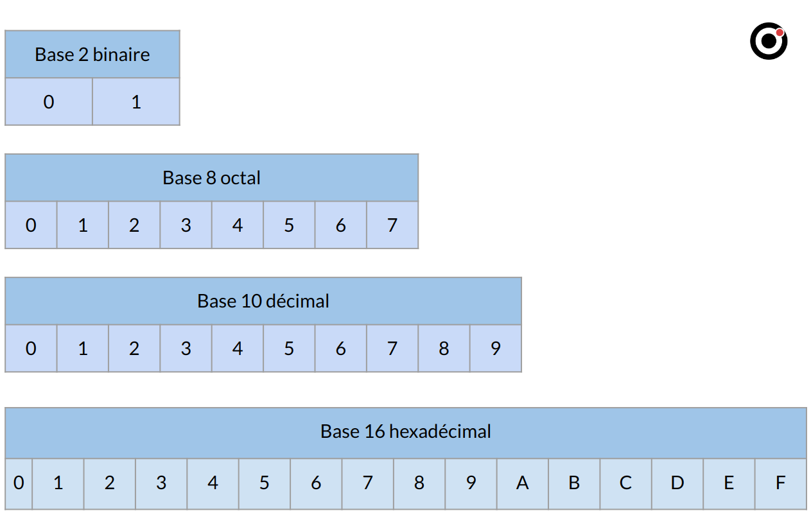
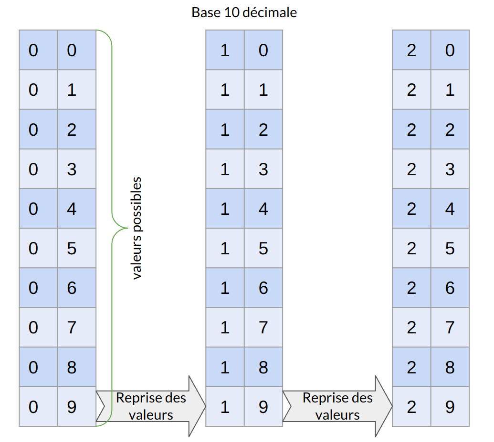
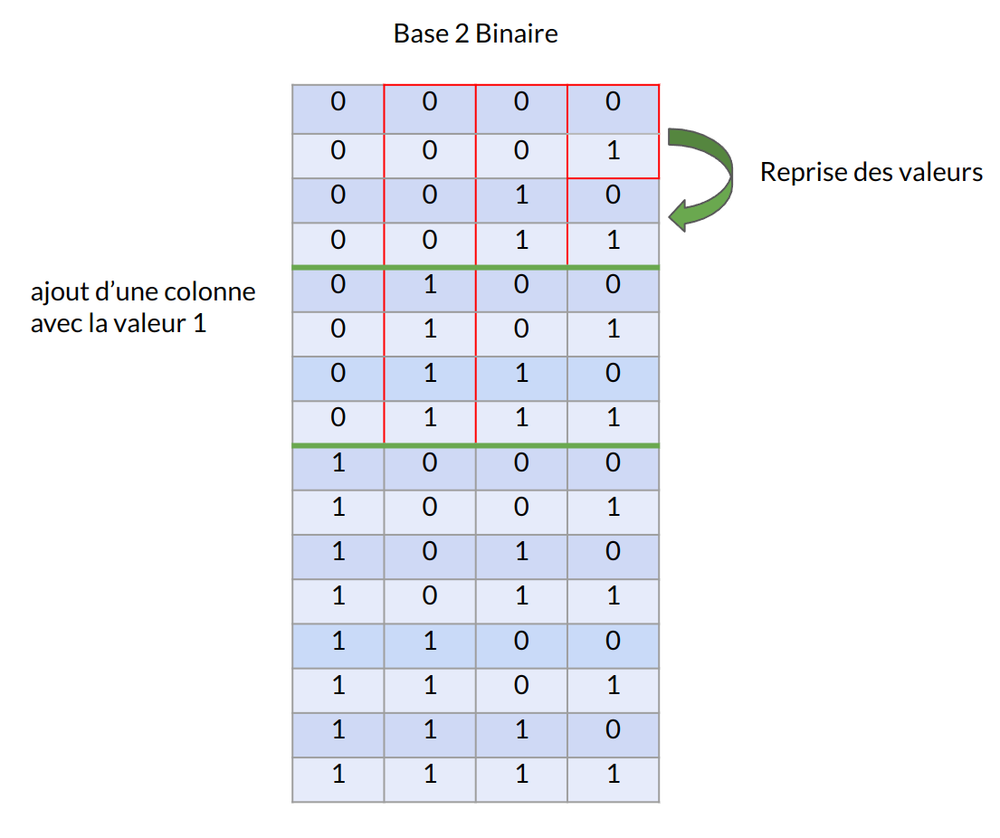
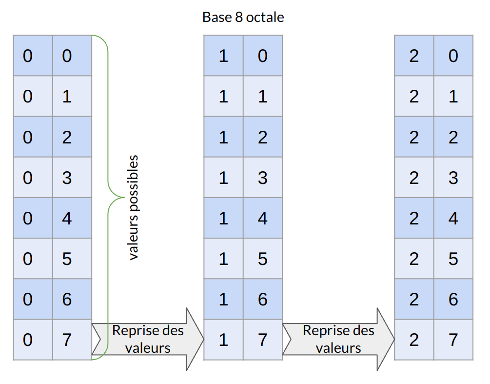
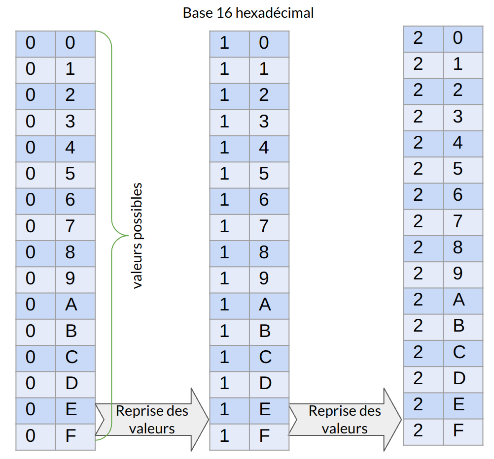
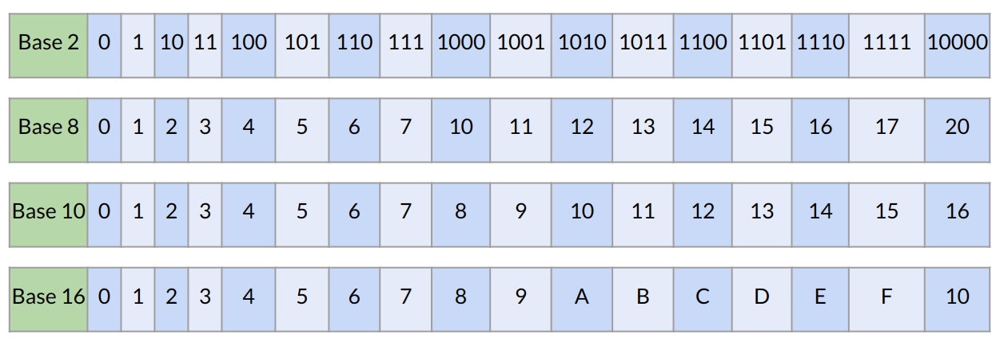
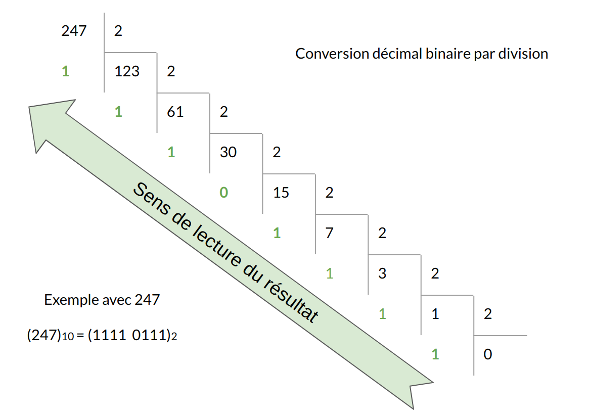
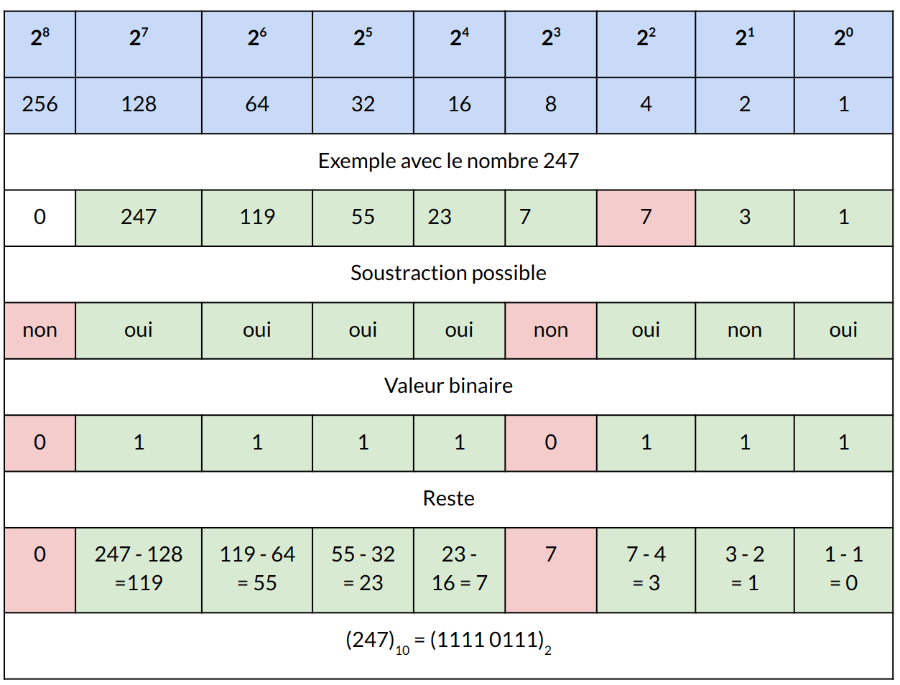
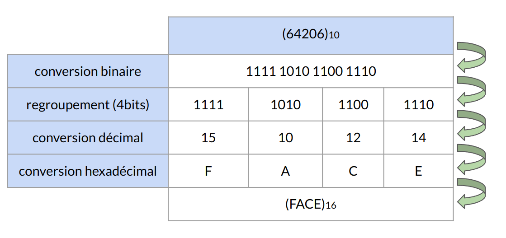
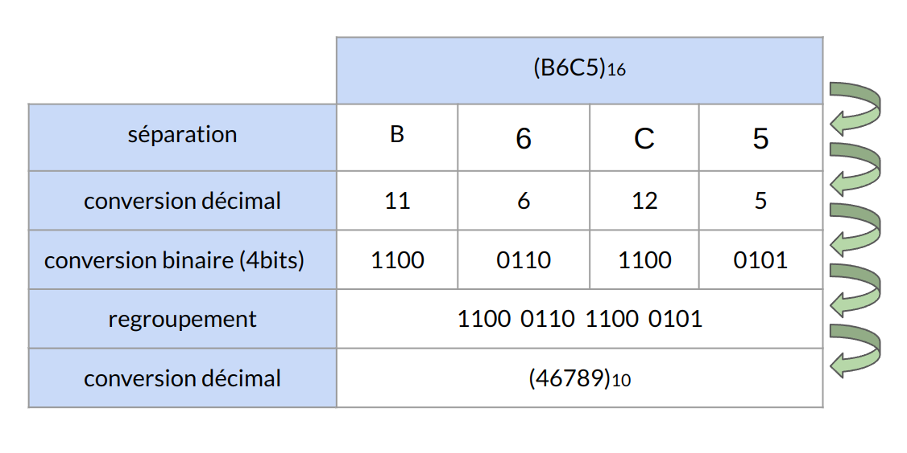

:titre: Unités Informatique
:module: Réseau
:duree: 120
:description: Comprendre les bases numériques et les conversions entre les bases
include::../../../../adoc/libs/header-module.adoc[]

ifeval::["{visible-on-html}" !=  "yes"]
:docinfo: shared
:docinfodir: ../../../../adoc/libs
endif::[]

== Objectifs pédagogiques

// tag::objectifs[]
* Expliquer le rôle des différentes bases numériques (décimale, binaire, octale, hexadécimale) dans les systèmes informatiques.
* Maîtriser les bases 10 (décimale)2 (binaire)8 (octale)16 (hexadécimale)
* Interpréter un tableau d’équivalence entre les bases (binaire, décimale, octale, hexadécimale) pour faciliter les conversions.
* Exécuter des conversions d’un nombre
* Identifier les principales unités de base (bit, octet) et comprendre leur rôle dans la représentation des données numériques.
// end::objectifs[]

// tag::deroulement[]
== Les bases numériques

=== Base 2 (Binaire) : 

* système numérique de base en informatique composé de 0 et 1 
* Chaque chiffre est appelé un "bit"

=== Base 8 (Octal) : 

* Ce système utilise huit chiffres, de 0 à 7. 
* Chaque chiffre octal correspond à trois chiffres binaires, 
* ce qui en fait une manière compacte de représenter des nombres binaires. 
* Par exemple, le nombre binaire `110` correspond à `6` en octal.

=== Base 10 (Décimale) : 

* Système de numération standard que nous utilisons dans la vie quotidienne, 
* Utilise dix chiffres : de 0 à 9.

=== Base 16 (Hexadécimale) : 

* Ce système utilise seize symboles pour représenter les chiffres : de 0 à 9, suivis des lettres A à F . 
* Chaque chiffre hexadécimal 
* correspond à quatre chiffres binaires, ce qui facilite la lecture et l'écriture des valeurs binaires. 

include::../../../../adoc/libs/slide-notitle.adoc[]

== Base 10 décimal

[NOTE.speaker]
--
Montrer que quelque soit la base numérique utilisé on retrouve ce que l’on connaît avec la base 10  
a savoir une séquence qui se répète avec des reprises de valeurs 
--

== Base 2 binaire

== Base 8 octale

== Base 16 hexadécimale

== Equivalence des bases

== Conversion décimal vers binaire

include::../../../../adoc/libs/slide-notitle.adoc[]

== Conversion décimal vers hexadécimal

== Conversion hexadécimal vers décimale

== Les unités de base

=== Le bit **B**inary dig**IT**

* Valeurs possible 0 et 1
* Symbole : b

=== Les multiples du bit

* Kibibit noté kibit
* Mebibit noté Mibit
* Gibibit noté Gibit
* Tebibit noté Tibit

=== L'octet ou Byte en anglais

* Ensemble de 8 bits
* Symbole octet: o
* Symbole Byte : B

=== Les multiples de l'octet (10)

* Kilooctet noté Ko
* Mégaoctet noté Mo
* Gigaoctet noté Go
* téraoctet noté TO

=== Les multiples de l’octet (2)

* Kibioctet noté Kio
* Mebioctet noté Mio
* Gibioctet noté Gio
* Tebioctet noté Tio

=== Différence entre un kilooctet (kB) et un kibioctet (KiB) 

**Kilooctet (kB)** : Le préfixe "kilo-" est d'origine décimale

* Utilise la base 10 pour définir sa taille.
* 1 kB = 1 000 octets

**Kibioctet (KiB)**: Le préfixe "kibi-" spécifique à l'informatique est utilisé pour éviter la confusion 

* Utilise la base 2 pour définir sa taille.
* 1 KiB = 1 024 octets 

// tag::demo[]

== Démonstration

**Conversions numériques**

[NOTE.speaker]
--

**refaire quelques exemples de conversion suivant les demandes** 

--

// end::demo[]

// end::deroulement[]

== Conclusion
// tag::conclusion[]
Être capable de jongler avec les différentes base numérique, comprendre les mécanismes de conversion permettra de mieux appréhender certaines notions tels que les découpages réseau en sous-réseau

Dans la pratique il existe de nombreux outils et calculatrices permettant de réaliser les conversions
// end::conclusion[]