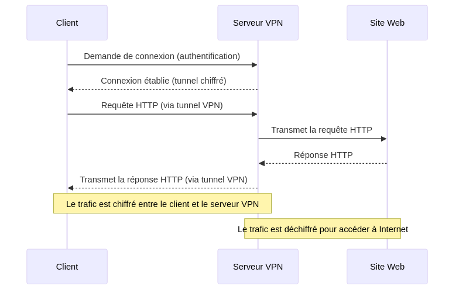
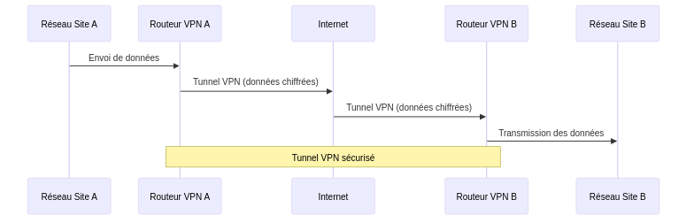
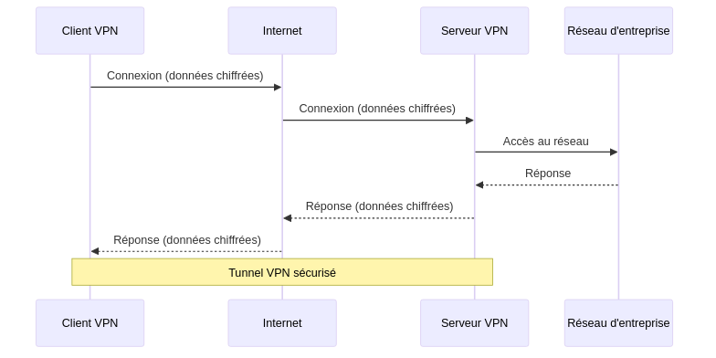

:titre: Interconnexion des réseaux
:module: Réseau
:duree: 90
:description: Comprendre les concepts d'interconnexion des réseaux, y compris les VPNs et les architectures multi-sites.
include::../../../../adoc/libs/header-module.adoc[]

ifeval::["{visible-on-html}" !=  "yes"]
:docinfo: shared
:docinfodir: ../../../../adoc/libs
endif::[]

== Objectifs pédagogiques

// tag::objectifs[]
* Comprendre le concept de VPN
* Connaître les méthodes d'interconnexion multi-sites
// end::objectifs[]

// tag::deroulement[]

== Présentation des VPN

Un **VPN** (Virtual Private Network) est un réseau privé virtuel qui permet de relier des réseaux distants via une connexion sécurisée.

=== Rôle des VPN

* **chiffrage des données** transmises entre l'utilisateur et le serveur VPN
* rendent les **informations illisibles pour les tiers** (FAI, pirates, gouvernements...)
* **masquent l'adresse IP** de l'utilisateur pour protéger sa vie privée

=== Importance des VPN

* **protection des données sensibles** (mots de passe, informations bancaires...) notamment lors de l'utilisation de réseaux publics
* **accès à distance sécurisé**, par exemple aux ressources d'une entreprise
* **confidentialité** : pas d'historique de navigation conservé par le FAI

include::../../../../adoc/libs/slide-notitle.adoc[]

[NOTE.speaker]
--
Explication du diagramme :

* **Demande de connexion :**

** Le client envoie une demande de connexion au serveur VPN, souvent accompagnée d'informations d'authentification (comme un nom d'utilisateur et un mot de passe).

* **Établissement de la connexion :**

** Le serveur VPN authentifie le client et établit un tunnel chiffré, permettant une communication sécurisée.

* **Requête HTTP :**

** Le client envoie une requête HTTP à travers le tunnel VPN sécurisé.

* **Transmission de la requête :**

** Le serveur VPN reçoit la requête et la transmet au site web sur Internet.

* **Réponse HTTP :**

** Le site web renvoie une réponse HTTP au serveur VPN.

* **Transmission de la réponse :**

** Le serveur VPN transmet la réponse HTTP au client via le tunnel chiffré.

Notes :

* Le tunnel VPN chiffre le trafic entre le client et le serveur VPN, protégeant les données contre les interceptions.
* Lorsque le trafic atteint le serveur VPN, il est déchiffré pour accéder à Internet, puis chiffré à nouveau pour le retour vers le client.
--

== Types de VPN

=== VPN site-à-site

* connecte de manière sécurisée deux réseaux distincts
* souvent utilisé pour relier différentes succursales d'une entreprise
* généralement configuré sur des routeurs ou pare-feux à chaque extrémité de la connexion
* permet aux appareils des deux réseaux de communiquer comme s'ils étaient sur le même réseau local

include::../../../../adoc/libs/slide-notitle.adoc[]

[NOTE.speaker]
--
* Les réseaux des sites A et B sont connectés via des routeurs VPN.
* Les données sont chiffrées et transmises à travers un tunnel sécurisé via Internet, permettant une communication sécurisée entre les deux sites.
--

=== VPN client-à-site

* connecte un utilisateur individuel à un réseau privé via un serveur VPN
* souvent utilisé pour accéder à distance aux ressources d'une entreprise
* le client VPN est installé sur l'appareil de l'utilisateur pour établir la connexion

include::../../../../adoc/libs/slide-notitle.adoc[]

[NOTE.speaker]
--
* Un client VPN se connecte au réseau de l'entreprise via un serveur VPN.
* Le trafic entre le client et le serveur VPN est chiffré, permettant à l'utilisateur distant d'accéder en toute sécurité aux ressources du réseau d'entreprise.
--

== Défis de l'interconnexion multi-sites

=== Latence

* temps qu'il faut pour qu'un paquet de données aille d'un point à un autre
* généralement mesurée en millisecondes (ms)
* dans le cas d'une interconnexion, la latence peut être causée par :
** la distance géographique entre les sites
** la qualité des équipements réseau
** des congestions sur le réseau

=== Sécurité

**Risques liés à l'interconnexion de réseaux dispersés :**

* plus vulnérables aux attaques, car ils incluent plusieurs points d'entrée potentiels pour les attaquants
* les données échangées entre les sites peuvent être interceptées, surtout si elles transitent sur des réseaux publics non sécurisés.

**Importance de la protection des données en transit :**

* **Chiffrement** : pour empêcher les interceptions et garantir la confidentialité des informations échangées.
* **Authentification et contrôle d'accès** : pour s'assurer que seuls les utilisateurs et dispositifs autorisés peuvent accéder au réseau.

=== Gestion des adresses IP

**Problèmes de chevauchement d'adresses IP :**

* possibilité de chevauchements d'adresses IP si différents sites utilisent des plages d'adresses identiques. 
* peut entraîner des conflits et des difficultés de routage.

**Complexité de la gestion des adresses IP :**

* **Planification d'adressage** : afin d'éviter les chevauchements et assurer une communication fluide.
* **Configuration dynamique** : L'utilisation de protocoles comme DHCP (Dynamic Host Configuration Protocol) et DNS (Domain Name System) peut aider à gérer l'attribution d'adresses IP et la résolution de noms, mais nécessite une gestion et une coordination efficaces entre les sites.

== Solutions d'interconnexion multi-sites

=== Utilisation de VPN :

* **Avantages** : Sécurité renforcée grâce au chiffrement, coût relativement bas.
* **Inconvénients** : Peut introduire une latence supplémentaire, complexité de gestion à grande échelle.
* **Cas d'utilisation** : Petites à moyennes entreprises avec des besoins de sécurité élevés.

=== MPLS (Multiprotocol Label Switching) :

* **Avantages** : Offre une qualité de service (QoS) élevée, faible latence.
* **Inconvénients** : Coût plus élevé, configuration complexe.
* **Cas d'utilisation** : Grandes entreprises nécessitant une haute performance et une fiabilité élevée.

=== SD-WAN (Software-Defined Wide Area Network) :

* **Avantages** : Flexibilité, gestion centralisée, optimisation du trafic.
* **Inconvénients** : Coût initial plus élevé, nécessité de compétences techniques avancées.
* **Cas d'utilisation** : Entreprises avec plusieurs sites nécessitant une gestion dynamique du réseau.

=== Comparaison des solutions

[cols="1,1,1,1", options="header"]
|===
| Critère      | VPNs       | MPLS          | SD-WAN

| Coût
| Bas
| Élevé
| Moyen à élevé

| Complexité
| Moyenne
| Élevée
| Moyenne à élevée

| Sécurité
| Élevée
| Moyenne à élevée
| Élevée
|===

// end::deroulement[]

== Conclusion
// tag::conclusion[]
**Choix de la solution adaptée** : évaluation soigneuse des besoins spécifiques de l'organisation en termes de coût, de complexité et de sécurité.

**Importance de la sécurité** : utilisation de technologies de chiffrement robustes et de protocoles d'authentification

**Gestion efficace des réseaux** : une planification appropriée de l'adressage IP et une gestion dynamique des ressources réseau sont cruciales pour minimiser les conflits et assurer une communication fluide entre les sites
// end::conclusion[]