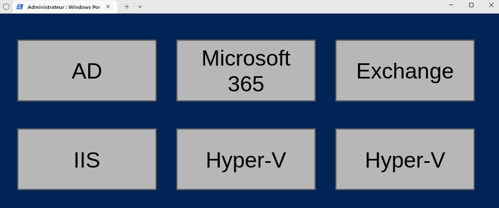
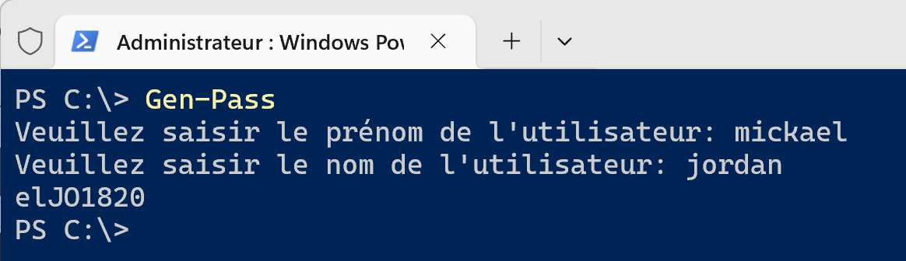

:titre: Fonctions et Modules
:module: Scripting
:duree: 150
:description: Les fonctions et modules en Powershell
include::../../../../adoc/libs/header-module.adoc[]

ifeval::["{visible-on-html}" !=  "yes"]
:docinfo: shared
:docinfodir: ../../../adoc/libs
endif::[]

== Objectifs pédagogiques
// tag::objectifs[]
* Les Fonctions
* Les Modules
* Cmdlets et Modules
* Création de modules
* Mise en pratique
// end::objectifs[]

// tag::deroulement[]
== Les fonctions

**Définition : **

Une fonction Unité de code autonome qui prend des entrées, effectue des opérations et peut retourner des résultats. 
Elle permet la réutilisation de blocs de code et l'organisation logique des tâches.

**Elles sont indispensables dans un script car elles vont :**

* limiter les copier coller dans le code et les redites
* ce qui va simplifier la lecture et la maintenance
* pouvoir réutiliser simplement des bouts de code 

include::../../../../adoc/libs/slide-notitle.adoc[]

Par convention on les regroupe en début de script pour les identifier plus facilement

on peut également les externaliser dans un autre script dédié que l’on va venir sourcer au début de notre script   

include::../../../../adoc/libs/slide-notitle.adoc[]

Créer une fonction = créer un commande

la syntaxe est la suivante : 

```powershell
PS > Fonction NomDeLaFonction 
{
		Code et instruction de la fonction
}
```

La portée d’une fonction est limité,

* elle pourra s'exécuter à l'intérieur de votre script 
* une fois l'exécution du script terminé la fonction est détruite 

== Les modules

PowerShell est un shell Modulaire 

* Powershell peut être vue comme une coquille vide ou avec très peu d’éléments de base
* En fonction de nos besoins on va pouvoir ajouter des fonctionnalités complémentaires via l’ajout de modules

include::../../../../adoc/libs/slide-notitle.adoc[]



* PowerShell charge les modules de manière dynamique chaque fois que l’on exécute une commande
* les modules sont stockés des emplacements précis

== CmdLets Modules

La variable `$env:PSModulePath` Contient les chemins locaux de stockage des modules :

Pour les versions 5.1 et antérieur de PowerShell : 

* `$env:USERPROFILE\Documents\WindowsPowershell\Modules`
* `C:\Program Files\WindowsPowerShell\Modules`

Pour PowerShell 7 : le dossier cible est “Powershell\Modules”

include::../../../../adoc/libs/slide-notitle.adoc[]

Les commandes suivantes vont nous permettre de rechercher et d’installer des modules depuis internet depuis le shell

`PS > Find-Module`	=> Rechercher un module

`PS > Install-Module`	=> Installer un module depuis le web

`PS > Import-Module`	=> Importer un module présent sur la machine

`PS > Get-Module`		=> Voir les modules installés 

`PS > Uninstall-Module`	=> Désinstaller un module

== Création de modules

On peut créer ces propres modules en respectant certain prérequis

Le module doit être enregistrer dans un des emplacements obligatoires

créer un dossier portant le même nom que le fichier de module

enregistrer dans ce dossier les fichiers contenant les fonctions avec l’extension *.psm1

== Mise en pratique

Exemple de création de fonction puis de module

```powershell
# génération d'un mot de passe

# demande de saisie du prénom et du nom de l'utilisateur
$Prenom = Read-Host "Veuillez saisir le prénom de l'utilisateur"
$Nom = Read-Host "Veuillez saisir le nom de l'utilisateur"

# on récupere les 2 derniers caractères du prénom en minuscule
$Cutprenom = $Prenom.Substring($Prenom.Length - 2).ToLower()

# on recupere les 2 premier caractères du prenom en majuscule
$cutnom = $Nom.Substring(0, 2).ToUpper()

# on génère un nombre aléatoire à 4 chiffres
$Alea = Get-Random (1000 .. 9999)

#on concatène l'ensemble pour former le mot de passe
$pass = $Cutprenom + $cutnom + $Alea

#on affiche le mot de passe généré
$pass
```

include::../../../../adoc/libs/slide-notitle.adoc[]

Transformation du code en fonction

```powershell
Function Gen-Pass {
# génération d'un mot de passe
# demande de saisie du prénom et du nom de l'utilisateur
$Prenom = Read-Host "Veuillez saisir le prénom de l'utilisateur"
$Nom = Read-Host "Veuillez saisir le nom de l'utilisateur"

# on récupere les 2 derniers caractères du prénom en minuscule
$Cutprenom = $Prenom.Substring($Prenom.Length - 2).ToLower()

# on recupere les 2 premier caractères du prenom en majuscule
$cutnom = $Nom.Substring(0, 2).ToUpper()

# on génère un nombre aléatoire à 4 chiffres
$Alea = Get-Random (1000 .. 9999)

#on concatène l'ensemble pour former le mot de passe
$pass = $Cutprenom + $cutnom + $Alea

#on affiche le mot de passe généré
$pass
}

#on appel la fonction Gen-Pass pour tester
gen-pass
```

include::../../../../adoc/libs/slide-notitle.adoc[]

Transformation de la fonction en module 

* dans le dossier `$env:USERPROFILE\Documents\WindowsPowershell\Modules`
* je genere un dossier gen-pass

si le dossier Modules n’existe pas il faudra également le créer 

* j’enregistre la fonction Gen-pass (sans le test) dans un fichier nommé gen-pass.psm1

include::../../../../adoc/libs/slide-notitle.adoc[]

notre module est créé on peut maintenant appeler directement la commande gen-pass
 


// tag::demo[]
== Démonstration

**Fonction / module**

[NOTE.speaker]
--
* reprendre l’exemple données dans le cours et le mettre en pratique 
* montrer l’autocomplétion
* montrer que celle ci disparaît si on renomme le dossier 
--
// e,nd::demo[]
// end::deroulement[]

== Conclusion
// tag::conclusion[]
* **Réutilisabilité du Code :**

Les fonctions permettent de regrouper des blocs de code réutilisables, réduisant ainsi la duplication de code et facilitant la maintenance.

* **Modularité et Organisation :**

Les modules permettent de regrouper des fonctions connexes et d'autres ressources, facilitant la gestion et le partage des scripts à grande échelle.

* **Facilité de Débogage et de Test :**

En isolant des portions de code dans des fonctions, il devient plus simple de tester et de déboguer chaque partie indépendamment.

include::../../../../adoc/libs/slide-notitle.adoc[]

* **Partage et Collaboration :**

Les modules peuvent être partagés entre équipes et projets, ce qui améliore la collaboration et le partage des meilleures pratiques.

* **Encapsulation des Fonctions :**

Les modules permettent de protéger le code en masquant l'implémentation interne, tout en exposant uniquement les fonctionnalités nécessaires 
// end::conclusion[]