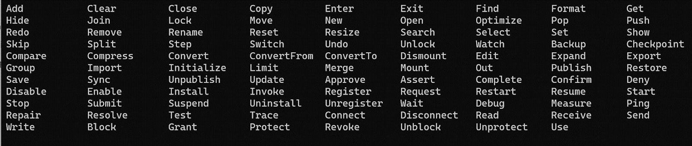
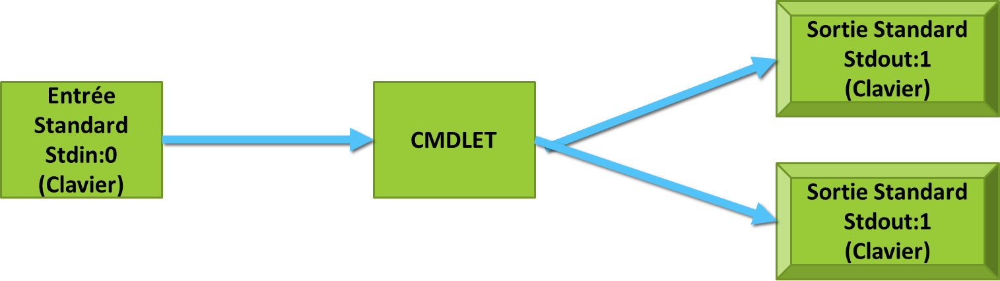
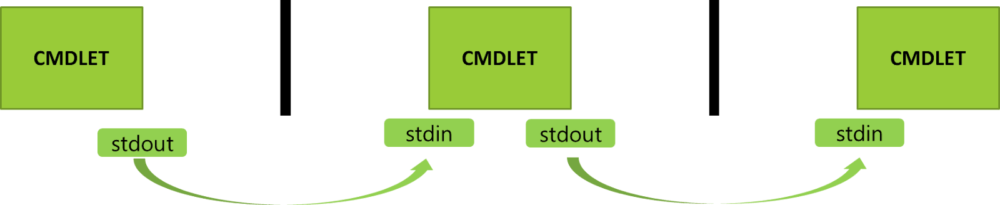
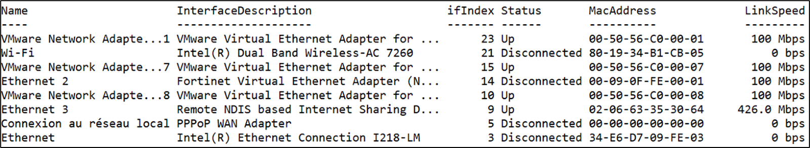
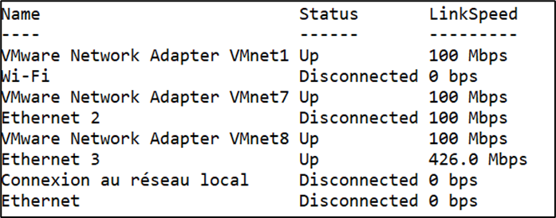
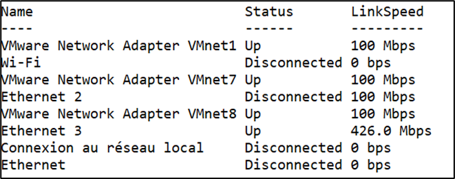
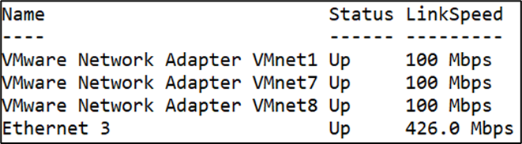
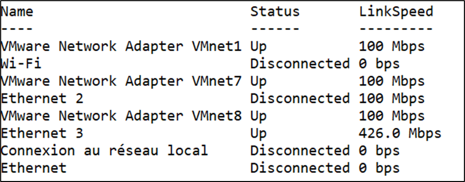
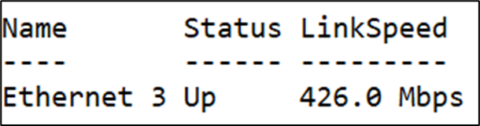

:titre: Rappel Powershell
:module: Scripting
:duree: 170
:description: Rappel sur les commandes de base en Powershell
include::../../../../adoc/libs/header-module.adoc[]

ifeval::["{visible-on-html}" !=  "yes"]
:docinfo: shared
:docinfodir: ../../../adoc/libs
endif::[]

== Objectifs pédagogiques

// tag::objectifs[]
* Version de PowerShell
* Les CmdLets
* Les CmdLets redirection
* Pipeline
* Filtrage opérateurs de comparaisons 
* Filtrage Basique
* Filtrage Avancé
* Commande de protection 
// end::objectifs[]

// tag::deroulement[]

== Versions de PowerShell

* **Version 1.0** : Publiée en novembre 2006.
* **Version 2.0** : Publiée en octobre 2009 avec Windows 7 et Server 2008 R2.
* **Version 3.0** : Publiée en septembre 2012 avec Windows 8 et Server 2012.
* **Version 4.0** : Publiée en octobre 2013 avec Windows 8.1 et Server 2012 R2.
* **Version 5.0** : Publiée en février 2016 avec Windows 10 et Server 2016.
* **PowerShell Core 6.0** : Publiée en janvier 2018.
* **PowerShell 7** : Publiée en mars 2020.

include::../../../../adoc/libs/slide-notitle.adoc[]

[cols="1,1"]
|===
a|
La commande `$PSVersionTable` permet de connaitre notre versions de Powershell

* `PSVersion` : version de PowerShell
* `PSEdition`: L'édition de PowerShell PSCompatibleVersions  : Retrocompatibilité
* `BuildVersion` : build de l’OS
a| image::./assets/01-versions.png[]
|===

== Les CmdLets

include::../../../../adoc/libs/slide-notitle.adoc[]

Les commandes PowerShell sont appelées des **cmdlets**

* Ne sont pas sensibles à la casse (sauf rares exceptions )
* Inclus des paramètres (obligatoires ou optionnels)…
* Les paramètres peuvent être complétés avec des arguments 
* Toujours constituées d'un **verbe** et d'un **nom** séparé par un –
* Les **noms** dépendent du contexte d'utilisation 


include::../../../../adoc/libs/slide-notitle.adoc[]

Les principaux Verbe  les plus courants à connaître sont :

* Get = Afficher
* Set = Modifier
* Remove = supprimer,
* Add = ajouter un objet dans un autre objet
* New = créer un objet



== Les CmdLets redirection

Une cmdlet :

* Reçoit des paramètres par l'entrée standard (stdin:0) par défaut le clavier
* Fournit des résultats sur la sortie standard (stdout:1) par défaut l'écran
* Affiche éventuellement les erreurs sur la sortie standard (stderr:2) par défaut l'écran

include::../../../../adoc/libs/slide-notitle.adoc[]



=== Redirection du flux de sortie standard

[cols="4,8"]
|===
a|
```powershell
Cmdlet > fichier
Cmdlet 1>fichier
```
a|
Redirige le flux de sortie standard vers ‘fichier’

a|
```powershell
Cmdlet >> fichier
Cmdlet 1>> fichier
```
a|
Redirige le flux de sortie standard à la fin de ‘fichier’
|===

=== Redirection du flux de sortie d'erreur

[cols="4,8"]
|===
a|
```powershell
Cmdlet 2> fichier.err
```
a|
Redirige le flux de sortie d'erreur vers fichier.err

a|
```powershell
Cmdlet 2>> fichier.err
```
a|
Redirige le flux de sortie d'erreur à la fin de fichier.err
|===

=== Redirection des flux

[cols="4,8"]
|===
a|
```powershell
Cmdlet > fichier 2>&1
```
a|
Redirige le flux de sortie standard et le flux de sortie d'erreur dans ‘fichier’

a|
```powershell
Cmdlet 2>$null
```
a|
Redirige le flux de sortie d'erreur "dans le vide"
|===

== Pipeline

Le _pipeline_ transmet le résultat de la sortie standard d'une cmdlet dans l'entrée standard d'une autre cmdlet



include::../../../../adoc/libs/slide-notitle.adoc[]

Utilisé pour fournir un jeu restreint de propriétés

exemple avec `Get-NetAdapter` (sans paramètre) qui affiche certaines propriétés



include::../../../../adoc/libs/slide-notitle.adoc[]

```powershell
Get-NetAdapter | Select Name,Status,LinkSpeed
```



== Filtrage opérateurs de comparaisons

Le **filtrage** permet de garder que les propriétés nécessaires

* Prérequis : connaître les **opérateurs de comparaisons** :
* Par défaut insensible à la casse
* Les préfixer de "c" pour les rendre sensibles ..

```powershell
… Get-Help About_Comparison_Operator …
```

include::../../../../adoc/libs/slide-notitle.adoc[]

[cols="1,1,1"]
|===
a| **Comparaison**
a| **Insensibilité à la casse**
a| **Sensibilité à la casse**

a| Egalité
a| `-eq`
a| `-ceq`

a| Inégalité
a| `-ne`
a| `-cne`

a| Supérieur à
a| `-gt`
a| `-cgt`

a| Supérieur ou égal à
a| `-ge`
a| `-cge`

a| Inférieur à
a| `-lt`
a| `-clt`

a| Inférieur ou égal à
a| `-lt`
a| `-clt`
|===

include::../../../../adoc/libs/slide-notitle.adoc[]

[cols="1,1,1"]
|===
a| **Comparaison**
a| **Insensibilité à la casse**
a| **Sensibilité à la casse**

a| Comparaison d'égalité d'expression
a| `-like`
a| `-clike`

a| Comparaison d'inégalité d'expression
a| `-notlike`
a| `-cnotlike`
|===

== Filtrage basique

Ne peut filtrer qu'une seule propriété et Nécessite la cmdlet `Where-Object`

```powershell
Exemple Get-NetAdapter | select Name,Status,LinkSpeed
```



include::../../../../adoc/libs/slide-notitle.adoc[]

```powershell
Get-Netadapter | Select Name,Status,LinkSpeed | Where Status –like Up
```



== Filtrage avancé

Le filtrage avancé permet de filtrer plusieurs propriétés

* Nécessite aussi la cmdlet `Where-Object`
* Nécessite un script de filtrage `–FilterScript {}` dans la cmdlet `Where-Object`
* Possibilité d'utiliser la variable `$PSITEM` (ou `$_`) pour être plus productif
* `$_` contient tous les objets transmis à `Where-Object`

=== Exemple 

```powershell
Get-NetAdapter | select Name,Status,LinkSpeed
```



include::../../../../adoc/libs/slide-notitle.adoc[]

```powershell
Get-NetAdapter | select Name,Status,LinkSpeed | Where –FilterScript {$_.Status –like "Up" –and $_.LinkSpeed –gt "100 Mbps"}
```



include::../../../../adoc/libs/slide-notitle.adoc[]

Si on applique plusieurs conditions à la commande `Where-Object`, on va utiliser les expressions logiques `ET` et `OU`. 

* Dans le cas d’un `ET` logique, les deux conditions doivent être valides pour que l’objet soit retenu.

```powershell
PS > Get-Process | Select Name,Id | Where –Filterscript{$PSitem.Id –gt 1500 –and $PSItem.Id –lt 2000}
```

* On peut réduire la syntaxe de `$PSItem` par `$_`.

```powershell
PS > Get-Process | Select Name,Id | Where{$_.Name –like "Power*" –and $_.Id –eq 825}
```

include::../../../../adoc/libs/slide-notitle.adoc[]

* Dans le cas d’un `OU` logique, l’une ou l’autre des conditions doit être valide pour que l’objet soit retenu.

```powershell
PS > Get-LocalUser | Select Name,Sid | Where –Filterscript {$PSitem.Name –eq « TOTO » -or $PSItem.Sid –eq S-1-5-21-3376288570-2491860933-3167967787-500}
```

* Il est également possible de faire collaborer les deux conditions et de tester de multiples valeurs en enchaînant les conditions 

== Commande de protection

L’exécution de script est par défaut soumise à une forte restriction.

Le niveau de confiance requis pour l’exécution est modifiable

=== Niveau de sécurité élevé

* **Restricted (par défaut)** : Aucune exécution de script possible. Niveau par défaut
* **AllSigned** : Tous les scripts doivent être signés par une autorité de certification de confiance, y compris ceux écrits sur la machine
* **Remote Signed** : Nécessite que tous les scripts provenant du net soient signés par une autorité de certification de confiance

=== Niveau de sécurité limité

* **Unrestricted** : Pas de restrictions particulières sur les scripts, les scripts provenant d’internant déclenchent un avertissement  
* **Bypass** : Tous les scripts sont autorisés, aucune restriction
* **Undefined** : supprime la stratégie actuellement en place

```powershell
PS > Set-ExecutionPolicy –ExecutionPolicy Unrestricted
```

// tag::demo[]
== Démonstration

**Rappel powershell **

[NOTE.speaker]
--
== Introduction à PowerShell et sa version

**Objectif**: Présenter ce qu'est PowerShell et vérifier la version utilisée.

**Explication**: PowerShell est un shell de ligne de commande et un langage de script développé par Microsoft. Il permet d'automatiser des tâches administratives sur des systèmes Windows et d'autres plateformes.

```powershell
# Introduction à PowerShell
Write-Host "Bienvenue dans cette démonstration de PowerShell!"
```

* Cette commande affiche un message de bienvenue dans la console.

```powershell
# Vérification de la version de PowerShell
$PSVersionTable.PSVersion
```

* `$PSVersionTable` est une variable automatique qui contient des informations sur la version de PowerShell en cours d'exécution. `PSVersion` affiche spécifiquement la version de PowerShell.

== Introduction aux CmdLets

**Objectif**: Présenter les CmdLets, l'élément de base des commandes PowerShell.

**Explication**: Les CmdLets (prononcé "command-lets") sont des commandes légères utilisées dans l'environnement PowerShell. Elles suivent généralement une convention de nommage "Verbe-Nom".

```powershell
# Liste des CmdLets disponibles
Get-Command
```

* `Get-Command` affiche toutes les CmdLets disponibles, les fonctions, les workflows, les alias, etc., dans la session PowerShell actuelle.

```powershell
# Exemple simple de CmdLet : Afficher un message
Write-Output "Ceci est un exemple de CmdLet."
```

* `Write-Output` envoie l'objet spécifié à l'hôte PowerShell, ce qui affiche le message à l'écran.

== Redirection des CmdLets

**Objectif**: Montrer comment rediriger la sortie des CmdLets.

**Explication**: La redirection permet d'envoyer la sortie d'une commande vers un fichier ou un autre périphérique.

```powershell
# Rediriger la sortie vers un fichier
Get-Process > processus.txt
```

* `Get-Process` récupère une liste des processus en cours d'exécution. Le symbole > redirige cette sortie vers un fichier nommé `processus.txt`.

```powershell
# Afficher le contenu du fichier
Get-Content processus.txt
```

* `Get-Content` lit le contenu d'un fichier et l'affiche dans la console.

== Utilisation du Pipeline

**Objectif**: Illustrer le passage de la sortie d'une commande en entrée d'une autre commande.

**Explication**: Le pipeline (|) permet de passer la sortie d'une commande comme entrée à une autre commande, facilitant ainsi la manipulation et le filtrage des données.

```powershell
# Utilisation du pipeline pour filtrer les processus
Get-Process | Where-Object { $_.CPU -gt 100 }
```

* `Get-Process` récupère les processus en cours. | passe la sortie à `Where-Object`, qui filtre les processus dont l'utilisation CPU est supérieure à 100. `$_` représente l'objet courant dans le pipeline.

```powershell
# Pipeline avec plusieurs CmdLets
Get-Service | Where-Object { $_.Status -eq 'Running' } | Select-Object -First 5
```

* `Get-Service` récupère les services sur la machine. `Where-Object` filtre ceux qui sont en cours d'exécution (`Status -eq 'Running'`). `Select-Object -First 5` sélectionne les cinq premiers services dans la liste filtrée.

== Filtrage avec des opérateurs de comparaison

**Objectif**: Utiliser les opérateurs de comparaison pour filtrer les données.

**Explication**: PowerShell utilise divers opérateurs de comparaison tels que -eq (égal à), -ne (non égal à), -gt (supérieur à), -lt (inférieur à), -like (correspondance avec un motif), etc.

```powershell
# Opérateur de comparaison -eq (égal à)
Get-Process | Where-Object { $_.Name -eq 'notepad' }
```

* `Get-Process` récupère les processus. `Where-Object` filtre ceux dont le nom est exactement "notepad".

```powershell
# Opérateur de comparaison -like (correspondance avec un motif)
Get-Process | Where-Object { $_.Name -like 'n*' }
```

* `Get-Process` récupère les processus. `Where-Object` filtre ceux dont le nom commence par "n". Le symbole `*` est un caractère générique représentant n'importe quelle séquence de caractères.

== Filtrage basique

**Objectif**: Utiliser des filtres simples pour obtenir des résultats spécifiques.

**Explication**: Les filtres basiques permettent de restreindre les données retournées par une commande en fonction de critères simples.

```powershell
# Filtrage des processus utilisant plus de 50 Mo de mémoire
Get-Process | Where-Object { $_.WorkingSet -gt 50MB }
```

* `Get-Process` récupère les processus. `Where-Object` filtre ceux dont l'utilisation de la mémoire (`WorkingSet`) est supérieure à 50 Mo.

```powershell
# Filtrage des services en cours d'exécution
Get-Service | Where-Object { $_.Status -eq 'Running' }
```

* `Get-Service` récupère les services. `Where-Object` filtre ceux qui sont en cours d'exécution (`Status -eq 'Running'`).

== Filtrage avancé

**Objectif**: Utiliser des filtres avancés avec des conditions complexes.

**Explication**: Les filtres avancés permettent d'utiliser des conditions multiples pour affiner les résultats.

```powershell
# Filtrage avancé des processus avec plusieurs conditions
Get-Process | Where-Object { $_.CPU -gt 100 -and $_.WorkingSet -gt 100MB }
```

* `Get-Process` récupère les processus. `Where-Object` utilise deux conditions (`CPU -gt 100 et WorkingSet -gt 100MB`) pour filtrer les résultats. L'opérateur `-and` combine les deux conditions.

```powershell
# Utilisation de Select-Object pour choisir des propriétés spécifiques
Get-Process | Where-Object { $_.CPU -gt 100 } | Select-Object Name, CPU, WorkingSet
```

* `Get-Process` récupère les processus. `Where-Object` filtre ceux dont l'utilisation CPU est supérieure à 100. `Select-Object` sélectionne les propriétés `Name`, `CPU`, et `WorkingSet` des objets filtrés.

== Commande de protection

**Objectif**: Utiliser des commandes pour protéger les données et les systèmes.

**Explication**: Certaines commandes nécessitent des confirmations pour éviter des modifications accidentelles. De plus, il est possible de sauvegarder les données avant de les modifier ou de les supprimer.

```powershell
# Exemple de commande de protection : Confirmer avant d'arrêter un service
Stop-Service -Name 'Spooler' -Confirm
```

* `Stop-Service` arrête un service. L'option `-Confirm` demande une confirmation avant d'exécuter l'action.

```powershell
# Exemple de sauvegarde des données avant suppression
Get-Process | Out-File -FilePath 'processus_backup.txt'
```

* `Get-Process` récupère les processus. `Out-File` enregistre cette liste dans un fichier nommé `processus_backup.txt`.

```powershell
Remove-Item -Path 'processus_backup.txt' -Confirm
```

* `Remove-Item` supprime le fichier spécifié. L'option `-Confirm` demande une confirmation avant de supprimer le fichier.
--
// end::demo[]

// end::deroulement[]

== Conclusion
// tag::conclusion[]
**Version**

* Vérifiez avec `$PSVersionTable.PSVersion`

**CmdLets**

* Commandes de base, format "Verbe-Nom".
* Listez avec Get-Command

**Redirection**

* `>` pour rediriger, `Get-Content` pour lire.

include::../../../../adoc/libs/slide-notitle.adoc[]

**Pipeline**

* Utilisez | pour chaîner les commandes.

**Filtrage**

* Comparaison: `-eq`, `-ne`, `-gt`, `-lt`, `-like`.
* Basique: critères simples.
* Avancé: conditions multiples avec `Where-Object`, `Select-Object`.

**Protection**

* Utilisez `-Confirm` pour éviter les erreurs, sauvegardez avant modification.

// end::conclusion[]