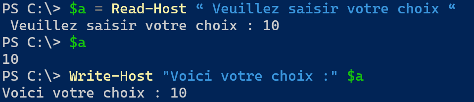
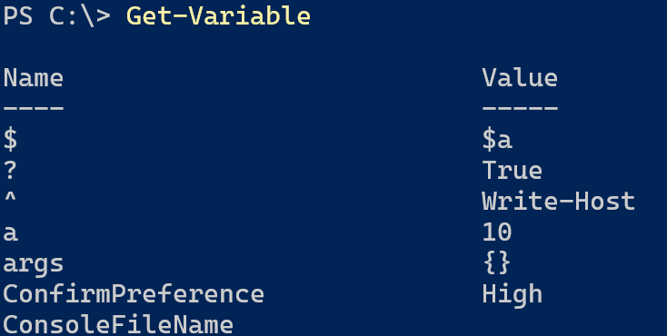
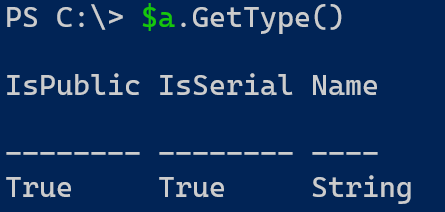

:titre: Variables PowerShell
:module: Scripting
:duree: 150
:description: Les variables en PowerShell
include::../../../../adoc/libs/header-module.adoc[]

ifeval::["{visible-on-html}" !=  "yes"]
:docinfo: shared
:docinfodir: ../../../adoc/libs
endif::[]

== Objectifs pédagogiques
// tag::objectifs[]
* Les variables
* Read-Host / Write-Host
* Get-Variable / GetType
* Variable et Objet
* Objets propriétés et méthodes
* Variable String
* Variable Int
* Variable Array
* Variable ArrayList
// end::objectifs[]

// tag::deroulement[]

== Les variables

Les variables stockent des objets ou informations dans la mémoire vive afin de permettre leur réutilisation.

include::../../../../adoc/libs/slide-notitle.adoc[]

Pour déclarer ou appeler une variable, on utilise le symbole `$`

`$A=1` 

La valeur `1` est de type `Int` donc la variable sera de type `Int`

Le symbole `=` assigne une valeur à la variable.

`$A = « Bonjour »` Ici la valeur est de type `String`

`$Service = Get-Service`  La variable et de type `Objet`

Les variables conservent leurs valeurs et leurs types tant que l’on ne ré-assigne pas de nouvelle valeur à la variable.

À la fermeture de la console, les variables sont supprimées de la mémoire vive.

== Read-Host / Write-Host

Donner des noms explicites aux variables en fonction des valeurs que les variables vont recevoir.

exemple une variable contenant des Logs : `$LogFile`

La commande `Read-Host` permet de récupérer la saisie utilisateur et de la stocker dans une variable.

```powershell
$a = Read-Host “ Veuillez saisir votre choix “
```

include::../../../../adoc/libs/slide-notitle.adoc[]

Les variables peuvent être incluses dans la commande `Write-Host`.

```powershell
Write-Host “ Voici  votre choix $a “
```



== Get-Variable / GetType

Les variables conservent leurs valeurs et leurs types tant que l’on ne ré-assigne pas de nouvelle valeur à la variable.

À la fermeture de la console, les variables sont supprimées de la mémoire vive.

=== Get-Variable

`Get-Variable` permet d’afficher les variables actuellement déclarées dans la console 



=== GetType

Pour connaître le type d’une variable, on utilise `GetType()`

`$A.GetType()`



== Variable et objet

Quand une variable contient un objet, on peut agir sur celui-ci :

Pour afficher le contenu de la variable, il suffit de saisir le nom de la variable.

`$Services = Get-Service`

`$Services` Affichera la liste des services

include::../../../../adoc/libs/slide-notitle.adoc[]

Pour afficher la propriété d’un objet contenu dans une variable, on spécifie le nom de la propriété à la suite de la variable avec un point de concaténation entre les deux.

```powershell
$Services.ServiceName 
```

Affichera uniquement la colonne `Servicename` des services

Si votre variable contient plusieurs objets, vous pouvez spécifier le numéro de l’objet à afficher. La numérotation débute à 0.

```powershell
$Services[2]
```

« Affichera le troisième utilisateur »

== Objet propriétés etméthodes

Les objets ont un ensemble de propriétés et de méthodes :

Pour utiliser une méthode sur un objet, on spécifie le numéro de l’objet, puis on ajoute la méthode.

La commande `Get-Member` permet de connaître l’ensemble des méthodes.

`$Services[3].stop()` va arrêter le quatrième service 

include::../../../../adoc/libs/slide-notitle.adoc[]

Beaucoup de méthodes sont des convertisseurs de valeur.

```powershell
$Date = (Get-Date).ToString(« yyyyMMdd »)
```

La variable `$Date` contient le résultat de la commande `get-date` tout en étant de type `String`.

```powershell
$Date.GetType()
```

== Variable String

Quand une variable est de type `String`, on peut utiliser le symbole `+`.

[cols="1,1"]
|===
a| 
```powershell
PS > $a = « abc  »
PS > $b = « def »
PS > $c = $a + $b
PS > $c
PS > abcdef
```
a|
```powershell
PS > $d = Get-AdUser –Filter *
PS > $e = $d.Name
PS > $f = $d.Surname
PS > $g= $e + $f
PS > $g
PS > Nom Prénom
```
|===

[.highlight.bg-red-500.text-white]
====
Il faut toujours additionner des variables de type identique
====

== Variable Int

Quand une variable est de type `Int`, on peut utiliser les symboles `+` et `-`.

[cols="1,1"]
|===

a|
```powershell
PS > $a = 1
PS > $b = 2
PS > $c = $a + $b
PS > $c
PS > 3
```
a|
```powershell
PS > $d = Get-Process
PS > $e = $d[1].Id
PS > $f = $d[2].Id
PS > $g= $e - $f
PS > $g
PS >  id  du process 1 - id du process 2
```
|===

== Variable Array

Le type `Array` représente une variable qui stocke ses valeurs ou objets sous forme de tableau.

**Chaque valeur possède un numéro d’index initié à 0.** 

```powershell
		    i0	  i1   i2
$array =  "PC1","PC2","PC3"   Le séparateur des valeurs est la virgule
$array[2]
PC2
```

[.highlight.bg-blue-500.text-white]
====
Les tableaux Array sont de taille fixe. On ne peut pas supprimer de valeur.
====

include::../../../../adoc/libs/slide-notitle.adoc[]

Le type `Array` permet également de gérer les valeurs présentes avec des méthodes. 

[cols="1,1"]
|===
a|
```powershell
PS >$array = "PC1","PC2","PC3"
PS >$array +="PC4"  
PS >$array
PS >PC1 PC2 PC3 PC4
```
a|
```powershell
PS >$array =  "PC1","PC2","PC3"
PS >$array.Replace("PC1", "PC11")
PS >$array[0]
PS >PC11
``` 
|===

[.highlight.bg-blue-500.text-white]
====
La section de l’aide `Get-Help about_Array` vous indiquera toutes les possibilités d’une variable tableau.
====

== Variable ArrayList

Alternativement aux tableaux de type `Array`, il est possible d’utiliser des tableaux à taille variable, de type `ArrayList` :

On doit d’abord forcer le type de variable.

```powershell
$machines = New-Object System.Collections.ArrayList
```

Deuxième méthode pour typer une variable.

```powershell
[System.Collections.ArrayList] $machines = "PC1","PC2"
```

include::../../../../adoc/libs/slide-notitle.adoc[]

pour vérifier le type d’une variable on utilise `GetType()`

```powershell
$machines.Gettype().FullName
```

[.highlight.bg-blue-500.text-white]
====
Les tableaux de type `ArrayList` ont une taille variable, ce qui simplifie l’ajout et la suppression de contenu.
====

include::../../../../adoc/libs/slide-notitle.adoc[]

Les méthodes utilisables sont plus nombreuses que sur une variable de type Array.

```powershell
[System.Collections.ArrayList] $machines  =  "PC1","PC2"
PS > $machines.Add("PC3")
PS > $machines
PS > PC1 PC2 PC3
PS > $machines.Remove("PC2")
PS > $machines
PS > PC1 PC3
```

[.highlight.bg-blue-500.text-white]
====
Ces variables vont être dédiées au stockage d’objet.
====

// tag::demo[]
== Démonstration

**Les Variables**

[NOTE.speaker]
--
**Cette démonstration couvre les bases de la manipulation des variables en PowerShell, en utilisant des commandes simples et des exemples pratiques.**

**Déclaration et Utilisation des Variables**

**Déclaration de Variables**

```powershell
# Déclaration de variables
$nom = "Alice"
$age = 25
$liste = @(1, 2, 3, 4, 5)
$dict = @{ "clé1" = "valeur1"; "clé2" = "valeur2" }
```

**Affichage des Variables**

```powershell
Write-Host "Nom: $nom"
Write-Host "Âge: $age"
Write-Host "Liste: $liste"
Write-Host "Dictionnaire: $dict"
```

* **Utilisation de `Read-Host` et `Write-Host`**

**Lecture d'Entrée Utilisateur**

```powershell
$nom = Read-Host "Veuillez entrer votre nom"
$age = Read-Host "Veuillez entrer votre âge"
Write-Host "Bonjour, $nom. Vous avez $age ans."
```

* **Utilisation de `Get-Variable` et `GetType`**

**Récupération et Affichage des Variables**

```powershell
$varName = "nom"
Get-Variable -Name $varName

# Détermination du type de la variable
$nom.GetType()
$age.GetType()
$liste.GetType()
```

* **Variables et Objets**

**Création d'Objets**

```powershell
# Création d'un objet DateTime
$dateActuelle = [DateTime]::Now
Write-Host "Date actuelle: $dateActuelle"
```

* **Objets, Propriétés et Méthodes**

**Utilisation des Propriétés et Méthodes**

```powershell
# Propriétés
Write-Host "Année actuelle: $($dateActuelle.Year)"
Write-Host "Mois actuel: $($dateActuelle.Month)"
Write-Host "Jour actuel: $($dateActuelle.Day)"

# Méthodes
$dateFutur = $dateActuelle.AddDays(10)
Write-Host "Date future (dans 10 jours): $dateFutur"
```

* **Types de Variables**

**Variables de Type `String`**


```powershell
# Déclaration d'une variable string
$chaine = "Bonjour tout le monde"
Write-Host "Chaine: $chaine"
Write-Host "Longueur de la chaine: $($chaine.Length)"
```

**Variables de Type `Int`**

```powershell
# Déclaration d'une variable int
$nombre = 42
Write-Host "Nombre: $nombre"
Write-Host "Nombre * 2: $($nombre * 2)"
```

**Variables de Type `Array`**

```powershell
# Déclaration d'un tableau
$tableau = 1..5
Write-Host "Tableau: $tableau"
Write-Host "Premier élément: $($tableau[0])"
```

**Variables de Type `ArrayList`**

```powershell
# Déclaration d'une ArrayList
$arrayList = New-Object System.Collections.ArrayList
$arrayList.Add(1)
$arrayList.Add(2)
$arrayList.Add(3)
Write-Host "ArrayList: $arrayList"
Write-Host "Nombre d'éléments: $($arrayList.Count)"
```
--
// end::demo[]
// end::deroulement[]

== Conclusion
// tag::conclusion[]
* **Rôle Crucial** : Les variables sont essentielles pour l'automatisation des tâches et la gestion des scripts en PowerShell.
* **Typage Dynamique** : Permet de stocker divers types de données sans déclaration explicite, simplifiant le développement.
* **Types de Données Variés** : Supporte les chaînes de caractères, nombres, booléens et objets complexes pour une grande flexibilité.
* **Fondamentalité** : Une maîtrise des variables est indispensable pour développer des scripts robustes et efficaces en PowerShell
// end::conclusion[]