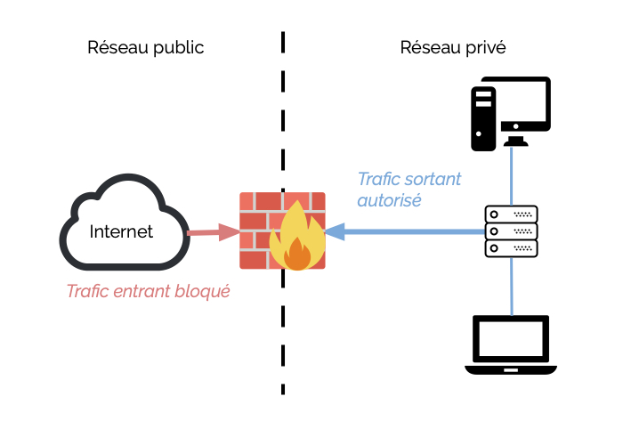

:titre: Remise à niveau sécurité
:module: Sécurité
:duree: 95
:description: Sécurité des systèmes, pare-feu, contrôle d'accès, sécurisation des OS
include::../../../../adoc/libs/header-module.adoc[]

ifeval::["{visible-on-html}" !=  "yes"]
:docinfo: shared
:docinfodir: ../../../adoc/libs
endif::[]

== Objectifs pédagogiques
// tag::objectifs[]
* Comprendre les principes fondamentaux de la sécurité informatique.
* Maîtriser la configuration et la gestion des pare-feu et des mécanismes de contrôle des accès.
* Appliquer les meilleures pratiques pour la sécurisation des systèmes d'exploitation.
// end::objectifs[]

// tag::deroulement[]
== Principes fondamentaux

=== 🕵️ Confidentialité

* Protection des informations contre l’accès non autorisé
* Garantit que seules les personnes autorisées peuvent accéder aux données sensibles

[cols="1,1"]
|===
a| 
**Objectifs :**

* Protéger les données personnelles et sensibles contre les violations
* Assurer que les informations confidentielles ne sont pas divulguées à des personnes non autorisées

a|
**Outil : Contrôle d’accès**

* Régule qui peut accéder aux systèmes et ressources
* Inclut des politiques d’accès, des mécanismes d’authentification et des autorisations d’accès
|===

=== ✅ Intégrité

* Assure que les données ne sont pas modifiées de manière non autorisée
* Garantit l’exactitude et la cohérence des informations

[cols="1,1"]
|===
a| 
**Objectifs :**

* Prévenir les modifications non autorisées des données
* Assurer la précision et la fiabilité des informations

a|
**Outil : Cryptographie**

* Protège les informations en les rendant illisibles pour les personnes non autorisées
* Garantit la confidentialité et l’intégrité des données
|===

=== ⏰ Disponibilité

* Garantit que les informations et ressources sont accessibles aux utilisateurs autorisés
* Assure la disponibilité des systèmes et services

[cols="1,1"]
|===
a| 
**Objectifs :**

* Minimiser les interruptions de service
* Assurer un accès continu aux informations critiques

a|
**Outil : Défense en profondeur**

* Stratégie de sécurité avec plusieurs couches de protection
* Si une couche est compromise, les autres continuent à fournir une protection
|===

== Pare-feu et contrôle d'accès

=== Types de pare-feu

* **Pare-feu réseau** :
  ** Protège un réseau en filtrant le trafic
  ** Fonctionne au niveau des couches réseau et transport du modèle OSI

* **Pare-feu applicatif** :
  ** Filtre le trafic en fonction des applications
  ** Analyse des protocoles de niveau application (HTTP, FTP, etc.)

* **Pare-feu personnel** :
  ** Installé sur des dispositifs individuels pour contrôler le trafic réseau
  ** Exemple : Windows Defender

include::../../../../adoc/libs/slide-notitle.adoc[]

=== Règles de filtrage

* Déterminent quel trafic est autorisé ou bloqué
* Critères tels que les adresses IP, ports et protocoles
* Exemple : Autoriser le trafic HTTP (port 80) et bloquer le trafic SSH (port 22)

=== Contrôle d'accès

* **Par liste (ACL)** :
  ** Définit les autorisations d’accès aux ressources réseau
  ** Liste les utilisateurs ou groupes et spécifie les actions autorisées (lecture, écriture, exécution)

* **Basé sur les rôles (RBAC)** :
  ** Attribue les permissions en fonction des rôles des utilisateurs
  ** Les rôles regroupent des ensembles de permissions attribuées selon les fonctions

* **Basé sur les attributs (ABAC)** :
  ** Utilise des attributs pour déterminer les autorisations d’accès
  ** Les règles d’accès sont basées sur une combinaison d’attributs

== Sécurisation des systèmes d'exploitation

=== Mises à jour

* Corrigent les vulnérabilités de sécurité dans les systèmes et applications
* Les attaquants exploitent souvent ces vulnérabilités

**Objectifs :**

* Corriger les failles de sécurité
* Assurer la compatibilité avec les nouvelles technologies

=== Configuration sécurisée

* Désactivation des services non utilisés pour réduire la surface d’attaque
* Configuration des pare-feu et ACL pour limiter le trafic réseau
* Renforcement de la sécurité pour éviter les configurations par défaut

**Exemples :**

* Désactiver les services telnet ou ftp
* Utiliser SELinux ou AppArmor pour renforcer la sécurité

=== Gestion des comptes et des permissions

* Principe du moindre privilège : les utilisateurs doivent avoir uniquement les permissions nécessaires
* Création de groupes pour organiser les utilisateurs et appliquer des permissions cohérentes

**Gestion des permissions :**

* Configurer les permissions de fichiers et répertoires (lecture, écriture, exécution)
* Limiter l’utilisation des comptes root ou administrateurs avec sudo pour l’escalade temporaire
// end::deroulement[]

== 📝 Conclusion
// tag::conclusion[]
* Compréhension des principes fondamentaux de la sécurité informatique
* Capacité à configurer et gérer des pare-feu et des mécanismes de contrôle d’accès
* Compétence dans la sécurisation des systèmes d’exploitation à travers les mises à jour, la configuration sécurisée, et la gestion des permissions
// end::conclusion[]