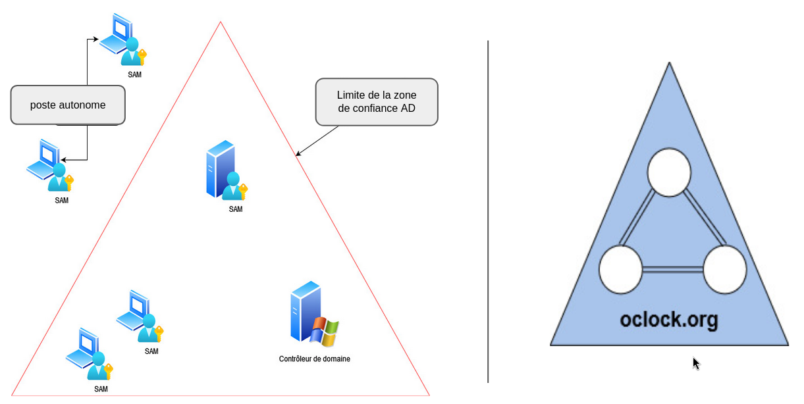
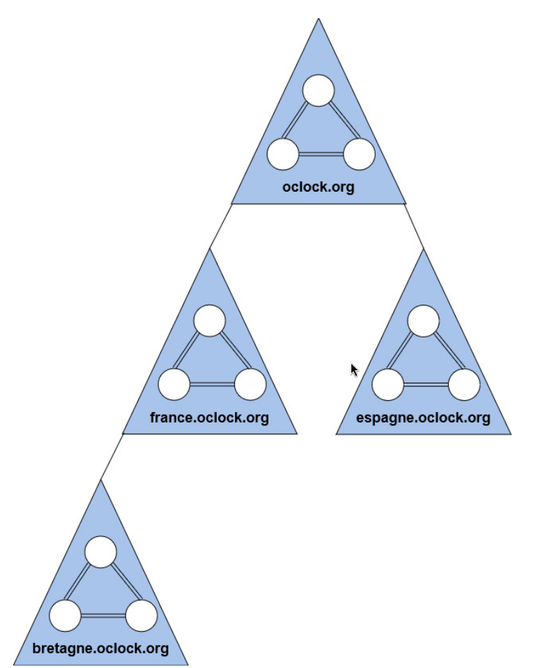
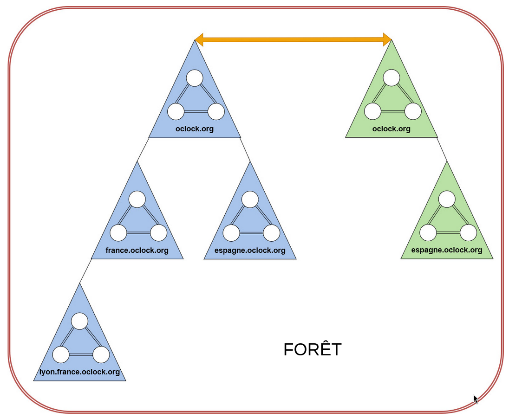
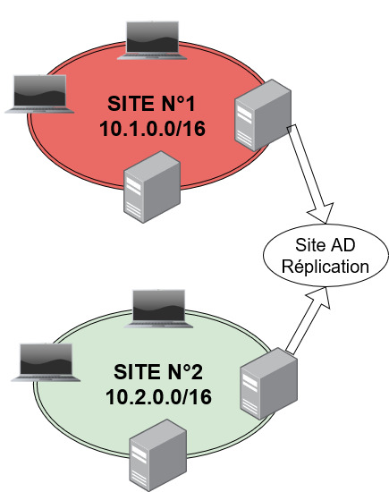
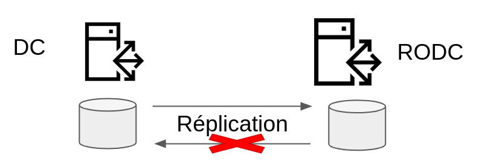
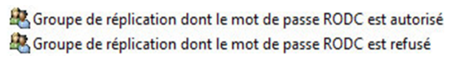

:titre: Structure et concept fondamentaux Active Directory
:module: Système
:duree: 50
:description: Comprendre les concepts fondamentaux d'Active Directory
include::../../../../adoc/libs/header-module.adoc[]

ifeval::["{visible-on-html}" !=  "yes"]
:docinfo: shared
:docinfodir: ../../../adoc/libs
endif::[]

== Objectifs pédagogiques

// tag::objectifs[]
* Comprendre ce qu’est Active directory 
* Comprendre les notions de Domaine, arbre, Forêt et sites Active directory
* Appréhender la structure d’un contrôleur de domaine
* voir la structure logique de la base Active Directory
* Le contrôleur de domaine en lecture seule
// end::objectifs[]

// tag::deroulement[]
== Qu'est-ce que Active Directory ?

Active directory est un service de gestion des identités et des accès qui Permet la gestion centralisée des utilisateurs, des ordinateurs et des ressources réseau.

=== Composants principaux

* **Domaines** : Regroupements logiques d'objets partageant une base de données commune.
* **Forêts** : Ensembles de domaines partageant un schéma commun.
* **Unités Organisationnelles (OU)** : Conteneurs pour structurer et appliquer des politiques aux objets.

=== Fonctionnalités clés :

* **Authentification** : Vérifie les identités des utilisateurs et des appareils.
* **Autorisation** : Contrôle l'accès aux ressources réseau.
* **Politiques de groupe** : Définit des configurations et des restrictions pour les utilisateurs et les ordinateurs.
* **Réplication** : Synchronise les données entre les contrôleurs de domaine pour garantir une base de données à jour.

== Comprendre les notions de Domaine, Arbre, Forêt et sites Active directory

=== Le domaine

**Définition** : Regroupe des objets tels que des utilisateurs, des groupes et des ordinateurs partageant une même base de données.

**Caractéristiques :**

* Structure hiérarchique.
* Unité de sécurité : contrôle l'accès aux ressources.
* Chaque domaine a sa propre BDD et ses propres stratégies de sécurité.
* Peut être administré indépendamment des autres domaines.

include::../../../../adoc/libs/slide-notitle.adoc[]

=== L'arbre

**Définition**: Un arbre est une collection de domaines AD liés par une relation de confiance hiérarchique.

**Caractéristiques :**

* Les domaines dans un arbre partagent un espace de noms contigu.
* L'arbre commence par un domaine racine et peut contenir plusieurs sous-domaines.
* Les domaines d'un même arbre partagent un schéma et une configuration globaux.

include::../../../../adoc/libs/slide-notitle.adoc[]

=== La forêt

**Définition**: Une forêt est la collection la plus étendue dans Active Directory, regroupant plusieurs arbres.

**Caractéristiques :**

* Les arbres dans une forêt partagent un schéma commun et une configuration globale.
* Les arbres dans une forêt sont connectés par des relations de confiance bidirectionnelles transversales.
* Permet la gestion centralisée de multiples arbres et domaines.

include::../../../../adoc/libs/slide-notitle.adoc[]

=== Les sites

**Définition** : Un site AD est une représentation physique d'un réseau d'Active Directory, souvent alignée avec la structure géographique.

**Caractéristiques :**

* Optimise la gestion de la réplication du trafic réseau.
* Correspond à un ou plusieurs sous-réseaux IP.
* Utilisé pour gérer la connectivité et la réplication des données entre contrôleurs de domaine.
* Améliore l'efficacité de l'authentification et de la localisation des ressources.

include::../../../../adoc/libs/slide-notitle.adoc[]

[NOTE.speaker]
--
Les objets de site représentent la topologie réseau d’une société,généralement basé sur les lieux géographique

Des contrôleurs de domaine sont déployés sur différents sites géographiques:

* permet aux postes clients de connaître les contrôleur de domaine les plus proches et de les contacter 
* gérer la réplication des partitions de la base AD en personnalisant le moment où elle peut avoir lieu (fenêtre de réplication)

Des services capables de tirer profit des sites AD sont déployés sur différents sites et on souhaite que les clients s’adressent à ceux qui sont à proximité. 
ex : DFS, si plusieurs serveurs de fichiers partagent des informations similaires. 
       Exchange est aussi un service utilisant les sites AD.
--

== Appréhender la structure d’un contrôleur de domaine

=== Le fonctionnement multi-maître

* Les contrôleurs peuvent tous apporter des modifications aux services de domaine
* Les data des services de domaine sont stockées

include::../../../../adoc/libs/slide-notitle.adoc[]

[cols="1,1"]
|===
a|
**Base de données Active directory**
chemin par défaut : `C:\Windows\NTDS`

**Fichiers dans le partage sysvol**
Chemin par défaut : `C:\Windows\SYSVOL`

Les modifications apportées sont transmises entre contrôleurs via la **réplication**
a| image::./assets/03-multi-maitre.png[]
|===

[NOTE.speaker]
--
Toutes les données relatives aux domaines, à la forêt sont stockées physiquement sur chaque CD.

Ainsi, les contrôleurs de domaine ont un fonctionnement dit multi-maitre car ils possèdent tous un réplica/une copie de la base AD sur leur volume local en lecture/écriture à part le RODC abordé plus tard.

Ils sont ainsi tous capables d’authentifier, entre autres, les ordinateurs et utilisateurs de leur domaine.

En outre, ils possèdent un partage nommé Sysvol dans lequel on va trouver notamment les objets de stratégie de groupe.

Des mécanismes de synchronisation sont à l’œuvre pour répliquer les modifications entre eux.

Les chemins indiqués pour l’hébergement physique de ces données, correspondent aux emplacements par défaut. Les emplacements réels peuvent différer car ils sont personnalisables.
--

== Structure logique de la base AD

include::../../../../adoc/libs/slide-notitle.adoc[]

[cols="1,1"]
|===
a| 
Les données Active Directory sont réparties sur 3 partitions logiques

[blue]#Configuration# ;  Objets liés aux sites AD, partitions de la base AD

[green]#Schéma# : Contient les classes d’objets et attributs

[red]#Domaine# : Contient les objets spécifiques au domaine

Plus des partitions applicatives
a| image::./assets/04-donnees.png[]
|===

[NOTE.speaker]
--
D’un point de vue logique, les objets de l’annuaire sont regroupés au sein de plusieurs partitions :

-> Domaine: Contient les objets du domaine (OU, utilisateurs, groupes,  contacts … ) qui sont généralement gérés depuis la console utilisateurs et ordinateurs AD.

-> Configuration: Contient les informations de configuration des services de domaine.

On y trouve la configuration des sites AD, des services et du partitionnement.

-> Schéma: Dans le schéma sont référencés pour rappel :

- L’ensemble des classes d’objets disponibles
- Pour chaque classe, les attributs qui peuvent ou doivent être renseignés

Le schéma est unique pour la forêt

Le schéma n’est pas figé, il évolue avec l’apparition de nouveaux besoins, ou l’implémentation de nouveaux outils

Des partitions applicatives => -> Zones DNS de domaine ou forêt si des noms de domaine DNS sont intégrées à l’AD
   -> Catalogue global si activé (explication plus tard dans une autre diapo)
--

== Contrôleur de domaine en lecture seule

=== RODC : Read Only Domain Controller

Réplication Unidirectionnelle uniquement vers le RODC 

[NOTE.speaker]
--
C’est un type de contrôleur de domaine AD qui déroge du fonctionnement multimaître dans le sens où ce dernier ne dispose d’un réplica de la base AD qu’en lecture ET ne stocke par défaut AUCUN mot de passe d’utilisateurs du domaine.

Il est ainsi destiné à être installé physiquement sur un site distant lorsque son positionnement ne permet pas de le sécuriser efficacement (pas de locaux techniques, ou alors pas suffisamment sécurisés) contre le vol ou l’accès physique à la console pour tenter de pénétrer sur le domaine.

Pour permettre tout de même au RODC d’authentifier les utilisateurs du site distant, une stratégie de réplication de mots de passe peut être mise en œuvre à l’aide de groupes de domaine créés spécifiquement dans lesquels nous placeront les identifiants nécessaires.

La réplication AD avec ses homologues CDs en écriture ne peut s’effectuer que dans un sens => depuis les CDs multimaitre vers le RODC, et c’est normal puisqu’il ne peut être à l’origine de modif.

Pour des besoins locaux (ajout de périphériques ou de drivers sur le serveur par ex.), un compte d’admin LOCAL est utilisable pour y ouvrir une session avec des privilèges élevés.
--

=== Stratégie de réplication des mots de passe

* Ceux pouvant être stockés par le RODC
* Ceux interdits de l’être

// end::deroulement[]

== Conclusion
// tag::conclusion[]
* vous êtes en mesure de comprendre ce qu’est un contrôleur de domaine
* en capacité de comprendre ses différentes structures
* vous savez où sont stockés les différent éléments constitutifs de l’AD 
// end::conclusion[]