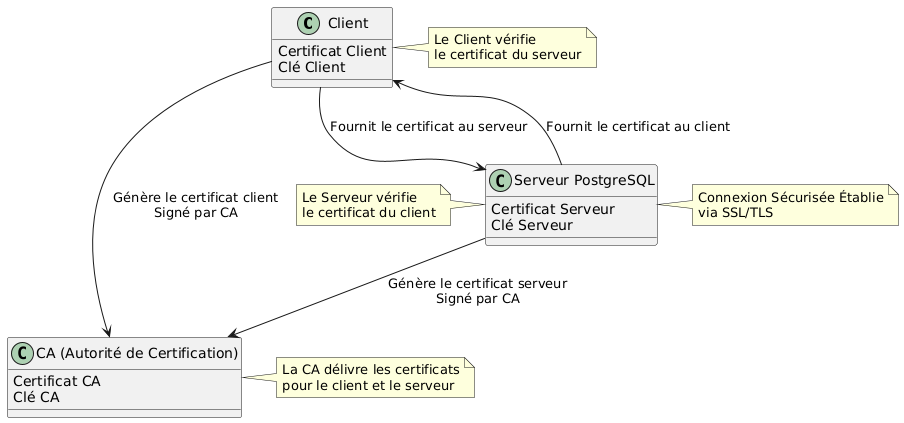

:titre: Bases de données
:module: Système
:duree: 60
:description: Savoir installer et configurer un serveur de base de données.
include::../../../../adoc/libs/header-module.adoc[]

ifeval::["{visible-on-html}" !=  "yes"]
:docinfo: shared
:docinfodir: ../../../adoc/libs
endif::[]

== Objectifs pédagogiques
// tag::objectifs[]
* Comprendre les concepts fondamentaux des bases de données 
* Savoir configurer une base de données
* Apprendre à sécuriser une base de données
* Savoir optimiser les performances d’une base de données
* Connaître les techniques de sauvegarde et de récupération d’une base de données
// end::objectifs[]

// tag::deroulement[]
== Introduction aux bases de données

* ensemble structuré de données permettant de stocker, organiser et gérer de grandes quantités d’informations de manière efficace et sécurisée
* essentielles pour de nombreuses applications modernes

=== Types de bases de données :

* **Relationnelles** : PostgreSQL, MySQL, Oracle…
* **Non-relationnelles (NoSQL)** : MongoDB, Cassandra, Neo4j, Redis…
* **Hiérarchiques** : IBM Information Management System (IMS)

=== Rôle de l’administrateur de base de données (DBA) :

* responsable de la gestion, de l’entretien et de la sécurité des bases de données d’une organisation
* s’assure de leur performance, disponibilité et sécurité
* planifie et exécute des sauvegardes, surveille les performances, effectue des mises à jour et des migrations

=== Tâches courantes d’administration de bases de données :

* Installation
* Configuration
* Maintenance
* Sauvegarde et récupération
* Sécurité
* Optimisation

== Installer une base de données PostgreSQL

**Pourquoi PostgreSQL ?**

[cols="1,1",frame=none,grid=none]
|===

a|
* Licence libre (open source)
* Conforme aux normes SQL
* Riche en fonctionnalités : ACID, types de données avancés, indexation puissante, fonctions de fenêtres et agrégats
* Extensible
a|
* Performante, optimisable et sécurisée
* Communauté active, bonnes réputation et adoption
* Compatibilité avec d’autres systèmes
* Prête pour la Haute Disponibilité

|===

include::../../../../adoc/libs/slide-notitle.adoc[]

**Installation de PostgreSQL sur Debian :**

```shell
sudo apt install postgresql postgresql-contrib
```

**Démarrer et vérifier le service**

```shell
sudo systemctl enable postgresql --now
sudo systemctl status postgresql
```

**Vérifier la version installée**

```shell
psql --version
```

include::../../../../adoc/libs/slide-notitle.adoc[]

**Accéder à l’interface en ligne de commande de PostgreSQL**

```shell
sudo -i -u postgres
psql
```

**Créer une base de données de test**

```shell
CREATE DATABASE testdb;
```

// tag:demo[]
=== Démonstration

**Installation de PostgreSQL**

[NOTE.speaker]
--
* Installer les paquets PostgreSQL
* Démarrer le service PostgreSQL et vérifier son bon fonctionnement
* Créer une base de données via l’interface `psql`
--
//end::demo[]

== Sécuriser une base de données PostgreSQL

=== Accès utilisateur

**Création d'un nouvel utilisateur avec un mot de passe :**

```shell
CREATE USER new_user WITH PASSWORD 'secure_password';
```

**Attribution des privilèges nécessaires :**

```shell
GRANT ALL PRIVILEGES ON DATABASE my_database TO new_user;
```

=== Sécuriser la communication client / serveur avec un certificat SSL



include::../../../../adoc/libs/slide-notitle.adoc[]

**Génération d’un certificat auto-signé et d’une clé privée :**

```shell
openssl genrsa -out server.key 2048

openssl req -new -x509 -key server.key -out server.crt -days 365
```

**Configurer PostgreSQL pour accepter les certificats SSL :**

```shell
sudo nano /etc/postgresql/[version]/main/postgresql.conf

ssl = on
ssl_cert_file = ‘server.crt’
ssl_key_file = ‘server.key’

sudo nano /etc/postgresql/[version]/main/pg_hba.conf

hostssl all all [ip] [cert_file]

sudo systemctl restart postgresql
```

**=> Pour se connecter, le client devra à présent fournir un certificat valide**

=== Autoriser uniquement certaines adresses : l’exemple de localhost

_Lorsque la BDD n’a pas besoin d’être en accès distant_

* **Modifier le fichier `postgresql.conf` :**

```shell
sudo nano /etc/postgresql/[version]/main/postgresql.conf
```

* **Ajouter / modifier la ligne `listen_adresses` :**

```shell
listen_addresses = 'localhost'
```

include::../../../../adoc/libs/slide-notitle.adoc[]

* **Modifier le fichier `pg_hba.conf` :**

```shell
sudo nano /etc/postgresql/[version]/main/pg_hba.conf
```

* **Laisser uniquement la ligne de connexion suivante, commenter les autres lignes de connexion :**

```shell
local 	all 	all 	trust
```

* **Redémarrer le service postgresql**

== Optimiser une base de données PostgreSQL

=== Paramétrage système dans `postgresql.conf`

_Quelques paramètres courants…_

```shell
# quantité de mémoire allouée au cache des données
shared_buffers = 2GB 		# recommandation : 25% de la RAM disponible

# quantité de mémoire allouée aux opérations de tri et les jointures
work_mem = 64MB			# recommandation : 64MB ou plus

# quantité de mémoire cache disponible
effective_cache_size = 6GB	# recommandation : 50% à 75% de la RAM totale

# quantité de mémoire allouée aux opérations de maintenance telles que index et VACUUM
maintenance_work_mem = 512MB

# nombre maximal de connexions simultanées
max_connections = 200		# recommandation : entre 100 et 1000

# taille maximale des fichiers de journalisation des transactions avant déclenchement d’un point de contrôle (checkpoint)
max_wal_size = 1GB
```

=== `pg_stat_activity`

[cols="2,8"]
|===

a| **Description**
a|
Fournit des informations sur les connexions actives à la base de données :
* sessions en cours
* requêtes exécutées par ces sessions


a| **Syntaxe**
a|
```shell
SELECT pid, usename, datname, client_addr, state, query FROM pg_stat_activity;
```

a| **Utilité**
a|
* Détecter les verrous (ce qui pourrait bloquer d’autres transactions)
* Analyser les requêtes lentes pour pouvoir les améliorer
* Surveiller les connexions, notamment celles qui sont inattendues ou suspectes

|===

=== `pg_stat_statements`

[cols="2,8"]
|===

a| **Description**
a|
Fournit des statistiques agrégées sur les requêtes SQL exécutées :
* fréquence des requêtes
* durée des requêtes
* coût des requêtes


a| **Syntaxe**
a|
```shell
SELECT query, total_time, calls, mean_time 
FROM pg_stat_statements 
ORDER BY mean_time DESC LIMIT 10;
```

a| **Utilité**
a|
* Identifier les requêtes lentes pour les optimiser
* Analyser les modèles de requêtes et leur impact sur les performances

|===

== Sauvegarder et restaurer une base de données PostgreSQL

* **Sauvegarder une base de données**

```shell
pg_dump my_database > my_database_backup.sql
```

* **Restaurer une base de données**

```shell
psql my_database < my_database_backup.sql
```

* **Automatiser la sauvegarde via un script bash**

include::../../../../adoc/libs/slide-notitle.adoc[]

* **Exécuter la sauvegarde de manière périodique avec crontab**

```shell
crontab -e # ouvrir l’éditeur de crons

0 2 * * * /path/to/your_backup_script.sh # exécuter le script tous les jours à 2h du matin

crontab -l # vérifier la planification de crons
```

* **Stocker les sauvegardes sur un emplacement sécurisé et avec une redondance géographiquement distante avec rsync**

```shell
rsync -avz /path/to/backup/directory/my_database_backup.sql remote_user@remote_host:/path/to/remote/directory
```
// end::deroulement[]

== Conclusion
// tag::conclusion[]
* Compréhension des concepts fondamentaux des bases de données
* Capacité à configurer une base de données avec l’exemple de PostgreSQL
* Connaissance de techniques pour sécuriser une base de données
* Connaissance de techniques pour optimiser une base de données
* Capacité à effectuer des opérations de sauvegarde et de récupération d’une base de données
// end::conclusion[]