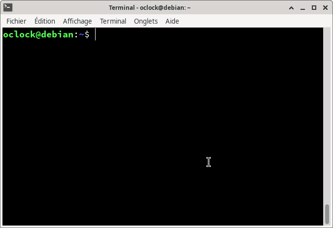
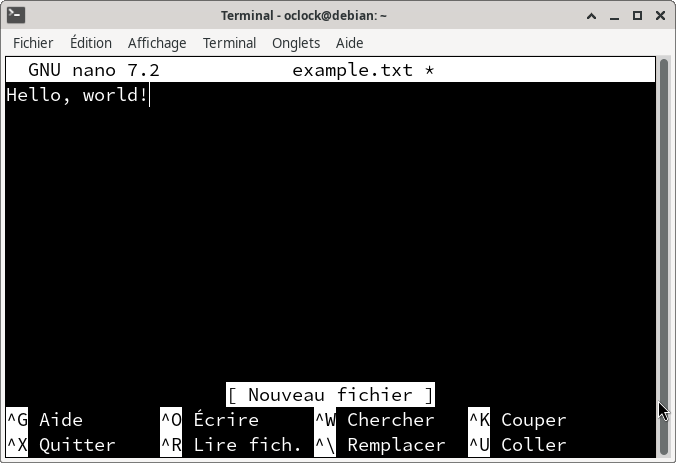

:titre: Commandes de base Linux
:module: Système
:duree: 45
:description: Découvrir les commandes de base de Linux pour la gestion des fichiers et des systèmes.
include::../../../../adoc/libs/header-module.adoc[]

ifeval::["{visible-on-html}" !=  "yes"]
:docinfo: shared
:docinfodir: ../../../adoc/libs
endif::[]

== Objectifs pédagogiques

// tag::objectifs[]
* Comprendre et utiliser la ligne de commande Linux.
* Maîtriser les commandes de base pour la gestion des fichiers et des répertoires.
* Utiliser un éditeur de texte en ligne de commande.
// end::objectifs[]

// tag::deroulement[]
== Introduction à la ligne de commande

* Interface textuelle permettant d’interagir avec le système d’exploitation
* Présente dès les tout premiers systèmes Unix
* Utilisation répandue dans l’administration système, le développement et la gestion de serveurs
* Avantages : 
** rapidité, 
** automatisation des tâches, 
** contrôle précis du système



[NOTE.speaker]
--
**Interface textuelle permettant d’interagir avec le système d’exploitation** : La ligne de commande offre une interface textuelle puissante pour exécuter des commandes et scripts, permettant une interaction directe avec le système d'exploitation.

**Présente dès les tout premiers systèmes Unix** : Utilisée depuis les débuts d'Unix, la ligne de commande est un outil éprouvé et essentiel pour les administrateurs système.

**Utilisation répandue dans l’administration système, le développement et la gestion de serveurs** : La ligne de commande est couramment utilisée pour administrer les systèmes, développer des applications et gérer des serveurs grâce à sa flexibilité et son efficacité.

**Avantages :**

* **Rapidité** : Permet d'exécuter rapidement des tâches complexes sans les limitations d'une interface graphique.
* **Automatisation des tâches** : Facilite l'automatisation par des scripts, réduisant les erreurs humaines et augmentant l'efficacité.
* **Contrôle précis du système** : Offre un contrôle détaillé et granulaire sur le fonctionnement et la configuration du système.
--

== Gestion des fichiers et répertoires

* Fichiers et répertoires servent à structurer les données du système
* Commandes de base :
** `ls` : liste les fichiers et répertoires.
** `cd` : change le répertoire de travail.
** `mkdir` : crée un nouveau répertoire.
** `rmdir` : supprime un répertoire vide.
** `rm` : supprime des fichiers ou des répertoires.
** `cp` : copie des fichiers ou des répertoires.
** `mv` : déplace ou renomme des fichiers ou des répertoires.

include::../../../../adoc/libs/slide-notitle.adoc[]

**Exemples courants de manipulation de fichiers :**

```shell
ls -l # liste des fichiers et dossiers
cd /home/user/Documents # déplacement dans un répertoire
mkdir new_folder # création d’un nouveau répertoire
cp file.txt new_folder/ # copie d’un fichier dans un répertoire
mv new_folder/file.txt /home/user/Desktop/ # déplacement d’un fichier vers un répertoire
rm /home/user/Desktop/file.txt # suppression d’un fichier
```

// tag::demo[]
== Démonstration

**Manipulation de la ligne de commande**

[NOTE.speaker]
--
* Lister les fichiers dans le répertoire courant avec `ls -l`.
* Créer un répertoire avec `mkdir test_directory`.
* Naviguer vers le nouveau répertoire avec `cd test_directory`.
* Créer un fichier avec `touch example.txt`.
* Copier ce fichier vers le répertoire parent avec `cp example.txt ../`.
* Renommer le fichier copié avec `mv ../example.txt ../new_example.txt`.
* Supprimer le fichier avec `rm ../new_example.txt`.
--
// end::demo[]

// tag::exercice[]
== Exercice

* Créer un répertoire nommé `my_project`.
* À l'intérieur de ce répertoire, créer un fichier nommé `README.md`.
* Copier ce fichier dans le répertoire parent.
* Supprimer le fichier original dans `my_project`.
* Renommer le fichier copié en `README_backup.md`.
// end::exercice[]

== Utilisation d’un éditeur de texte en ligne de commande

Les éditeurs de texte en ligne de commande sont essentiels pour éditer des fichiers de configuration, écrire des scripts ou développer du code directement depuis la ligne de commande.

Exemples d’éditeurs : `nano`, `vi`, et `emacs` 

➡️ **On va utiliser `nano`**

* Facile à prendre en main
* Affiche les commandes principales en bas de l’écran

include::../../../../adoc/libs/slide-notitle.adoc[]

Commandes de base dans `nano` :

* `Ctrl+O` : Enregistrer le fichier.
* `Ctrl+X` : Quitter l'éditeur.
* `Ctrl+K` : Couper une ligne.
* `Ctrl+U` : Coller une ligne.



// tag::demo[]
== Démonstration

**L’éditeur nano**

[NOTE.speaker]
--
* Ouvrir `nano` en tapant `nano nom_du_fichier.txt`.
* Taper du texte, puis enregistrer le fichier avec `Ctrl+O`.
* Effectuer d'autres opérations sur le texte
* Quitter nano avec `Ctrl+X`.
--
// end::demo[]

// tag::exercice[]
== Exercice

* Ouvrir `nano` et créer un fichier nommé `notes.txt`.
* Écrire trois lignes de texte, puis enregistrer et quitter.
* Réouvrir `notes.txt` dans `nano`, ajouter une ligne, et sauvegarder à nouveau.
// end::exercice[]

// end::deroulement[]

== Conclusion
// tag::conclusion[]
* Maîtrise de la navigation et de la manipulation de fichiers et répertoires via la ligne de commande.
* Capacité à utiliser un éditeur de texte en ligne de commande pour créer et modifier des fichiers.
* Compréhension des avantages et de l'efficacité de la ligne de commande dans les tâches courantes.
// end::conclusion[]