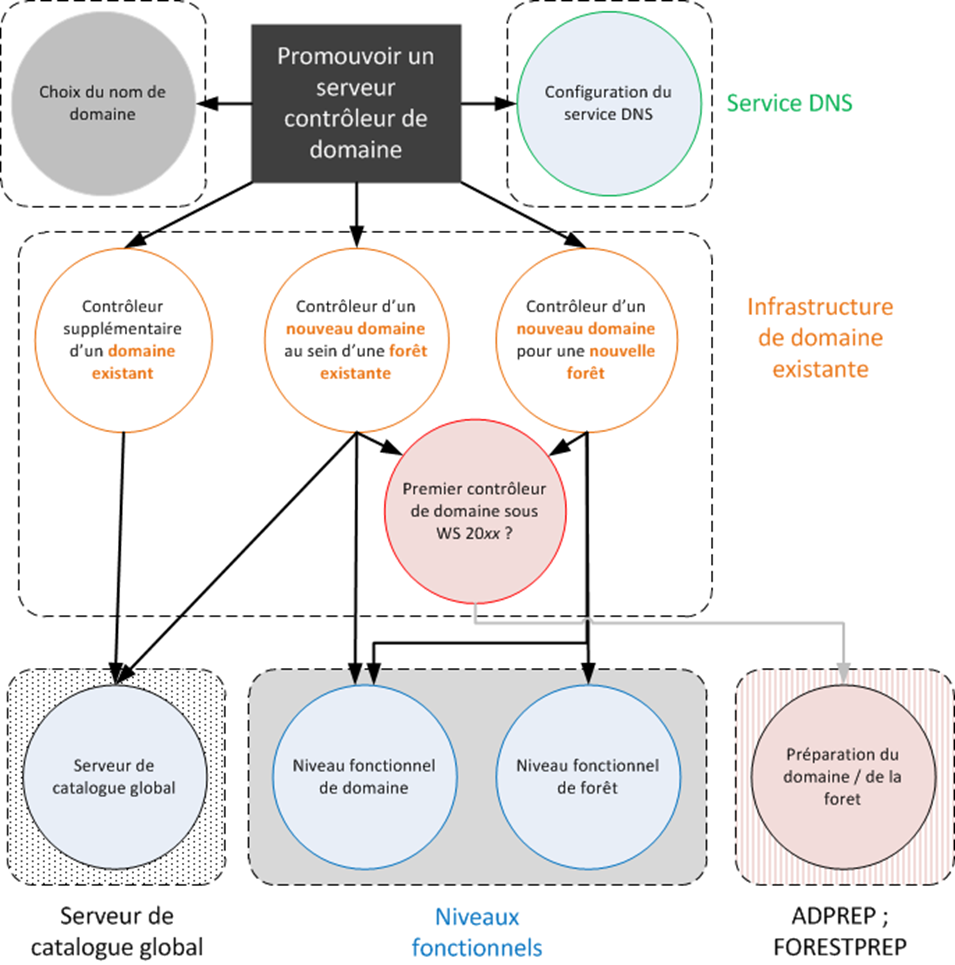
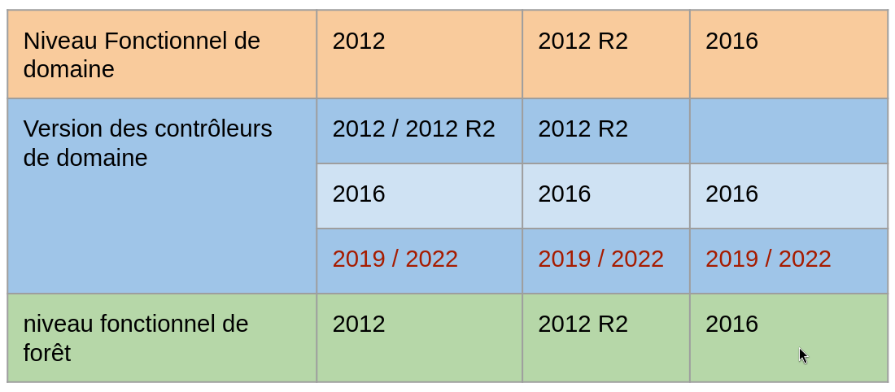
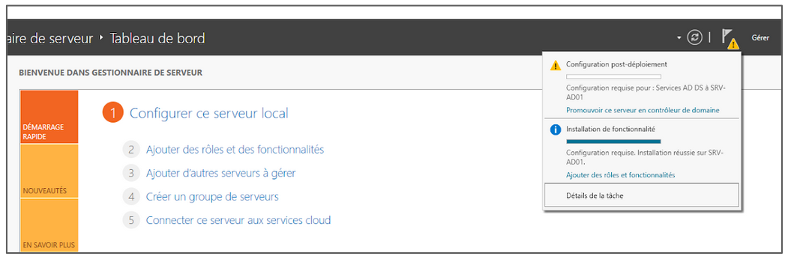

:titre: Installation et promotion d’un contrôleur de domaine
:module: Système
:duree: 90
:description: Le contrôleur de domaine est un serveur qui contient une base de données Active Directory et qui gère les accès aux ressources réseau.
include::../../../../adoc/libs/header-module.adoc[]

ifeval::["{visible-on-html}" !=  "yes"]
:docinfo: shared
:docinfodir: ../../../adoc/libs
endif::[]

== Objectifs pédagogiques

// tag::objectifs[]
* Comprendre les différents scénarios de promotion d’un contrôleur de domaine
* Appréhender la notion de niveaux fonctionnels
* Promouvoir ou Rétrograder un contrôleur de domaine
// end::objectifs[]

// tag::deroulement[]
== Scénarios de promotion d’un contrôleur de domaine

Une fois le rôle ADDS installé sur le serveur, pour activer le rôle il faut promouvoir le serveur en contrôleur de domaines.

Pour cela, il faut connaître l’existant pour déterminer le rôle souhaité

**Un contrôleur supplémentaire d’un domaine existant**

* Accroître la disponibilité des services de domaine de l’entreprise

**Le premier contrôleur d’un nouveau domaine dans une forêt existante**

* Nouvelle entité administrative possédant ses propres objets et administrateurs

include::../../../../adoc/libs/slide-notitle.adoc[]

Contrôleur d’un nouveau domaine dans une nouvelle forêt

* Isoler un nouveau domaine

D’autres points de configuration seront à déterminer

* Niveau fonctionnel de domaine et de forêt
* Répartition du rôle de serveur DNS

include::../../../../adoc/libs/slide-notitle.adoc[]

[NOTE.speaker]
--
La promotion d’un serveur M$ en tant que CD, est le préalable pour:

-> La création d’une nouvelle forêt

-> La création d'un nouveau domaine

-> Assurer l’équilibrage de charge et tolérance à la panne d’un domaine déjà existant

L’existant est important à prendre en compte dans les deux scénarios mentionnés juste avant:

-> Préparation du domaine/forêt lorsqu’on installe une nouvelle version d’un OS serveur M$ (par ex. s’il n’y avait que 2012R2 jusque-là et qu’on souhaite intégrer un CD en 2019 pour le première fois)

Cette opération se déroule aujourd’hui automatiquement.

-> Niveau fonctionnel du domaine et forêt qui peut être un frein à l’ajout d’un OS plus moderne (incompatibilité
--

== Niveaux fonctionnels

Les niveaux fonctionnels AD déterminent les fonctionnalités disponibles dans un environnement Active Directory 

* définissent les versions minimales de Windows Server requises 
* améliorent les capacités de gestion et de sécurité au sein du domaine ou de la forêt en activant des fonctionnalités avancées.

include::../../../../adoc/libs/slide-notitle.adoc[]

== Promouvoir ou rétrograder un Contrôleur de domaine

include::../../../../adoc/libs/slide-notitle.adoc[]

Prérequis avant de promouvoir un serveur : 

Vérifier que le nommage du Serveur est OK
Vérifier que l’adresse IP est correct et définis en statique
le rôle ADDS a été ajouté sur le serveur 

En fonction du scénario choisi faire des choix sur :

[cols="1,1"]
|===
a| **Devenir serveur DNS**
a| **Quel est le niveau fonctionnel**

a| Fonctionnalité de catalogue global
a| Mot de passe administrateur AD

a| Est ce un serveur RODC
a| Emplacement par défaut des services AD ?

|===

include::../../../../adoc/libs/slide-notitle.adoc[]

Pour promouvoir le serveur : 

* utilisation de l’assistant graphique via le gestionnaire serveur

include::../../../../adoc/libs/slide-notitle.adoc[]

* Utilisation de PowerShell 

Nouvelle forêt, nouveau domaine

`Install-ADDSForest`	

Nouveau domaine dans une forêt existante	

`Install-ADDSDomain`	

Ajout d’un contrôleur à un domaine existant

`Install-ADDSDomainController`

include::../../../../adoc/libs/slide-notitle.adoc[]

Opération de retrait d’un contrôleur de domaine

* Via le retrait du rôle AD DS depuis le gestionnaire de serveur, la suppression du rôle entraînera la dépromotion du serveur

[cols="1,1"]
|===

a| image::./assets/03-validation.png[]
a| image::./assets/03-assistant.png[]

|===

* En Powershell

`Uninstall-ADDSDomainController`

// tag::demo[]
== Démonstration

**Installation et suppression d’un contrôleur de domaine**

[NOTE.speaker]
--
* montrer la promotion d’un contrôleur de domaine graphiquement en expliquant chaque étape
* faire ensuite une rétrogradation de ce contrôleur de domaine
* refaire la promotion via powershell
--
// end::demo[]
// end::deroulement[]

== Conclusion
// tag::conclusion[]
* Compréhension des différents scénarios de promotion d’un contrôleur de domaine
* Capacité à appréhender la notion de niveaux fonctionnels
* Capacité à Promouvoir ou Rétrograder un contrôleur de domaine
// end::conclusion[]
