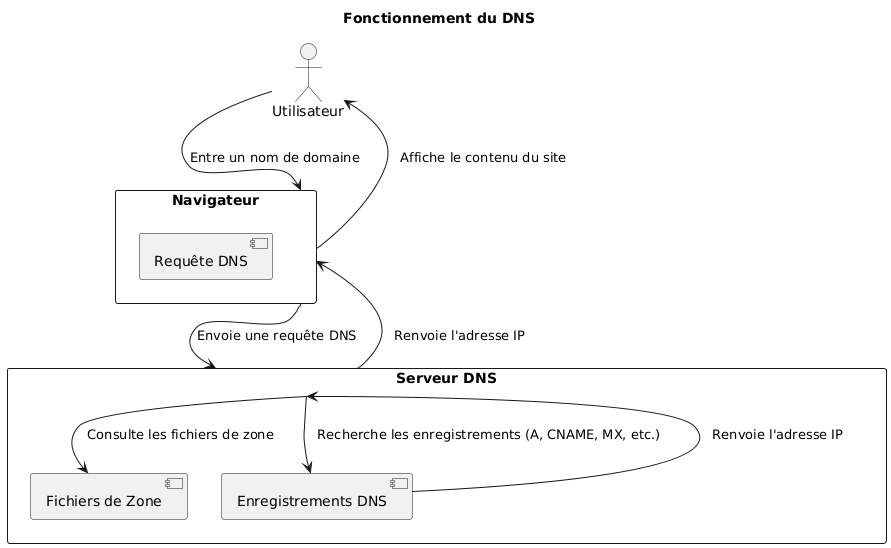
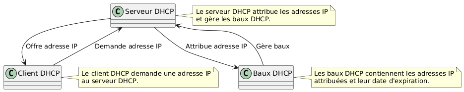

:titre: DNS, DHCP et partages
:module: Système
:duree: 105
:description: Utiliser les services DNS et DHCP, et mettre en place des partages de ressources.
include::../../../../adoc/libs/header-module.adoc[]

ifeval::["{visible-on-html}" !=  "yes"]
:docinfo: shared
:docinfodir: ../../../adoc/libs
endif::[]

== Objectifs pédagogiques
// tag::objectifs[]
* Comprendre le fonctionnement et la configuration du DNS dans un environnement Linux
* Configurer et gérer un serveur DHCP dans un environnement Linux
* Mettre en place des partages de fichiers et d'imprimantes dans un environnement Linux
* Appliquer les concepts DNS, DHCP et de partage
// end::objectifs[]

// tag::deroulement[]
== DNS (Domain Name System)



=== Mise en place d’un serveur BIND

```shell
sudo apt install bind9 bind9utils bind9-doc
```

=== Fichiers de configuration principaux :

* `etc/bind/named.conf` permet de rassembler les fichiers de configuration
* `etc/bind/named.conf.options` permet de configurer les options globales pour le serveur DNS, tels que les serveurs DNS en amont, les options de transfert, les paramètres de sécurité
* `etc/bind/named.conf.local` permet de définir les zones principales et inverses du domaine
* `etc/bind/db.example.com` est un fichier de zone pour le domaine example.com. Il contient les enregistrements A, MX et autres.
* `etc/bind/db.192.168.1` est un fichier de zone inverse pour le réseau `192.168.1.0`. Il permet la résolution inverse, soit la conversion d’une adresse IP vers un nom de domaine.

// tag:demo[]
=== Démonstration

**Mise en place d’un serveur DNS avec BIND**

[NOTE.speaker]
--
**Contexte :**

**Nom de domaine :** `company.local`

**Serveurs :**

* Serveur DNS principal : `ns1.company.local` (IP : 192.168.1.10)
* Serveur DNS secondaire : `ns2.company.local` (IP : 192.168.1.11)
* Serveur Web : `www.company.local` (IP : 192.168.1.20)
* Serveur de messagerie : `mail.company.local` (IP : 192.168.1.30)

* Installer BIND : `sudo apt install bind9 bind9utils bind9-doc`

* Configuration des fichiers principaux :

** `/etc/bind/named.conf.options`
	
```shell
options {
	directory "/var/cache/bind";

	// Forwarders (serveurs de noms en amont)
	forwarders {
    	8.8.8.8;
    	8.8.4.4;
	};

	// Options supplémentaires
	dnssec-validation auto; // valide la signature DNSSEC des zones signées
	listen-on { any; }; // adresses IP sur lesquelles le serveur est en écoute
	allow-query { any; }; // spécifie quelles machines sont autorisées à envoyer des requêtes au serveur
	recursion yes; 
};
```

** `/etc/bind/named.conf.local`

```shell
zone "company.local" {
	type master;
	file "/etc/bind/db.company.local";
};

zone "1.168.192.in-addr.arpa" {
	type master;
	file "/etc/bind/db.192.168.1";
};
```

* Configuration des fichiers de zone

** `/etc/bind/db.company.local`

```shell
$TTL 86400
@   IN  SOA ns1.company.local. admin.company.local. (
        	2024072201 ; Serial
        	3600   	; Refresh
        	1800   	; Retry
        	1209600	; Expire
        	86400 )	; Minimum TTL

; Déclarations des serveurs de noms
@   IN  NS  ns1.company.local.
@   IN  NS  ns2.company.local.

; Déclarations des adresses IP
@   IN  A   192.168.1.10
ns1 IN  A   192.168.1.10
ns2 IN  A   192.168.1.11
www IN  A   192.168.1.20
mail IN  A   192.168.1.30

; Enregistrements MX
@   IN  MX  10 mail.company.local.
```

** `/etc/bind/db.192.168.1`

```shell
	$TTL 86400
@   IN  SOA ns1.company.local. admin.company.local. (
        	2024072201 ; Serial
        	3600   	; Refresh
        	1800   	; Retry
        	1209600	; Expire
        	86400 )	; Minimum TTL

; Déclarations des serveurs de noms
@   IN  NS  ns1.company.local.
@   IN  NS  ns2.company.local.

; Déclarations des adresses IP
10  IN  PTR ns1.company.local.
11  IN  PTR ns2.company.local.
20  IN  PTR www.company.local.
30  IN  PTR mail.company.local.
```

* Redémarrer le service BIND pour appliquer les modifications : `sudo systemctl restart bind9`

* Vérifier la configuration : 

```shell
sudo named-checkconf
sudo named-checkzone company.local /etc/bind/db.company.local
sudo named-checkzone 1.168.192.in-addr.arpa /etc/bind/db.192.168.1

dig @127.0.0.1 company.local
dig @127.0.0.1 www.company.local
dig @127.0.0.1 -x 192.168.1.10
```


**Résultat attendu**

* La commande `dig @127.0.0.1 company.local` devrait retourner l'adresse IP `192.168.1.10`.
* La commande `dig @127.0.0.1 www.company.local` devrait retourner l'adresse IP `192.168.1.20`.
* La commande `dig @127.0.0.1 -x 192.168.1.10` devrait retourner le nom de domaine `ns1.company.local`.
--
// end::demo[]

== DHCP (Dynamic Host Configuration Protocol)



=== Mise en place d’un serveur DHCP

```shell
sudo apt install isc-dhcp-server
```

**Configuration :**

```shell
sudo nano /etc/dhcp/dhcpd.conf
```

```shell
# Option générale
default-lease-time 600;
max-lease-time 7200;
authoritative;

# Configuration de la plage d'adresses IP pour un sous-réseau spécifique
subnet 192.168.1.0 netmask 255.255.255.0 {
	range 192.168.1.10 192.168.1.100;  # Plage d'adresses IP à attribuer
	option domain-name-servers 8.8.8.8, 8.8.4.4;  # Serveurs DNS
	option routers 192.168.1.1;  # Routeur par défaut
	option broadcast-address 192.168.1.255;  # Adresse de diffusion
	option domain-name "example.com";  # Nom de domaine
}

# Exemples d'autres options possibles
# option ntp-servers 192.168.1.1;  # Serveurs NTP
# option time-offset -18000;  # Décalage horaire (en secondes)
```

[NOTE.speaker]
--
`default-lease-time` : Temps de bail par défaut (en secondes) pour lequel une adresse IP est attribuée.
`max-lease-time` : Temps de bail maximum.
`authoritative` : Indique que ce serveur DHCP est le serveur principal pour le réseau.
`subnet` : Définissez les paramètres pour le sous-réseau spécifié.
`range` : Plage d'adresses IP que le serveur peut attribuer.
`option domain-name-servers` : Adresses IP des serveurs DNS à utiliser.
`option routers` : Adresse IP du routeur par défaut.
`option broadcast-address` : Adresse de diffusion pour le sous-réseau.
`option domain-name` : Nom de domaine utilisé pour le réseau.
--

=== Configuration des interfaces réseau

```shell
sudo nano /etc/default/isc-dhcp-server 
```

**Modifier :**

```shell
INTERFACESv4="eth0"
```

**Puis : **

```shell
sudo systemctl restart isc-dhcp-server

sudo journalctl -u isc-dhcp-server

sudo dhclient -v
```

== Partage de fichiers

=== NFS (Network File System)

* NFS utilise un modèle client-serveur.
* Le serveur NFS exporte des répertoires qui peuvent être montés par des clients.
* Les clients accèdent aux fichiers sur le serveur comme s'ils étaient sur leur propre système de fichiers.
* Les versions courantes incluent NFSv3 et NFSv4, avec NFSv4 offrant des améliorations en termes de performance et de sécurité.

```shell
sudo apt install nfs-kernel-server
```

=== Configuration du serveur NFS

* Créer le dossier qui va servir à l’échange de fichiers, par exemple `/shared`
* Modifier le fichier `/etc/exports` pour définir les répertoires à partager et les permissions. Exemple :

```shell
/shared *(rw,sync,no_subtree_check,no_root_squash)
```

* Appliquer les changements

```shell
sudo exportfs -a
```

* Démarrer et activer le service NFS

```shell
sudo systemctl enable –now nfs-kernel-server
```

=== Configuration du client NFS

_En partant du principe que la machine client est une machine Debian également_

* **Installer le client NFS :**

```shell
sudo apt install nfs-common
```

* **Monter le répertoire partagé**

```shell
sudo mount -t nfs serveur_nfs:/chemin/vers/repertoire /chemin/local
```

* **Monter le répertoire automatiquement au démarrage en ajoutant une entrée dans /etc/fstab**

```shell
serveur_nfs:/chemin/vers/repertoire /chemin/local nfs defaults 0 0
```

// tag:demo[]
=== Démonstration

**Mise en place d’un partage de fichier avec NFS**

[NOTE.speaker]
--
**On va utiliser 2 VM Debian pour partager les fichiers :**

* S’assurer que les deux VM ont les paramètres réseau corrects (accès par pont / bridged access)
* **Sur la première VM**, qui tiendra le rôle de serveur NFS, suivre les étapes suivantes :
** Installer NFS Server : `sudo apt install nfs-kernel-server`
** Créer un dossier qui va servir pour le partage, par exemple `/shared`
** Dans ce dossier, ajouter un fichier avec un nom reconnaissable, du type `hello_from_nfs_server`
** Modifier le fichier `/etc/exports` en ajoutant la ligne ci-dessous

```shell
/shared *(rw,sync,no_subtree_check,no_root_squash)
```

** Appliquer les changements avec `sudo exportfs -a`
** Si besoin, activer le service `sudo systemctl enable --now nfs-kernel-server`
** Noter l’IP de la machine avec `ip a`

* **Sur la deuxième VM**, qui aura un rôle de client NFS, suivre les étapes suivantes :
** Installer le client NFS : `sudo apt install nfs-common`
** Créer un dossier sur lequel va être monté le dossier partagé, par exemple `~/shared_files`
** Monter le répertoire partagé

```shell
sudo mount -t nfs ip_vm_serveur:/shared ~/shared_files
```

** Contrôler que le dossier `~/shared_files` contient bien le fichier `hello_from_nfs_server`
** Ajouter un fichier, par exemple `hello_from_nfs_client`
** Contrôler que le contenu du dossier partagé est identique sur les deux machines
--
// end::demo[]

=== SAMBA : un partage possible avec les clients Windows

* **Installer Samba sur Debian**

```shell
sudo apt install samba
```

* **Modifier le fichier `/etc/samba/smb.conf`**

```shell
[partage]
path = /srv/samba
browsable = yes
read only = no
guest ok = yes
```

* **Ajouter des utilisateurs Samba**

```shell
sudo smbpasswd -a nom_utilisateur
```

include::../../../../adoc/libs/slide-notitle.adoc[]

* **Démarrer et activer le service Samba : `sudo systemctl enable --now smbd`**

* **Accéder aux partages Samba depuis un client Windows : `\\ip_serveur\partage`**

== Partage d'imprimantes avec CUPS (Common Unix Printing System)

* système de gestion d’imprimantes pour Linux qui permet le partage d’imprimantes
* utilise le protocole IPP (Internet Printing Protocol) pour gérer les tâches d’impression
* permet aux utilisateurs de découvrir et utiliser des imprimantes réseau
* fournit une interface web pour la configuration et la gestion des imprimantes

include::../../../../adoc/libs/slide-notitle.adoc[]


=== Configuration de CUPS

* **Installer CUPS : `sudo apt install cups`**
* **Ajouter un utilisateur au groupe `lpadmin`**

```shell
sudo usermod -aG lpadmin votre_nom_utilisateur
```

include::../../../../adoc/libs/slide-notitle.adoc[]

* **Modifier la configuration de CUPS : `sudo nano /etc/cups/cupsd.conf`**

```shell
# Activer le partage et l’administration à distance
WebInterface Yes

# Autoriser l’accès à distance
Listen 631
Port 631

# Restreindre l’accès au serveur
<Location />
  Order allow,deny
  Allow all
</Location>

# Restreindre l’accès aux pages admin
<Location /admin>
  Order allow,deny
  Allow all
</Location>

# Restreindre l’accès aux pages de configuration
<Location /admin/conf>
  AuthType Default
  Require user @SYSTEM
  Order allow,deny
  Allow all
</Location>
```

include::../../../../adoc/libs/slide-notitle.adoc[]

* **Redémarrer le service CUPS : `sudo systemctl restart cups`**
* **Accéder à l’interface de CUPS : http://localhost:631**
* **Ajout d’une imprimante :**
** Dans l’interface web de CUPS, aller dans l’onglet “Administration”, sélectionner “Add Printer” et suivre les instructions
* **Configurer le partage d’imprimante :**
** Lors de l’ajout d’imprimante, bien penser à cocher l’option “Share this printer”

include::../../../../adoc/libs/slide-notitle.adoc[]

* **Accès à l’imprimante depuis les clients**
** Sous Linux : via l’interface CUPS ou l’interface de gestion d’imprimantes de la distribution
** Sous Windows : via l’adresse IP du serveur CUPS (par exemple, http://localhost:631/printers/nom_imprimante)
// end::deroulement[]

== Conclusion
// tag::conclusion[]
* Compréhension du fonctionnement et de la configuration du DNS dans un environnement Linux
* Connaissance de la configuration et de la gestion d’un serveur DHCP dans un environnement Linux
* Capacité à mettre en place des partages de fichiers et d'imprimantes dans un environnement Linux
* Capacité à appliquer les concepts DNS, DHCP et de partage
// end::conclusion[]